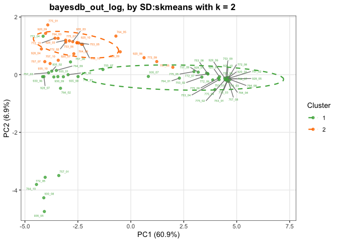
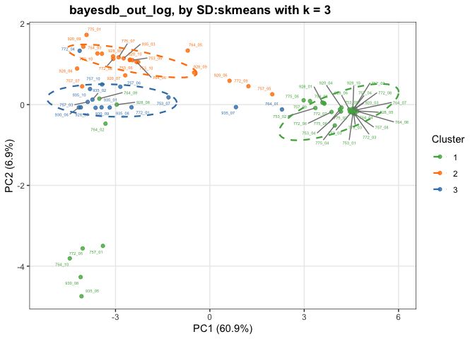
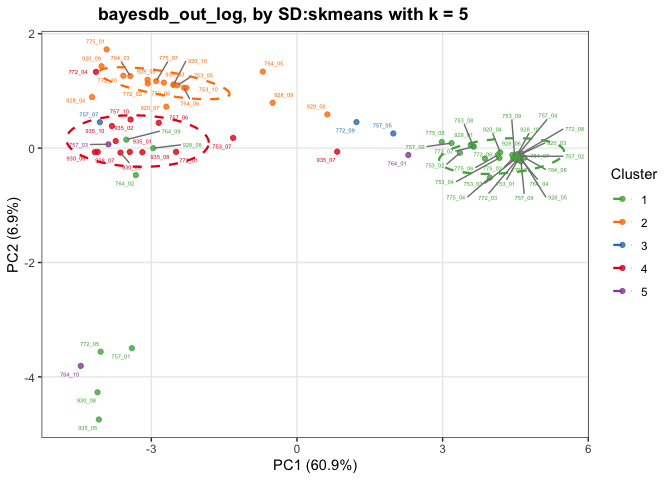
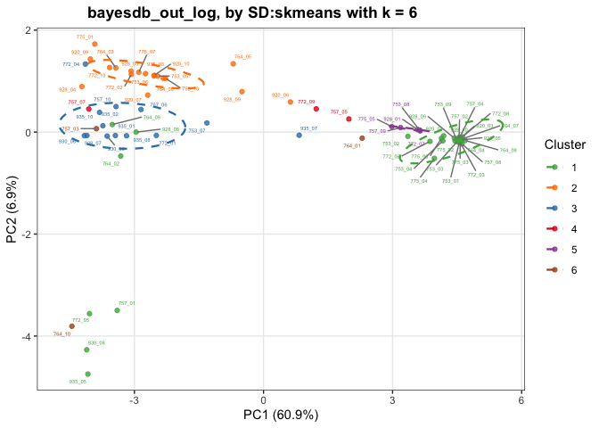
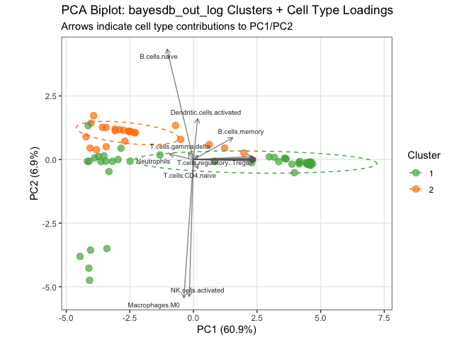

MCL_thesis_analysis
================
Heona
2026-02-06

- [MCL 1-100 Data Analysis](#mcl-1-100-data-analysis)
- [RNA data](#rna-data)
  - [Import the data & merge](#import-the-data--merge)
  - [Merge with only shared genes](#merge-with-only-shared-genes)
  - [PCA](#pca)
  - [Data check](#data-check)
  - [Batch correction with ComBat](#batch-correction-with-combat)
  - [Import the data](#import-the-data)
  - [Quick raw data check](#quick-raw-data-check)
  - [Sample loading normalization](#sample-loading-normalization)
  - [Principal Component analysis
    (PPCA)](#principal-component-analysis-ppca)
  - [Internal reference scaling](#internal-reference-scaling)
  - [Average replicates and
    log2-transform](#average-replicates-and-log2-transform)
  - [HarmonizR](#harmonizr)
  - [Mapping and unifying colnames](#mapping-and-unifying-colnames)
  - [DreamAI](#dreamai)
  - [Cell composition data check](#cell-composition-data-check)
  - [UMAP for plexes](#umap-for-plexes)
  - [UMAP for single plexes](#umap-for-single-plexes)
  - [UMAP lab origin](#umap-lab-origin)
  - [Scaled UMAPs](#scaled-umaps)
- [Cola clustering](#cola-clustering)
  - [PCA with single methods for different
    k](#pca-with-single-methods-for-different-k)
  - [PC1 and PC2 loadings](#pc1-and-pc2-loadings)
  - [Heatmaps](#heatmaps)
  - [SD:skmeans](#sdskmeans-1)
  - [B.cells naive and MCL marker
    correlation](#bcells-naive-and-mcl-marker-correlation)
- [DEA (transcriptomic) SD:skmeans](#dea-transcriptomic-sdskmeans)
  - [Volcano plot](#volcano-plot)
  - [GSEA](#gsea)
  - [GSVA](#gsva)
- [DEA (proteomic) with SD:skmeans](#dea-proteomic-with-sdskmeans)
  - [Volcano plots](#volcano-plots)
  - [GSEA](#gsea-1)
  - [GSVA](#gsva-1)

# MCL 1-100 Data Analysis

# RNA data

## Import the data & merge

I have RNA1 and RNA2 from 2 different sources and have to unite them.

``` r
## RNA data extraction

rna_1 <- readRDS("/Users/heona/git-repos/MCL_thesis_repo/data/raw_data/20250303_MCL_RNAseq1.rds")
rna_2 <- readRDS("/Users/heona/git-repos/MCL_thesis_repo/data/raw_data/20250303_MCL_RNAseq2.rds") 

print(paste("Missing values in rna_1:", sum(is.na(rna_1))))
```

    ## [1] "Missing values in rna_1: 0"

``` r
print(paste("Missing values in rna_2:", sum(is.na(rna_2))))
```

    ## [1] "Missing values in rna_2: 0"

``` r
rna_1_data <- rna_1 %>%
  as.data.frame() %>%
  dplyr::select(where(~ !any(is.na(.))))

rna_2_data <- rna_2 %>%
  as.data.frame() %>%
  dplyr::select(where(~ !any(is.na(.))))
```

First, I need to unify the column names.

dplyr::select(any_of(colnames(rna_data))) searches for overlapping
column names, we still have different column names in each matrix - I
have to change them to have uniform colnames.

``` r
mapping <- read_excel("/Users/heona/git-repos/MCL_thesis_repo/data/raw_data/20240830_MCL_IDs_Heona_V2_reduced.xlsx") 

#create a name vector, which replaces the RNAseq_ID names with the MS2_ID names
name_map <- setNames (mapping$MS2_ID, mapping$RNAseq_ID)

# rename columns in rna_2_data
colnames(rna_2_data) <- ifelse(colnames(rna_2_data) %in% names(name_map),
                               name_map[colnames(rna_2_data)], 
                               colnames(rna_2_data))

#create a name vector, which replaces the Cegat_id names with the MS2_ID names
name_map_2 <- setNames (mapping$MS2_ID, mapping$Cegat_id)

# only keep the columns that could be mapped, omit the missing ones that are still named "S..."
rna_2_data <- rna_2_data[, !grepl("^MCL", colnames(rna_2_data))]

# rename columns in rna_1_data
colnames(rna_1_data) <- ifelse(colnames(rna_1_data) %in% names(name_map_2),
                               name_map_2[colnames(rna_1_data)], 
                               colnames(rna_1_data))

# only keep the columns that could be mapped, omit the missing ones that are still named "S..."
rna_1_data <- rna_1_data[, !grepl("^S", colnames(rna_1_data))]
cat("dimension of rna_1_data:", dim(rna_1_data), "\n")
```

    ## dimension of rna_1_data: 14828 25

``` r
#hhow many gene names are overlapping
cat("shared rownames:", sum(rownames(rna_1) %in% rownames(rna_2)), "\n")
```

    ## shared rownames: 9995

``` r
cat("rows only in rna_1:", sum(!(rownames(rna_1) %in% rownames(rna_2))), "\n")
```

    ## rows only in rna_1: 4833

``` r
cat("rows only in rna_2:",sum(!(rownames(rna_2) %in% rownames(rna_1))), "\n")
```

    ## rows only in rna_2: 1851

``` r
#to make a full join of rna 1 and 2, move rownames to a new column called "gene" - bc full_join can only work with columns, not rownames
rna_1_data$gene <- rownames(rna_1_data)
rna_2_data$gene <- rownames(rna_2_data)

# now full_join by gene
rna_data <- full_join(rna_1_data, rna_2_data, by = "gene")
rownames(rna_data) <- rna_data$gene # set the column gene back to rownames
rna_data$gene <- NULL # delete the column gene
```

rna_1_data and rna_2_data are from different labs and measured different
genes. There are 9995 overlapping genes and about 5000 genes unique to
rna_1 and 2000 unique to rna_2.

## Merge with only shared genes

For further analysis, we need to proceed with only the data on the genes
that were shared between both datasets.

``` r
shared_genes <- intersect(rownames(rna_1_data), rownames(rna_2_data))

rna_data_shared <- cbind(rna_1_data[shared_genes, ], rna_2_data[shared_genes, ]) %>%
  select(-gene)
```

## PCA

``` r
sum(is.na(rna_data_shared))
```

    ## [1] 0

``` r
# 1. Filter out genes with too much missing data
threshold <- 0.9
rna_pca_df <- rna_data_shared %>%
  filter(rowMeans(is.na(.)) < threshold)

# Standard PCA (much faster)
rna_pca <- prcomp(t(as.matrix(rna_pca_df)), center = TRUE, scale. = TRUE)

# Extract scores
pca_out <- as.data.frame(rna_pca$x[, 1:2]) %>%
  rownames_to_column("Sample_ID")

# For variance explained, use:
var_explained <- summary(rna_pca)$importance[2, 1:2] * 100

# 5. for ex. "928_04" is plex_sample
pca_out <- pca_out %>%
  separate(Sample_ID, into = c("Plex", "Sample"), sep = "_", remove = FALSE)

# 6. Plot
ggplot(pca_out, aes(PC1, PC2, color = Plex)) +
  geom_point(size = 3) +
  theme_classic() +
  xlab(paste0("PC1 (", round(var_explained[1], 2), "%)")) +
  ylab(paste0("PC2 (", round(var_explained[2], 2), "%)")) +
  labs(title = "PCA of shared RNA-seq Samples")
```

<!-- -->

The PCA shows a strong batch effect between the two datasets, and also
within the plexes. For BayesdeBulk, which we will perform with this rna
data, it is crucial to not have any batch effects!

## Data check

``` r
# Count how many values are below 0 and get the range of negative values
cat("=== rna_data_shared ===\n")
```

    ## === rna_data_shared ===

``` r
cat("Total sum:", sum(rna_data_shared), "\n")
```

    ## Total sum: 3322889

``` r
cat("Data range:", range(rna_data_shared, na.rm = TRUE), "\n")
```

    ## Data range: -3.525104 14.11628

``` r
cat("Negative values:", sum(rna_data_shared < 0, na.rm = TRUE), "\n")
```

    ## Negative values: 29161

``` r
cat("Range of negative values:", range(rna_data_shared[rna_data_shared < 0], na.rm = TRUE), "\n\n")
```

    ## Range of negative values: -3.525104 -0.0008044756

``` r
cat("=== rna_1_data ===\n")
```

    ## === rna_1_data ===

``` r
cat("Total sum:", sum(rna_1_data[ , sapply(rna_1_data, is.numeric)], na.rm = TRUE), "\n")
```

    ## Total sum: 1769492

``` r
cat("Data range:", range(rna_1_data[ , sapply(rna_1_data, is.numeric)], na.rm = TRUE), "\n")
```

    ## Data range: -2.811264 16.17664

``` r
cat("Negative values:", sum(rna_1_data < 0, na.rm = TRUE), "\n")
```

    ## Negative values: 6503

``` r
cat("Range of negative values:", range(rna_1_data[rna_1_data < 0], na.rm = TRUE), "\n\n")
```

    ## Range of negative values: -0.002074767 -2.81126414

``` r
cat("=== rna_2_data ===\n")
```

    ## === rna_2_data ===

``` r
cat("Total sum:", sum(rna_2_data[ , sapply(rna_2_data, is.numeric)], na.rm = TRUE), "\n")
```

    ## Total sum: 2319244

``` r
cat("Data range:", range(rna_2_data[ , sapply(rna_2_data, is.numeric)], na.rm = TRUE), "\n")
```

    ## Data range: -3.525104 18.29288

``` r
cat("Negative values:", sum(rna_2_data < 0, na.rm = TRUE), "\n")
```

    ## Negative values: 35482

``` r
cat("Range of negative values:", range(rna_2_data[rna_2_data < 0], na.rm = TRUE), "\n")
```

    ## Range of negative values: -0.0008044756 -3.52510448

Expression values ranged from approximately -2,8 to 16,2 in samples from
lab 1 and from -3,5 to 18,3 in samples from lab 2.

### Normalization pattern

Since I have negative values in my RNA datasets that hinder batch
correction methods to function, I want to check if my RNA data is
normalized and that is the cause of the negative values.

``` r
library(tidyverse)
library(cowplot)

rna_data_shared %>%
  rownames_to_column("gene") %>%
  pivot_longer(-gene, names_to = "sample", values_to = "expression") %>%
  separate(sample, into = c("plex", "number"), sep = "_", remove = FALSE) %>%
  ggplot(aes(x = sample, y = expression, fill = plex)) +
  geom_boxplot() +
  theme_cowplot() +
  theme(axis.text.x = element_text(angle = 90, size = 6, vjust = 0.5, hjust = 1)) +
  labs(x = "", y = "log2 (expression)") +
  scale_fill_brewer(palette = "Set3")
```

<!-- -->

``` r
# Density plots
rna_data_shared %>%
  rownames_to_column("gene") %>%
  pivot_longer(-gene, names_to = "sample", values_to = "expression") %>%
  separate(sample, into = c("plex", "number"), sep = "_", remove = FALSE) %>%
  ggplot(aes(x = expression, color = plex)) +
  geom_density() +
  theme_classic() +
  labs(x = "log2 (expression)", color = "Plex") +
  scale_color_brewer(palette = "Set3")
```

<!-- -->

``` r
rna_data_shared %>%
  rownames_to_column("gene") %>%
  pivot_longer(-gene, names_to = "sample", values_to = "expression") %>%
  separate(sample, into = c("plex", "number"), sep = "_", remove = FALSE) %>%
  ggplot(aes(x = expression, color = plex, fill = plex, group = sample)) +
  geom_density(fill = NA) +
  theme_classic() +
  labs(x = "log2 (expression)", color = "Plex", fill = "Plex") +
  scale_color_brewer(palette = "Set3") +
  scale_fill_brewer(palette = "Set3")
```

<!-- -->

``` r
# Check column medians
rna_data_shared %>%
  summarise(across(everything(), ~median(.x, na.rm = TRUE))) %>%
  pivot_longer(everything(), names_to = "sample", values_to = "median") %>%
  summary()
```

    ##     sample              median     
    ##  Length:72          Min.   :4.288  
    ##  Class :character   1st Qu.:4.420  
    ##  Mode  :character   Median :4.473  
    ##                     Mean   :4.767  
    ##                     3rd Qu.:5.345  
    ##                     Max.   :5.495

The boxplot visualization shows aligned medians within samples of the
same lab origin, confirming normalization within each batch while
revealing differences in normalization between the two laboratories

## Batch correction with ComBat

with lab origin as batch variable

The samples starting with 9 are from rna_1, the samples starting with 7
are from rna_2.

``` r
batch_vector <- ifelse(grepl("^9", colnames(rna_data_shared)), "rna_1", "rna_2")
modcombat <- model.matrix(~1, data = data.frame(batch = batch_vector))

rna_combat <- ComBat(dat = as.matrix(rna_data_shared),
                        batch = batch_vector,
                        mod = modcombat,
                        par.prior = TRUE)
```

    ## Found2batches

    ## Adjusting for0covariate(s) or covariate level(s)

    ## Standardizing Data across genes

    ## Fitting L/S model and finding priors

    ## Finding parametric adjustments

    ## Adjusting the Data

#### PCA after Batch correction

``` r
# Standard PCA
rna_pca_corrected <- prcomp(t(as.matrix(rna_combat)), scale. = TRUE)

# Create data frame for plotting
pca_out_corrected <- as.data.frame(rna_pca_corrected$x[, 1:2]) %>%
  rownames_to_column("Sample_ID") %>%
  separate(Sample_ID, into = c("Plex", "Sample"), sep = "_", remove = FALSE)

# Plot
ggplot(pca_out_corrected, aes(PC1, PC2, color = Plex)) +
  geom_point(size = 3) +
  theme_classic() +
  xlab(sprintf("PC1 (%.2f%%)", summary(rna_pca_corrected)$importance[2,1] * 100)) +
  ylab(sprintf("PC2 (%.2f%%)", summary(rna_pca_corrected)$importance[2,2] * 100)) +
  labs(title = "PCA of rna_combat (After ComBat)")
```

<!-- -->

color by lab origin:

``` r
# Standard PCA
pca_rna_combat <- prcomp(t(as.matrix(rna_combat)), scale. = TRUE)

# Create data frame for plotting
pca_df <- data.frame(
  PC1 = pca_rna_combat$x[,1],
  PC2 = pca_rna_combat$x[,2],
  Sample_ID = rownames(pca_rna_combat$x)
) %>%
  mutate(Lab = ifelse(substr(Sample_ID, 1, 1) == "9", "RNA_1", "RNA_2"))

# Plot
ggplot(pca_df, aes(PC1, PC2, color = Lab)) +
  geom_point(size = 3) +
  scale_color_manual(values = c("RNA_1" = "#E41A1C", "RNA_2" = "#377EB8")) +
  theme_classic() +
  labs(
    x = sprintf("PC1 (%.1f%%)", summary(pca_rna_combat)$importance[2,1] * 100),
    y = sprintf("PC2 (%.1f%%)", summary(pca_rna_combat)$importance[2,2] * 100),
    title = "PCA of rna_combat (After ComBat) - colored by Lab"
  )
```

<!-- -->

It looks like the batch correction was successful, the dominant
separation by lab has been eliminated.

\#Proteomic data

## Import the data

``` r
getwd()
```

    ## [1] "/Users/heona/git-repos/MCL_thesis_repo"

``` r
setwd("/Users/heona/git-repos/MCL_thesis_repo")
mcl_original <- read.table("/Users/heona/git-repos/MCL_thesis_repo/data/raw_data/MCL_1-100_Cologne_Essen.txt", header = TRUE, sep = "\t")%>%
  janitor::clean_names()
```

## Quick raw data check

``` r
dim(mcl_original)
```

    ## [1] 6327  253

The dataset contains 6327 rows and 253 columns. I select only the
relevant columns and rename them.

``` r
mcl_unfiltered <- mcl_original %>%
  dplyr::select(uniprot_i_ds, gene_names, contains("reporter_intensity_corrected")) %>%
  dplyr::rename("uniprot_id" = "uniprot_i_ds" ) %>%
  dplyr::rename("gene_id" = "gene_names") %>%
  dplyr::rename_with(.cols = -c("uniprot_id", "gene_id"), .fn = ~ stringr::str_remove(string = ., "reporter_intensity_corrected_"))

dim(mcl_unfiltered)
```

    ## [1] 6327  244

The transformed dataset mcl_unfiltered contains 6327 rows and 244
columns.

### Missing values

Check for number of missing values - R likes to work with NA as missing
values, but in our dataset missing values are NaN.

``` r
print(paste("Total number of missing values: ", sum(is.na(mcl_unfiltered))))
```

    ## [1] "Total number of missing values:  564006"

``` r
print(paste("Proportion of missing values:", 
            round(sum(is.na(mcl_unfiltered)) / length(as.matrix(mcl_unfiltered)) * 100, 2), "%"))
```

    ## [1] "Proportion of missing values: 36.53 %"

### Initial visualization of NAs

``` r
# Process both replicates together
missing_per_sample <- bind_rows(
  mcl_unfiltered %>%
    select(contains("_r1_")) %>%
    summarise(across(everything(), ~sum(is.na(.)) / n() * 100)) %>%
    pivot_longer(everything(), names_to = "sample", values_to = "pct_missing") %>%
    mutate(replicate = "r1"),
  
  mcl_unfiltered %>%
    select(contains("_r2_")) %>%
    summarise(across(everything(), ~sum(is.na(.)) / n() * 100)) %>%
    pivot_longer(everything(), names_to = "sample", values_to = "pct_missing") %>%
    mutate(replicate = "r2")
) %>%
  mutate(plex = str_extract(sample, "\\d{3}$"))

# Faceted plot
ggplot(missing_per_sample, aes(x = reorder(sample, as.numeric(plex)), y = pct_missing, fill = plex)) +
  geom_bar(stat = "identity") +
  facet_wrap(~replicate, scales = "free_x", ncol = 1) +
  labs(x = "Samples", 
       y = "% of proteins missing", 
       fill = "Plex",
       title = "Missing values per sample") +
  theme_minimal() +
  theme(axis.text.x = element_text(angle = 90, hjust = 1, vjust = 0.5, size = 4))
```

<!-- -->

Samples across plexes show varying % of missing values, while within the
plex usually have the same % of missingness. The spikes in missingness
are the “empty” plexes, those that were labeled but not filled with
samples.The mass spec does not measure perfectly, and slight overlap is
usual, explaining the measurements of some signals even in the empty
samples. I exclude replicate 1 and 2 of the TMT-labels that were not
used in the plexes. Also, I exclude the plexes 949 ad 783 because they
did not yield enough data (\> 50% missing values)

``` r
mcl <- mcl_unfiltered %>%
  select(-c("8_r1_775", "9_r1_775", "10_r1_775", # from Plex 5 from MCL1-54
                          "1_r1_930", "2_r1_930", "3_r1_930", "4_r1_930", "5_r1_930", # from Plex 3 from MCL56-100
                          "8_r2_775", "9_r2_775", "10_r2_775", # r2
                          "1_r2_930", "2_r2_930", "3_r2_930", "4_r2_930", "5_r2_930", # r2
                          )) %>%
  select(-contains("949")) %>%
  select(-contains("783"))
```

I convert NaN to NA and remove rows with only NA, then check the data
again.

### Data on protein identified

``` r
#convert NaN to NA
mcl[mcl == "NaN"] <- NA_integer_

#convert Zero values to NA
mcl[,-c(1:2)][mcl[,-c(1:2)] == "0"] <- NA_integer_

#remove rows with only NA
mcl <- mcl %>%
  filter(rowSums(is.na(mcl[,-c(1:2)])) != ncol(mcl[,-c(1:2)]))
```

Data check:

``` r
dim(mcl)
```

    ## [1] 6321  184

``` r
print(paste("Total number of proteins identified:", nrow(mcl)))
```

    ## [1] "Total number of proteins identified: 6321"

``` r
na_per_sample <- colSums(is.na(mcl[,-c(1:2)]))

print(paste("Median number of proteins identified per sample:", nrow(mcl) - median(na_per_sample)))
```

    ## [1] "Median number of proteins identified per sample: 4624"

``` r
print(paste("Minimum number of proteins identified per sample:", nrow(mcl) - max(na_per_sample)))
```

    ## [1] "Minimum number of proteins identified per sample: 3759"

``` r
print(paste("Maximum number of proteins identified per sample:", nrow(mcl) - min(na_per_sample)))
```

    ## [1] "Maximum number of proteins identified per sample: 5243"

``` r
print(paste("Total number of missing values:", sum(is.na(mcl))))
```

    ## [1] "Total number of missing values: 319128"

``` r
print(paste("Proportion of missing values:", 
            round(sum(is.na(mcl)) / length(as.matrix(mcl)) * 100, 2), "%"))
```

    ## [1] "Proportion of missing values: 27.44 %"

``` r
print(paste("Negative values:", sum(mcl[sapply(mcl, is.numeric)] < 0, na.rm = TRUE)))
```

    ## [1] "Negative values: 0"

Proteomics typically has 20-40% missing values, which is much higher
than RNA-seq. This is normal and expected due to the stochastic nature
of mass spectrometry.

### Duplicates

check for duplicated features and samples:

``` r
print(paste("Number of duplicated features: ", sum(duplicated(mcl$uniprot_id))))
```

    ## [1] "Number of duplicated features:  0"

``` r
print(paste("Number of duplicated samples: ", sum(duplicated(colnames(mcl[,-c(1:2)])))))
```

    ## [1] "Number of duplicated samples:  0"

### Raw data distribution of mcl

inspect how the data is distributed without any correction

``` r
order_vec <- colnames(mcl[,-c(1:2)])

# both plots without legend
p1 <- mcl %>%
  dplyr::select(-gene_id) %>%
  pivot_longer(!uniprot_id, names_to = "Prot_id", values_to = "intensity") %>%
  mutate(splitter = Prot_id) %>%
  separate(splitter, c("remove", "plex"), sep = "_r1_|_r2_") %>%
  filter(grepl("_r1_", Prot_id)) %>%
  ggplot(aes(factor(Prot_id, levels = order_vec), log2(intensity), fill = plex)) +
  geom_boxplot() +
  theme_cowplot() +
  theme(axis.text.x = element_text(size = 5, angle = 90, hjust = 1, vjust = 1),
        legend.position = "none") +
  labs(x = "", y = "log2(intensity)", title = "Replicate 1") +
  scale_fill_brewer(palette = "Set3")

p2 <- mcl %>%
  dplyr::select(-gene_id) %>%
  pivot_longer(!uniprot_id, names_to = "Prot_id", values_to = "intensity") %>%
  mutate(splitter = Prot_id) %>%
  separate(splitter, c("remove", "plex"), sep = "_r1_|_r2_") %>%
  filter(grepl("_r2_", Prot_id)) %>%
  ggplot(aes(factor(Prot_id, levels = order_vec), log2(intensity), fill = plex)) +
  geom_boxplot() +
  theme_cowplot() +
  theme(axis.text.x = element_text(size = 5, angle = 90, hjust = 1, vjust = 1),
        legend.position = "none") +
  labs(x = "", y = "log2(intensity)", title = "Replicate 2") +
  scale_fill_brewer(palette = "Set3")

# legend from one plot
legend <- get_legend(
  p1 + theme(legend.position = "right")
)
```

    ## Warning: Removed 157266 rows containing non-finite outside the scale range
    ## (`stat_boxplot()`).

``` r
# combine plots and legend
plot_grid(
  plot_grid(p1, p2, nrow = 2),
  legend,
  rel_widths = c(1, 0.1)
)
```

    ## Warning: Removed 157266 rows containing non-finite outside the scale range
    ## (`stat_boxplot()`).

    ## Warning: Removed 161862 rows containing non-finite outside the scale range
    ## (`stat_boxplot()`).

<!-- -->
This boxplot visualization of raw protein intensities on a log₂-scale
reveals consistent intensity distributions between replicates while
showing variations both within and across plexes indicating the need for
normalization.

### Replicate correlation

Each plex was measured in two replicates - they should be similar - so
we investigate the correlation between both replicates.

``` r
mcl_rep1 <- mcl %>%
  dplyr::select(contains("r1"))
mcl_rep2 <- mcl %>%
  dplyr::select(contains("r2"))

#set the color-vector 
color_fun_corr = colorRamp2(c(-1, 0, 1), c("blue", "white", "red"))

cor(mcl_rep1, mcl_rep2, method = "spearman", use = "pairwise.complete.obs") %>%
  Heatmap(as.matrix(.),
                   column_title = "Replicate 1",
                   row_title = "Replicate 2",
                   col = color_fun_corr,
                   show_row_names = FALSE,
                   show_column_names = FALSE,
                   cluster_rows = FALSE,
                   cluster_columns = FALSE,
                   name = "Spearman's R") %>%
  draw()
```

<!-- -->
This shows an acceptable correlation, though optimal would be a higher
contrast between the diagonal and off-diagonal correlations. Still, we
can combine the replicate values to an average value.

### Combine replicates & reshape dataframe from wide to long

I combine the replicates to a dataframe with the average of r1 and r2.

``` r
mcl_r1 <- mcl %>%
  dplyr::select(uniprot_id, contains("r1")) %>%
    tidyr::pivot_longer(!uniprot_id,
                        names_to = "samples_r1",
                        values_to = "count_R1")

mcl_r2 <- mcl %>%
    dplyr::select(uniprot_id, contains("r2")) %>%
    tidyr::pivot_longer(!uniprot_id,
                        names_to = "samples_r2",
                        values_to = "count_R2")

# mearge mcl_r1 and mcl_r2 and add an average column
mcl_long <- cbind(mcl_r1, mcl_r2[, -1]) # [, -1] to leave out the second uniprot_id column

mcl_avg <- mcl_long %>%
  rowwise() %>%
  mutate(avg_count = mean(c(count_R1, count_R2), na.rm = TRUE)) 

#reformat the NaN in the new column to NA
mcl_avg[mcl_avg == "NaN"] <- NA_integer_
```

### Visualize NAs

``` r
comb <- mcl_avg %>%
  group_by(samples_r1) %>%
  summarise(na_rate = sum(is.na(avg_count))) %>%
  mutate(samples_r2 = samples_r1) %>% 
  separate(samples_r2, c("remove", "Plex"), sep = "r1_") %>% 
  mutate(na_perc = na_rate / nrow(mcl)) 

ggplot(comb, aes(
    x = forcats::fct_reorder(samples_r1, na_perc),
    y = na_perc,
    fill = Plex
  )) +
  geom_col() +
  theme_cowplot() +
  labs(x = "samples", y = "[%] of proteins missing") +
  theme(
    panel.border = element_blank(),
    panel.grid.major = element_blank(),
    panel.grid.minor = element_blank(),
    axis.line.y =  element_line(colour = "black"),
    axis.line.x =  element_line(colour = "black"),
    axis.text.y = element_text(colour = "black"),
    legend.title = element_blank(),
    axis.text.x = element_text(
      size = 6,
      angle = 90,
      hjust = 1,
      vjust = 1
    ),
    legend.position = "none"
  ) 
```

<!-- -->

### Reference channel correlation

The reference channel is the 11th sample, so I only select the 11th
sample of each plex as ref_cor.

Then, cor() calculates the pairwise Spearman correlations for the
selected columns starting with 11, considering only complete
observations (pairwise.complete.obs). The resulting correlation matrix
is converted to a data frame using as.data.frame(). The mutate()
function adds new column “type” with the value “ref” to distinguish it
as the reference-channel correlation. pivot_longer() converts the
correlation matrix from wide format to long format, resulting in a
tibble with two columns: “Prot_id” and “count” (the correlation values)
filter(count != 1) removes self-correlation values (correlation of a
variable with itself), as these values are always 1 in correlation
matrices.

``` r
mcl_wide <- mcl_avg %>%
  dplyr::select(c("uniprot_id", "samples_r1", "avg_count")) %>% #mcl_wide has the average count, we only take the name of samples_r1 (in case of confusion)
  pivot_wider(names_from = "samples_r1", values_from = avg_count)

#reference-channel correlation 
ref_cor11 <- mcl_wide %>%
  dplyr::select(starts_with("11_")) %>% 
  cor(., method = "spearman", use = "pairwise.complete.obs") %>%
  as.data.frame() %>%
  mutate(type = "ref") %>%
  pivot_longer(!c(type), names_to = "samples", values_to = "count") %>%
  filter(count != 1)

head(ref_cor11, n = 5)
```

    ## # A tibble: 5 × 3
    ##   type  samples   count
    ##   <chr> <chr>     <dbl>
    ## 1 ref   11_r1_757 0.808
    ## 2 ref   11_r1_764 0.807
    ## 3 ref   11_r1_772 0.798
    ## 4 ref   11_r1_775 0.760
    ## 5 ref   11_r1_920 0.808

``` r
ref_cor <- ref_cor11[duplicated(ref_cor11$count),] # remove duplicates that appear twice bc of pivot_longer

head(ref_cor, n = 5)
```

    ## # A tibble: 5 × 3
    ##   type  samples   count
    ##   <chr> <chr>     <dbl>
    ## 1 ref   11_r1_753 0.808
    ## 2 ref   11_r1_753 0.807
    ## 3 ref   11_r1_757 0.839
    ## 4 ref   11_r1_753 0.798
    ## 5 ref   11_r1_757 0.821

``` r
ggplot(ref_cor, aes(count)) +
  geom_density(fill = "#2a9d8f") +
  cowplot::theme_cowplot() +
  labs(x = "Spearman's R" ) 
```

<!-- -->
The reference channel correlation ensures that measurements are accurate
and not biased by technical irregularities. Spearman’s R showed an
overall positive correlation for reference channels and a peak around
0.8, when ideally it would be at \> 0.9. This sub-optimal correlation
suggested the presence of technical variation between plexes, requiring
batch effect correction.

## Sample loading normalization

To correct for differences in total protein amount loaded across samples
and plexes, sample loading normalization is applied. A “target” is
defined as the median total intensity across all samples (median of all
column sums). For each sample, a normalization factor is calculated by
dividing the target by the sample’s total intensity. Each protein
intensity value is then multiplied by its corresponding normalization
factor, scaling all samples to a common total intensity level while
preserving the relative differences between individual proteins. To
verify successful normalization, protein intensities are again
visualized by boxplots on a log2-scale.

``` r
library(dplyr)

# create a vector of plexes
plex_vec <- unique(
  stringr::str_remove(
    colnames(mcl[,-c(1,2)]), 
    "._r1_|._r2_|.._r1_|.._r2_")
  ) 

# Store each plex into a list embedment
plex_list <- list() 

for(i in plex_vec) {
  plex_list[[i]] <- mcl %>% 
    dplyr::select(contains(i))
}

#create the target scaling factor 
colsum_vec <- c() 

for(i in plex_vec) {
  df <- plex_list[[i]]
  colsum_vec <- c(colsum_vec, colSums(df, na.rm = TRUE))
}

target <- median(colsum_vec, na.rm = TRUE)

#correct per plex with a helper function
run_sl_correct <- function(Y) { 
  norm_facs <- target / colSums(Y, na.rm = TRUE) # calculate normalization factor for each column in matrix Y
  output_sl <- sweep(Y, 2, norm_facs, FUN = "*") # multiplies norm_facs with each column
  return(output_sl) # output_sl is the normalized matrix
}

data_sl_repl <- plex_list%>%
  purrr::map(run_sl_correct) %>% 
  bind_cols()
```

visualize effect

``` r
# Plots without legends
p1 <- data_sl_repl %>%
  tibble::rownames_to_column("n") %>%
  pivot_longer(!n, names_to = "Prot_id", values_to = "intensity") %>%
  mutate(splitter = Prot_id) %>%
  separate(splitter, c("remove", "plex"), sep = "_r1_|_r2_") %>%
  filter(grepl("_r1_", Prot_id)) %>%
  ggplot(aes(
    factor(Prot_id, levels = order_vec), log2(intensity), fill = plex
  )) +
  geom_boxplot() +
  theme_cowplot() +
  theme(axis.text.x = element_text(
    size = 6,
    angle = 90,
    hjust = 1,
    vjust = 1
  ),
  legend.position = "none") +
  labs(x = "", y = "log2(intensity)", title = "Replicate 1") +
  scale_fill_brewer(palette = "Set3")

p2 <- data_sl_repl %>%
  tibble::rownames_to_column("n") %>%
  pivot_longer(!n, names_to = "Prot_id", values_to = "intensity") %>%
  mutate(splitter = Prot_id) %>%
  separate(splitter, c("remove", "plex"), sep = "_r1_|_r2_") %>%
  filter(grepl("_r2_", Prot_id)) %>%
  ggplot(aes(
    factor(Prot_id, levels = order_vec), log2(intensity), fill = plex
  )) +
  geom_boxplot() +
  theme_cowplot() +
  theme(axis.text.x = element_text(
    size = 6,
    angle = 90,
    hjust = 1,
    vjust = 1
  ),
  legend.position = "none") +
  labs(x = "", y = "log2(intensity)", title = "Replicate 2") +
  scale_fill_brewer(palette = "Set3")

# Extract legend from one plot
legend <- get_legend(
  p1 + theme(legend.position = "right")
)
```

    ## Warning: Removed 157266 rows containing non-finite outside the scale range
    ## (`stat_boxplot()`).

``` r
# combine plots and legend
plot_grid(
  plot_grid(p1, p2, nrow = 2),
  legend,
  rel_widths = c(1, 0.1)
)
```

    ## Warning: Removed 157266 rows containing non-finite outside the scale range
    ## (`stat_boxplot()`).

    ## Warning: Removed 161862 rows containing non-finite outside the scale range
    ## (`stat_boxplot()`).

<!-- -->
After sample loading normalization protein intensities are effectively
balanced across all samples. The boxplots show aligned medians and
comparable intensity distributions across both replicates and plexes,
indicating successful correction of technical variability in protein
loading.

### Correlation between random sets of channels

I am comparing the ones with TMT-label 129C since they are present in
every plex.

``` r
library(psych)

sl_data <- data_sl_repl %>%
  dplyr::select(contains("r1")) %>%
  dplyr::select(contains(plex_vec[1:9])) %>%
  dplyr::select(contains("7_"))

pairs.panels(log2(sl_data), lm = TRUE, main = "Random channel 129C over plexes")
```

<!-- -->

## Principal Component analysis (PPCA)

Let’s further have a look into the general structure in the dataset by
PCA. Since we are working with a dataset that contains missing data, we
probabilistic PCA (pPCA) that accounts for missing data
<http://www.cs.columbia.edu/~blei/seminar/2020-representation/readings/TippingBishop1999.pdf>.

Highly correlated samples cluster together in a 2D graph The axes are
ranked in order of importance - differences along x axis (PC1 =
principle component 1) are more important than differences along the 2nd
principal component on y-axis (PC2)

The scales: Large absolute values (e.g., -60 or 20) indicate that those
samples differ significantly from the average sample along that
principal component. Smaller values (closer to 0) suggest that a sample
is near the dataset’s mean in that dimension.

``` r
library(pcaMethods)
library(scrime)

threshold <- 0.5

ppca_df <- data_sl_repl %>% 
  filter(rowMeans(is.na(.)) < threshold) %>%
  #feature-wise scaling and centering 
  rowScales() %>%
  as.data.frame()

data_ppca <- pcaMethods::pca(t(as.matrix(ppca_df)), method = "ppca", nPcs = 2, seed = 123)

ppca_out <- as.data.frame(scores(data_ppca)) %>%
  rownames_to_column("Prot_id") %>%
  separate(Prot_id, c("Number", "Plex"), sep = "_r1_|_r2_")
ggplot(ppca_out, aes(PC1, PC2, col = Plex)) +
  geom_point(size = 3) +
  scale_fill_brewer(palette = "Set3") +
  theme_classic() +
  xlab(paste("PC1 (", round(data_ppca@R2[1] * 100, digits = 2), "%)")) +
  ylab(paste("PC2 (", round(data_ppca@R2[2] * 100, digits = 2), "%)")) 
```

<!-- -->

This is the PCA of the mcl data that was corrected with the
normalization factor. The PCA reveals prominent clustering of samples
according to their plex membership, confirming that batch effects were a
major source of variance in the dataset.

## Internal reference scaling

The reference channel (channel 11, containing an identical pooled sample
in each plex) serves as the basis for reference for protein-wise scaling
within each plex. For each protein, the geometric mean of intensities
across all reference channels is defined as the reference average. A
scaling factor is calculated by dividing the ref-erence average by the
observed value in the reference channel of a plex. All values of that
protein within the plex were then multiplied with the corresponding
plex- and protein-specific scaling factor.

``` r
#make a dataframe of the reference channels per plex 
irs_factors <- data_sl_repl %>% 
  dplyr::select(contains("11_"))

#calculate the geometric mean per sample as global reference for scaling
irs_factors$geomean <- apply(irs_factors, 1, function(x) exp(mean(log(x), na.rm = TRUE)))

#pull out sample names to identify  !!! Adjust removal position to geomeam column
irs_factor_vec = as.vector(names(irs_factors[,-c((length(plex_vec)*2)+1)]))
irs_factor_vec
```

    ##  [1] "11_r1_753" "11_r2_753" "11_r1_757" "11_r2_757" "11_r1_764" "11_r2_764"
    ##  [7] "11_r1_772" "11_r2_772" "11_r1_775" "11_r2_775" "11_r1_920" "11_r2_920"
    ## [13] "11_r1_928" "11_r2_928" "11_r1_930" "11_r2_930" "11_r1_935" "11_r2_935"

``` r
#create the protein and reference channel wise scaling factor
for(i in irs_factor_vec) {
  factor <-  irs_factors$geomean / (irs_factors %>% dplyr::select(i))
  irs_factors[,paste0("fac_",i)] <- factor
}
```

    ## Warning: Using an external vector in selections was deprecated in tidyselect 1.1.0.
    ## ℹ Please use `all_of()` or `any_of()` instead.
    ##   # Was:
    ##   data %>% select(i)
    ## 
    ##   # Now:
    ##   data %>% select(all_of(i))
    ## 
    ## See <https://tidyselect.r-lib.org/reference/faq-external-vector.html>.
    ## This warning is displayed once per session.
    ## Call `lifecycle::last_lifecycle_warnings()` to see where this warning was
    ## generated.

``` r
irs_mult <- colnames(irs_factors %>% dplyr::select(contains("fac"))) %>% as.data.frame

irs_mult <- cbind(irs_mult, irs_mult) 

colnames(irs_mult) <- c("factor", "exp")

irs_mult<- irs_mult %>%
  separate(exp, c("discard", "plex"), sep = "\\_11_") %>%
  dplyr::select(-discard) %>%
  filter(plex !=  "r1_753") # i just took the first plex to start with

irs_mult_vec = as.vector(irs_mult$plex)

irs_fac_filt <- irs_factors %>% dplyr::select(contains("fac"))

all_irs <- (data_sl_repl %>% dplyr::select(contains( "r1_753"))) * unlist(irs_fac_filt %>% dplyr::select(contains( "r1_753"))) # starting with the first plex, the scaling is applied on all samples

for(i in irs_mult_vec) {
  all_irs <- cbind(all_irs, (data_sl_repl %>% dplyr::select(contains(i))) * unlist(irs_fac_filt %>% dplyr::select(contains(i))))
}
```

visualize effect

``` r
# Create plots without legends
p1 <- all_irs %>%
  tibble::rownames_to_column("n") %>%
  pivot_longer(!n, names_to = "Prot_id", values_to = "intensity") %>%
  mutate(splitter = Prot_id) %>%
  separate(splitter, c("remove", "plex"), sep = "_r1_|_r2_") %>%
  filter(grepl("_r1_", Prot_id)) %>%
  ggplot(aes(
    factor(Prot_id, levels = order_vec), log2(intensity), fill = plex
  )) +
  geom_boxplot() +
  theme_cowplot() +
  theme(axis.text.x = element_text(
    size = 6,
    angle = 90,
    hjust = 1,
    vjust = 1
  ),
  legend.position = "none") +
  labs(x = "", y = "log2(intensity)", title = "Replicate 1") +
  scale_fill_brewer(palette = "Set3")

p2 <- all_irs %>%
  tibble::rownames_to_column("n") %>%
  pivot_longer(!n, names_to = "Prot_id", values_to = "intensity") %>%
  mutate(splitter = Prot_id) %>%
  separate(splitter, c("remove", "plex"), sep = "_r1_|_r2_") %>%
  filter(grepl("_r2_", Prot_id)) %>%
  ggplot(aes(
    factor(Prot_id, levels = order_vec), log2(intensity), fill = plex
  )) +
  geom_boxplot() +
  theme_cowplot() +
  theme(axis.text.x = element_text(
    size = 6,
    angle = 90,
    hjust = 1,
    vjust = 1
  ),
  legend.position = "none") +
  labs(x = "", y = "log2(intensity)", title = "Replicate 2") +
  scale_fill_brewer(palette = "Set3")

# Extract legend from one plot
legend <- get_legend(
  p1 + theme(legend.position = "right")
)
```

    ## Warning: Removed 157378 rows containing non-finite outside the scale range
    ## (`stat_boxplot()`).

``` r
# Combine plots and legend
plot_grid(
  plot_grid(p1, p2, nrow = 2),
  legend,
  rel_widths = c(1, 0.15)
)
```

    ## Warning: Removed 157378 rows containing non-finite outside the scale range
    ## (`stat_boxplot()`).

    ## Warning: Removed 161910 rows containing non-finite outside the scale range
    ## (`stat_boxplot()`).

<!-- -->

### Correlation between random set of channels after IRS

``` r
sl_test_data <- all_irs %>%
  dplyr::select(contains("r1")) %>%
  dplyr::select(contains(plex_vec[1:9])) %>%
  dplyr::select(contains("7_"))

pairs.panels(log2(sl_test_data), lm = TRUE, main = "Random channel 129C over plexes")
```

<!-- -->

### PPCA after IRS

``` r
ppca_df <- all_irs %>% 
  filter(rowMeans(is.na(.)) < threshold) %>%
  #feature-wise scaling and centering 
  rowScales() %>%
  as.data.frame()
data_ppca <- pcaMethods::pca(t(as.matrix(ppca_df)), method = "ppca", nPcs = 2, seed = 123)
ppca_out <- as.data.frame(scores(data_ppca)) %>%
  rownames_to_column("Prot_id") %>%
  separate(Prot_id, c("Number", "Plex"), sep = "_r1_|_r2_")
ggplot(ppca_out, aes(PC1, PC2, col = Plex)) +
  geom_point(size = 3) +
  scale_fill_brewer(palette = "Set3") +
  theme_classic() +
  xlab(paste("PC1 (", round(data_ppca@R2[1] * 100, digits = 2), "%)")) +
  ylab(paste("PC2 (", round(data_ppca@R2[2] * 100, digits = 2), "%)"))
```

<!-- -->

After internal reference scaling, data consistency was enhanced,
improving reliability of downstream analyses. Correlation analysis of a
random channel (channel 7) across plexes showed increased correlations
(ρ ≈ 0.91–0.98) compared to pre-IRS values (ρ ≈ 0.63–0.80), confirming
successful batch correction. However, PPCA reveals that samples still
clustered by plex, indicating residual batch effects requiring further
correction.

## Average replicates and log2-transform

I now average replicate values to a single value per protein per sample
to create mcl_proteome_final.

``` r
mcl_norm <- cbind(mcl[,c(1)], all_irs) %>%
  dplyr::select(-contains("11_"))

colnames(mcl_norm)[1] <- "uniprot_id"

# create the datasets for r1 and r2 first separately
mcl_long_norm_r1 <- mcl_norm %>%
    dplyr::select(uniprot_id, contains("r1")) %>%
    tidyr::pivot_longer(!uniprot_id,
                        names_to = "Prot_id1",
                        values_to = "count_R1")

mcl_long_norm_r2 <- mcl_norm %>%
    dplyr::select(uniprot_id, contains("r2")) %>%
    tidyr::pivot_longer(!uniprot_id,
                        names_to = "Prot_id2",
                        values_to = "count_R2") 

head(mcl_long_norm_r1, n = 3)
```

    ## # A tibble: 3 × 3
    ##   uniprot_id               Prot_id1 count_R1
    ##   <chr>                    <chr>       <dbl>
    ## 1 P60709;E7EVS6;A0A6Q8PFE4 1_r1_753 2608005.
    ## 2 P60709;E7EVS6;A0A6Q8PFE4 2_r1_753 2986740.
    ## 3 P60709;E7EVS6;A0A6Q8PFE4 3_r1_753 3179421.

``` r
head(mcl_long_norm_r2, n = 3)
```

    ## # A tibble: 3 × 3
    ##   uniprot_id               Prot_id2 count_R2
    ##   <chr>                    <chr>       <dbl>
    ## 1 P60709;E7EVS6;A0A6Q8PFE4 1_r2_753 2398527.
    ## 2 P60709;E7EVS6;A0A6Q8PFE4 2_r2_753 2961353.
    ## 3 P60709;E7EVS6;A0A6Q8PFE4 3_r2_753 3175631.

``` r
# now merge and leave out uniprot_id (first col) from r2 dataset

mcl_long_norm <- cbind(mcl_long_norm_r1, mcl_long_norm_r2[, -1]) 

mcl_long_norm <- mcl_long_norm %>%
  rowwise() %>%
  mutate(avg_count = mean(c(count_R1, count_R2), na.rm = TRUE))

#reformat the NA 
mcl_long_norm$avg_count[mcl_long_norm$avg_count == "NaN"] <- NA_integer_

mcl_wide_norm <- mcl_long_norm %>% 
  dplyr::select(uniprot_id, Prot_id1, avg_count) %>%
  pivot_wider(names_from = "Prot_id1", values_from = "avg_count")
```

Assign the gene_ids to the samples and log2-transform

``` r
m_comb <- as.matrix(mcl_wide_norm[,-1])

rownames(m_comb) <- mcl_wide_norm$uniprot_id

# t() function swaps rows and cols

t_comb <- t(m_comb) %>% 
  as.data.frame() %>%
  rownames_to_column("Pre_id") %>%
  separate(Pre_id, c("number", "plex"), sep = "_r1_") %>%
  mutate(plex = paste0("P", as.character(plex))) %>%
  mutate(plex = paste0(as.character(plex), as.character(number))) %>%
  dplyr::select(-number) %>% 
  column_to_rownames("plex")

mcl_proteome <-
  t(t_comb) %>% 
  as.data.frame() %>% 
  rownames_to_column("uniprot_id")

uniprot_gene_mcl <- mcl %>% dplyr::select(uniprot_id, gene_id) 

mcl_proteome_final <-  left_join(uniprot_gene_mcl, mcl_proteome, by  = "uniprot_id") 

mcl_proteome_final[,3:ncol(mcl_proteome_final)]<- sapply(mcl_proteome_final[,3:ncol(mcl_proteome_final)], as.numeric)

mcl_proteome_final[,3:ncol(mcl_proteome_final)] <- log2(mcl_proteome_final[,3:ncol(mcl_proteome_final)]) # log-transformed!
```

### PPCA before HarmonizR

``` r
ppca_df <- mcl_proteome_final[,-c(1,2)] %>% 
  filter(rowMeans(is.na(.)) < threshold) %>%
  #feature-wise scaling and centering 
  rowScales() %>%
  as.data.frame()

data_ppca <- pcaMethods::pca(t(as.matrix(ppca_df)), method = "ppca", nPcs = 2, seed = 123)

ppca_out <- as.data.frame(scores(data_ppca)) %>%
  rownames_to_column("Prot_id") %>%
  mutate(Plex = str_remove(str_sub(Prot_id, 1, 4), "P"))
# sep = 4 means separate at the 4th string character

ggplot(ppca_out, aes(PC1, PC2, col = Plex)) +
  geom_point(size = 3) +
  scale_fill_brewer(palette = "Set3") +
  theme_classic() +
  xlab(paste("PC1 (", round(data_ppca@R2[1] * 100, digits = 2), "%)")) +
  ylab(paste("PC2 (", round(data_ppca@R2[2] * 100, digits = 2), "%)"))
```

<!-- -->
missingness distribution

``` r
comb_df <- comb %>%
  dplyr::select(Plex, na_perc) %>%
  group_by(Plex) %>%
  summarise(na = mean(na_perc)) %>%
  mutate(Plex = paste0("P", Plex, sep = ""))

ppca_out <- as.data.frame(scores(data_ppca)) %>%
  rownames_to_column("Prot_id") %>%
  separate(Prot_id, c("Plex", "Number"), sep = 4) %>%
  left_join(comb_df, 
            by = "Plex")

ggplot(ppca_out, aes(PC1, PC2, col = na)) +
  geom_point(size = 3) +
  scale_color_viridis_c()+
  theme_classic() +
  xlab(paste("PC1 (", round(data_ppca@R2[1] * 100, digits = 2), "%)")) +
  ylab(paste("PC2 (", round(data_ppca@R2[2] * 100, digits = 2), "%)")) +
  labs(color = "% missing")
```

<!-- -->

## HarmonizR

with Plex = Batch, and with specifying parameters

HarmonizR integrates limma’s removeBatchEffect() function employing
linear regres-sion and the batch effect correction method ComBat which
uses an empirical Bayes framework. Unlike most harmonization tools that
require complete datasets, HarmonizR can handle missing values by matrix
dissection, without imputing or reducing data, which makes it suitable
for proteomic data.

I use the normalized log-transformed data mcl_proteome_final for
HarmonizR.

``` r
print(paste("Total number of missing values: ", sum(is.na(mcl_proteome_final))))
```

    ## [1] "Total number of missing values:  114545"

``` r
prod(dim(mcl_proteome_final))
```

    ## [1] 530964

``` r
print(sum(is.na(mcl_proteome_final)) / prod(dim(mcl_proteome_final)))
```

    ## [1] 0.2157303

We have 21,57% missing values before applying harmonizr.

``` r
# 1: Create the batch vector information
# Extract sample names (excluding uniprot_id and gene_name columns)
# make batch_df with cols: samplename, numbered ID and batch
batch_df <- tibble(samplename = colnames(mcl_proteome_final[,-c(1,2)])) %>%
  rowid_to_column("ID") %>%
  relocate(ID, .after = samplename) %>%
  mutate(
    plex_number = sub("P(.{3}).*", "\\1", samplename),
    batch = case_when(
      plex_number == "753" ~ 1,
      plex_number == "757" ~ 2,
      plex_number == "764" ~ 3,
      plex_number == "772" ~ 4,
      plex_number == "775" ~ 5,
      plex_number == "920" ~ 6,
      plex_number == "928" ~ 7,
      plex_number == "930" ~ 8,
      plex_number == "935" ~ 9,
      TRUE ~ NA_real_
    )
  ) %>%
  select(samplename, ID, batch)

# Check batch assignments
table(batch_df$batch)
```

    ## 
    ##  1  2  3  4  5  6  7  8  9 
    ## 10 10 10 10  7 10 10  5 10

``` r
# 2: Prepare dataframe for harmonization
# Remove gene_name column and set uniprot_id as rownames
harmonize_df <- mcl_proteome_final[,-2] %>%
  column_to_rownames("uniprot_id")

# 3: Run HarmonizR with explicit parameters
mcl_harmonized <- harmonizR(
  data_as_input = harmonize_df,
  description_as_input = batch_df,
  algorithm = "ComBat",
  ComBat_mode = 3,  # parametric adjustment (1 = non-parametric if needed)
  plot = "samplemeans"  # generates diagnostic plots
)
```

    ## Initializing HarmonizR...

    ## Reading the files...

    ## Preparing...

    ## Splitting the data using ComBat adjustment...

    ## Rebuilding...

    ## Writing file...

    ## Saving plot to pdf...

    ## Visualizing samplemeans...

<!-- -->

    ## Termination.

``` r
# 4: Convert back to dataframe with protein IDs
mcl_proteome_harmonized <- mcl_harmonized %>%
  as.data.frame() %>%
  rownames_to_column("uniprot_id") %>%
  left_join(mcl_proteome_final[, c("uniprot_id", "gene_id")], by = "uniprot_id") %>%
  relocate(gene_id, .after = uniprot_id)

# store files in the processed_data folder

file.rename("cured_data.tsv", "data/processed_data/mcl_harmonized.tsv")
```

    ## [1] TRUE

``` r
file.rename("cured_data.pdf", "data/processed_data/mcl_harmonized_diagnostics.pdf")
```

    ## [1] TRUE

\###PPCA after HarmonizR

``` r
ppca_df <- mcl_proteome_harmonized[,-c(1,2)] %>% 
  filter(rowMeans(is.na(.)) < threshold) %>%
  #feature-wise scaling and centering 
  rowScales() %>%
  as.data.frame()

data_ppca <- pcaMethods::pca(t(as.matrix(ppca_df)), method = "ppca", nPcs = 2, seed = 123)

ppca_out <- as.data.frame(scores(data_ppca)) %>%
  rownames_to_column("Prot_id") %>%
  separate(Prot_id, into = c("Plex", "Number"), sep = 4)
# sep = 4 means separate at the 4th string character

ggplot(ppca_out, aes(PC1, PC2, col = Plex)) +
  geom_point(size = 3) +
  scale_fill_brewer(palette = "Set3") +
  theme_classic() +
  xlab(paste("PC1 (", round(data_ppca@R2[1] * 100, digits = 2), "%)")) +
  ylab(paste("PC2 (", round(data_ppca@R2[2] * 100, digits = 2), "%)"))
```

<!-- -->

HarmonizR successfully corrected the batch effects. We proceed with
mcl_proteome_harmonized for our missing value imputation.

## Mapping and unifying colnames

``` r
# for protein data, create a name vector, which replaces the MS_Label names with the MS2_ID names
name_map_ms <- setNames (mapping$MS2_ID, mapping$MS_Label)

proteome_data_log <- mcl_proteome_harmonized

# rename columns in mcl_proteome_cured_data to "753_01" to fit the same format -> prot_data
colnames(proteome_data_log) <- ifelse(colnames(proteome_data_log) %in% names(name_map_ms),
                               name_map_ms[colnames(proteome_data_log)], 
                               colnames(proteome_data_log))
```

proteome_data_log now has the same colnames as the rna_data_shared

We still have multiple genes in some gene_id rownames, that are
seperated by “;” So we select one of the genes (the first) and drop the
rest. If the first of the row is already taken prior, the next is
selected as unique identifier.

### Create unique gene_id identifiers

``` r
# A vector to keep track of the genes that have already been used
used_genes <- c()

# A vector to store the new, unique gene IDs
unique_gene_id <- sapply(proteome_data_log$gene_id, function(genes_str) {
  
  # Split the string of genes by the semicolon
  candidate_genes <- str_split(genes_str, ";")[[1]]
  
  # Find the first gene in the list that has not been used yet
  for (gene in candidate_genes) {
    if (!gene %in% used_genes) {
      used_genes <<- c(used_genes, gene) # If found, add it to our list of used genes
      return(gene) # Return this gene as the chosen one for this row
    }
  }
  # If no unique gene is found for this row (all candidates were already used),
  # return NA as a placeholder.
  return(NA_character_)
}) 

# Add the new column of unique gene IDs to dataframe
proteome_data_log$unique_gene_id <- unique_gene_id

prot_data_log <- proteome_data_log %>%
  select(uniprot_id, gene_id, unique_gene_id, everything())

sum(is.na(unique_gene_id))
```

    ## [1] 165

165 rows cannot be matched with a unique_gene_id, and thus have to be
removed. We only work with those that have both gene_id and uniprot_id
because we focus on the features that are gene/protein-code.

``` r
prot_data_final_log <- prot_data_log %>%
  select(-uniprot_id, -gene_id) %>%
  filter(!is.na(unique_gene_id)) 

rownames(prot_data_final_log) <- prot_data_final_log$unique_gene_id
prot_data_final_log <- prot_data_final_log[,-1]
```

## DreamAI

In order to apply BayesDeBulk deconvolution analysis with RNA and
protein data, we need our datasets to be free of missing values. To
impute the missing values I use DreamAI.

### Missing values

``` r
na_percentage <- rowMeans(is.na(prot_data_final_log)) * 100 #
rows_above_50_na <- which(na_percentage > 50)

row_lowest_na <- which.min(na_percentage) 
min_na_percentage <- na_percentage[row_lowest_na] 

row_highest_na <- which.max(na_percentage) 
max_na_percentage <- na_percentage[row_highest_na] 

# Proportion of rows with >50% missing values
proportion_above_50_na <- sum(na_percentage > 50) / nrow(mcl_proteome_harmonized) *100

# Output results
list(
  num_rows_above_50_na = sum(na_percentage > 50),
  row_lowest_na = row_lowest_na,
  min_na_percentage = min_na_percentage,
  row_highest_na = row_highest_na,
  max_na_percentage = max_na_percentage,
  proportion_above_50_na = proportion_above_50_na
)
```

    ## $num_rows_above_50_na
    ## [1] 1273
    ## 
    ## $row_lowest_na
    ## ACTB 
    ##    1 
    ## 
    ## $min_na_percentage
    ## ACTB 
    ##    0 
    ## 
    ## $row_highest_na
    ## AAMP 
    ## 5449 
    ## 
    ## $max_na_percentage
    ## AAMP 
    ##  100 
    ## 
    ## $proportion_above_50_na
    ## [1] 20.14241

### Filtering for DreamAI

As a preparation, we need to filter the rows that have NA \> 50%, We
only take the columns that are also found in RNA data. For some, RNA
data was missing and we have to exclude these.

``` r
sum(is.na(prot_data_final_log))
```

    ## [1] 109320

``` r
# for DreamAI limit the threshold of missing values to 0.5
threshold <- 0.5

prot_data_final_dai_log <- prot_data_final_log %>%
  filter(rowMeans(is.na(.[,])) < threshold) %>%
  select(, any_of(colnames(rna_combat))) # only the columns which are found in rna_data. bc for some, rna data was missing and we have to exclude these

sum(is.na(prot_data_final_dai_log))
```

    ## [1] 29610

``` r
dim(prot_data_final_log)
```

    ## [1] 6155   82

``` r
dim(prot_data_final_dai_log)
```

    ## [1] 4882   72

``` r
dim(rna_combat)
```

    ## [1] 9995   72

The dimensions are now matched between RNA and protein data.

### Missing values after filtering

Before I run DreamAI, I want to see, how many missing values there are.

``` r
vis_miss(prot_data_final_dai_log[, order(colnames(prot_data_final_dai_log))]) +
  theme(
    axis.text.x = element_text(size = 4, angle = 90, vjust = 1, hjust = 1),
    plot.margin = ggplot2::margin(t = 50, r = 5, b = 5, l = 5)
  )
```

<!-- -->

The graph shows how many missing values are in each sample now, it
varies from 3% to 22%, on average 8,4%. You can derive from this graph,
that the missing values are not missing at random, they follow a
pattern.

### Run DreamAI()

on prot_data_final_dai_log

Install DreamAI:

``` r
require("cluster")
require("survival")
require("randomForest")
require("missForest")
require("glmnet")
require("Rcpp")
```

    ## Loading required package: Rcpp

    ## Warning: package 'Rcpp' was built under R version 4.4.3

``` r
require("foreach")
require("itertools")
require("iterators")
require("Matrix")
require("devtools")
```

    ## Loading required package: devtools

    ## Loading required package: usethis

``` r
if (!requireNamespace("BiocManager", quietly = TRUE))
install.packages("BiocManager")
BiocManager::install("impute") #original code: BiocManager::install("impute", version = "3.8"), caused problems because my R version is newer (4.4) and is only compatible with BiocManager 3.19. If i need the 3.8 version i need to install R 3.5.x
```

    ## Bioconductor version 3.19 (BiocManager 1.30.27), R 4.4.1 (2024-06-14)

    ## Warning: package(s) not installed when version(s) same as or greater than current; use
    ##   `force = TRUE` to re-install: 'impute'

    ## Old packages: 'cluster', 'doRNG', 'lubridate', 'permute', 'RSQLite', 'skmeans',
    ##   'viridisLite'

``` r
require("impute")
```

    ## Loading required package: impute

``` r
BiocManager::version()
```

Run DreamAI

``` r
library(DreamAI)

imputed_prot_data_log <- DreamAI(prot_data_final_dai_log, k = 10, maxiter_MF = 10, ntree = 100,
  maxnodes = NULL, maxiter_ADMIN = 30, tol = 10^(-2),
  gamma_ADMIN = NA, gamma = 50, CV = FALSE,
  fillmethod = "row_mean", maxiter_RegImpute = 10,
  conv_nrmse = 1e-06, iter_SpectroFM = 40, method = c("KNN",
  "MissForest", "ADMIN", "Birnn", "SpectroFM", "RegImpute"),
  out = c("Ensemble"))
```

    ## 
    ##  6 methods specified, ensemble imputation will be generated with those algorithms:
    ##  KNN, MissForest, ADMIN, Birnn, SpectroFM, RegImpute

    ## [1] "Method 1 complete"
    ## [1] "Method 2 complete"
    ## [1] "Method 3 complete"
    ## [1] "Method 4 complete"
    ## [1] "Method 5 complete"
    ## [1] "Method 6 complete"

``` r
#imputed_prot_data_log$Ensemble has the new data

#check NAs
sum(is.na(imputed_prot_data_log$Ensemble))
```

    ## [1] 0

``` r
#make it a dataframe (and later maybe a matrix)
prot_data_dreamai_log <- imputed_prot_data_log$Ensemble %>%
  as.data.frame()
```

prot_data_dreamai_log is the imputed dataframe to further work with.

``` r
order_asc = sort(colnames(prot_data_dreamai_log))

prot_data_dreamai_log <- prot_data_dreamai_log[, order_asc]
```

### PCA after DreamAI

of prot_data_dreamai_log

as a last check to not have batch effects standard PCA (bc we have a
complete dataset after DreamAI)

``` r
# Prepare data with scaling
pca_df_dreamai_log <- prot_data_dreamai_log %>%
  as.data.frame() %>%
  rowScales() %>%
  as.data.frame()

# Run standard PCA using prcomp (base R)
data_pca_dreamai_log <- prcomp(t(as.matrix(pca_df_dreamai_log)), 
                                center = FALSE,  # already centered via rowScales
                                scale. = FALSE)  # already scaled via rowScales

# Extract scores and separate sample IDs
pca_out_dreamai <- as.data.frame(data_pca_dreamai_log$x[, 1:2]) %>%
  rownames_to_column("Sample_id") %>%
  separate(Sample_id, into = c("Plex", "Number"), sep = "_")

# Calculate variance explained
var_explained <- summary(data_pca_dreamai_log)$importance[2, 1:2] * 100

# Plot
ggplot(pca_out_dreamai, aes(PC1, PC2, col = Plex)) +
  geom_point(size = 3) +
  scale_color_brewer(palette = "Set3") +
  theme_classic() +
  xlab(paste0("PC1 (", round(var_explained[1], 2), "%)")) +
  ylab(paste0("PC2 (", round(var_explained[2], 2), "%)")) +
  ggtitle("PCA of prot_data_dreamai_log")
```

<!-- -->
No batch effect visible - which means we can take prot_data_dreamai_log
for BayesdeBulk.

\#BayesDeBulk

<https://github.com/WangLab-MSSM/BayesDeBulk.git>

using prot_data_dreamai_log and rna_combat

BayesDeBulk expects MATRICES with: - Genes as ROWS - Samples as COLUMNS

``` r
# Check your data structure
class(rna_combat)     
```

    ## [1] "matrix" "array"

``` r
class(prot_data_dreamai_log)      
```

    ## [1] "data.frame"

``` r
dim(rna_combat)        
```

    ## [1] 9995   72

``` r
dim(prot_data_dreamai_log)        
```

    ## [1] 4882   72

``` r
head(rownames(prot_data_dreamai_log)) # Should be gene names
```

    ## [1] "ACTB"      "HIST2H2BE" "HIST1H4A"  "VIM"       "HBB"       "MYH9"

``` r
head(colnames(prot_data_dreamai_log)) # Should be sample names
```

    ## [1] "753_01" "753_02" "753_03" "753_04" "753_05" "753_06"

``` r
head(rownames(rna_combat))   # Should be gene names
```

    ## [1] "NOC2L"    "KLHL17"   "AGRN"     "C1orf159" "SDF4"     "UBE2J2"

``` r
head(colnames(rna_combat))   # Should be sample names
```

    ## [1] "928_04" "928_09" "935_01" "928_07" "935_02" "930_09"

run BayesDeBulk

``` r
out <-BayesDeBulk(n.iter=5000, burn.in=2500,
                  Y=list(rna_combat,prot_data_dreamai_log), 
                  markers = LM22_markers(list(rna_combat,prot_data_dreamai_log)))

bayesdb_out_log <- out$cell.fraction %>%
  as.data.frame()

write.csv(bayesdb_out_log, 
          file = "data/processed_data/bayesdb_out_log.csv", 
          row.names = TRUE) 
```

## Cell composition data check

``` r
library(tidyverse)

# 1. Check structure
dim(bayesdb_out_log)
```

    ## [1] 72 22

``` r
colnames(bayesdb_out_log)
```

    ##  [1] "B.cells.naive"                "B.cells.memory"              
    ##  [3] "Plasma.cells"                 "T.cells.CD8"                 
    ##  [5] "T.cells.CD4.naive"            "T.cells.CD4.memory.resting"  
    ##  [7] "T.cells.CD4.memory.activated" "T.cells.follicular.helper"   
    ##  [9] "T.cells.regulatory..Tregs."   "T.cells.gamma.delta"         
    ## [11] "NK.cells.resting"             "NK.cells.activated"          
    ## [13] "Monocytes"                    "Macrophages.M0"              
    ## [15] "Macrophages.M1"               "Macrophages.M2"              
    ## [17] "Dendritic.cells.resting"      "Dendritic.cells.activated"   
    ## [19] "Mast.cells.resting"           "Mast.cells.activated"        
    ## [21] "Eosinophils"                  "Neutrophils"

``` r
# 2. Summary statistics per cell type
celltype_summary <- bayesdb_out_log %>%
  rownames_to_column("sample") %>%
  pivot_longer(-sample, names_to = "cell_type", values_to = "proportion") %>%
  group_by(cell_type) %>%
  summarise(
    median = median(proportion, na.rm = TRUE),
    mean = mean(proportion, na.rm = TRUE),
    sd = sd(proportion, na.rm = TRUE),
    min = min(proportion, na.rm = TRUE),
    max = max(proportion, na.rm = TRUE),
    cv = sd / mean * 100
  ) %>%
  arrange(desc(median))

print(celltype_summary, n = Inf)
```

    ## # A tibble: 22 × 7
    ##    cell_type                    median   mean     sd     min    max    cv
    ##    <chr>                         <dbl>  <dbl>  <dbl>   <dbl>  <dbl> <dbl>
    ##  1 B.cells.naive                0.0533 0.234  0.289  0.00193 0.851  124. 
    ##  2 Neutrophils                  0.0431 0.161  0.263  0.00407 0.914  164. 
    ##  3 Macrophages.M0               0.0282 0.0603 0.152  0.00363 0.872  252. 
    ##  4 Dendritic.cells.activated    0.0259 0.0362 0.0606 0.00195 0.436  167. 
    ##  5 T.cells.regulatory..Tregs.   0.0255 0.0422 0.105  0.00179 0.847  248. 
    ##  6 T.cells.gamma.delta          0.0242 0.0521 0.133  0.00182 0.813  256. 
    ##  7 NK.cells.activated           0.0220 0.0485 0.116  0.00267 0.798  239. 
    ##  8 Mast.cells.resting           0.0164 0.0232 0.0172 0.00192 0.0603  74.1
    ##  9 T.cells.CD4.naive            0.0163 0.0366 0.103  0.00181 0.884  281. 
    ## 10 T.cells.follicular.helper    0.0153 0.0243 0.0190 0.00185 0.0750  78.2
    ## 11 B.cells.memory               0.0153 0.0258 0.0265 0.00191 0.192  103. 
    ## 12 Macrophages.M1               0.0153 0.0237 0.0181 0.00195 0.0592  76.1
    ## 13 T.cells.CD4.memory.activated 0.0149 0.0237 0.0182 0.00181 0.0578  76.7
    ## 14 T.cells.CD8                  0.0143 0.0243 0.0190 0.00174 0.0578  78.2
    ## 15 Eosinophils                  0.0143 0.0231 0.0174 0.00194 0.0667  75.5
    ## 16 Plasma.cells                 0.0142 0.0226 0.0170 0.00193 0.0499  75.4
    ## 17 Monocytes                    0.0142 0.0228 0.0169 0.00203 0.0460  74.1
    ## 18 Dendritic.cells.resting      0.0142 0.0228 0.0171 0.00199 0.0474  75.1
    ## 19 Mast.cells.activated         0.0141 0.0226 0.0168 0.00198 0.0477  74.3
    ## 20 Macrophages.M2               0.0138 0.0228 0.0172 0.00197 0.0476  75.5
    ## 21 NK.cells.resting             0.0135 0.0236 0.0182 0.00180 0.0494  77.1
    ## 22 T.cells.CD4.memory.resting   0.0135 0.0243 0.0189 0.00184 0.0559  77.8

``` r
# 3. Boxplot of cell type proportions
bayesdb_out_log %>%
  rownames_to_column("sample") %>%
  pivot_longer(-sample, names_to = "cell_type", values_to = "proportion") %>%
  ggplot(aes(x = reorder(cell_type, proportion, FUN = median), y = proportion)) +
  geom_boxplot() +
  coord_flip() +
  theme_classic() +
  labs(x = "Cell type", y = "Estimated proportion",
       title = "Cell type proportions across samples")
```

<!-- -->

``` r
# 4. Heatmap
library(ComplexHeatmap)

Heatmap(
  t(as.matrix(bayesdb_out_log)),  # transpose so cell types are rows
  name = "Proportion",
  row_title = "Cell types",
  column_title = "Samples",
  show_column_names = FALSE,
  cluster_rows = TRUE,
  cluster_columns = TRUE
)
```

<!-- -->

``` r
# 5. Variability plot (coefficient of variation)
celltype_summary %>%
  ggplot(aes(x = reorder(cell_type, cv), y = cv)) +
  geom_bar(stat = "identity") +
  coord_flip() +
  theme_classic() +
  labs(x = "Cell type", y = "Coefficient of variation (%)",
       title = "Variability of cell type proportions")
```

<!-- -->

``` r
# 6. Quick summary for your thesis
cat("Number of cell types:", ncol(bayesdb_out_log), "\n")
```

    ## Number of cell types: 22

``` r
cat("Number of samples:", nrow(bayesdb_out_log), "\n\n")
```

    ## Number of samples: 72

``` r
cat("Highest median abundance:\n")
```

    ## Highest median abundance:

``` r
print(head(celltype_summary, 3))
```

    ## # A tibble: 3 × 7
    ##   cell_type      median   mean    sd     min   max    cv
    ##   <chr>           <dbl>  <dbl> <dbl>   <dbl> <dbl> <dbl>
    ## 1 B.cells.naive  0.0533 0.234  0.289 0.00193 0.851  124.
    ## 2 Neutrophils    0.0431 0.161  0.263 0.00407 0.914  164.
    ## 3 Macrophages.M0 0.0282 0.0603 0.152 0.00363 0.872  252.

``` r
cat("\nLowest median abundance:\n")
```

    ## 
    ## Lowest median abundance:

``` r
print(tail(celltype_summary, 3))
```

    ## # A tibble: 3 × 7
    ##   cell_type                  median   mean     sd     min    max    cv
    ##   <chr>                       <dbl>  <dbl>  <dbl>   <dbl>  <dbl> <dbl>
    ## 1 Macrophages.M2             0.0138 0.0228 0.0172 0.00197 0.0476  75.5
    ## 2 NK.cells.resting           0.0135 0.0236 0.0182 0.00180 0.0494  77.1
    ## 3 T.cells.CD4.memory.resting 0.0135 0.0243 0.0189 0.00184 0.0559  77.8

``` r
cat("\nMost variable cell types (highest CV):\n")
```

    ## 
    ## Most variable cell types (highest CV):

``` r
print(celltype_summary %>% arrange(desc(cv)) %>% head(3))
```

    ## # A tibble: 3 × 7
    ##   cell_type           median   mean    sd     min   max    cv
    ##   <chr>                <dbl>  <dbl> <dbl>   <dbl> <dbl> <dbl>
    ## 1 T.cells.CD4.naive   0.0163 0.0366 0.103 0.00181 0.884  281.
    ## 2 T.cells.gamma.delta 0.0242 0.0521 0.133 0.00182 0.813  256.
    ## 3 Macrophages.M0      0.0282 0.0603 0.152 0.00363 0.872  252.

## UMAP for plexes

``` r
umap_bdb_log <- umap(bayesdb_out_log)

umap_df <- data.frame(
  UMAP1 = umap_bdb_log$layout[,1],
  UMAP2 = umap_bdb_log$layout[,2],
  Sample = rownames(bayesdb_out_log)
) %>%
  separate(Sample, into = c("Plex", "Number"), sep = "_", remove = FALSE)

ggplot(umap_df, aes(UMAP1, UMAP2, color = Plex)) +
  geom_point(size = 2) +
  scale_color_brewer(palette = "Set3") +
  theme_classic() +
  labs(
    x = "UMAP1",
    y = "UMAP2",
    title = "UMAP of bayesdb_out_log colored by Plex"
  )
```

<!-- -->

## UMAP for single plexes

``` r
umap_bdb_log <- umap(bayesdb_out_log, n_neighbors = 15)

# Create data frame for plotting
umap_df <- data.frame(
  UMAP1 = umap_bdb_log$layout[,1],
  UMAP2 = umap_bdb_log$layout[,2],
  Sample = rownames(bayesdb_out_log)
) %>%
  separate(Sample, into = c("Plex", "Number"), sep = "_", remove = FALSE) %>%
  mutate(Highlight = ifelse(Plex %in% c("930", "935"), Plex, "Other"))

# Plot
ggplot(umap_df, aes(UMAP1, UMAP2, color = Highlight)) +
  geom_point(size = 2) +
  scale_color_manual(values = c("930" = "#E41A1C", "935" = "#377EB8", "Other" = "grey80")) +
  theme_classic() +
  labs(
    x = "UMAP1",
    y = "UMAP2",
    title = "UMAP of bayesdb_out_log colored by Plex 930 and 935"
  )
```

<!-- -->

UMAP of 928:

``` r
umap_bdb_log <- umap(bayesdb_out_log)

umap_df <- data.frame(
  UMAP1 = umap_bdb_log$layout[,1],
  UMAP2 = umap_bdb_log$layout[,2],
  Sample = rownames(bayesdb_out_log)
) %>%
  separate(Sample, into = c("Plex", "Number"), sep = "_", remove = FALSE) %>%
  mutate(Highlight = ifelse(Plex %in% c("928"), Plex, "Other"))

ggplot(umap_df, aes(UMAP1, UMAP2, color = Highlight)) +
  geom_point(size = 2) +
  scale_color_manual(values = c("928" = "#E41A1C", "Other" = "grey80")) +
  theme_classic() +
  labs(
    x = "UMAP1",
    y = "UMAP2",
    title = "UMAP of bayesdb_out_log colored by Plex 928"
  )
```

<!-- -->
UMAP of 775

``` r
umap_bdb_log <- umap(bayesdb_out_log)

umap_df <- data.frame(
  UMAP1 = umap_bdb_log$layout[,1],
  UMAP2 = umap_bdb_log$layout[,2],
  Sample = rownames(bayesdb_out_log)
) %>%
  separate(Sample, into = c("Plex", "Number"), sep = "_", remove = FALSE) %>%
  mutate(Highlight = ifelse(Plex %in% c("775"), Plex, "Other"))

ggplot(umap_df, aes(UMAP1, UMAP2, color = Highlight)) +
  geom_point(size = 2) +
  scale_color_manual(values = c("775" = "#E41A1C", "Other" = "grey80")) +
  theme_classic() +
  labs(
    x = "UMAP1",
    y = "UMAP2",
    title = "UMAP of bayesdb_out_log colored by Plex 775"
  )
```

<!-- -->

There are no big batch effects visible.

## UMAP lab origin

``` r
umap_df <- data.frame(
  UMAP1 = umap_bdb_log$layout[,1],
  UMAP2 = umap_bdb_log$layout[,2],
  Sample = rownames(bayesdb_out_log)
) %>%
  mutate(Lab = ifelse(substr(Sample, 1, 1) == "9", "RNA_1", "RNA_2"))

ggplot(umap_df, aes(UMAP1, UMAP2, color = Lab)) +
  geom_point(size = 2) +
  scale_color_manual(values = c("RNA_1" = "#E41A1C", "RNA_2" = "#377EB8")) +
  theme_classic() +
  labs(
    x = "UMAP1",
    y = "UMAP2",
    title = "UMAP of bayesdb_out_log - colored by RNA source lab"
  )
```

<!-- -->

## Scaled UMAPs

``` r
# Scaled UMAP
set.seed(123)

bayesdb_log_scaled <- scale(bayesdb_out_log)
umap_scaled <- umap(bayesdb_log_scaled)

# Base data frame
umap_base <- data.frame(
  UMAP1 = umap_scaled$layout[,1],
  UMAP2 = umap_scaled$layout[,2],
  Sample = rownames(bayesdb_log_scaled)
) %>%
  separate(Sample, into = c("Plex", "Number"), sep = "_", remove = FALSE) %>%
  mutate(
    Lab = ifelse(substr(Sample, 1, 1) == "9", "RNA_1", "RNA_2"),
    Highlight_930_935 = case_when(
      Plex == "930" ~ "930",
      Plex == "935" ~ "935",
      TRUE ~ "Other"
    ),
    Highlight_928 = ifelse(Plex == "928", "928", "Other"),
    Highlight_775 = ifelse(Plex == "775", "775", "Other")
  )

# 1. Plex 930 and 935
p1 <- ggplot(umap_base, aes(UMAP1, UMAP2, color = Highlight_930_935)) +
  geom_point(size = 2) +
  scale_color_manual(values = c("930" = "#E41A1C", "935" = "#377EB8", "Other" = "grey80"), name = "Plex") +
  theme_classic() +
  labs(title = "Plex 930 & 935")

# 2. Plex 928
p2 <- ggplot(umap_base, aes(UMAP1, UMAP2, color = Highlight_928)) +
  geom_point(size = 2) +
  scale_color_manual(values = c("928" = "#E41A1C", "Other" = "grey80"), name = "Plex") +
  theme_classic() +
  labs(title = "Plex 928")

# 3. Plex 775
p3 <- ggplot(umap_base, aes(UMAP1, UMAP2, color = Highlight_775)) +
  geom_point(size = 2) +
  scale_color_manual(values = c("775" = "#E41A1C", "Other" = "grey80"), name = "Plex") +
  theme_classic() +
  labs(title = "Plex 775")

# 4. All plexes
p4 <- ggplot(umap_base, aes(UMAP1, UMAP2, color = Plex)) +
  geom_point(size = 2) +
  scale_color_brewer(palette = "Set3") +
  theme_classic() +
  labs(title = "All Plexes")

# 5. RNA source lab
p5 <- ggplot(umap_base, aes(UMAP1, UMAP2, color = Lab)) +
  geom_point(size = 2) +
  scale_color_manual(values = c("RNA_1" = "#E41A1C", "RNA_2" = "#377EB8")) +
  theme_classic() +
  labs(title = "RNA Source Lab")

# Combine all
library(patchwork)
(p1 + p2) / p3 +
  plot_annotation(title = "UMAP of bayesdb_out_log (scaled)", theme = theme(plot.title = element_text(hjust = 0.5, face = "bold")))
```

<!-- -->

``` r
(p4 + p5) +
  plot_annotation(title = "UMAP of bayesdb_out_log (scaled)", theme = theme(plot.title = element_text(hjust = 0.5, face = "bold")))
```

<!-- -->

``` r
(p1 + p2) / (p4 + p5) +
  plot_annotation(title = "UMAP of bayesdb_out_log (scaled)", theme = theme(plot.title = element_text(hjust = 0.5, face = "bold")))
```

<!-- -->

# Cola clustering

on bayesdb_out_log

``` r
library(cola)
library(dplyr)

graphics.off()

bayesdb_mat_log <- bayesdb_out_log %>%
  as.matrix() %>%
  t()  

# set seed for reproducibility!
set.seed(123) 

# to prevent the error message "#> Error in dev.off(i2): cannot shut down device 1 (the null device)"
while (!is.null(dev.list()))  dev.off()

#run cola
rl_bayesdb_log <- run_all_consensus_partition_methods(
  bayesdb_mat_log,
  top_value_method = c("SD", "MAD", "ATC"), 
  partition_method = c("hclust", "kmeans", "skmeans"),
  max_k = 6, 
  scale_rows = TRUE,
  cores = 4
)
```

    ## * on a 22x72 matrix.
    ## * calculate top-values.
    ##   - calculate SD score for 22 rows.
    ##   - calculate MAD score for 22 rows.
    ##   - calculate ATC score for 22 rows.
    ## ------------------------------------------------------------
    ## * running partition by SD:skmeans. 1/9
    ## * run SD:skmeans on a 22x72 matrix.
    ## * SD values have already been calculated. Get from cache.
    ## * rows are scaled before sent to partition, method: 'z-score' (x - mean)/sd
    ## * get top 2 rows by SD method
    ##   - skmeans repeated for 50 times by row-sampling (p = 0.8) from top 2 rows (4 cores).

    ## Loading required package: rngtools

    ## * wrap results for k = 2
    ## * wrap results for k = 3
    ## * wrap results for k = 4
    ## * wrap results for k = 5
    ## * wrap results for k = 6
    ## * adjust class labels between different k.
    ## * SD:skmeans used 5.064 secs.
    ## ------------------------------------------------------------
    ## * running partition by MAD:skmeans. 2/9
    ## * run MAD:skmeans on a 22x72 matrix.
    ## * MAD values have already been calculated. Get from cache.
    ## * rows are scaled before sent to partition, method: 'z-score' (x - mean)/sd
    ## * get top 2 rows by MAD method
    ##   - skmeans repeated for 50 times by row-sampling (p = 0.8) from top 2 rows (4 cores).
    ## * wrap results for k = 2
    ## * wrap results for k = 3
    ## * wrap results for k = 4
    ## * wrap results for k = 5
    ## * wrap results for k = 6
    ## * adjust class labels between different k.
    ## * MAD:skmeans used 5.131 secs.
    ## ------------------------------------------------------------
    ## * running partition by ATC:skmeans. 3/9
    ## * run ATC:skmeans on a 22x72 matrix.
    ## * set 4 cores for ATC()
    ## * ATC values have already been calculated. Get from cache.
    ## * rows are scaled before sent to partition, method: 'z-score' (x - mean)/sd
    ## * get top 2 rows by ATC method
    ##   - skmeans repeated for 50 times by row-sampling (p = 0.8) from top 2 rows (4 cores).
    ## * wrap results for k = 2
    ## * wrap results for k = 3
    ## * wrap results for k = 4
    ## * wrap results for k = 5
    ## * wrap results for k = 6
    ## * adjust class labels between different k.
    ## * ATC:skmeans used 5.347 secs.
    ## ------------------------------------------------------------
    ## * running partition by SD:kmeans. 4/9
    ## * run SD:kmeans on a 22x72 matrix.
    ## * SD values have already been calculated. Get from cache.
    ## * rows are scaled before sent to partition, method: 'z-score' (x - mean)/sd
    ## * get top 2 rows by SD method
    ##   - kmeans repeated for 50 times by row-sampling (p = 0.8) from top 2 rows (4 cores).
    ## * wrap results for k = 2
    ## * wrap results for k = 3
    ## * wrap results for k = 4
    ## * wrap results for k = 5
    ## * wrap results for k = 6
    ## * adjust class labels between different k.
    ## * SD:kmeans used 0.5810001 secs.
    ## ------------------------------------------------------------
    ## * running partition by MAD:kmeans. 5/9
    ## * run MAD:kmeans on a 22x72 matrix.
    ## * MAD values have already been calculated. Get from cache.
    ## * rows are scaled before sent to partition, method: 'z-score' (x - mean)/sd
    ## * get top 2 rows by MAD method
    ##   - kmeans repeated for 50 times by row-sampling (p = 0.8) from top 2 rows (4 cores).
    ## * wrap results for k = 2
    ## * wrap results for k = 3
    ## * wrap results for k = 4
    ## * wrap results for k = 5
    ## * wrap results for k = 6
    ## * adjust class labels between different k.
    ## * MAD:kmeans used 0.552 secs.
    ## ------------------------------------------------------------
    ## * running partition by ATC:kmeans. 6/9
    ## * run ATC:kmeans on a 22x72 matrix.
    ## * ATC values have already been calculated. Get from cache.
    ## * rows are scaled before sent to partition, method: 'z-score' (x - mean)/sd
    ## * get top 2 rows by ATC method
    ##   - kmeans repeated for 50 times by row-sampling (p = 0.8) from top 2 rows (4 cores).
    ## * wrap results for k = 2
    ## * wrap results for k = 3
    ## * wrap results for k = 4
    ## * wrap results for k = 5
    ## * wrap results for k = 6
    ## * adjust class labels between different k.
    ## * ATC:kmeans used 0.5569999 secs.
    ## ------------------------------------------------------------
    ## * running partition by SD:hclust. 7/9
    ## * run SD:hclust on a 22x72 matrix.
    ## * SD values have already been calculated. Get from cache.
    ## * rows are scaled before sent to partition, method: 'z-score' (x - mean)/sd
    ## * get top 2 rows by SD method
    ##   - hclust repeated for 50 times by row-sampling (p = 0.8) from top 2 rows (4 cores).
    ## * wrap results for k = 2
    ## * wrap results for k = 3
    ## * wrap results for k = 4
    ## * wrap results for k = 5
    ## * wrap results for k = 6
    ## * adjust class labels between different k.
    ## * SD:hclust used 0.5350001 secs.
    ## ------------------------------------------------------------
    ## * running partition by MAD:hclust. 8/9
    ## * run MAD:hclust on a 22x72 matrix.
    ## * MAD values have already been calculated. Get from cache.
    ## * rows are scaled before sent to partition, method: 'z-score' (x - mean)/sd
    ## * get top 2 rows by MAD method
    ##   - hclust repeated for 50 times by row-sampling (p = 0.8) from top 2 rows (4 cores).
    ## * wrap results for k = 2
    ## * wrap results for k = 3
    ## * wrap results for k = 4
    ## * wrap results for k = 5
    ## * wrap results for k = 6
    ## * adjust class labels between different k.
    ## * MAD:hclust used 0.5250001 secs.
    ## ------------------------------------------------------------
    ## * running partition by ATC:hclust. 9/9
    ## * run ATC:hclust on a 22x72 matrix.
    ## * ATC values have already been calculated. Get from cache.
    ## * rows are scaled before sent to partition, method: 'z-score' (x - mean)/sd
    ## * get top 2 rows by ATC method
    ##   - hclust repeated for 50 times by row-sampling (p = 0.8) from top 2 rows (4 cores).
    ## * wrap results for k = 2
    ## * wrap results for k = 3
    ## * wrap results for k = 4
    ## * wrap results for k = 5
    ## * wrap results for k = 6
    ## * adjust class labels between different k.
    ## * ATC:hclust used 0.5350001 secs.
    ## ------------------------------------------------------------
    ## * adjust class labels according to the consensus classifications from all methods.
    ##   - get reference class labels from all methods, all k.
    ##   - adjust class labels for each single method, each single k.
    ## ------------------------------------------------------------

``` r
best_results_bdb_log <- suggest_best_k(rl_bayesdb_log)
head(best_results_bdb_log, 5)
```

    ##            best_k 1-PAC mean_silhouette concordance    optional_k
    ## SD:hclust       5     1       1.0000000        1.00 **        2,3
    ## SD:kmeans       5     1       0.9915937        0.99 **           
    ## SD:skmeans      6     1       1.0000000        1.00 **        2,3
    ## MAD:hclust      5     1       1.0000000        1.00 **        2,3
    ## MAD:kmeans      5     1       1.0000000        1.00 **          4

``` r
# Generate full report
# eval = FALSE because of knitting problem
cola_report(rl_bayesdb_log, output_dir = "data/processed_data/cola_bayesdb_log", cores = 4)
```

## PCA with single methods for different k

adjust k in code

``` r
k <- 5 # adjust k here

# Get individual method clusters
method_names <- c("SD:hclust", "MAD:hclust", "ATC:hclust",
                  "SD:kmeans", "MAD:kmeans", "ATC:kmeans", 
                  "SD:skmeans", "MAD:skmeans", "ATC:skmeans")

# PCA coordinates
pca_bayesdb_cola <- prcomp(bayesdb_out_log, scale. = TRUE)
var_exp <- summary(pca_bayesdb_cola)$importance[2, 1:2] * 100

# Create 3x3 comparison plots
par(mfrow = c(3, 3), mar = c(5, 5, 3, 2))

for(method in method_names) {
  # Extract this method's clusters from cola
  method_result <- rl_bayesdb_log[[method]]
  
  # Get clusters for this method
  method_clusters <- get_classes(method_result, k = k)[, 1]
  
  plot(pca_bayesdb_cola$x[, 1], pca_bayesdb_cola$x[, 2],
       col = method_clusters,
       pch = 19, cex = 0.8,
       main = method,
       xlab = paste0("PC1 (", round(var_exp[1], 1), "%)"),
       ylab = paste0("PC2 (", round(var_exp[2], 1), "%)"))
}
```

<!-- -->

## PC1 and PC2 loadings

``` r
pca_loadings <- as.data.frame(pca_bayesdb_cola$rotation)
pca_loadings$cell_type <- rownames(pca_loadings)

# Calculate loading magnitude for PC1 and PC2
pca_loadings <- pca_loadings %>%
  mutate(
    magnitude = sqrt(PC1^2 + PC2^2),
    angle = atan2(PC2, PC1)
  ) %>%
  arrange(desc(magnitude))

# PC1 loadings
p_pc1_loadings <- pca_loadings %>%
  arrange(PC1) %>%
  mutate(cell_type = factor(cell_type, levels = cell_type)) %>%
  ggplot(aes(x = cell_type, y = PC1, fill = PC1 > 0)) +
  geom_bar(stat = "identity") +
  scale_fill_manual(values = c("TRUE" = "#E41A1C", "FALSE" = "#377EB8"), guide = "none") +
  coord_flip() +
  theme_bw() +
  labs(title = "bayesdb_out_log PC1 Loadings", x = "", y = "Loading")

# PC2 loadings
p_pc2_loadings <- pca_loadings %>%
  arrange(PC2) %>%
  mutate(cell_type = factor(cell_type, levels = cell_type)) %>%
  ggplot(aes(x = cell_type, y = PC2, fill = PC2 > 0)) +
  geom_bar(stat = "identity") +
  scale_fill_manual(values = c("TRUE" = "#E41A1C", "FALSE" = "#377EB8"), guide = "none") +
  coord_flip() +
  theme_bw() +
  labs(title = "PC2 Loadings", x = "", y = "Loading")


p_pc1_loadings
```

<!-- -->

``` r
p_pc2_loadings
```

<!-- -->

``` r
combined_loadings <- p_pc1_loadings | p_pc2_loadings
combined_loadings
```

<!-- -->

``` r
# ggsave("pca_loadings_barplot.pdf", combined_loadings, width = 12, height = 8)
```

## Heatmaps

We visualize the TME clusters found by different clustering methods in
heatmaps, with cell types as rows and samples as columns, grouped in
their cola clusters and colored by z-scored

creating base for all following heatmaps

``` r
pca_result <- prcomp(bayesdb_out_log, center = TRUE, scale. = TRUE)
loadings <- pca_result$rotation[, 1]

# 1. Prepare data (once)
bayesdb_scaled <- scale(bayesdb_out_log)
heatmap_matrix_base <- t(bayesdb_scaled)  # cell types (rows) x samples (columns)

# PC1 loadings for row annotation
pc1_loadings <- pca_result$rotation[, 1]
pc1_loadings <- pc1_loadings[rownames(heatmap_matrix_base)]

# Color scale for z-scores
col_fun <- colorRamp2(c(-2, 0, 2), c("blue", "white", "red"))

# Cluster color palette (enough for k=6)
all_cluster_colors <- c("1" = "#4DAF4A", "2" = "#FF7F00", "3" = "#377EB8", 
                        "4" = "#E41A1C", "5" = "#984EA3", "6" = "#A65628")
```

### ATC:hclust

``` r
res_atc_hclust <- rl_bayesdb_log["ATC", "hclust"]

# 2. Function to create heatmap for any k

make_heatmap_k <- function(k) {
  
  # Get cluster assignments
  class_k <- get_classes(res_atc_hclust, k = k)
  
  cluster_assignments <- data.frame(
    sample_id = rownames(class_k),
    cluster = factor(class_k$class),
    silhouette = class_k$silhouette
  )
  
  # Order samples by cluster, then silhouette
  cluster_order <- cluster_assignments %>%
    arrange(cluster, desc(silhouette)) %>%
    pull(sample_id)
  
  # Reorder matrix and assignments
  heatmap_matrix <- heatmap_matrix_base[, cluster_order]
  cluster_assignments <- cluster_assignments %>%
    arrange(match(sample_id, cluster_order))
  
  # Column annotation
  cluster_colors <- all_cluster_colors[1:k]
  
  col_annotation <- HeatmapAnnotation(
    Cluster = cluster_assignments$cluster,
    col = list(Cluster = cluster_colors),
    annotation_name_side = "left",
    show_legend = TRUE
  )
  
  # Row annotation
  row_annotation <- rowAnnotation(
    PC1 = pc1_loadings,
    col = list(PC1 = colorRamp2(c(-0.2, 0, 0.3), c("blue", "white", "red"))),
    show_legend = TRUE
  )
  
  # Create heatmap
  ht <- Heatmap(
    heatmap_matrix,
    name = "Z-score",
    col = col_fun,
    top_annotation = col_annotation,
    column_split = cluster_assignments$cluster,
    column_gap = unit(2, "mm"),
    cluster_columns = FALSE,
    show_column_names = TRUE, 
    right_annotation = row_annotation,
    cluster_rows = TRUE,
    row_names_side = "left",
    row_names_gp = gpar(fontsize = 8),
    column_title = paste0("ATC:hclust, k = ", k),
    column_title_gp = gpar(fontsize = 12, fontface = "bold"),
    heatmap_legend_param = list(title = "Z-score")
  )
  
  return(ht)
}

# 3. Generate all heatmaps (k=2 to k=6)

# save ll in one PDF 
pdf("/Users/heona/git-repos/MCL_thesis_repo/MCL_thesis_analysis_files/figure-gfm/heatmap_celltypes_ATC_hclust_k2to6.pdf", width = 14, height = 10)
for (k in 2:6) {
  ht <- make_heatmap_k(k)
  draw(ht)
}
dev.off()
```

    ## quartz_off_screen 
    ##                 2

``` r
# 4. Display one (here k=3)

draw(make_heatmap_k(5))
```

<!-- -->

### SD:skmeans

creating a ComplexHeatmap: Cell type abundances (z-scored) by SD:skmeans
for k=2 to k=6 clusters

``` r
res_sd_skmeans <- rl_bayesdb_log["SD", "skmeans"]

# 2. create heatmap for any k

make_heatmap_k <- function(k) {
  
  # Get cluster assignments
  class_k <- get_classes(res_sd_skmeans, k = k)
  
  cluster_assignments <- data.frame(
    sample_id = rownames(class_k),
    cluster = factor(class_k$class),
    silhouette = class_k$silhouette
  )
  
  # Order samples by cluster, then silhouette
  cluster_order <- cluster_assignments %>%
    arrange(cluster, desc(silhouette)) %>%
    pull(sample_id)
  
  # Reorder matrix and assignments
  heatmap_matrix <- heatmap_matrix_base[, cluster_order]
  cluster_assignments <- cluster_assignments %>%
    arrange(match(sample_id, cluster_order))
  
  # Column annotation
  cluster_colors <- all_cluster_colors[1:k]
  
  col_annotation <- HeatmapAnnotation(
    Cluster = cluster_assignments$cluster,
    col = list(Cluster = cluster_colors),
    annotation_name_side = "left",
    show_legend = TRUE
  )
  
  # Row annotation
  row_annotation <- rowAnnotation(
    PC1 = pc1_loadings,
    col = list(PC1 = colorRamp2(c(-0.2, 0, 0.3), c("blue", "white", "red"))),
    show_legend = TRUE
  )
  
  # Create heatmap
  ht <- Heatmap(
    heatmap_matrix,
    name = "Z-score",
    col = col_fun,
    top_annotation = col_annotation,
    column_split = cluster_assignments$cluster,
    column_gap = unit(2, "mm"),
    cluster_columns = FALSE,
    show_column_names = TRUE, 
    right_annotation = row_annotation,
    cluster_rows = TRUE,
    row_names_side = "left",
    row_names_gp = gpar(fontsize = 8),
    column_title = paste0("SD:skmeans, k = ", k),
    column_title_gp = gpar(fontsize = 12, fontface = "bold"),
    heatmap_legend_param = list(title = "Z-score")
  )
  
  return(ht)
}

# 3. Generate all heatmaps (k=2 to k=6)

# save ll in one PDF 
pdf("/Users/heona/git-repos/MCL_thesis_repo/MCL_thesis_analysis_files/figure-gfm/heatmap_celltypes_SD_skmeans_k2to6.pdf", width = 14, height = 10)
for (k in 2:6) {
  ht <- make_heatmap_k(k)
  draw(ht)
}
dev.off()
```

    ## quartz_off_screen 
    ##                 2

``` r
# 4. Display one (here k=5)

draw(make_heatmap_k(5))
```

<!-- -->

SD:skmeans gives us more meaningful biological groups, like: green: t
cells and others enriched + dendritic + nk orange: B cell rich blue:
t-cell and other endriched red: neutrophil rich violet: B cells + T
cells (moderate enrichment)

whereas ATC:hclust shows rather a gradient. We proceed with analysis on
SD:skmeans groups.

## SD:skmeans

\###PCA + loadings

``` r
library(cola)
library(ggplot2)
library(ggrepel)
library(dplyr)
library(tidyr)


# Use samples as rows, cell types as columns (original orientation)
pca_result <- prcomp(bayesdb_out_log, center = TRUE, scale. = TRUE)

# Extract PCA scores (sample coordinates)
pca_scores <- as.data.frame(pca_result$x)
pca_scores$sample_id <- rownames(pca_scores)

# Variance explained
var_explained <- summary(pca_result)$importance[2, ] * 100
pc1_var <- round(var_explained[1], 1)
pc2_var <- round(var_explained[2], 1)
pc3_var <- round(var_explained[3], 1)

cat("Variance explained:\n")
```

    ## Variance explained:

``` r
cat("PC1:", pc1_var, "%\n")
```

    ## PC1: 60.9 %

``` r
cat("PC2:", pc2_var, "%\n")
```

    ## PC2: 6.9 %

``` r
cat("PC3:", pc3_var, "%\n")
```

    ## PC3: 5.8 %

``` r
cat("Cumulative (PC1-3):", round(sum(var_explained[1:3]), 1), "%\n")
```

    ## Cumulative (PC1-3): 73.6 %

``` r
# Extract a single method (ATC:hclust)
res_sd_skmeans <- rl_bayesdb_log["SD:skmeans"]

# Extract assignments for each k
for (k in 2:6) {
  class_df <- get_classes(res_sd_skmeans, k = k)
  pca_scores[[paste0("k", k)]] <- factor(class_df[pca_scores$sample_id, "class"])
}

# Define color palettes for each k
colors_k2 <- c("1" = "#4DAF4A", "2" = "#FF7F00")
colors_k3 <- c("1" = "#4DAF4A", "2" = "#FF7F00", "3" = "#377EB8")
colors_k4 <- c("1" = "#4DAF4A", "2" = "#FF7F00", "3" = "#377EB8", "4" = "#E41A1C")
colors_k5 <- c("1" = "#4DAF4A", "2" = "#FF7F00", "3" = "#377EB8", "4" = "#E41A1C", "5" = "#984EA3")
colors_k6 <- c("1" = "#4DAF4A", "2" = "#FF7F00", "3" = "#377EB8", "4" = "#E41A1C", "5" = "#984EA3", "6" = "#A65628")

# Function to create PCA plot for a given k
make_pca_plot <- function(data, k, colors) {
  k_col <- paste0("k", k)
  ggplot(data, aes(x = PC1, y = PC2, color = .data[[k_col]])) +
    geom_point(size = 1.5, alpha = 0.8) +
    geom_text_repel(aes(label = sample_id), size = 1.5, max.overlaps = 40,
                    segment.color = "gray50", show.legend = FALSE) +
    stat_ellipse(level = 0.68, linetype = "dashed", linewidth = 0.8) +
    scale_color_manual(values = colors, name = "Cluster") +
    theme_bw() +
    theme(
      panel.grid.minor = element_blank(),
      legend.position = "right",
      plot.title = element_text(hjust = 0.3, face = "bold")
    ) +
    labs(
      title = paste0(" bayesdb_out_log, by SD:skmeans with k = ", k),
      x = paste0("PC1 (", pc1_var, "%)"),
      y = paste0("PC2 (", pc2_var, "%)")
    )
}

# Create individual plots
p_k2 <- make_pca_plot(pca_scores, 2, colors_k2)
p_k3 <- make_pca_plot(pca_scores, 3, colors_k3)
p_k4 <- make_pca_plot(pca_scores, 4, colors_k4)
p_k5 <- make_pca_plot(pca_scores, 5, colors_k5)
p_k6 <- make_pca_plot(pca_scores, 6, colors_k6)

p_k2
```

<!-- -->

``` r
p_k3
```

<!-- -->

``` r
p_k4
```

    ## Too few points to calculate an ellipse

<!-- -->

``` r
p_k5
```

    ## Too few points to calculate an ellipse
    ## Too few points to calculate an ellipse

<!-- -->

``` r
p_k6
```

    ## Too few points to calculate an ellipse
    ## Too few points to calculate an ellipse

<!-- -->

``` r
## PCA loadings

# Extract loadings (cell type contributions)
loadings <- as.data.frame(pca_result$rotation)
loadings$cell_type <- rownames(loadings)

# Calculate loading magnitude for PC1 and PC2
loadings <- loadings %>%
  mutate(
    magnitude = sqrt(PC1^2 + PC2^2),
    angle = atan2(PC2, PC1)
  ) %>%
  arrange(desc(magnitude))

cat("\nTop cell types driving PC1-PC2 in bayesdb_out_log:\n")
```

    ## 
    ## Top cell types driving PC1-PC2 in bayesdb_out_log:

``` r
print(head(loadings %>% select(cell_type, PC1, PC2, magnitude), 10))
```

    ##                                                 cell_type         PC1
    ## Macrophages.M0                             Macrophages.M0 -0.04159861
    ## NK.cells.activated                     NK.cells.activated -0.01812745
    ## B.cells.naive                               B.cells.naive -0.11541252
    ## Dendritic.cells.resting           Dendritic.cells.resting  0.27207660
    ## NK.cells.resting                         NK.cells.resting  0.27195448
    ## Macrophages.M2                             Macrophages.M2  0.27196292
    ## Monocytes                                       Monocytes  0.27170920
    ## Plasma.cells                                 Plasma.cells  0.27158260
    ## T.cells.CD4.memory.activated T.cells.CD4.memory.activated  0.27087673
    ## T.cells.CD8                                   T.cells.CD8  0.27058141
    ##                                        PC2 magnitude
    ## Macrophages.M0               -0.6039181340 0.6053491
    ## NK.cells.activated           -0.5984045685 0.5986791
    ## B.cells.naive                 0.4821699612 0.4957902
    ## Dendritic.cells.resting       0.0004284109 0.2720769
    ## NK.cells.resting             -0.0055754914 0.2720116
    ## Macrophages.M2               -0.0030484567 0.2719800
    ## Monocytes                     0.0015964621 0.2717139
    ## Plasma.cells                  0.0026584182 0.2715956
    ## T.cells.CD4.memory.activated  0.0025945130 0.2708892
    ## T.cells.CD8                  -0.0046125311 0.2706207

``` r
# Scale loadings for visualization
loading_scale <- 9  # Adjust this to fit arrows nicely

p_biplot <- ggplot() +
  # Sample points colored by k=2 clusters
  geom_point(data = pca_scores, 
             aes(x = PC1, y = PC2, color = k2), 
             size = 3, alpha = 0.7) +
  stat_ellipse(data = pca_scores,
               aes(x = PC1, y = PC2, color = k2),
               level = 0.68, linetype = "dashed") +
  # Cell type loading arrows
  geom_segment(data = loadings,
               aes(x = 0, y = 0, 
                   xend = PC1 * loading_scale, 
                   yend = PC2 * loading_scale),
               arrow = arrow(length = unit(0.2, "cm")),
               color = "gray40", alpha = 0.7) +
  # Cell type labels
  geom_text_repel(data = loadings,
                  aes(x = PC1 * loading_scale, 
                      y = PC2 * loading_scale, 
                      label = cell_type),
                  size = 2.5, color = "gray20",
                  max.overlaps = 20,
                  segment.color = "gray70",
                  segment.size = 0.3) +
  scale_color_manual(values = colors_k2, name = "Cluster") +
  theme_bw() +
  theme(
    panel.grid.minor = element_blank(),
    legend.position = "right"
  ) +
  labs(
    title = "PCA Biplot: bayesdb_out_log Clusters + Cell Type Loadings",
    subtitle = "Arrows indicate cell type contributions to PC1/PC2",
    x = paste0("PC1 (", pc1_var, "%)"),
    y = paste0("PC2 (", pc2_var, "%)")
  ) +
  coord_fixed()  # Equal scaling for proper angle interpretation

# ggsave("pca_biplot_celltypes.pdf", p_biplot, width = 12, height = 10)
print(p_biplot)
```

<!-- -->

### UMAP

``` r
# Z-score each cell type (column) 
bayesdb_log_scaled <- scale(bayesdb_out_log)

# Verify scaling
cat("Column means after scaling (should be ~0):\n")
```

    ## Column means after scaling (should be ~0):

``` r
print(round(colMeans(bayesdb_log_scaled), 10))
```

    ##                B.cells.naive               B.cells.memory 
    ##                            0                            0 
    ##                 Plasma.cells                  T.cells.CD8 
    ##                            0                            0 
    ##            T.cells.CD4.naive   T.cells.CD4.memory.resting 
    ##                            0                            0 
    ## T.cells.CD4.memory.activated    T.cells.follicular.helper 
    ##                            0                            0 
    ##   T.cells.regulatory..Tregs.          T.cells.gamma.delta 
    ##                            0                            0 
    ##             NK.cells.resting           NK.cells.activated 
    ##                            0                            0 
    ##                    Monocytes               Macrophages.M0 
    ##                            0                            0 
    ##               Macrophages.M1               Macrophages.M2 
    ##                            0                            0 
    ##      Dendritic.cells.resting    Dendritic.cells.activated 
    ##                            0                            0 
    ##           Mast.cells.resting         Mast.cells.activated 
    ##                            0                            0 
    ##                  Eosinophils                  Neutrophils 
    ##                            0                            0

``` r
cat("\nColumn SDs after scaling (should be 1):\n")
```

    ## 
    ## Column SDs after scaling (should be 1):

``` r
print(round(apply(bayesdb_log_scaled, 2, sd), 10))
```

    ##                B.cells.naive               B.cells.memory 
    ##                            1                            1 
    ##                 Plasma.cells                  T.cells.CD8 
    ##                            1                            1 
    ##            T.cells.CD4.naive   T.cells.CD4.memory.resting 
    ##                            1                            1 
    ## T.cells.CD4.memory.activated    T.cells.follicular.helper 
    ##                            1                            1 
    ##   T.cells.regulatory..Tregs.          T.cells.gamma.delta 
    ##                            1                            1 
    ##             NK.cells.resting           NK.cells.activated 
    ##                            1                            1 
    ##                    Monocytes               Macrophages.M0 
    ##                            1                            1 
    ##               Macrophages.M1               Macrophages.M2 
    ##                            1                            1 
    ##      Dendritic.cells.resting    Dendritic.cells.activated 
    ##                            1                            1 
    ##           Mast.cells.resting         Mast.cells.activated 
    ##                            1                            1 
    ##                  Eosinophils                  Neutrophils 
    ##                            1                            1

``` r
# Run UMAP
set.seed(123)  # For reproducibility

# UMAP configuration
umap_config <- umap.defaults
umap_config$n_neighbors <- 15      # Local neighborhood size
umap_config$min_dist <- 0.1       # Minimum distance between points
umap_config$metric <- "euclidean"  # Distance metric
umap_config$n_components <- 2      # 2D embedding

# Run UMAP
umap_result <- umap(bayesdb_log_scaled, config = umap_config)

# Extract UMAP coordinates
umap_coords <- as.data.frame(umap_result$layout)
colnames(umap_coords) <- c("UMAP1", "UMAP2")
umap_coords$sample_id <- rownames(bayesdb_log_scaled)

# Extract cluster assignments for k=2 to k=6 (like previously)
res_class <- rl_bayesdb_log["SD:skmeans"]

# Add cluster assignments for each k
for (k in 2:6) {
  class_df <- get_classes(res_class, k = k)
  umap_coords[[paste0("k", k)]] <- factor(class_df[umap_coords$sample_id, "class"])
}

# Color palettes
colors_k2 <- c("1" = "#4DAF4A", "2" = "#FF7F00")
colors_k3 <- c("1" = "#4DAF4A", "2" = "#FF7F00", "3" = "#377EB8")
colors_k4 <- c("1" = "#4DAF4A", "2" = "#FF7F00", "3" = "#377EB8", "4" = "#E41A1C")
colors_k5 <- c("1" = "#4DAF4A", "2" = "#FF7F00", "3" = "#377EB8", "4" = "#E41A1C", "5" = "#984EA3")
colors_k6 <- c("1" = "#4DAF4A", "2" = "#FF7F00", "3" = "#377EB8", "4" = "#E41A1C", "5" = "#984EA3", "6" = "#A65628")

# Function to create UMAP plot
make_umap_plot <- function(data, k, colors) {
  k_col <- paste0("k", k)
  ggplot(data, aes(x = UMAP1, y = UMAP2, color = .data[[k_col]])) +
    geom_point(size = 3, alpha = 0.8) +
    scale_color_manual(values = colors, name = "Cluster") +
    theme_bw() +
    theme(
      panel.grid = element_blank(),
      legend.position = "right",
      plot.title = element_text(hjust = 0.5, face = "bold")
    ) +
    labs(title = paste0("UMAP bayesdb_out_log SD:skmeans, k = ", k))
}

# Create plots
u_k2 <- make_umap_plot(umap_coords, 2, colors_k2)
u_k3 <- make_umap_plot(umap_coords, 3, colors_k3)
u_k4 <- make_umap_plot(umap_coords, 4, colors_k4)
u_k5 <- make_umap_plot(umap_coords, 5, colors_k5)
u_k6 <- make_umap_plot(umap_coords, 6, colors_k6)

u_k2
```

<!-- -->

``` r
u_k3
```

<!-- -->

``` r
u_k4
```

<!-- -->

``` r
u_k5
```

<!-- -->

``` r
u_k6
```

<!-- -->

### 3D UMAP

``` r
library(umap)
library(plotly)  # For interactive 3D
```

    ## 
    ## Attaching package: 'plotly'

    ## The following object is masked from 'package:ComplexHeatmap':
    ## 
    ##     add_heatmap

    ## The following object is masked from 'package:ggplot2':
    ## 
    ##     last_plot

    ## The following object is masked from 'package:stats':
    ## 
    ##     filter

    ## The following object is masked from 'package:graphics':
    ## 
    ##     layout

``` r
# Run 3D UMAP
umap_config <- umap.defaults
umap_config$n_neighbors <- 15
umap_config$min_dist <- 0.1
umap_config$n_components <- 3

set.seed(123)
umap_3d <- umap(bayesdb_log_scaled, config = umap_config)

# Create dataframe
umap_3d_df <- data.frame(
  UMAP1 = umap_3d$layout[, 1],
  UMAP2 = umap_3d$layout[, 2],
  UMAP3 = umap_3d$layout[, 3],
  sample_id = rownames(bayesdb_log_scaled),
  cluster = factor(get_classes(rl_bayesdb_log["ATC", "hclust"], k = 2)[, "class"]) # adjust k here
)

# Interactive 3D plot
plot_ly(umap_3d_df, 
        x = ~UMAP1, y = ~UMAP2, z = ~UMAP3,
        color = ~cluster,
        colors = c("#4DAF4A", "#FF7F00"),
        type = "scatter3d", 
        mode = "markers",
        marker = list(size = 5)) %>%
  layout(title = "3D UMAP of bayesdb_out_log")
```

<div class="plotly html-widget html-fill-item" id="htmlwidget-97cc8bad87a5e57f237d" style="width:672px;height:480px;"></div>
<script type="application/json" data-for="htmlwidget-97cc8bad87a5e57f237d">{"x":{"visdat":{"397e793b2286":["function () ","plotlyVisDat"]},"cur_data":"397e793b2286","attrs":{"397e793b2286":{"x":{},"y":{},"z":{},"mode":"markers","marker":{"size":5},"color":{},"colors":["#4DAF4A","#FF7F00"],"alpha_stroke":1,"sizes":[10,100],"spans":[1,20],"type":"scatter3d"}},"layout":{"margin":{"b":40,"l":60,"t":25,"r":10},"title":"3D UMAP of bayesdb_out_log","scene":{"xaxis":{"title":"UMAP1"},"yaxis":{"title":"UMAP2"},"zaxis":{"title":"UMAP3"}},"hovermode":"closest","showlegend":true},"source":"A","config":{"modeBarButtonsToAdd":["hoverclosest","hovercompare"],"showSendToCloud":false},"data":[{"x":[0.14375329766240474,-0.56849654930704818,-0.023212103799719219,-0.77829697072585513,0.32343186516725486,0.44583688923793152,-0.73992692177152153,0.31926019081270762,-0.31900084483801461,0.18757216109800945,-0.32929178070207682,0.41406700981071165,0.31144649938401747,-0.82570301640427302,-0.41924828737319025,0.36417763290810012,0.40526921637160873,0.55681367992346198,0.019166124601579848,0.34345284084473271,-0.55468713501948819,-1.0537018337085782,-0.66262270778321652,-1.01844850573148,-0.71110006086935329,0.59763606677586512,0.26864937998772687,0.28831307875794498,-0.24599310272819858,0.093228107365710966,0.63674665132724284,0.16941573318626868,0.63741190367877221,-0.48893573535234514],"y":[0.31966280932338353,-2.5234224443723416,-1.4511704995932901,-2.1794690445959,-0.57318138663201834,-0.68736596681353213,-2.6582090141356955,-1.1900381796682002,-1.8364110855898845,-1.5242771808493942,-1.2522877220309603,-0.78184744066548628,-1.127743352818467,-2.5124978377541303,-1.4245447397991584,-1.1983694591852432,-1.2218263670347138,-1.1208698096484171,-1.8595669691969228,-0.80895020928645378,-1.6667945699745275,-2.1833393448674974,-2.4186208656738737,-2.7710070635031081,-2.7547961809837465,-0.76406846598341271,-0.82217342419869732,-1.7916928048204208,-1.1371223836528475,-1.2472396580348408,-1.5474651724856412,-1.1506527925921906,-0.9407973481389833,-2.1649848898320374],"z":[0.54147511246635727,-4.5170258961368281,-4.2165404119159957,-4.4414713655189848,-1.6681731143716148,-2.0359475516500769,-4.546521999319638,-2.9958847187505109,-4.2470438782482729,-4.1783835120530286,-4.2291556803958139,-2.1194466049369431,-2.8965478739565746,-4.8439247730869637,-4.366469976808804,-3.2539929864834978,-4.1240334508282581,-2.5574704696166695,-4.5607461491005887,-2.0687410663614347,-4.6118181068521364,-4.5842563816812154,-4.8067130453372657,-4.8483316170291326,-5.0527120004380945,-2.447273760977235,-2.928110157249936,-3.8261575634741645,-4.333604674261637,-4.528941229088038,-2.8478015641309726,-4.2368168836031908,-2.7377216927771117,-4.8899198481718882],"mode":"markers","marker":{"color":"rgba(77,175,74,1)","size":5,"line":{"color":"rgba(77,175,74,1)"}},"type":"scatter3d","name":"1","textfont":{"color":"rgba(77,175,74,1)"},"error_y":{"color":"rgba(77,175,74,1)"},"error_x":{"color":"rgba(77,175,74,1)"},"line":{"color":"rgba(77,175,74,1)"},"frame":null},{"x":[0.26430139359437055,0.12965540075268622,0.080362551953158334,0.09678419104634628,-0.026469856680766901,0.25963012486140791,-0.17069278809926952,0.2223802837722707,-0.4052503162850008,-0.15964315579994182,0.017609396248342679,0.16912720278200899,-0.53710250097640277,0.26663860724098909,0.19529169750333664,-0.036022805345517328,0.0025762320193153387,-0.33037480284200277,-0.2269195866302412,0.86348790457061519,0.25682204660570518,0.06379240890303961,0.65693030253588303,-0.053358015726770625,-0.10703600843222211,-0.25020562994149098,-0.11570346834291823,0.10360466636278343,0.76829243719831042,0.45196936319624859,-0.050127425339505149,-0.0090876147138504448,-0.25130701723344789,-0.093470314742293781,-0.1169724120368249,0.86385191717045862,-0.40444998174575864,-0.17589720019073324],"y":[1.2094415085297801,2.0042020110384176,1.7715771364582036,1.9425045759659287,1.9394966015443895,1.0051097524561508,2.0573305758014042,1.0727934702070065,1.2377754230217617,1.2493069365787504,1.609076623650517,2.1307119748243251,1.0196744919170451,1.0072377510096251,1.4140021214280596,1.1499770839712493,0.72351980414691663,1.1870626391048242,0.58137531018552302,1.6723581165649986,1.3558916544787243,0.60377161776567956,0.85561328833427197,1.2932625710015619,1.1223861943451316,1.4946120009835164,0.4933272486352287,1.6844390947125785,1.7350131473582566,1.5386269028877573,1.6572766609878382,1.6025317113907045,1.6533547207582133,0.89270241886286961,1.5206489345435772,1.7160213969270419,1.0619977626101171,0.70712963010067487],"z":[3.2145640274859062,5.276144867622202,5.4208902563640002,4.916955387769173,5.4167144260511506,1.9990257780033311,5.2902404492532211,2.4316892482587567,3.3331180672191856,2.1387509686141146,4.4854993890516148,5.2983986166896555,3.2622217749823927,1.6223860967443562,1.5737432362706332,1.3629835259256233,1.4476748025398702,4.6070880307454845,3.2299588644083435,3.4160196601361208,2.0662056286123791,0.67789124366184694,2.5401070167168811,2.4638829947476957,1.5594089309128867,2.4664360490531259,1.6539983453237332,2.1613041864472393,3.4775380860710063,4.7511669221624153,5.1323207965059732,3.7086513640180647,5.0755075993397583,1.7851512771148723,4.2065841248434799,3.9489927689751867,3.5368963675462792,3.0501137159580991],"mode":"markers","marker":{"color":"rgba(255,127,0,1)","size":5,"line":{"color":"rgba(255,127,0,1)"}},"type":"scatter3d","name":"2","textfont":{"color":"rgba(255,127,0,1)"},"error_y":{"color":"rgba(255,127,0,1)"},"error_x":{"color":"rgba(255,127,0,1)"},"line":{"color":"rgba(255,127,0,1)"},"frame":null}],"highlight":{"on":"plotly_click","persistent":false,"dynamic":false,"selectize":false,"opacityDim":0.20000000000000001,"selected":{"opacity":1},"debounce":0},"shinyEvents":["plotly_hover","plotly_click","plotly_selected","plotly_relayout","plotly_brushed","plotly_brushing","plotly_clickannotation","plotly_doubleclick","plotly_deselect","plotly_afterplot","plotly_sunburstclick"],"base_url":"https://plot.ly"},"evals":[],"jsHooks":[]}</script>

``` r
# Static 2D views of 3D UMAP (for thesis)
p1 <- ggplot(umap_3d_df, aes(UMAP1, UMAP2, color = cluster)) + 
  geom_point(size = 3) + theme_bw() + ggtitle("UMAP1 vs UMAP2")

p2 <- ggplot(umap_3d_df, aes(UMAP1, UMAP3, color = cluster)) + 
  geom_point(size = 3) + theme_bw() + ggtitle("UMAP1 vs UMAP3")

p3 <- ggplot(umap_3d_df, aes(UMAP2, UMAP3, color = cluster)) + 
  geom_point(size = 3) + theme_bw() + ggtitle("UMAP2 vs UMAP3")

grid.arrange(p1, p2, p3, ncol = 3)
```

<!-- -->
-\> mainly 2-dimensional. The 3rd axis does not provide more insights.

### UMAP colored by PC1 and PC2 loadings

``` r
library(ggplot2)
library(gridExtra)
library(dplyr)
library(patchwork)

# Merge z-scored cell type values with UMAP coordinates
umap_with_celltypes <- cbind(umap_coords, bayesdb_log_scaled)

# Get PC1 loadings and select top 9 by absolute value
pca_result <- prcomp(bayesdb_out_log, center = TRUE, scale. = TRUE)
loadings <- pca_result$rotation[, 1]
top_pc1_celltypes <- names(sort(abs(loadings), decreasing = TRUE))[1:9]

cat("Top 9 PC1 loading cell types:\n")
```

    ## Top 9 PC1 loading cell types:

``` r
print(loadings[top_pc1_celltypes])
```

    ##      Dendritic.cells.resting               Macrophages.M2 
    ##                    0.2720766                    0.2719629 
    ##             NK.cells.resting                    Monocytes 
    ##                    0.2719545                    0.2717092 
    ##                 Plasma.cells T.cells.CD4.memory.activated 
    ##                    0.2715826                    0.2708767 
    ##                  T.cells.CD8         Mast.cells.activated 
    ##                    0.2705814                    0.2704935 
    ##               Macrophages.M1 
    ##                    0.2704098

``` r
set.seed(123)  # For reproducibility

# Merge z-scored cell type values with UMAP coordinates
umap_with_celltypes <- cbind(umap_coords, bayesdb_log_scaled)

# Create UMAP plots for each top PC1 cell type
celltype_plots <- lapply(top_pc1_celltypes, function(ct) {
  ggplot(umap_with_celltypes, aes(x = UMAP1, y = UMAP2, color = .data[[ct]])) +
    geom_point(size = 2.5, alpha = 0.8) +
    scale_color_gradient2(low = "blue", mid = "white", high = "red", 
                          midpoint = 0, name = "Z-score") +
    theme_bw() +
    theme(
      panel.grid = element_blank(),
      legend.position = "right",
      axis.title = element_text(size = 7),
      axis.text = element_text(size = 6),
      strip.text = element_text(size = 8),
      legend.title = element_text(size = 7),
      legend.text = element_text(size = 6),
      legend.key.height = unit(0.4, "cm"),
      plot.title = element_text(hjust = 0.5, size = 8)
    ) +
    labs(title = ct)
})

# Combine plots
celltype_panel <- grid.arrange(
  grobs = celltype_plots,
  ncol = 3,
  top = "UMAP Colored by Top PC1 Loading Cell Types"
)
```

<!-- -->

``` r
# for PC2

loadings_pc2 <- pca_result$rotation[, 2]
top_pc2_celltypes <- names(sort(abs(loadings_pc2), decreasing = TRUE))[1:9]

cat("\nTop 9 PC2 loading cell types:\n")
```

    ## 
    ## Top 9 PC2 loading cell types:

``` r
print(loadings_pc2[top_pc2_celltypes])
```

    ##             Macrophages.M0         NK.cells.activated 
    ##                -0.60391813                -0.59840457 
    ##              B.cells.naive  Dendritic.cells.activated 
    ##                 0.48216996                 0.17888392 
    ##             B.cells.memory          T.cells.CD4.naive 
    ##                 0.09535471                -0.03895382 
    ##        T.cells.gamma.delta                Neutrophils 
    ##                 0.03058909                 0.02343428 
    ## T.cells.regulatory..Tregs. 
    ##                 0.01756366

``` r
# Create UMAP plots for each top PC2 cell type
celltype_plots_pc2 <- lapply(top_pc2_celltypes, function(ct) {
  ggplot(umap_with_celltypes, aes(x = UMAP1, y = UMAP2, color = .data[[ct]])) +
    geom_point(size = 2.5, alpha = 0.8) +
    scale_color_gradient2(low = "blue", mid = "white", high = "red", 
                          midpoint = 0, name = "Z-score") +
    theme_bw() +
    theme(
      panel.grid = element_blank(),
      legend.position = "right",
      axis.title = element_text(size = 7),
      axis.text = element_text(size = 6),
      strip.text = element_text(size = 8),
      legend.title = element_text(size = 7),
      legend.text = element_text(size = 6),
      legend.key.height = unit(0.4, "cm"),
      plot.title = element_text(hjust = 0.5, size = 8)
    ) +
    labs(title = ct)
})

# Combine PC2 plots
celltype_panel_pc2 <- grid.arrange(
  grobs = celltype_plots_pc2,
  ncol = 3,
  top = "UMAP Colored by Top PC2 Loading Cell Types"
)
```

<!-- -->

``` r
top_pc1_celltypes
```

    ## [1] "Dendritic.cells.resting"      "Macrophages.M2"              
    ## [3] "NK.cells.resting"             "Monocytes"                   
    ## [5] "Plasma.cells"                 "T.cells.CD4.memory.activated"
    ## [7] "T.cells.CD8"                  "Mast.cells.activated"        
    ## [9] "Macrophages.M1"

## B.cells naive and MCL marker correlation

I want to check whether the MCL markers “CCND1”, “SOX11”, “TP53” are
found in the RNA data of the B.cells.naive rich samples to distinguish
healthy naive B-cells from MCL cells because the LM22 list that was
provided for bayesdedbulk is cannot distinguish between tumor and
healthy tissue and would assign MCL cells to the healthy B cells they
are most similar to (which is B-cells naive)

checking absolute zeros because I want to logit transform

``` r
# Check for zeros across all cell types
zero_counts <- colSums(bayesdb_out_log == 0)
cat("Zeros per cell type:\n")
```

    ## Zeros per cell type:

``` r
print(zero_counts[zero_counts > 0])
```

    ## named numeric(0)

``` r
# If none
if (all(zero_counts == 0)) cat("No exact zeros found.\n")
```

    ## No exact zeros found.

``` r
# Check for values very close to 0 or 1
cat("\nValues < 1e-6:\n")
```

    ## 
    ## Values < 1e-6:

``` r
print(colSums(bayesdb_out_log < 1e-6))
```

    ##                B.cells.naive               B.cells.memory 
    ##                            0                            0 
    ##                 Plasma.cells                  T.cells.CD8 
    ##                            0                            0 
    ##            T.cells.CD4.naive   T.cells.CD4.memory.resting 
    ##                            0                            0 
    ## T.cells.CD4.memory.activated    T.cells.follicular.helper 
    ##                            0                            0 
    ##   T.cells.regulatory..Tregs.          T.cells.gamma.delta 
    ##                            0                            0 
    ##             NK.cells.resting           NK.cells.activated 
    ##                            0                            0 
    ##                    Monocytes               Macrophages.M0 
    ##                            0                            0 
    ##               Macrophages.M1               Macrophages.M2 
    ##                            0                            0 
    ##      Dendritic.cells.resting    Dendritic.cells.activated 
    ##                            0                            0 
    ##           Mast.cells.resting         Mast.cells.activated 
    ##                            0                            0 
    ##                  Eosinophils                  Neutrophils 
    ##                            0                            0

``` r
cat("\nValues > 1 - 1e-6:\n")
```

    ## 
    ## Values > 1 - 1e-6:

``` r
print(colSums(bayesdb_out_log > (1 - 1e-6)))
```

    ##                B.cells.naive               B.cells.memory 
    ##                            0                            0 
    ##                 Plasma.cells                  T.cells.CD8 
    ##                            0                            0 
    ##            T.cells.CD4.naive   T.cells.CD4.memory.resting 
    ##                            0                            0 
    ## T.cells.CD4.memory.activated    T.cells.follicular.helper 
    ##                            0                            0 
    ##   T.cells.regulatory..Tregs.          T.cells.gamma.delta 
    ##                            0                            0 
    ##             NK.cells.resting           NK.cells.activated 
    ##                            0                            0 
    ##                    Monocytes               Macrophages.M0 
    ##                            0                            0 
    ##               Macrophages.M1               Macrophages.M2 
    ##                            0                            0 
    ##      Dendritic.cells.resting    Dendritic.cells.activated 
    ##                            0                            0 
    ##           Mast.cells.resting         Mast.cells.activated 
    ##                            0                            0 
    ##                  Eosinophils                  Neutrophils 
    ##                            0                            0

``` r
# Find exact locations of any zeros
which_zero <- which(bayesdb_out_log == 0, arr.ind = TRUE)
if (nrow(which_zero) > 0) {
  zero_df <- data.frame(
    sample = rownames(bayesdb_out_log)[which_zero[,1]],
    cell_type = colnames(bayesdb_out_log)[which_zero[,2]]
  )
  print(zero_df)
} else {
  cat("No exact zeros in the matrix.\n")
}
```

    ## No exact zeros in the matrix.

### CCND1 and TP53

in rna_combat

``` r
# Get cluster assignments
res_class <- get_classes(rl_bayesdb_log["SD:skmeans"], k = 5)

# Build B naive data with logit transform and clusters
b_naive <- data.frame(
  sample_id = rownames(bayesdb_out_log),
  B.cells.naive = bayesdb_out_log[, "B.cells.naive"]
) %>%
  mutate(
    # Clamp to avoid log(0) or log(inf)
    B_clamped = pmin(pmax(B.cells.naive, 1e-6), 1 - 1e-6),
    B_logit = log(B_clamped / (1 - B_clamped)),
    Cluster = as.factor(res_class[sample_id, "class"])
  )

# Extract RNA markers
mcl_markers <- c("CCND1", "SOX11", "TP53")
rna_markers_present <- mcl_markers[mcl_markers %in% rownames(rna_combat)]

rna_marker_data <- as.data.frame(t(rna_combat[rna_markers_present, , drop = FALSE]))
rna_marker_data$sample_id <- rownames(rna_marker_data)

# Merge
merged_data <- b_naive %>%
  left_join(rna_marker_data, by = "sample_id")

# Correlations
cat("\n=== Spearman correlations: B.cells.naive (logit) vs MCL markers ===\n")
```

    ## 
    ## === Spearman correlations: B.cells.naive (logit) vs MCL markers ===

``` r
for (marker in rna_markers_present) {
  cor_test <- cor.test(merged_data$B_logit, merged_data[[marker]], 
                       method = "spearman", use = "complete.obs")
  cat(marker, ": rho =", round(cor_test$estimate, 3), 
      ", p =", formatC(cor_test$p.value, format = "e", digits = 2), "\n")
}
```

    ## CCND1 : rho = 0.395 , p = 6.48e-04 
    ## TP53 : rho = 0.238 , p = 4.47e-02

``` r
# Plot
cluster_colors <- c("1" = "#4DAF4A", "2" = "#FF7F00", "3" = "#377EB8", 
                     "4" = "#E41A1C", "5" = "#984EA3")

scatter_plots <- list()
for (marker in rna_markers_present) {
  plot_data <- merged_data %>% filter(!is.na(.data[[marker]]))
  cor_val <- cor(plot_data$B_logit, plot_data[[marker]], method = "spearman")
  
  scatter_plots[[marker]] <- ggplot(plot_data, aes(x = B_logit, y = .data[[marker]], color = Cluster)) +
    geom_point(size = 3, alpha = 0.8) +
    geom_text_repel(aes(label = sample_id), size = 1.5, max.overlaps = 50, color = "black") +
    geom_smooth(method = "lm", se = TRUE, color = "black", linetype = "dashed") +
    scale_color_manual(values = cluster_colors) +
    theme_bw() +
    labs(
      title = paste0("B.cells.naive vs ", marker),
      subtitle = paste0("Spearman rho = ", round(cor_val, 3)),
      x = "B.cells.naive (logit proportion)",
      y = paste0(marker, " (log2 expression)")
    )
}

combined_mcl_markers <- grid.arrange(grobs = scatter_plots, ncol = 2)
```

    ## `geom_smooth()` using formula = 'y ~ x'
    ## `geom_smooth()` using formula = 'y ~ x'

<!-- -->

``` r
combined_mcl_markers
```

    ## TableGrob (1 x 2) "arrange": 2 grobs
    ##       z     cells    name           grob
    ## CCND1 1 (1-1,1-1) arrange gtable[layout]
    ## TP53  2 (1-1,2-2) arrange gtable[layout]

### SOX11

in prot_data_dreamai_log

``` r
res_class <- get_classes(rl_bayesdb_log["SD:skmeans"], k = 5)

merged_data <- data.frame(
  sample_id = rownames(bayesdb_out_log),
  B_logit = log(bayesdb_out_log[, "B.cells.naive"] / (1 - bayesdb_out_log[, "B.cells.naive"])),
  Cluster = as.factor(res_class[rownames(bayesdb_out_log), "class"])
) %>%
  left_join(
    as.data.frame(t(prot_data_dreamai_log[c("CCND1", "SOX11", "TP53")[c("CCND1", "SOX11", "TP53") %in% rownames(prot_data_dreamai_log)], , drop = FALSE])) %>%
      mutate(sample_id = rownames(.)),
    by = "sample_id"
  )

cluster_colors <- c("1" = "#4DAF4A", "2" = "#FF7F00", "3" = "#377EB8", 
                     "4" = "#E41A1C", "5" = "#984EA3")

prot_markers_present <- c("CCND1", "SOX11", "TP53")[c("CCND1", "SOX11", "TP53") %in% rownames(prot_data_dreamai_log)]

scatter_plots <- lapply(prot_markers_present, function(marker) {
  plot_data <- merged_data %>% filter(!is.na(.data[[marker]]))
  cor_val <- cor(plot_data$B_logit, plot_data[[marker]], method = "spearman")
  
  ggplot(plot_data, aes(x = B_logit, y = .data[[marker]], color = Cluster)) +
    geom_point(size = 3, alpha = 0.8) +
    geom_text_repel(aes(label = sample_id), size = 1.5, max.overlaps = 50, color = "black") +
    geom_smooth(method = "lm", se = TRUE, color = "black", linetype = "dashed") +
    scale_color_manual(values = cluster_colors) +
    theme_bw() +
    labs(
      title = paste0("B.cells.naive vs ", marker, " (Protein)"),
      subtitle = paste0("Spearman rho = ", round(cor_val, 3)),
      x = "B.cells.naive (logit proportion)",
      y = paste0(marker, " (log2 protein abundance)")
    )
})

grid.arrange(grobs = scatter_plots, ncol = 2)
```

    ## `geom_smooth()` using formula = 'y ~ x'

<!-- -->
Though there are also healthy B-cells naive, positive correlation shows
that the naive B cell signature in BayesDeBulk deconvolution is
substantially capturing malignant MCL cells.

# DEA (transcriptomic) SD:skmeans

transcriptomic differential gene expression analysis

with limma because edgeR expects raw data and limma can handle
normalized and negative values too. We have no missing values in
rna_data_shared.

``` r
library(limma)

# Extract class assignments (k=5, SD:skmeans)
res_class <- get_classes(rl_bayesdb_log["SD:skmeans"], k = 5)

# Subset RNA data to shared samples
shared_samples <- intersect(rownames(res_class), colnames(rna_data_shared))
rna_subset <- rna_data_shared[, shared_samples]

# differential expression analysis with limma in a loop

dge_res_df <- data.frame(
  gene_id = as.character(), 
  logFC = as.numeric(), 
  AveExpr = as.numeric(), 
  t = as.numeric(), 
  P.Value = as.numeric(), 
  adj.P.Val = as.numeric(),
  B = as.numeric(),
  class = as.integer()
)

for (i in 1:5) {
  
  dge_ident <- res_class %>%
    as.data.frame() %>%
    rownames_to_column("sample_id") %>%
    filter(sample_id %in% shared_samples) %>%
    slice(match(colnames(rna_subset), sample_id)) %>%
    mutate(
      batch = as.factor(if_else(grepl("^7", sample_id), "rna_2", "rna_1")),
      classx = as.factor(if_else(class == i, "1", "0"))
    )
  
  design <- model.matrix(~ batch + classx, data = dge_ident)
  
  fit <- lmFit(rna_subset, design)
  fit <- eBayes(fit)
  
  dge_res_df_inner <- topTable(fit, coef = "classx1", n = Inf, adjust.method = "BH") %>% # BH = Benjamini Hochberg
    rownames_to_column("gene_id") %>%
    mutate(class = i)
  
  dge_res_df <- rbind(dge_res_df, dge_res_df_inner)
}
```

## Volcano plot

``` r
top_genes_rna <- dge_res_df %>%
  filter(adj.P.Val < 0.05, abs(logFC) > 1) %>%
  group_by(class) %>%
  slice_min(adj.P.Val, n = 20) %>%
  mutate(label_key = paste0(gene_id, "_", class))

dge_res_df %>%
  mutate(
    class_num = class,
    class = paste0("Cluster ", class),
    color = case_when(
      adj.P.Val < 0.05 & logFC > 1 ~ "Up",
      adj.P.Val < 0.05 & logFC < -1 ~ "Down",
      TRUE ~ "NS"
    ),
    label_key = paste0(gene_id, "_", class_num),
    label = ifelse(label_key %in% top_genes_rna$label_key, gene_id, NA)
  ) %>%
  ggplot(aes(x = logFC, y = -log10(adj.P.Val), color = color)) +
  geom_point(size = 0.8, alpha = 0.6) +
  geom_text_repel(
    aes(label = label),
    size = 2,
    max.overlaps = 30,
    min.segment.length = 0,
    segment.size = 0.3,
    segment.color = "grey50",
    force = 2,
    box.padding = 0.3,
    point.padding = 0.2,
    color = "black",
    na.rm = TRUE
  ) +
  scale_color_manual(values = c("Up" = "firebrick", "Down" = "steelblue", "NS" = "grey70")) +
  geom_hline(yintercept = -log10(0.05), linetype = "dashed", color = "grey40") +
  geom_vline(xintercept = c(-1, 1), linetype = "dashed", color = "grey40") +
  facet_wrap(~class, ncol = 3) +
  labs(
    title = "RNA-seq Differential Expression",
    x = "log2 Fold Change",
    y = "-log10(adjusted p-value)",
    color = "Significance"
  ) +
  theme_bw() +
  theme(strip.text = element_text(face = "bold"))
```

<!-- -->

``` r
for(cl in 1:5) {
  p <- dge_res_df %>%
    filter(class == cl) %>%
    mutate(
      color = case_when(
        adj.P.Val < 0.05 & logFC > 1 ~ "Up",
        adj.P.Val < 0.05 & logFC < -1 ~ "Down",
        TRUE ~ "NS"
      )
    ) %>%
    ggplot(aes(x = logFC, y = -log10(adj.P.Val), color = color)) +
    geom_point(size = 1.5, alpha = 0.6) +
    geom_text_repel(
      . %>% filter(color != "NS"),
      mapping = aes(label = gene_id),
      size = 2.5,
      max.overlaps = 40,
      color = "black",
      segment.size = 0.2
    ) +
    scale_color_manual(values = c("Up" = "firebrick", "Down" = "steelblue", "NS" = "grey70")) +
    geom_hline(yintercept = -log10(0.05), linetype = "dashed") +
    geom_vline(xintercept = c(-1, 1), linetype = "dashed") +
    labs(title = paste("Cluster", cl), x = "log2 Fold Change", y = "-log10(adj. p-value)") +
    guides(color = "none") +
    theme_bw()
  
  print(p)
}
```

<!-- --><!-- --><!-- --><!-- --><!-- -->
\## Extracted significant genes

``` r
sig_genes_df <- dge_res_df %>%
  mutate(
    direction = case_when(
      adj.P.Val < 0.05 & logFC > 1 ~ "Up",
      adj.P.Val < 0.05 & logFC < -1 ~ "Down",
      TRUE ~ NA_character_
    )
  ) %>%
  filter(!is.na(direction)) %>%
  arrange(class, adj.P.Val, desc(abs(logFC))) %>%
  select(class, gene_id, logFC, adj.P.Val, direction)

write.csv(sig_genes_df, "/Users/heona/git-repos/MCL_thesis_repo/data/processed_data/significant_genes_per_cluster_rna.csv", row.names = FALSE)
```

## GSEA

Gene set enrichment analysis

first downloaded the gene set collections ( from
<https://www.gsea-msigdb.org/gsea/msigdb/collections.jsp>)

H: hallmark gene sets (browse 50 gene sets) Hallmark gene sets summarize
and represent specific well-defined biological states or processes and
display coherent expression. These gene sets were generated by a
computational methodology based on identifying overlaps between gene
sets in other MSigDB collections and retaining genes that display
coordinate expression.

Staudt signature DBs from Julius

C5 GO: Gene Ontology gene sets (browse 10480 gene sets) All gene sets
derived from Gene Ontology.

``` r
library(fgsea)
library(psych)
library(tidyverse)
library(readxl)

# Load gene set collections
pathways_hallmark <- gmtPathways("/Users/heona/git-repos/MCL_thesis_repo/data/raw_data/GSEA/h.all.v2025.1.Hs.symbols.gmt.txt")
staudt_df <- read_excel("/Users/heona/git-repos/MCL_thesis_repo/data/raw_data/GSEA/SignatureDB_StaudtLab.xlsx")
pathways_go <- gmtPathways("/Users/heona/git-repos/MCL_thesis_repo/data/raw_data/GSEA/c5.go.v2025.1.Hs.symbols.gmt.txt")

# convert to list like GMT format
pathways_staudt <- split(staudt_df$gene_id, staudt_df$short_signature_name)

# Initialize results dataframe
results_df <- data.frame(
  pathway = as.character(),
  pval = as.numeric(), 
  padj = as.numeric(), 
  NES = as.numeric(),
  size = as.numeric(),
  class = as.integer(),
  collection = as.character()
)

# Run GSEA for each collection and each class
results_list <- list()

for (i in 1:5) {
  
  output_filt <- dge_res_df %>%
    filter(class == i)
  
  diff_exp_vec <- output_filt %>%
    dplyr::select(gene_id, t) %>%
    drop_na(t) %>%
    arrange(desc(t)) %>%
    distinct(gene_id, .keep_all = TRUE) %>%
    deframe()
  
  # Hallmark
  fgsea_hallmark <- fgseaMultilevel(
    pathways = pathways_hallmark,
    stats = diff_exp_vec,
    minSize = 15,
    maxSize = 500, 
    scoreType = "std"
  ) %>%
    as_tibble() %>%
    drop_na(padj) %>%
    filter(padj <= 0.01) %>%
    dplyr::select(pathway, pval, padj, NES, size) %>%
    arrange(desc(NES)) %>%
    slice(c(head(row_number(), 10), tail(row_number(), 10))) %>%
    mutate(class = i, collection = "Hallmark")
  
    # Staudt
  fgsea_staudt <- fgseaMultilevel(
    pathways = pathways_staudt,
    stats = diff_exp_vec,
    minSize = 15,
    maxSize = 500, 
    scoreType = "std"
  ) %>%
    as_tibble() %>%
    drop_na(padj) %>%
    filter(padj <= 0.01) %>%
    dplyr::select(pathway, pval, padj, NES, size) %>%
    arrange(desc(NES)) %>%
    slice(c(head(row_number(), 10), tail(row_number(), 10))) %>%
    mutate(class = i, collection = "Staudt")
 
  # GO 
  fgsea_go <- fgseaMultilevel(
    pathways = pathways_go,
    stats = diff_exp_vec,
    minSize = 15,
    maxSize = 500, 
    scoreType = "std"
  ) %>%
    as_tibble() %>%
    drop_na(padj) %>%
    filter(padj <= 0.01) %>%
    dplyr::select(pathway, pval, padj, NES, size) %>%
    arrange(desc(NES)) %>%
    slice(c(head(row_number(), 10), tail(row_number(), 10))) %>%
    mutate(class = i, collection = "GO")
  
  # Store in list
  results_list[[paste0("hallmark_", i)]] <- fgsea_hallmark
  results_list[[paste0("staudt_", i)]] <- fgsea_staudt
  results_list[[paste0("go_", i)]] <- fgsea_go
}

# Combine all results
results_df <- bind_rows(results_list)

# Filter for unique pathway terms
pathway_df <- results_df %>% 
  distinct(pathway, .keep_all = TRUE) %>%
  drop_na(pathway)
```

### GSEA Pathway heatmaps

``` r
library(ComplexHeatmap)
library(matrixStats)
```

    ## 
    ## Attaching package: 'matrixStats'

    ## The following object is masked from 'package:itertools':
    ## 
    ##     product

    ## The following objects are masked from 'package:genefilter':
    ## 
    ##     rowSds, rowVars

    ## The following objects are masked from 'package:Biobase':
    ## 
    ##     anyMissing, rowMedians

    ## The following object is masked from 'package:dplyr':
    ## 
    ##     count

``` r
heatmap_all <- pathway_df %>%
  dplyr::select(pathway, NES, class) %>%
  group_by(pathway, class) %>%
  summarize(NES = mean(NES), .groups = "drop") %>%
  pivot_wider(names_from = class, values_from = NES) %>%
  column_to_rownames("pathway") %>%
  dplyr::select(order(as.numeric(colnames(.)))) %>%
  as.matrix()

Heatmap(heatmap_all,
        name = "NES",
        cluster_rows = FALSE,
        cluster_columns = FALSE,
        na_col = "grey90",
        column_title = "Pathway Enrichment Across TME Clusters",
        row_names_gp = gpar(fontsize = 2.5),
        row_order = order(rowMaxs(heatmap_all, na.rm = TRUE), decreasing = TRUE))
```

<!-- -->

``` r
# only hallmark

heatmap_hallmark <- pathway_df %>%
  filter(collection == "Hallmark") %>%
  dplyr::select(pathway, NES, class) %>%
  group_by(pathway, class) %>%
  summarize(NES = mean(NES), .groups = "drop") %>%
  pivot_wider(names_from = class, values_from = NES) %>%
  column_to_rownames("pathway") %>%
  dplyr::select(order(as.numeric(colnames(.)))) %>%
  as.matrix()

Heatmap(heatmap_hallmark,
        name = "NES",
        cluster_rows = FALSE,
        cluster_columns = FALSE,
        na_col = "grey90",
        column_title = "Hallmark Pathway Enrichment",
        row_names_gp = gpar(fontsize = 5),
        row_order = order(rowMaxs(heatmap_hallmark, na.rm = TRUE), decreasing = TRUE))
```

<!-- -->

``` r
# Staudt heatmap - top 50 pathways
heatmap_staudt <- pathway_df %>%
  filter(collection == "Staudt") %>%
  group_by(pathway) %>%
  summarize(max_NES = max(NES, na.rm = TRUE), .groups = "drop") %>%
  slice_max(max_NES, n = 50) %>%
  pull(pathway) %>%
  {filter(pathway_df, pathway %in% .)} %>%
  dplyr::select(pathway, NES, class) %>%
  group_by(pathway, class) %>%
  summarize(NES = mean(NES), .groups = "drop") %>%
  pivot_wider(names_from = class, values_from = NES) %>%
  column_to_rownames("pathway") %>%
  dplyr::select(order(as.numeric(colnames(.)))) %>%
  as.matrix()

Heatmap(heatmap_staudt,
        name = "NES",
        cluster_rows = FALSE,
        cluster_columns = FALSE,
        na_col = "grey90",
        column_title = "Staudt Pathways - Top 50",
        row_names_gp = gpar(fontsize = 5),
        row_order = order(rowMaxs(heatmap_staudt, na.rm = TRUE), decreasing = TRUE))
```

<!-- -->

``` r
# C5 GO heatmap - top 50 pathways
heatmap_go <- pathway_df %>%
  filter(collection == "GO") %>%
  group_by(pathway) %>%
  summarize(max_NES = max(NES, na.rm = TRUE), .groups = "drop") %>%
  slice_max(max_NES, n = 50) %>%
  pull(pathway) %>%
  {filter(pathway_df, pathway %in% .)} %>%
  dplyr::select(pathway, NES, class) %>%
  group_by(pathway, class) %>%
  summarize(NES = mean(NES), .groups = "drop") %>%
  pivot_wider(names_from = class, values_from = NES) %>%
  column_to_rownames("pathway") %>%
  dplyr::select(order(as.numeric(colnames(.)))) %>%
  as.matrix()

Heatmap(heatmap_go,
        name = "NES",
        cluster_rows = FALSE,
        cluster_columns = FALSE,
        na_col = "grey90",
        column_title = "C5 GO Signatures - Top 50",
        row_names_gp = gpar(fontsize = 5),
        row_order = order(rowMaxs(heatmap_go, na.rm = TRUE), decreasing = TRUE))
```

<!-- -->

``` r
# top 10 pathways per class
heatmap_top10 <- pathway_df %>%
  group_by(class) %>%
  slice_max(NES, n = 10) %>%
  ungroup() %>%
  dplyr::select(pathway, NES, class) %>%
  group_by(pathway, class) %>%
  summarize(NES = mean(NES), .groups = "drop") %>%
  pivot_wider(names_from = class, values_from = NES) %>%
  column_to_rownames("pathway") %>%
  dplyr::select(order(as.numeric(colnames(.)))) %>%
  as.matrix()

Heatmap(heatmap_top10,
        name = "NES",
        cluster_rows = FALSE,
        cluster_columns = FALSE,
        na_col = "grey90",
        column_title = "Top 10 Pathways enriched per class",
        row_names_gp = gpar(fontsize = 5),
        column_names_gp = gpar(fontsize = 10),
        row_order = order(rowMaxs(heatmap_top10, na.rm = TRUE), decreasing = TRUE))
```

<!-- -->

## GSVA

I’ll take the Hallmark, Staudt, C2 canonical and C5 GO data pathways

``` r
library(GSVA)

pthwlist <- append(pathways_hallmark[unique(results_df$pathway)],
                   pathways_staudt[unique(results_df$pathway)])
pthwlist <- append(pthwlist, pathways_go[unique(results_df$pathway)])

# Check how many pathways
cat("Number of pathways for GSVA:", length(pthwlist), "\n")
```

    ## Number of pathways for GSVA: 516

``` r
cat("Number of duplicates:", sum(duplicated(names(pthwlist))), "\n")
```

    ## Number of duplicates: 343

``` r
# remove duplicates
pthwlist <- pthwlist[!duplicated(names(pthwlist))] # remove duplicates

cat("Number of duplicates after removing duplicates:", sum(duplicated(names(pthwlist))), "\n")
```

    ## Number of duplicates after removing duplicates: 0

``` r
cat("Number of pathways for GSVA after removing duplicates:", length(pthwlist), "\n")
```

    ## Number of pathways for GSVA after removing duplicates: 173

``` r
# create rna_subset
rna_subset <- rna_data_shared[, shared_samples]

# Check if gene symbols in pathways match your data
genes_in_data <- rownames(rna_subset)
genes_in_pathways <- unique(unlist(pthwlist))
overlap <- length(intersect(genes_in_data, genes_in_pathways))
cat("Genes in data:", length(genes_in_data), "\n")
```

    ## Genes in data: 9995

``` r
cat("Genes in pathways:", length(genes_in_pathways), "\n")
```

    ## Genes in pathways: 9423

``` r
cat("Overlap:", overlap, "\n")
```

    ## Overlap: 6060

``` r
gsva_param <- GSVA::gsvaParam( # creates the parameter object containing all settings
  expr = as.matrix(rna_subset), 
  geneSets = pthwlist, 
  kcdf = "Gaussian",
  minSize = 10, # mininum genes in pathway to include
  maxSize = 500 # maximum genes in pathway to include
)

gsva.out <- gsva(gsva_param, verbose = FALSE) # runs the computation
```

Test whether pathway activity differs significantly between clusters
using Kruskal-Wallis tests:

``` r
res_class <- get_classes(rl_bayesdb_log["SD:skmeans"], k = 5)

# Pivot longer for Kruskal-Wallis testing
gsva_out_rna <- gsva.out %>% 
  as_tibble(rownames = "Pathway") %>% 
  pivot_longer(names_to = "sample_id", values_to = "score", cols = c(-Pathway)) %>% 
  left_join(res_class %>%
              as.data.frame() %>% 
              rownames_to_column("sample_id") %>% 
              dplyr::select(sample_id, class), by = "sample_id") %>%
  mutate(cluster = as.factor(class)) %>%
  mutate(cluster_name = case_when(
    cluster == "1" ~ "cluster_1",
    cluster == "2" ~ "cluster_2",
    cluster == "3" ~ "cluster_3",
    cluster == "4" ~ "cluster_4",
    cluster == "5" ~ "cluster_5"
  ))

# Define Kruskal-Wallis test function
kruskaltest <- function(set, pthw) {
  out <- tryCatch(
    {
      kruskal.test(set[set$Pathway == pthw,]$score ~ set[set$Pathway == pthw,]$cluster)$p.value
    },
    error = function(e) {
      return(NA)
    }
  )
  return(out)
}

# Run rowwise Kruskal-Wallis test for each pathway
gsva_out_rna_posthoc <- gsva_out_rna %>% 
  distinct(Pathway) %>%
  rowwise() %>% 
  mutate(pva = kruskaltest(gsva_out_rna, Pathway))

# Multiple testing correction
gsva_out_rna_posthoc <- gsva_out_rna_posthoc %>% 
  mutate(padj = p.adjust(pva, method = "BH"))

# Check results
cat("Significant pathways (padj < 0.05):", sum(gsva_out_rna_posthoc$padj < 0.05, na.rm = TRUE), "\n")
```

    ## Significant pathways (padj < 0.05): 149

``` r
cat("Significant pathways (padj < 0.01):", sum(gsva_out_rna_posthoc$padj < 0.01, na.rm = TRUE), "\n")
```

    ## Significant pathways (padj < 0.01): 122

``` r
cat("Pathways tested in GSVA:", nrow(gsva_out_rna_posthoc), "\n")
```

    ## Pathways tested in GSVA: 172

Calculate the mean GSVA score for each pathway within each cluster using
linear regression. Keeps only pathways that significantly differ between
clusters (padj \< 0.001).

``` r
library(fastDummies)

gsva_out_rna_meanshift <- gsva_out_rna %>% 
  filter(Pathway %in% filter(gsva_out_rna_posthoc, padj < 0.001)$Pathway) %>%
  dplyr::select(Pathway, score, cluster) %>% 
  fastDummies::dummy_cols(select_columns = "cluster", remove_selected_columns = T) %>%
  group_by(Pathway) %>% 
  do(
    meanshift = lm(score ~ 0 + cluster_1 + cluster_2 + cluster_3 + cluster_4 + cluster_5, .)$coefficients
  )
```

prepare data for heatmap

``` r
gsva_out_rna_meanshift_mat <- gsva_out_rna_meanshift %>%   
  unnest_wider(meanshift) %>% 
  dplyr::select(-Pathway) %>% 
  as.matrix() 

# Create clean rownames for better readability
rownames(gsva_out_rna_meanshift_mat) <- gsva_out_rna_meanshift$Pathway %>% 
  str_replace_all(pattern = "_", replacement = " ") %>%
  str_replace_all(pattern = "GOBP ", replacement = "") %>%
  str_replace_all(pattern = "GOCC ", replacement = "") %>%
  str_replace_all(pattern = "GOMF ", replacement = "") %>%
  str_replace_all(pattern = "HALLMARK ", replacement = "") %>%
  str_replace_all(pattern = "KEGG ", replacement = "") %>%
  str_replace_all(pattern = "REACTOME ", replacement = "") %>%
  str_replace_all(pattern = "WP ", replacement = "") %>%
  str_replace_all(pattern = "PID ", replacement = "") %>%
  str_replace_all(pattern = "BIOCARTA ", replacement = "") %>%
  str_replace_all(pattern = "Blood Module-([0-9.]+)", replacement = "Blood Module \\1")

# Z-score scale by row
gsva_out_rna_meanshift_mat_scaled <- gsva_out_rna_meanshift_mat %>% 
  t() %>% 
  scale() %>%
  t()

# Reorder columns numerically (1, 2, 3, 4, 5)
gsva_out_rna_meanshift_mat_scaled <- gsva_out_rna_meanshift_mat_scaled[, order(as.numeric(gsub("cluster_", "", colnames(gsva_out_rna_meanshift_mat_scaled))))]
```

``` r
library(ComplexHeatmap)
library(circlize)

# Create color frame for meanshift data 
color_meanshift = colorRamp2(c(
  min(gsva_out_rna_meanshift_mat_scaled, na.rm = TRUE),
  median(gsva_out_rna_meanshift_mat_scaled, na.rm = TRUE),
  max(gsva_out_rna_meanshift_mat_scaled, na.rm = TRUE)
), c("blue", "white", "red"))

# Create cluster annotation (5 clusters)
cluster_anno = HeatmapAnnotation(
  Cluster = c("1", "2", "3", "4", "5"),
  col = list(
    Cluster = c(
      "1" = "#4CAF50",  # grün
      "2" = "#FF9800",  # orange
      "3" = "#2196F3",  # blau
      "4" = "#F44336",  # rot
      "5" = "#9C27B0"   # lila
    )
  ),
  annotation_label = c(" ")
)

# Create heatmap object
meanshift_rna_ht <- Heatmap(gsva_out_rna_meanshift_mat_scaled,
        show_column_names = FALSE,
        show_row_names = TRUE,
        col = color_meanshift,
        cluster_columns = FALSE, 
        bottom_annotation = cluster_anno, 
        name = "z-score", 
        row_split = 5,
        row_names_gp = gpar(fontsize = 5, face = "bold"),
        width = unit(3, "cm"), 
        row_title = " ")

draw(meanshift_rna_ht, heatmap_legend_side = "left", merge_legend = TRUE)
```

<!-- -->

GSVA heatmap with Hallmark, Staudt and C5 GO with padj \< 0.001

# DEA (proteomic) with SD:skmeans

proteomic differential expression analysis

``` r
sum(is.na(mcl_proteome_final))
```

    ## [1] 114545

preparing data for DEA

``` r
library(limma)

# Map unique_gene_id from prot_data_log to mcl_proteome_final
gene_id_mapping <- prot_data_log %>%
  dplyr::select(uniprot_id, gene_id, unique_gene_id)

mcl_proteome_final_dea <- mcl_proteome_final %>%
  left_join(gene_id_mapping, by = c("uniprot_id", "gene_id"))

# Transform sample names: P7531 -> 753_01
transform_name <- function(x) {
  num <- gsub("^P", "", x)
  paste0(substr(num, 1, 3), "_", sprintf("%02d", as.numeric(substr(num, 4, nchar(num)))))
}

# Filter for proteins with less than 99.9% NA
threshold <- 0.999
mcl_proteome_final_dea <- mcl_proteome_final_dea %>%
  filter(!is.na(unique_gene_id)) %>%
  filter(rowMeans(is.na(dplyr::select(., -uniprot_id, -gene_id, -unique_gene_id))) < threshold) %>%
  dplyr::select(-uniprot_id, -gene_id) %>%
  column_to_rownames("unique_gene_id")

colnames(mcl_proteome_final_dea) <- sapply(colnames(mcl_proteome_final_dea), transform_name)
```

match samples to cola clustering

``` r
res_class <- get_classes(rl_bayesdb_log["SD:skmeans"], k = 5)

# Match sample order between proteome and class assignments
cohort_order <- mcl_proteome_final_dea %>% t() %>% as.data.frame() %>% rownames_to_column("sample_id")

# create the identifiers for differential testing
class_df <- res_class %>%
  as.data.frame() %>%
  rownames_to_column("sample_id") %>%
  filter(sample_id %in% cohort_order$sample_id) %>%
  dplyr::slice(match(cohort_order$sample_id, sample_id)) %>%
  mutate(class = as.factor(class)) %>%
  dplyr::select(sample_id, class)

# Subset proteome to matched samples
mcl_proteome_final_dea <- mcl_proteome_final_dea[, class_df$sample_id]

cat("Proteins:", nrow(mcl_proteome_final_dea), "| Samples:", ncol(mcl_proteome_final_dea), "\n")
```

    ## Proteins: 6155 | Samples: 72

``` r
print(table(class_df$class))
```

    ## 
    ##  1  2  3  4  5 
    ## 35 18  3 13  3

set up annotations and plex covariate

``` r
# Plex mapping
plex_mapping <- c("753" = "1", 
                  "757" = "2", 
                  "764" = "3", 
                  "772" = "4", 
                  "775" = "5", 
                  "920" = "6", 
                  "928" = "7", 
                  "930" = "8", 
                  "935" = "9")

# Add plex information to class_df
class_df <- class_df %>%
  mutate(
    plex_code = substr(sample_id, 1, 3),
    plex = factor(plex_mapping[plex_code])
  )

gene_ann <- data.frame(unique_gene_id = rownames(mcl_proteome_final_dea))
count_raw <- mcl_proteome_final_dea
samples_ann <- class_df %>% dplyr::select(sample_id, plex)
```

create design matrix with plex as covariate

``` r
modelmatrix <- model.matrix(~ 0 + class + plex, data = class_df)
# Clean up column names
colnames(modelmatrix) <- gsub("class", "class_", colnames(modelmatrix))
colnames(modelmatrix) <- gsub("plex", "plex_", colnames(modelmatrix))

n_classes <- length(levels(class_df$class))

# Get class column names from design matrix (excluding plex columns)
class_cols <- grep("^class_", colnames(modelmatrix), value = TRUE)

contr_matrix_list <- lapply(1:n_classes, function(i) {
  contrast_str <- paste0("class_", i, " - ((", 
                         paste0("class_", setdiff(1:n_classes, i), collapse = " + "), 
                         ")/", n_classes - 1, ")")
  makeContrasts(contrasts = contrast_str, levels = modelmatrix)
})
```

run limma differential expression

``` r
output_df <- data.frame(
  unique_gene_id = character(),
  logFC = numeric(),
  AveExpr = numeric(),
  t = numeric(),
  P.Value = numeric(),
  adj.P.Val = numeric(),
  B = numeric(),
  class = character()
)

for (i in 1:n_classes) {
  
  # Create EList for limma
  prot_elist <- new("EList", list(
    E = count_raw,
    targets = samples_ann,
    genes = gene_ann,
    design = modelmatrix
  ))
  
  # Fit model
  prot_efit <- lmFit(prot_elist, design = modelmatrix)
  prot_efit <- contrasts.fit(prot_efit, contr_matrix_list[[i]])
  prot_efit <- eBayes(prot_efit, trend = TRUE, robust = TRUE)
  
  # Extract results
  logFC_class <- topTable(prot_efit, adjust = "BH", p.value = 1, number = Inf) %>%
    mutate(class = as.character(i))
  
  output_df <- rbind(output_df, logFC_class)
}

# annotate results
output_df <- output_df %>%
  mutate(
    q_value = -log10(adj.P.Val),
    signif = case_when(adj.P.Val < 0.01 ~ "sig", TRUE ~ "notsig"),
    sig_FC = case_when(
      signif == "sig" & logFC > 0.2 ~ "sig_fc",
      signif == "sig" & logFC < -0.2 ~ "sig_fc",
      TRUE ~ "notsig_fc"
    )
  )
```

## Volcano plots

``` r
for(cl in 1:5) {
  p <- output_df %>%
    filter(class == cl) %>%
    mutate(
      color = case_when(
        adj.P.Val < 0.05 & logFC > 0.2 ~ "Up",
        adj.P.Val < 0.05 & logFC < -0.2 ~ "Down",
        TRUE ~ "NS"
      )
    ) %>%
    ggplot(aes(x = logFC, y = -log10(adj.P.Val), color = color)) +
    geom_point(size = 1.5, alpha = 0.6) +
    geom_text_repel(
      . %>% filter(color != "NS"),
      mapping = aes(label = unique_gene_id),
      size = 2.5,
      max.overlaps = 20,
      color = "black",
      segment.size = 0.2
    ) +
    scale_color_manual(values = c("Up" = "firebrick", "Down" = "steelblue", "NS" = "grey70")) +
    geom_hline(yintercept = -log10(0.05), linetype = "dashed") +
    geom_vline(xintercept = c(-0.2, 0.2), linetype = "dashed") +
    labs(title = paste("Cluster", cl), x = "log2 Fold Change", y = "-log10(adj. p-value)") +
    guides(color = "none") +
    theme_bw()
  
  print(p)
}
```

<!-- --><!-- --><!-- --><!-- --><!-- -->

``` r
sum(is.na(output_df))
```

    ## [1] 30720

``` r
output_df %>%
  filter(class == 1) %>%
  summarise(
    na_logFC = sum(is.na(logFC)),
    na_padj = sum(is.na(adj.P.Val)),
    na_either = sum(is.na(logFC) | is.na(adj.P.Val)),
    total = n()
  )
```

    ##   na_logFC na_padj na_either total
    ## 1     1024    1024      1024  6155

## GSEA

### with Hallmark

``` r
results_hallmark <- list()

for(i in 1:5) {
  output_filt <- output_df %>%
    dplyr::filter(class == i)
  
  diff_exp_vec <- output_filt %>%
    dplyr::select(unique_gene_id, logFC) %>%
    drop_na(logFC) %>%
    arrange(desc(logFC)) %>%
    distinct(unique_gene_id, .keep_all = TRUE) %>%
    deframe()
  
  fgsea_res <- fgseaMultilevel(
    pathways = pathways_hallmark,
    stats = diff_exp_vec,
    minSize = 15,
    maxSize = 500
  )
  
  fgsea_res_filt <- fgsea_res %>%
    as_tibble() %>%
    drop_na(padj) %>%
    filter(padj <= 0.01) %>%
    dplyr::select(pathway, pval, padj, NES, size) %>%
    arrange(desc(NES)) %>%
    mutate(class = as.character(i))
  
  # Take top 10 and bottom 10 manually instead of headTail
  if(nrow(fgsea_res_filt) > 20) {
    fgsea_res_filt <- bind_rows(
      head(fgsea_res_filt, 10),
      tail(fgsea_res_filt, 10)
    )
  }
  
  results_hallmark[[i]] <- fgsea_res_filt
}

results_hallmark <- bind_rows(results_hallmark)

cat("Hallmark significant pathways:", nrow(results_hallmark), "\n")
```

    ## Hallmark significant pathways: 30

``` r
pathway_df_hallmark <- results_hallmark %>%
  distinct(pathway, .keep_all = TRUE) %>%
  drop_na(pathway)
```

``` r
library(tidyr)
library(ComplexHeatmap)
library(circlize)

# Create matrix of NES values
nes_matrix <- pathway_df_hallmark %>%
  dplyr::select(pathway, class, NES) %>%
  mutate(NES = as.numeric(NES)) %>%
  pivot_wider(names_from = class, values_from = NES) %>%
  column_to_rownames("pathway") %>%
  mutate(across(everything(), ~replace_na(as.numeric(.), 0))) %>%
  as.matrix()

nrow(nes_matrix)
```

    ## [1] 18

``` r
col_fun <- colorRamp2(c(-2, 0, 2), c("blue", "white", "red"))

Heatmap(nes_matrix,
        name = "NES",
        col = col_fun,
        cluster_columns = FALSE,
        row_names_gp = gpar(fontsize = 7),
        column_names_gp = gpar(fontsize = 8),
        width = ncol(nes_matrix) * unit(3, "mm"),
        heatmap_legend_param = list(
          title = "NES",
          legend_direction = "vertical"
        ),
        show_heatmap_legend = TRUE) -> ht

draw(ht, heatmap_legend_side = "right")
```

<!-- -->

### with Staudt

``` r
results_staudt <- list()

for(i in 1:5) {
  output_filt <- output_df %>%
    dplyr::filter(class == i)
  
  diff_exp_vec <- output_filt %>%
    dplyr::select(unique_gene_id, logFC) %>%
    drop_na(logFC) %>%
    arrange(desc(logFC)) %>%
    distinct(unique_gene_id, .keep_all = TRUE) %>%
    deframe()
  
  fgsea_res <- fgseaMultilevel(
    pathways = pathways_staudt,
    stats = diff_exp_vec,
    minSize = 15,
    maxSize = 500
  )
  
  fgsea_res_filt <- fgsea_res %>%
    as_tibble() %>%
    drop_na(padj) %>%
    filter(padj <= 0.01) %>%
    dplyr::select(pathway, pval, padj, NES, size) %>%
    arrange(desc(NES)) %>%
    mutate(class = as.character(i))
  
  # Take top 10 and bottom 10 manually instead of headTail
  if(nrow(fgsea_res_filt) > 20) {
    fgsea_res_filt <- bind_rows(
      head(fgsea_res_filt, 10),
      tail(fgsea_res_filt, 10)
    )
  }
  
  results_staudt[[i]] <- fgsea_res_filt
}

results_staudt <- bind_rows(results_staudt)

cat("Staudt significant pathways:", nrow(results_staudt), "\n")
```

    ## Staudt significant pathways: 59

``` r
pathway_df_staudt <- results_staudt %>%
  distinct(pathway, .keep_all = TRUE) %>%
  drop_na(pathway)
```

``` r
library(tidyr)
library(ComplexHeatmap)
library(circlize)

# Create matrix of NES values
nes_matrix <- pathway_df_staudt %>%
  dplyr::select(pathway, class, NES) %>%
  mutate(NES = as.numeric(NES)) %>%
  pivot_wider(names_from = class, values_from = NES) %>%
  column_to_rownames("pathway") %>%
  mutate(across(everything(), ~replace_na(as.numeric(.), 0))) %>%
  as.matrix()

nrow(nes_matrix)
```

    ## [1] 43

``` r
col_fun <- colorRamp2(c(-2, 0, 2), c("blue", "white", "red"))

Heatmap(nes_matrix,
        name = "NES",
        col = col_fun,
        cluster_columns = FALSE,
        row_names_gp = gpar(fontsize = 7),
        column_names_gp = gpar(fontsize = 8),
        width = ncol(nes_matrix) * unit(3, "mm"),
        heatmap_legend_param = list(
          title = "NES",
          legend_direction = "vertical"
        ),
        show_heatmap_legend = TRUE) -> ht

draw(ht, heatmap_legend_side = "right")
```

<!-- -->

### with GO

with the GO gene set

``` r
library(fgsea)

# GSEA with GO pathways

results_go <- data.frame()

for(i in 1:5) {
  output_filt <- output_df %>%
    dplyr::filter(class == i)
  
  diff_exp_vec <- output_filt %>%
    dplyr::select(unique_gene_id, logFC) %>%
    drop_na(logFC) %>%
    arrange(desc(logFC)) %>%
    distinct(unique_gene_id, .keep_all = TRUE) %>%
    deframe()
  
  fgsea_res_go <- fgseaMultilevel(
    pathways = pathways_go,
    stats = diff_exp_vec,
    minSize = 15,
    maxSize = 500
  )
  
  fgsea_res_filt_go <- fgsea_res_go %>%
    as_tibble() %>%
    drop_na(padj) %>%
    filter(padj <= 0.01) %>%
    dplyr::select(pathway, pval, padj, NES, size) %>%
    arrange(desc(NES)) %>%
    headTail(10, digits = 16) %>%
    mutate(class = as.character(i))
  
  results_go <- rbind(results_go, fgsea_res_filt_go)
}

cat("C5 GO significant pathways:", nrow(results_go), "\n")
```

    ## C5 GO significant pathways: 75

``` r
# Filter for unique pathway terms
pathway_df_go <- results_go %>% 
  distinct(pathway, .keep_all = TRUE) %>%
  drop_na(pathway)
```

visualize pathway_df_go

``` r
library(tidyr)
library(ComplexHeatmap)
library(circlize)

# Create matrix of NES values
nes_matrix <- pathway_df_go %>%
  dplyr::select(pathway, class, NES) %>%
  mutate(NES = as.numeric(NES)) %>%
  pivot_wider(names_from = class, values_from = NES) %>%
  column_to_rownames("pathway") %>%
  mutate(across(everything(), ~replace_na(as.numeric(.), 0))) %>%
  as.matrix()

nrow(nes_matrix)
```

    ## [1] 62

``` r
col_fun <- colorRamp2(c(-2, 0, 2), c("blue", "white", "red"))

Heatmap(nes_matrix,
        name = "NES",
        col = col_fun,
        cluster_columns = FALSE,
        row_names_gp = gpar(fontsize = 4),
        column_names_gp = gpar(fontsize = 8),
        width = ncol(nes_matrix) * unit(3, "mm"),
        heatmap_legend_param = list(
          title = "NES",
          legend_direction = "vertical"
        ),
        show_heatmap_legend = TRUE) -> ht

draw(ht, heatmap_legend_side = "right")
```

<!-- -->

## GSVA

### DreamAI for GSVA

GSVA cannot deal with missing values. Therefore, I filtered the protein
expression data for 50% missing value rate and used the DreamAI
imputation algorithm to impute the respective missing values.

``` r
library(visdat)

vis_miss(mcl_proteome_final_dea[, order(colnames(mcl_proteome_final_dea))]) +
  theme(axis.text.x = element_text(size = 5))
```

<!-- -->

for DreamAI limit the threshold of missing values to 0.5 and check NA
before and after

``` r
sum(is.na(mcl_proteome_final_dea))
```

    ## [1] 94536

``` r
threshold <- 0.5

mcl_proteome_final_dea_dai <- mcl_proteome_final_dea %>%
  filter(rowMeans(is.na(.[,])) < threshold)

sum(is.na(mcl_proteome_final_dea_dai))
```

    ## [1] 29628

``` r
imputed_prot_for_gsva <- DreamAI(mcl_proteome_final_dea_dai, k = 10, maxiter_MF = 10, ntree = 100,
  maxnodes = NULL, maxiter_ADMIN = 30, tol = 10^(-2),
  gamma_ADMIN = NA, gamma = 50, CV = FALSE,
  fillmethod = "row_mean", maxiter_RegImpute = 10,
  conv_nrmse = 1e-06, iter_SpectroFM = 40, method = c("KNN",
  "MissForest", "ADMIN", "Birnn", "SpectroFM", "RegImpute"),
  out = c("Ensemble"))
```

    ## 
    ##  6 methods specified, ensemble imputation will be generated with those algorithms:
    ##  KNN, MissForest, ADMIN, Birnn, SpectroFM, RegImpute

    ## [1] "Method 1 complete"
    ## [1] "Method 2 complete"
    ## [1] "Method 3 complete"
    ## [1] "Method 4 complete"
    ## [1] "Method 5 complete"
    ## [1] "Method 6 complete"

``` r
#imputed_prot_for_gsva$Ensemble has the new data

#check NAs
sum(is.na(imputed_prot_for_gsva$Ensemble))
```

    ## [1] 0

``` r
#make it a dataframe (and later maybe a matrix)
prot_gsva_imp <- imputed_prot_for_gsva$Ensemble %>%
  as.data.frame()
```

prot_for_gsva is the imputed dataframe to further work with. Dimensions:
4892 proteins x 72 samples

### run GSVA

``` r
pthwlist <- c(
  pathways_hallmark[unique(results_hallmark$pathway)],
  pathways_staudt[unique(results_staudt$pathway)],
  pathways_go[unique(results_go$pathway)]
)


# Check how many pathways
cat("Number of pathways for GSVA:", length(pthwlist), "\n")
```

    ## Number of pathways for GSVA: 124

``` r
# Check for duplicates
cat("Number of duplicates:", sum(duplicated(names(pthwlist))), "\n")
```

    ## Number of duplicates: 0

``` r
# Remove duplicates
pthwlist <- pthwlist[!duplicated(names(pthwlist))]

# Check if gene symbols in pathways match your data
genes_in_data <- rownames(prot_gsva_imp)
genes_in_pathways <- unique(unlist(pthwlist))
overlap <- length(intersect(genes_in_data, genes_in_pathways))
cat("Genes in data:", length(genes_in_data), "\n")
```

    ## Genes in data: 4892

``` r
cat("Genes in pathways:", length(genes_in_pathways), "\n")
```

    ## Genes in pathways: 12170

``` r
cat("Overlap:", overlap, "\n")
```

    ## Overlap: 3641

``` r
# Run GSVA with filtered pathway list
gsva_param <- gsvaParam(
  exprData = as.matrix(prot_gsva_imp),
  geneSets = pthwlist,
  kcdf = "Gaussian",
  minSize = 10,
  maxSize = 500
)

gsva_out <- gsva(gsva_param, verbose = TRUE)
```

    ## Estimating GSVA scores for 123 gene sets.
    ## Estimating ECDFs with Gaussian kernels
    ##   |                                                                              |                                                                      |   0%  |                                                                              |=                                                                     |   1%  |                                                                              |=                                                                     |   2%  |                                                                              |==                                                                    |   2%  |                                                                              |==                                                                    |   3%  |                                                                              |===                                                                   |   4%  |                                                                              |===                                                                   |   5%  |                                                                              |====                                                                  |   6%  |                                                                              |=====                                                                 |   7%  |                                                                              |======                                                                |   8%  |                                                                              |======                                                                |   9%  |                                                                              |=======                                                               |  10%  |                                                                              |=======                                                               |  11%  |                                                                              |========                                                              |  11%  |                                                                              |=========                                                             |  12%  |                                                                              |=========                                                             |  13%  |                                                                              |==========                                                            |  14%  |                                                                              |==========                                                            |  15%  |                                                                              |===========                                                           |  15%  |                                                                              |===========                                                           |  16%  |                                                                              |============                                                          |  17%  |                                                                              |=============                                                         |  18%  |                                                                              |=============                                                         |  19%  |                                                                              |==============                                                        |  20%  |                                                                              |===============                                                       |  21%  |                                                                              |===============                                                       |  22%  |                                                                              |================                                                      |  23%  |                                                                              |=================                                                     |  24%  |                                                                              |==================                                                    |  25%  |                                                                              |==================                                                    |  26%  |                                                                              |===================                                                   |  27%  |                                                                              |===================                                                   |  28%  |                                                                              |====================                                                  |  28%  |                                                                              |====================                                                  |  29%  |                                                                              |=====================                                                 |  30%  |                                                                              |======================                                                |  31%  |                                                                              |======================                                                |  32%  |                                                                              |=======================                                               |  33%  |                                                                              |========================                                              |  34%  |                                                                              |========================                                              |  35%  |                                                                              |=========================                                             |  36%  |                                                                              |==========================                                            |  37%  |                                                                              |===========================                                           |  38%  |                                                                              |===========================                                           |  39%  |                                                                              |============================                                          |  40%  |                                                                              |============================                                          |  41%  |                                                                              |=============================                                         |  41%  |                                                                              |==============================                                        |  42%  |                                                                              |==============================                                        |  43%  |                                                                              |===============================                                       |  44%  |                                                                              |===============================                                       |  45%  |                                                                              |================================                                      |  46%  |                                                                              |=================================                                     |  47%  |                                                                              |==================================                                    |  48%  |                                                                              |==================================                                    |  49%  |                                                                              |===================================                                   |  50%  |                                                                              |====================================                                  |  51%  |                                                                              |====================================                                  |  52%  |                                                                              |=====================================                                 |  53%  |                                                                              |======================================                                |  54%  |                                                                              |=======================================                               |  55%  |                                                                              |=======================================                               |  56%  |                                                                              |========================================                              |  57%  |                                                                              |========================================                              |  58%  |                                                                              |=========================================                             |  59%  |                                                                              |==========================================                            |  59%  |                                                                              |==========================================                            |  60%  |                                                                              |===========================================                           |  61%  |                                                                              |===========================================                           |  62%  |                                                                              |============================================                          |  63%  |                                                                              |=============================================                         |  64%  |                                                                              |==============================================                        |  65%  |                                                                              |==============================================                        |  66%  |                                                                              |===============================================                       |  67%  |                                                                              |================================================                      |  68%  |                                                                              |================================================                      |  69%  |                                                                              |=================================================                     |  70%  |                                                                              |==================================================                    |  71%  |                                                                              |==================================================                    |  72%  |                                                                              |===================================================                   |  72%  |                                                                              |===================================================                   |  73%  |                                                                              |====================================================                  |  74%  |                                                                              |====================================================                  |  75%  |                                                                              |=====================================================                 |  76%  |                                                                              |======================================================                |  77%  |                                                                              |=======================================================               |  78%  |                                                                              |=======================================================               |  79%  |                                                                              |========================================================              |  80%  |                                                                              |=========================================================             |  81%  |                                                                              |=========================================================             |  82%  |                                                                              |==========================================================            |  83%  |                                                                              |===========================================================           |  84%  |                                                                              |===========================================================           |  85%  |                                                                              |============================================================          |  85%  |                                                                              |============================================================          |  86%  |                                                                              |=============================================================         |  87%  |                                                                              |=============================================================         |  88%  |                                                                              |==============================================================        |  89%  |                                                                              |===============================================================       |  89%  |                                                                              |===============================================================       |  90%  |                                                                              |================================================================      |  91%  |                                                                              |================================================================      |  92%  |                                                                              |=================================================================     |  93%  |                                                                              |==================================================================    |  94%  |                                                                              |===================================================================   |  95%  |                                                                              |===================================================================   |  96%  |                                                                              |====================================================================  |  97%  |                                                                              |====================================================================  |  98%  |                                                                              |===================================================================== |  98%  |                                                                              |===================================================================== |  99%  |                                                                              |======================================================================| 100%

Check for differential enriched pathways between classes

``` r
# Get class assignments
res_class <- get_classes(rl_bayesdb_log["SD:skmeans"], k = 5)

# Pivot longer for following kruskal wallis
gsva_out_prot <- gsva_out %>% 
  as_tibble(rownames = "Pathway") %>% 
  pivot_longer(names_to = "sample_id", values_to = "score", cols = -Pathway) %>% 
  left_join(res_class %>% 
              as.data.frame() %>%
              rownames_to_column("sample_id") %>% 
              dplyr::select(sample_id, class), 
            by = "sample_id") %>%
  dplyr::rename("cluster" = "class") %>%
  mutate(cluster = as.factor(cluster)) %>%
  mutate(cluster_name = case_when(
    cluster == "1" ~ "cluster_1",
    cluster == "2" ~ "cluster_2",
    cluster == "3" ~ "cluster_3",
    cluster == "4" ~ "cluster_4",
    cluster == "5" ~ "cluster_5"
  ))

# Define kruskal.test function for significance test of differences between clusters
kruskaltest <- function(set, pthw) {
  tryCatch({
    kruskal.test(set[set$Pathway == pthw, ]$score ~ set[set$Pathway == pthw, ]$cluster)$p.value
  }, error = function(e) NA)
}

# Run rowwise kruskal test to identify significant differences of pathway scores over clusters
gsva_out_prot_posthoc <- gsva_out_prot %>% 
  distinct(Pathway) %>%
  rowwise() %>% 
  mutate(pva = kruskaltest(gsva_out_prot, Pathway)) %>%
  ungroup()

# Perform multiple testing adjustment
gsva_out_prot_posthoc <- gsva_out_prot_posthoc %>% 
  mutate(padj = p.adjust(pva, method = "BH"))

# Check results
cat("Significant pathways (padj < 0.05):", sum(gsva_out_prot_posthoc$padj < 0.05, na.rm = TRUE), "\n")
```

    ## Significant pathways (padj < 0.05): 69

``` r
cat("Significant pathways (padj < 0.1):", sum(gsva_out_prot_posthoc$padj < 0.1, na.rm = TRUE), "\n")
```

    ## Significant pathways (padj < 0.1): 98

``` r
cat("Significant pathways (pva < 0.05):", sum(gsva_out_prot_posthoc$pva < 0.05, na.rm = TRUE), "\n")
```

    ## Significant pathways (pva < 0.05): 85

Compare meanshifts - for padj \< 0.05

``` r
#compare the mean shift 
gsva_out_prot_meanshift <- gsva_out_prot %>% 
  filter(Pathway %in% filter(gsva_out_prot_posthoc, padj < 0.01)$Pathway) %>% dplyr::select(Pathway, score, cluster) %>% 
  fastDummies::dummy_cols(select_columns = "cluster") %>%
  group_by(Pathway) %>% 
  do(
    meanshift = lm(score ~ 0 + cluster_1 + cluster_2 + cluster_3 + cluster_4 + cluster_5, .)$coefficients)
```

generate and shape matrix for output

``` r
gsva_out_prot_meanshift_mat <- gsva_out_prot_meanshift %>%   
  unnest_wider(meanshift) %>% 
  dplyr::select(-Pathway) %>% 
  as.matrix() 

prot_names <- rownames(gsva_out_prot_meanshift_mat)

#create rownames 
rownames(gsva_out_prot_meanshift_mat) <- gsva_out_prot_meanshift$Pathway %>% 
  str_replace_all(pattern = "_", replacement = " ") %>%
  str_replace_all(pattern = "GOBP ", replacement = "") %>%
  str_replace_all(pattern = "GOCC ", replacement = "") %>%
  str_replace_all(pattern = "GOMF ", replacement = "")%>%
  str_replace_all(pattern = "HALLMARK ", replacement = "") %>%
  str_replace_all(pattern = "KEGG ", replacement = "") %>%
  str_replace_all(pattern = "REACTOME ", replacement = "") %>%
  str_replace_all(pattern = "WP ", replacement = "") %>%
  str_replace_all(pattern = "PID ", replacement = "") %>%
  str_replace_all(pattern = "BIOCARTA ", replacement = "") %>%
  str_replace_all(pattern = "Blood Module-([0-9.]+)", replacement = "Blood Module \\1")

gsva_out_prot_meanshift_mat_scaled <- gsva_out_prot_meanshift_mat %>% 
  t() %>% 
  scale() %>%
  t()
```

visualize prot gsva in heatmap

``` r
library(ComplexHeatmap)
library(circlize)

#create color frame for meanshift data 
color_meanshift = colorRamp2(c(
  min(gsva_out_prot_meanshift_mat_scaled),
  median(gsva_out_prot_meanshift_mat_scaled),
  max(gsva_out_prot_meanshift_mat_scaled)
), c("blue", "white", "red"))

# Create cluster annotation (5 clusters)
cluster_anno = HeatmapAnnotation(
  Cluster = c("1", "2", "3", "4", "5"),
  col = list(
    Cluster = c(
      "1" = "#4CAF50",  # grün
      "2" = "#FF9800",  # orange
      "3" = "#2196F3",  # blau
      "4" = "#F44336",  # rot
      "5" = "#9C27B0"   # lila
    )
  ),
  annotation_label = c(" ")
)

#create heatmap object
meanshift_proteome_ht <- Heatmap(gsva_out_prot_meanshift_mat_scaled,
          show_column_names = FALSE,
          show_row_names = TRUE,
          col = color_meanshift,
          cluster_columns = FALSE, 
          bottom_annotation = cluster_anno, 
          name = "z-score", 
          row_split = 5,
          row_names_gp = gpar(fontsize = 5, face = "bold"),
          width = unit(3, "cm"), 
          row_title = " ")  %>%
  draw(heatmap_legend_side = "left", merge_legend = TRUE)
```

<!-- -->
