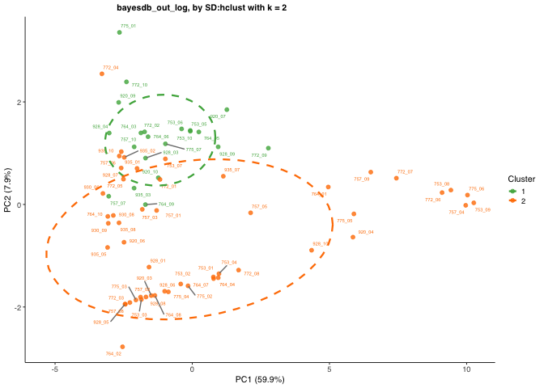
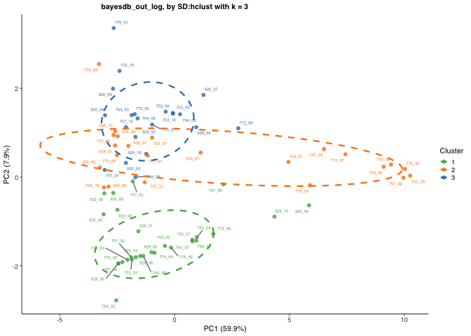
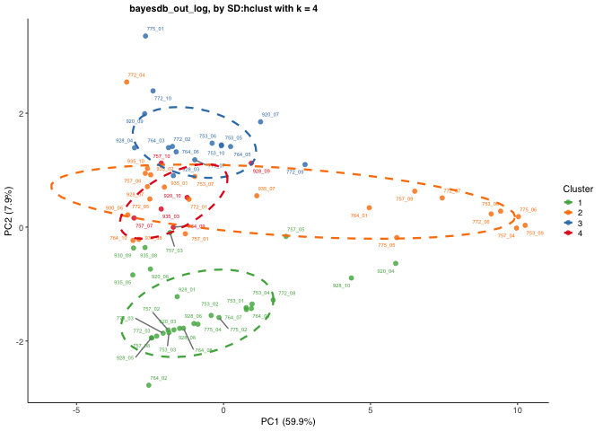
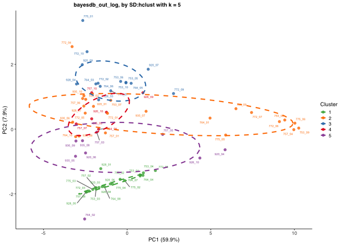
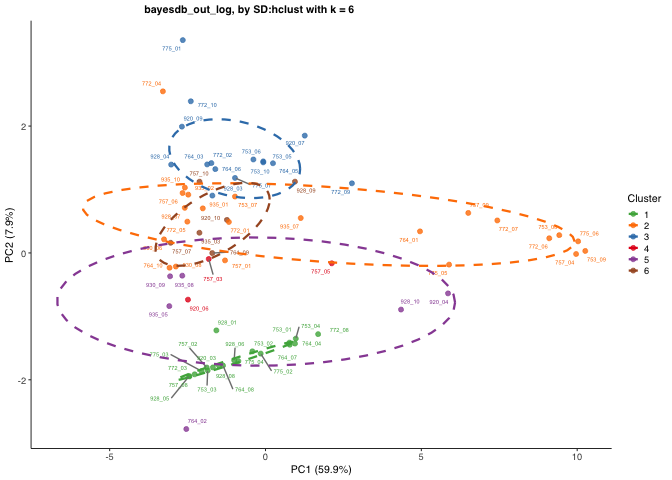
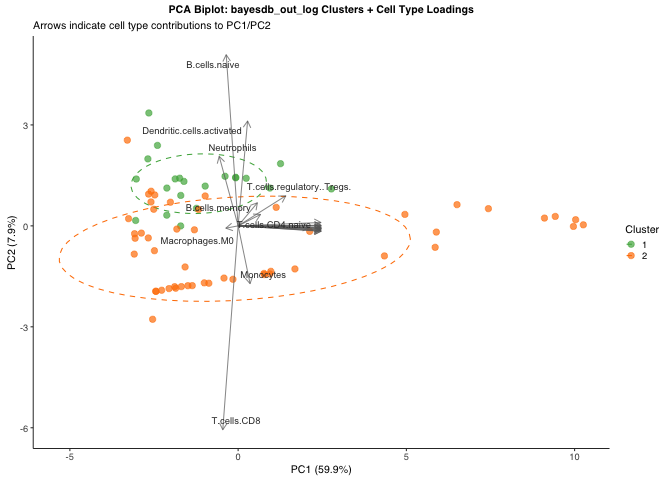

MCL_thesis_analysis
================
Heona
2026-07-24

- [Setup](#setup)
- [Color Setup](#color-setup)
- [MCL 1-100 Data Analysis](#mcl-1-100-data-analysis)
- [RNA data](#rna-data)
  - [Import the data & merge](#import-the-data--merge)
  - [Merge with only shared genes](#merge-with-only-shared-genes)
  - [PCA](#pca)
  - [Data check](#data-check)
  - [Batch correction with ComBat](#batch-correction-with-combat)
  - [RNA Combined Figure for
    dissertation](#rna-combined-figure-for-dissertation)
- [Proteomic data](#proteomic-data)
  - [Import the data](#import-the-data)
  - [Quick raw data check](#quick-raw-data-check)
  - [Sample loading normalization](#sample-loading-normalization)
  - [Principal Component analysis
    (PPCA)](#principal-component-analysis-ppca)
  - [Internal reference scaling](#internal-reference-scaling)
  - [Average replicates and
    log2-transform](#average-replicates-and-log2-transform)
  - [PPCA before HarmonizR](#ppca-before-harmonizr)
  - [HarmonizR](#harmonizr)
  - [Mapping and unifying colnames](#mapping-and-unifying-colnames)
  - [DreamAI](#dreamai)
  - [Run BayesDeBulk](#run-bayesdebulk)
  - [Cell composition data check](#cell-composition-data-check)
  - [UMAPs](#umaps)
- [Cola clustering](#cola-clustering)
  - [Consensus heatmap](#consensus-heatmap)
  - [Stats for k = 4](#stats-for-k--4)
  - [CDF functions](#cdf-functions)
  - [PCA with single methods for different
    k](#pca-with-single-methods-for-different-k)
  - [PC1 and PC2 loadings](#pc1-and-pc2-loadings)
  - [PC1-6 loadings](#pc1-6-loadings)
  - [UMAP colored by PC1 and PC2
    loadings](#umap-colored-by-pc1-and-pc2-loadings)
  - [Heatmaps (cell composition)](#heatmaps-cell-composition)
  - [SD:skmeans](#sdskmeans-1)
  - [SD:hclust](#sdhclust)
  - [B.cells naive and MCL marker
    correlation](#bcells-naive-and-mcl-marker-correlation)
- [Cola groups SD:hclust k=4 marker
  correlation](#cola-groups-sdhclust-k4-marker-correlation)
- [DEA (transcriptomic) SD:hclust k =
  4](#dea-transcriptomic-sdhclust-k--4)
  - [Volcano plots](#volcano-plots)
  - [GSEA: Hallmark, Staudt, GO](#gsea-hallmark-staudt-go)
  - [GSVA: Hallmark, Staudt, GO](#gsva-hallmark-staudt-go)
  - [GSEA with only Hallmark + Staudt](#gsea-with-only-hallmark--staudt)
  - [GSVA Hallmark + Staudt](#gsva-hallmark--staudt)
- [DEA (proteomic) with SD:hclust k =
  4](#dea-proteomic-with-sdhclust-k--4)
  - [Volcano plots](#volcano-plots-1)
  - [Volcano plot RNA + Prot combined](#volcano-plot-rna--prot-combined)
  - [Summary table of significant
    proteins](#summary-table-of-significant-proteins)
  - [Global heatmap of DE proteins](#global-heatmap-of-de-proteins)
  - [GSEA](#gsea)
  - [GSVA](#gsva)
- [Top DGE combined heatmap](#top-dge-combined-heatmap)
- [GSEA combined](#gsea-combined)
- [GSVA combined RNA and prot](#gsva-combined-rna-and-prot)
  - [Per-cluster means](#per-cluster-means)
  - [Per-sample heatmap](#per-sample-heatmap)
- [T cell markers SD:hclust cluster
  2](#t-cell-markers-sdhclust-cluster-2)
  - [in RNA: check T cell markers](#in-rna-check-t-cell-markers)
  - [Heatmap T cell marker in RNA
    data](#heatmap-t-cell-marker-in-rna-data)
  - [Heatmap T cell marker in protein
    data](#heatmap-t-cell-marker-in-protein-data)
  - [PI3K check](#pi3k-check)
- [Add clinical data](#add-clinical-data)
  - [Clinical data + GSVA](#clinical-data--gsva)
  - [Patient characteristics table](#patient-characteristics-table)
- [————–](#section)
- [EXTRA](#extra)
- [————–](#section-1)
- [DEA (transcriptomic) SD:hclust k =
  5](#dea-transcriptomic-sdhclust-k--5)
  - [Volcano plot](#volcano-plot)
  - [GSEA](#gsea-1)
  - [GSVA](#gsva-1)
- [DEA (proteomic) with SD:hclust k =
  5](#dea-proteomic-with-sdhclust-k--5)
  - [Volcano plots](#volcano-plots-2)
  - [GSEA with Hallmark, Staudt, GO](#gsea-with-hallmark-staudt-go)
  - [GSVA](#gsva-2)
- [DEA (transcriptomic) with SD:skmeans k =
  4](#dea-transcriptomic-with-sdskmeans-k--4)
  - [Volcano plot](#volcano-plot-1)
  - [Extracted significant genes](#extracted-significant-genes)
  - [GSEA](#gsea-2)
  - [GSVA](#gsva-3)
- [DEA (proteomic) with SD:skmeans k
  4](#dea-proteomic-with-sdskmeans-k-4)
  - [Volcano plots](#volcano-plots-3)
  - [GSEA](#gsea-3)
  - [GSVA](#gsva-4)
- [DEA (transcriptomic) with SD:skmeans k =
  5](#dea-transcriptomic-with-sdskmeans-k--5)
  - [Volcano plot](#volcano-plot-2)
  - [Extracted significant genes](#extracted-significant-genes-1)
  - [GSEA](#gsea-4)
  - [GSVA](#gsva-5)
- [DEA (proteomic) with SD:skmeans k =
  5](#dea-proteomic-with-sdskmeans-k--5)
  - [Volcano plots](#volcano-plots-4)
  - [GSEA with Hallmark, Staudt, GO](#gsea-with-hallmark-staudt-go-1)
  - [GSVA](#gsva-6)

# Setup

Bibtex files for Zotero

Then in each heatmap, just reference:

Heatmap( mat, row_names_gp = gp_row, column_names_gp = gp_col,
row_title_gp = gp_col, column_title_gp = gp_title, heatmap_legend_param
= list( title_gp = gp_legend_title, labels_gp = gp_legend_labels ), …
rest of heatmap code )

# Color Setup

``` r
library(scales)
```

    ## 
    ## Attaching package: 'scales'

    ## The following object is masked from 'package:purrr':
    ## 
    ##     discard

    ## The following object is masked from 'package:readr':
    ## 
    ##     col_factor

    ## The following objects are masked from 'package:psych':
    ## 
    ##     alpha, rescale

``` r
default_9 <- hue_pal()(9)
# This gives you the 9 colors ggplot auto-assigns

plex_colors <- setNames(default_9, c("753", "757", "764", "772", "775", "920", "928", "930", "935"))
```

Anywhere you have fill = plex → add + scale_fill_manual(values =
plex_colors). Anywhere you have color = plex → add +
scale_color_manual(values = plex_colors).

``` r
# Dissertation-wide divergent color scheme
diverging_palette <- c("#185FA5", "white", "#A32D2D")
```

# MCL 1-100 Data Analysis

# RNA data

## Import the data & merge

I have RNA1 and RNA2 from 2 different sources and have to unite them.

``` r
## RNA data extraction

rna_1 <- readRDS("/Users/heona/git-repos/MCL_thesis_repo/data/raw_data/20250303_MCL_RNAseq1.rds")
rna_2 <- readRDS("/Users/heona/git-repos/MCL_thesis_repo/data/raw_data/20250303_MCL_RNAseq2.rds") 

print(paste("Missing values in rna_1:", sum(is.na(rna_1))))
```

    ## [1] "Missing values in rna_1: 0"

``` r
print(paste("Missing values in rna_2:", sum(is.na(rna_2))))
```

    ## [1] "Missing values in rna_2: 0"

``` r
rna_1_data <- rna_1 %>%
  as.data.frame() %>%
  dplyr::select(where(~ !any(is.na(.))))

rna_2_data <- rna_2 %>%
  as.data.frame() %>%
  dplyr::select(where(~ !any(is.na(.))))
```

First, I need to unify the column names.

dplyr::select(any_of(colnames(rna_data))) searches for overlapping
column names, we still have different column names in each matrix - I
have to change them to have uniform colnames.

``` r
mapping <- read_excel("/Users/heona/git-repos/MCL_thesis_repo/data/raw_data/20240830_MCL_IDs_Heona_V2_reduced.xlsx") 

#create a name vector, which replaces the RNAseq_ID names with the MS2_ID names
name_map <- setNames (mapping$MS2_ID, mapping$RNAseq_ID)

# rename columns in rna_2_data
colnames(rna_2_data) <- ifelse(colnames(rna_2_data) %in% names(name_map),
                               name_map[colnames(rna_2_data)], 
                               colnames(rna_2_data))

#create a name vector, which replaces the Cegat_id names with the MS2_ID names
name_map_2 <- setNames (mapping$MS2_ID, mapping$Cegat_id)

# only keep the columns that could be mapped, omit the missing ones that are still named "S..."
rna_2_data <- rna_2_data[, !grepl("^MCL", colnames(rna_2_data))]

# rename columns in rna_1_data
colnames(rna_1_data) <- ifelse(colnames(rna_1_data) %in% names(name_map_2),
                               name_map_2[colnames(rna_1_data)], 
                               colnames(rna_1_data))

# only keep the columns that could be mapped, omit the missing ones that are still named "S..."
rna_1_data <- rna_1_data[, !grepl("^S", colnames(rna_1_data))]
cat("dimension of rna_1_data:", dim(rna_1_data), "\n")
```

    ## dimension of rna_1_data: 14828 25

``` r
cat("dimension of rna_2_data:", dim(rna_2_data), "\n")
```

    ## dimension of rna_2_data: 11846 47

``` r
#to make a full join of rna 1 and 2, move rownames to a new column called "gene" - bc full_join can only work with columns, not rownames
rna_1_data$gene <- rownames(rna_1_data)
rna_2_data$gene <- rownames(rna_2_data)

# now full_join by gene
rna_data <- full_join(rna_1_data, rna_2_data, by = "gene")
rownames(rna_data) <- rna_data$gene # set the column gene back to rownames
rna_data$gene <- NULL # delete the column gene

cat("dimension of rna_data:", dim(rna_data), "\n")
```

    ## dimension of rna_data: 16679 72

``` r
# how many gene names are overlapping
cat("shared rownames:", sum(rownames(rna_1_data) %in% rownames(rna_2_data)), "\n")
```

    ## shared rownames: 9995

``` r
cat("rows only in rna_1_data:", sum(!(rownames(rna_1_data) %in% rownames(rna_2_data))), "\n")
```

    ## rows only in rna_1_data: 4833

``` r
cat("rows only in rna_2_data:",sum(!(rownames(rna_2_data) %in% rownames(rna_1_data))), "\n")
```

    ## rows only in rna_2_data: 1851

rna_1_data and rna_2_data are from different labs and measured different
genes. There are 9995 overlapping genes and about 5000 genes unique to
rna_1 and 2000 unique to rna_2.

## Merge with only shared genes

For further analysis, we need to proceed with only the data on the genes
that were shared between both datasets.

``` r
shared_genes <- intersect(rownames(rna_1_data), rownames(rna_2_data))

rna_data_shared <- cbind(rna_1_data[shared_genes, ], rna_2_data[shared_genes, ]) %>%
  select(-gene)
```

## PCA

``` r
sum(is.na(rna_data_shared))
```

    ## [1] 0

``` r
# Standard PCA
rna_pca <- prcomp(t(as.matrix(rna_data_shared)), center = TRUE, scale. = TRUE)

# Extract scores
pca_out <- as.data.frame(rna_pca$x[, 1:2]) %>%
  rownames_to_column("Sample_ID")

# For variance explained:
var_explained <- summary(rna_pca)$importance[2, 1:2] * 100

# 5. for ex. "928_04" is plex_sample
pca_out_plex <- pca_out %>%
  separate(Sample_ID, into = c("Plex", "Sample"), sep = "_", remove = FALSE)

pca_before_plex <- ggplot(pca_out_plex, aes(PC1, PC2, color = Plex)) +
  geom_point(size = 1) +
  xlab(paste0("PC1 (", round(var_explained[1], 2), "%)")) +
  ylab(paste0("PC2 (", round(var_explained[2], 2), "%)")) +
  labs(title = "Before correction") +
  scale_color_manual(name = "Plex", values = plex_colors)
  
pca_before_plex
```

<!-- -->

``` r
save_figure(pca_before_plex, "fig01_rna_pca_before_batch_correction_plex", width = 7, height = 5, units = "cm")

# for coloring of sequencing site:

pca_out <- pca_out %>%
  mutate(Sequencing_site = ifelse(substr(Sample_ID, 1, 1) == "9", "Batch 1", "Batch 2"))

pca_before <- ggplot(pca_out, aes(PC1, PC2, color = Sequencing_site)) +
  geom_point(size = 1) +
  xlab(paste0("PC1 (", round(var_explained[1], 2), "%)")) +
  ylab(paste0("PC2 (", round(var_explained[2], 2), "%)")) +
  labs(title = "Before correction", color = "Sequencing site") +
  scale_color_manual(values = c("Batch 1" = "#E41A1C", "Batch 2" = "#377EB8"))

pca_before
```

<!-- -->

``` r
save_figure(pca_before, "fig01_rna_pca_before_batch_correction_lab", width = 7, height = 5, units = "cm")
```

The PCA shows a strong batch effect between the two datasets, and also
within the plexes. For BayesdeBulk, which we will perform with this rna
data, it is crucial to not have any batch effects!

## Data check

``` r
# Count how many values are below 0 and get the range of negative values
cat("=== rna_data_shared ===\n")
```

    ## === rna_data_shared ===

``` r
cat("Total sum:", sum(rna_data_shared), "\n")
```

    ## Total sum: 3322889

``` r
cat("Data range:", range(rna_data_shared, na.rm = TRUE), "\n")
```

    ## Data range: -3.525104 14.11628

``` r
cat("Negative values:", sum(rna_data_shared < 0, na.rm = TRUE), "\n")
```

    ## Negative values: 29161

``` r
cat("Range of negative values:", range(rna_data_shared[rna_data_shared < 0], na.rm = TRUE), "\n\n")
```

    ## Range of negative values: -3.525104 -0.0008044756

``` r
cat("=== rna_1_data ===\n")
```

    ## === rna_1_data ===

``` r
cat("Total sum:", sum(rna_1_data[ , sapply(rna_1_data, is.numeric)], na.rm = TRUE), "\n")
```

    ## Total sum: 1769492

``` r
cat("Data range:", range(rna_1_data[ , sapply(rna_1_data, is.numeric)], na.rm = TRUE), "\n")
```

    ## Data range: -2.811264 16.17664

``` r
cat("Negative values:", sum(rna_1_data < 0, na.rm = TRUE), "\n")
```

    ## Negative values: 6503

``` r
cat("Range of negative values:", range(rna_1_data[rna_1_data < 0], na.rm = TRUE), "\n\n")
```

    ## Range of negative values: -0.002074767 -2.81126414

``` r
cat("=== rna_2_data ===\n")
```

    ## === rna_2_data ===

``` r
cat("Total sum:", sum(rna_2_data[ , sapply(rna_2_data, is.numeric)], na.rm = TRUE), "\n")
```

    ## Total sum: 2319244

``` r
cat("Data range:", range(rna_2_data[ , sapply(rna_2_data, is.numeric)], na.rm = TRUE), "\n")
```

    ## Data range: -3.525104 18.29288

``` r
cat("Negative values:", sum(rna_2_data < 0, na.rm = TRUE), "\n")
```

    ## Negative values: 35482

``` r
cat("Range of negative values:", range(rna_2_data[rna_2_data < 0], na.rm = TRUE), "\n")
```

    ## Range of negative values: -0.0008044756 -3.52510448

Expression values ranged from approximately -2,8 to 16,2 in samples from
lab 1 and from -3,5 to 18,3 in samples from lab 2.

### Normalization pattern

Since I have negative values in my RNA datasets that hinder batch
correction methods to function, I want to check if my RNA data is
normalized and that is the cause of the negative values.

``` r
library(tidyverse)
library(cowplot)

# Boxplot with default colors and plain title
p1_rna_plex <- rna_data_shared %>%
  rownames_to_column("gene") %>%
  pivot_longer(-gene, names_to = "sample", values_to = "expression") %>%
  separate(sample, into = c("plex", "number"), sep = "_", remove = FALSE) %>%
  ggplot(aes(x = sample, y = expression, fill = plex)) +
  geom_boxplot(outlier.size = 1, outlier.alpha = 1) +
  theme(
    axis.text.x = element_text(angle = 90, size = 6, vjust = 0.5, hjust = 1),
    legend.position = "right",
  ) +
  labs(x = "", y = "log2(expression)", title = "Before correction") +
  scale_fill_manual(name = "Plex", values = plex_colors)
  # scale_fill_brewer removed to use defaults

# boxplot with sequencing site colored

p1_rna <- rna_data_shared %>%
  rownames_to_column("gene") %>%
  pivot_longer(-gene, names_to = "sample", values_to = "expression") %>%
  mutate(Sequencing_site = ifelse(substr(sample, 1, 1) == "9", "Batch 1", "Batch 2")) %>%
  ggplot(aes(x = sample, y = expression, fill = Sequencing_site)) +
  geom_boxplot(outlier.size = 1, outlier.alpha = 1) +
  theme(
    axis.text.x = element_text(angle = 90, size = 6, vjust = 0.5, hjust = 1),
    legend.position = "right",
  ) +
  labs(x = "", y = "log2(expression)", title = "Before correction") +
  scale_fill_manual(values = c("Batch 1" = "#E41A1C", "Batch 2" = "#377EB8"))

# Density plot with default colors and plain title
p2_rna <- rna_data_shared %>%
  rownames_to_column("gene") %>%
  pivot_longer(-gene, names_to = "sample", values_to = "expression") %>%
  separate(sample, into = c("plex", "number"), sep = "_", remove = FALSE) %>%
  ggplot(aes(x = expression, color = plex)) +
  geom_density() +
  theme(
    legend.position = "right",
    #plot.title = element_text(face = "plain")
  ) +
  labs(x = "log2(expression)", title = "Before correction")
  # scale_color_brewer removed to use defaults

# Combine using cowplot
combined_rna_plot <- plot_grid(
  plot_grid(p1_rna_plex, p2_rna, nrow = 2),
  rel_widths = c(1, 0.2)
)

combined_rna_plot
```

<!-- -->

``` r
p1_rna
```

<!-- -->

``` r
save_figure(p1_rna_plex, "fig03_rna_boxplot_raw_plex", width = 14, height = 4)
save_figure(p1_rna, "fig03_rna_boxplot_raw", width = 14, height = 4)
save_figure(p2_rna, "fig03_rna_density_raw", width = 7, height = 5)
```

The boxplot visualization shows aligned medians within samples of the
same lab origin, confirming normalization within each batch while
revealing differences in normalization between the two laboratories

## Batch correction with ComBat

with lab origin as batch variable

The samples starting with 9 are from rna_1, the samples starting with 7
are from rna_2.

``` r
batch_vector <- ifelse(grepl("^9", colnames(rna_data_shared)), "rna_1", "rna_2")
modcombat <- model.matrix(~1, data = data.frame(batch = batch_vector))

rna_combat <- ComBat(dat = as.matrix(rna_data_shared),
                        batch = batch_vector,
                        mod = modcombat,
                        par.prior = TRUE)
```

    ## Found2batches

    ## Adjusting for0covariate(s) or covariate level(s)

    ## Standardizing Data across genes

    ## Fitting L/S model and finding priors

    ## Finding parametric adjustments

    ## Adjusting the Data

#### PCA after Batch correction

``` r
rna_pca_corrected <- prcomp(t(as.matrix(rna_combat)), scale. = TRUE)

# Create data frame for plotting
pca_out_corrected <- as.data.frame(rna_pca_corrected$x[, 1:2]) %>%
  rownames_to_column("Sample_ID") %>%
  separate(Sample_ID, into = c("Plex", "Sample"), sep = "_", remove = FALSE)

# Plot
pca_after_plex <- ggplot(pca_out_corrected, aes(PC1, PC2, color = Plex)) +
  geom_point(size = 1) +
  xlab(sprintf("PC1 (%.2f%%)", summary(rna_pca_corrected)$importance[2,1] * 100)) +
  ylab(sprintf("PC2 (%.2f%%)", summary(rna_pca_corrected)$importance[2,2] * 100)) +
  labs(title = "After ComBat") +
  scale_color_manual(name = "Plex", values = plex_colors)

pca_after_plex
```

<!-- -->

``` r
save_figure(pca_after_plex, "fig02_rna_pca_after_batch_correction", width = 7, height = 5, units = "cm")
```

color by lab origin:

``` r
# Standard PCA
pca_rna_combat <- prcomp(t(as.matrix(rna_combat)), scale. = TRUE)

# Create data frame for plotting
pca_df <- data.frame(
  PC1 = pca_rna_combat$x[,1],
  PC2 = pca_rna_combat$x[,2],
  Sample_ID = rownames(pca_rna_combat$x)
) %>%
  mutate(Sequencing_site = ifelse(substr(Sample_ID, 1, 1) == "9", "Batch 1", "Batch 2"))

# Plot
pca_after <- ggplot(pca_df, aes(PC1, PC2, color = Sequencing_site)) +
  geom_point(size = 1) +
  scale_color_manual(values = c("Batch 1" = "#E41A1C", "Batch 2" = "#377EB8")) +
  labs(
    x = sprintf("PC1 (%.1f%%)", summary(pca_rna_combat)$importance[2,1] * 100),
    y = sprintf("PC2 (%.1f%%)", summary(pca_rna_combat)$importance[2,2] * 100),
    title = "After ComBat",
    color = "Sequencing site"
  )

save_figure(pca_after, "fig02_rna_pca_after_batch_correction_lab", width = 7, height = 5, units = "cm")

pca_after
```

<!-- -->

It looks like the batch correction was successful, the dominant
separation by lab has been eliminated.

### Boxplot after correction

``` r
# Boxplot version

p1_corrected_plex <- rna_combat %>%
  as.data.frame() %>%
  rownames_to_column("gene") %>%
  pivot_longer(-gene, names_to = "sample", values_to = "expression") %>%
  separate(sample, into = c("plex", "number"), sep = "_", remove = FALSE) %>%
  ggplot(aes(x = sample, y = expression, fill = plex)) +
  geom_boxplot(outlier.size = 1) +
  theme(axis.text.x = element_text(angle = 90, size = 5, vjust = 0.5, hjust = 1)) +
  labs(title = "After correction", x = "", y = "log2 (expression)") +
  scale_fill_manual(name = "Plex", values = plex_colors)

p1_corrected_plex
```

<!-- -->

``` r
save_figure(p1_corrected_plex, "fig03_rna_boxplot_batch_corrected_plex", width = 14, height = 4)

# for sequencing site separation:

p1_corrected <- rna_combat %>%
  as.data.frame() %>%
  rownames_to_column("gene") %>%
  pivot_longer(-gene, names_to = "sample", values_to = "expression") %>%
  mutate(Sequencing_site = ifelse(substr(sample, 1, 1) == "9", "Batch 1", "Batch 2")) %>%
  ggplot(aes(x = sample, y = expression, fill = Sequencing_site)) +
  geom_boxplot(outlier.size = 1) +
  theme(axis.text.x = element_text(angle = 90, size = 5, vjust = 0.5, hjust = 1)) +
  labs(title = "After correction", x = "", y = "log2 (expression)", fill = "Sequencing site") +
  scale_fill_manual(values = c("Batch 1" = "#E41A1C", "Batch 2" = "#377EB8"))

p1_corrected
```

<!-- -->

``` r
save_figure(p1_corrected, "fig03_rna_boxplot_batch_corrected", width = 14, height = 4)

# 2. Density plot with default colors and plain title
p2_corrected <- rna_combat %>%
  as.data.frame() %>%
  rownames_to_column("gene") %>%
  pivot_longer(-gene, names_to = "sample", values_to = "expression") %>%
  separate(sample, into = c("plex", "number"), sep = "_", remove = FALSE) %>%
  ggplot(aes(x = expression, color = plex)) +
  geom_density() +
  theme(
    legend.position = "right",
    #plot.title = element_text(face = "plain")
  ) +
  labs(x = "log2(expression)", title = "After correction")
  # scale_color_brewer removed to use defaults

p2_corrected
```

<!-- -->

``` r
save_figure(p2_corrected, "fig03_rna_density_batch_corrected", width = 7, height = 5)
```

## RNA Combined Figure for dissertation

``` r
library(patchwork)

library(patchwork)

final <- (p1_rna / p1_corrected / (pca_before | pca_after)) +
  plot_layout(guides = "collect", heights = c(1, 1, 1.4)) &
  theme(legend.position = "right")

final
```

<!-- -->

``` r
library(cowplot)

# Strip legends from all plots
p1 <- p1_rna + theme(legend.position = "none")
p2 <- p1_corrected + theme(legend.position = "none")
p3 <- pca_before + theme(legend.position = "none")
p4 <- pca_after + theme(legend.position = "none")

# Build the layout
top_rows <- plot_grid(p1, p2, ncol = 1, align = "v", axis = "lr")
bottom_row <- plot_grid(p3, p4, ncol = 2, align = "h", axis = "tb")
plots <- plot_grid(top_rows, bottom_row, ncol = 1, rel_heights = c(2, 1.4))

# Extract one legend (using fill from a boxplot is cleanest)
legend <- get_legend(p1_rna + theme(legend.title = element_blank()) +
                       labs(fill = "Sequencing site"))

# Combine plots + legend
final <- plot_grid(plots, legend, ncol = 2, rel_widths = c(1, 0.15))
final
```

<!-- -->

``` r
save_figure(final, "fig03_rna_before_after_lab", width = 15, height = 12)
```

# Proteomic data

## Import the data

``` r
getwd()
```

    ## [1] "/Users/heona/git-repos/MCL_thesis_repo"

``` r
setwd("/Users/heona/git-repos/MCL_thesis_repo")
mcl_original <- read.table("/Users/heona/git-repos/MCL_thesis_repo/data/raw_data/MCL_1-100_Cologne_Essen.txt", header = TRUE, sep = "\t")%>%
  janitor::clean_names()
```

## Quick raw data check

``` r
dim(mcl_original)
```

    ## [1] 6327  253

The dataset contains 6327 rows and 253 columns. I select only the
relevant columns and rename them.

``` r
mcl_unfiltered <- mcl_original %>%
  dplyr::select(uniprot_i_ds, gene_names, contains("reporter_intensity_corrected")) %>%
  dplyr::rename("uniprot_id" = "uniprot_i_ds" ) %>%
  dplyr::rename("gene_id" = "gene_names") %>%
  dplyr::rename_with(.cols = -c("uniprot_id", "gene_id"), .fn = ~ stringr::str_remove(string = ., "reporter_intensity_corrected_"))

dim(mcl_unfiltered)
```

    ## [1] 6327  244

The transformed dataset mcl_unfiltered contains 6327 rows and 244
columns.

### Missing values

Check for number of missing values - R likes to work with NA as missing
values, but in our dataset missing values are NaN.

``` r
print(paste("Total number of missing values: ", sum(is.na(mcl_unfiltered))))
```

    ## [1] "Total number of missing values:  564006"

``` r
print(paste("Proportion of missing values:", 
            round(sum(is.na(mcl_unfiltered)) / length(as.matrix(mcl_unfiltered)) * 100, 2), "%"))
```

    ## [1] "Proportion of missing values: 36.53 %"

### Initial visualization of NAs

``` r
# Process both replicates together
missing_per_sample <- bind_rows(
  mcl_unfiltered %>%
    select(contains("_r1_")) %>%
    summarise(across(everything(), ~sum(is.na(.)) / n() * 100)) %>%
    pivot_longer(everything(), names_to = "sample", values_to = "pct_missing") %>%
    mutate(replicate = "r1"),
  
  mcl_unfiltered %>%
    select(contains("_r2_")) %>%
    summarise(across(everything(), ~sum(is.na(.)) / n() * 100)) %>%
    pivot_longer(everything(), names_to = "sample", values_to = "pct_missing") %>%
    mutate(replicate = "r2")
) %>%
  mutate(plex = str_extract(sample, "\\d{3}$"))

# Faceted plot
ggplot(missing_per_sample, aes(x = reorder(sample, as.numeric(plex)), y = pct_missing, fill = plex)) +
  geom_bar(stat = "identity") +
  facet_wrap(~replicate, scales = "free_x", ncol = 1) +
  labs(x = "Samples", 
       y = "% of proteins missing", 
       fill = "Plex",
       title = "Missing values per sample") +
  theme(axis.text.x = element_text(angle = 90, hjust = 1, vjust = 0.5, size = 4))
```

<!-- -->

Samples across plexes show varying % of missing values, while within the
plex usually have the same % of missingness. The spikes in missingness
are the “empty” plexes, those that were labeled but not filled with
samples.The mass spec does not measure perfectly, and slight overlap is
usual, explaining the measurements of some signals even in the empty
samples. I exclude replicate 1 and 2 of the TMT-labels that were not
used in the plexes. Also, I exclude the plexes 949 ad 783 because they
did not yield enough data (\> 50% missing values)

``` r
mcl <- mcl_unfiltered %>%
  select(-c("8_r1_775", "9_r1_775", "10_r1_775", # from Plex 5 from MCL1-54
                          "1_r1_930", "2_r1_930", "3_r1_930", "4_r1_930", "5_r1_930", # from Plex 3 from MCL56-100
                          "8_r2_775", "9_r2_775", "10_r2_775", # r2
                          "1_r2_930", "2_r2_930", "3_r2_930", "4_r2_930", "5_r2_930", # r2
                          )) %>%
  select(-contains("949")) %>%
  select(-contains("783"))
```

I convert NaN to NA and remove rows with only NA, then check the data
again.

``` r
# Process both replicates together
missing_per_sample <- bind_rows(
  mcl %>%
    select(contains("_r1_")) %>%
    summarise(across(everything(), ~sum(is.na(.)) / n() * 100)) %>%
    pivot_longer(everything(), names_to = "sample", values_to = "pct_missing") %>%
    mutate(replicate = "r1"),
  
  mcl %>%
    select(contains("_r2_")) %>%
    summarise(across(everything(), ~sum(is.na(.)) / n() * 100)) %>%
    pivot_longer(everything(), names_to = "sample", values_to = "pct_missing") %>%
    mutate(replicate = "r2")
) %>%
  mutate(plex = str_extract(sample, "\\d{3}$"))

# Faceted plot
p <- ggplot(missing_per_sample, aes(x = reorder(sample, as.numeric(plex)), y = pct_missing, fill = plex)) +
  geom_bar(stat = "identity") +
  facet_wrap(~replicate, scales = "free_x", ncol = 1) +
  labs(x = "Samples", 
       y = "% of proteins missing", 
       fill = "Plex",
       title = "Protein - Missing values per sample") +
  theme(axis.text.x = element_text(angle = 90, hjust = 1, vjust = 0.5, size = 4))

p
```

<!-- -->

``` r
save_figure(p, "fig04_prot_missingness", width = 7, height = 5, units = "cm")
```

### Data on protein identified

``` r
#convert NaN to NA
mcl[mcl == "NaN"] <- NA_integer_

#convert Zero values to NA
mcl[,-c(1:2)][mcl[,-c(1:2)] == "0"] <- NA_integer_

#remove rows with only NA
mcl <- mcl %>%
  filter(rowSums(is.na(mcl[,-c(1:2)])) != ncol(mcl[,-c(1:2)]))
```

Data check:

``` r
dim(mcl)
```

    ## [1] 6321  184

``` r
print(paste("Total number of proteins identified:", nrow(mcl)))
```

    ## [1] "Total number of proteins identified: 6321"

``` r
na_per_sample <- colSums(is.na(mcl[,-c(1:2)]))

print(paste("Median number of proteins identified per sample:", nrow(mcl) - median(na_per_sample)))
```

    ## [1] "Median number of proteins identified per sample: 4624"

``` r
print(paste("Minimum number of proteins identified per sample:", nrow(mcl) - max(na_per_sample)))
```

    ## [1] "Minimum number of proteins identified per sample: 3759"

``` r
print(paste("Maximum number of proteins identified per sample:", nrow(mcl) - min(na_per_sample)))
```

    ## [1] "Maximum number of proteins identified per sample: 5243"

``` r
print(paste("Total number of missing values:", sum(is.na(mcl))))
```

    ## [1] "Total number of missing values: 319128"

``` r
print(paste("Proportion of missing values:", 
            round(sum(is.na(mcl)) / length(as.matrix(mcl)) * 100, 2), "%"))
```

    ## [1] "Proportion of missing values: 27.44 %"

``` r
print(paste("Negative values:", sum(mcl[sapply(mcl, is.numeric)] < 0, na.rm = TRUE)))
```

    ## [1] "Negative values: 0"

Proteomics typically has 20-40% missing values, which is much higher
than RNA-seq. This is normal and expected due to the stochastic nature
of mass spectrometry.

### Duplicates

check for duplicated features and samples:

``` r
print(paste("Number of duplicated features: ", sum(duplicated(mcl$uniprot_id))))
```

    ## [1] "Number of duplicated features:  0"

``` r
print(paste("Number of duplicated samples: ", sum(duplicated(colnames(mcl[,-c(1:2)])))))
```

    ## [1] "Number of duplicated samples:  0"

### Raw data distribution of mcl

inspect how the data is distributed without any correction

``` r
order_vec <- colnames(mcl[,-c(1:2)])

# both plots without legend
p1 <- mcl %>%
  dplyr::select(-gene_id) %>%
  pivot_longer(!uniprot_id, names_to = "Prot_id", values_to = "intensity") %>%
  mutate(splitter = Prot_id) %>%
  separate(splitter, c("remove", "plex"), sep = "_r1_|_r2_") %>%
  filter(grepl("_r1_", Prot_id)) %>%
  ggplot(aes(factor(Prot_id, levels = order_vec), log2(intensity), fill = plex)) +
  geom_boxplot(outlier.size = 1, outlier.alpha = 1, outlier.shape = 16) +
  theme(axis.text.x = element_text(size = 5, angle = 90, hjust = 1, vjust = 1),
        legend.position = "none",
        plot.title = element_text(size = 8, face = "plain", hjust = 0.5)) +
  labs(x = "", y = "log2(intensity)", title = "R1") +
  scale_fill_manual(name = "Plex", values = plex_colors) 
  # scale_fill_brewer(palette = "Set3")

p2 <- mcl %>%
  dplyr::select(-gene_id) %>%
  pivot_longer(!uniprot_id, names_to = "Prot_id", values_to = "intensity") %>%
  mutate(splitter = Prot_id) %>%
  separate(splitter, c("remove", "plex"), sep = "_r1_|_r2_") %>%
  filter(grepl("_r2_", Prot_id)) %>%
  ggplot(aes(factor(Prot_id, levels = order_vec), log2(intensity), fill = plex)) +
  geom_boxplot(outlier.size = 1, outlier.alpha = 1, outlier.shape = 16) +
  theme(axis.text.x = element_text(size = 5, angle = 90, hjust = 1, vjust = 1),
        legend.position = "none",
        plot.title = element_text(size = 8, face = "plain", hjust = 0.5)) +
  labs(x = "", y = "log2(intensity)", title = "R2") +
  scale_fill_manual(name = "Plex", values = plex_colors) 
  #scale_fill_brewer(palette = "Set3")

# legend from one plot
legend <- get_legend(
  p1 + theme(legend.position = "right")
)
```

    ## Warning: Removed 157266 rows containing non-finite outside the scale range
    ## (`stat_boxplot()`).

``` r
# combine
combined <- plot_grid(
  plot_grid(p1, p2, nrow = 2),
  legend,
  rel_widths = c(1, 0.1)
)
```

    ## Warning: Removed 157266 rows containing non-finite outside the scale range
    ## (`stat_boxplot()`).

    ## Warning: Removed 161862 rows containing non-finite outside the scale range
    ## (`stat_boxplot()`).

``` r
p <- plot_grid(
  plot_grid(p1, p2, nrow = 2),
  legend,
  rel_widths = c(1, 0.1)
)
```

    ## Warning: Removed 157266 rows containing non-finite outside the scale range
    ## (`stat_boxplot()`).
    ## Removed 161862 rows containing non-finite outside the scale range
    ## (`stat_boxplot()`).

``` r
p
```

<!-- -->

``` r
save_figure(p, "fig05_prot_boxplot_raw", width = 15, height = 7, units = "cm")
```

This boxplot visualization of raw protein intensities on a log₂-scale
reveals consistent intensity distributions between replicates while
showing variations both within and across plexes indicating the need for
normalization.

### Replicate correlation

Each plex was measured in two replicates - they should be similar - so
we investigate the correlation between both replicates.

``` r
mcl_rep1 <- mcl %>%
  dplyr::select(contains("r1"))
mcl_rep2 <- mcl %>%
  dplyr::select(contains("r2"))

#set the color-vector 
color_fun_corr = colorRamp2(c(-1, 0, 1), c("blue", "white", "red"))

ht <- cor(mcl_rep1, mcl_rep2, method = "spearman", use = "pairwise.complete.obs") %>%
  Heatmap(as.matrix(.),
          column_title = "Replicate 1",
          row_title = "Replicate 2",
          col = color_fun_corr,
          show_row_names = FALSE,
          show_column_names = FALSE,
          cluster_rows = FALSE,
          cluster_columns = FALSE,
          name = "Spearman's R",
          column_title_gp = gp_col,
          row_title_gp = gp_col,
          heatmap_legend_param = list(
            title_gp = gp_legend_title,
            labels_gp = gp_legend_labels
          ))

draw(ht)
```

<!-- -->

``` r
ht
```

<!-- -->

``` r
save_heatmap(ht, "fig06_replicate_correlation", width = 6, height = 4)
```

    ## null device 
    ##           1

This shows an acceptable correlation, though optimal would be a higher
contrast between the diagonal and off-diagonal correlations. Still, we
can combine the replicate values to an average value.

### Combine replicates & reshape dataframe from wide to long

I combine the replicates to a dataframe with the average of r1 and r2.

``` r
mcl_r1 <- mcl %>%
  dplyr::select(uniprot_id, contains("r1")) %>%
    tidyr::pivot_longer(!uniprot_id,
                        names_to = "samples_r1",
                        values_to = "count_R1")

mcl_r2 <- mcl %>%
    dplyr::select(uniprot_id, contains("r2")) %>%
    tidyr::pivot_longer(!uniprot_id,
                        names_to = "samples_r2",
                        values_to = "count_R2")

# mearge mcl_r1 and mcl_r2 and add an average column
mcl_long <- cbind(mcl_r1, mcl_r2[, -1]) # [, -1] to leave out the second uniprot_id column

mcl_avg <- mcl_long %>%
  rowwise() %>%
  mutate(avg_count = mean(c(count_R1, count_R2), na.rm = TRUE)) 

#reformat the NaN in the new column to NA
mcl_avg[mcl_avg == "NaN"] <- NA_integer_
```

### Visualize NAs

``` r
comb <- mcl_avg %>%
  group_by(samples_r1) %>%
  summarise(na_rate = sum(is.na(avg_count))) %>%
  mutate(samples_r2 = samples_r1) %>% 
  separate(samples_r2, c("remove", "Plex"), sep = "r1_") %>% 
  mutate(na_perc = na_rate / nrow(mcl)) 

ggplot(comb, aes(
    x = forcats::fct_reorder(samples_r1, na_perc),
    y = na_perc,
    fill = Plex
  )) +
  geom_col() +
  labs(x = "samples", y = "[%] of proteins missing") +
  theme(
    panel.border = element_blank(),
    panel.grid.major = element_blank(),
    panel.grid.minor = element_blank(),
    axis.line.y =  element_line(colour = "black"),
    axis.line.x =  element_line(colour = "black"),
    axis.text.y = element_text(colour = "black"),
    legend.title = element_blank(),
    axis.text.x = element_text(
      size = 6,
      angle = 90,
      hjust = 1,
      vjust = 1
    ),
    legend.position = "none"
  ) 
```

<!-- -->

### Reference channel correlation

The reference channel is the 11th sample, so I only select the 11th
sample of each plex as ref_cor.

Then, cor() calculates the pairwise Spearman correlations for the
selected columns starting with 11, considering only complete
observations (pairwise.complete.obs). The resulting correlation matrix
is converted to a data frame using as.data.frame(). The mutate()
function adds new column “type” with the value “ref” to distinguish it
as the reference-channel correlation. pivot_longer() converts the
correlation matrix from wide format to long format, resulting in a
tibble with two columns: “Prot_id” and “count” (the correlation values)
filter(count != 1) removes self-correlation values (correlation of a
variable with itself), as these values are always 1 in correlation
matrices.

``` r
mcl_wide <- mcl_avg %>%
  dplyr::select(c("uniprot_id", "samples_r1", "avg_count")) %>% #mcl_wide has the average count, we only take the name of samples_r1 (in case of confusion)
  pivot_wider(names_from = "samples_r1", values_from = avg_count)

#reference-channel correlation 
ref_cor11 <- mcl_wide %>%
  dplyr::select(starts_with("11_")) %>% 
  cor(., method = "spearman", use = "pairwise.complete.obs") %>%
  as.data.frame() %>%
  mutate(type = "ref") %>%
  pivot_longer(!c(type), names_to = "samples", values_to = "count") %>%
  filter(count != 1)

head(ref_cor11, n = 5)
```

    ## # A tibble: 5 × 3
    ##   type  samples   count
    ##   <chr> <chr>     <dbl>
    ## 1 ref   11_r1_757 0.808
    ## 2 ref   11_r1_764 0.807
    ## 3 ref   11_r1_772 0.798
    ## 4 ref   11_r1_775 0.760
    ## 5 ref   11_r1_920 0.808

``` r
ref_cor <- ref_cor11[duplicated(ref_cor11$count),] # remove duplicates that appear twice bc of pivot_longer

head(ref_cor, n = 5)
```

    ## # A tibble: 5 × 3
    ##   type  samples   count
    ##   <chr> <chr>     <dbl>
    ## 1 ref   11_r1_753 0.808
    ## 2 ref   11_r1_753 0.807
    ## 3 ref   11_r1_757 0.839
    ## 4 ref   11_r1_753 0.798
    ## 5 ref   11_r1_757 0.821

``` r
p <- ggplot(ref_cor, aes(count)) +
  geom_density(fill = "#2a9d8f") +
  labs(x = "Spearman's R",
       title = "Reference channel correlation")  +
  theme(plot.title = element_text(face = "plain"))
  
p
```

<!-- -->

``` r
save_figure(p, "fig06_ref_channel_correlation", width = 6, height = 4)
```

The reference channel correlation ensures that measurements are accurate
and not biased by technical irregularities. Spearman’s R showed an
overall positive correlation for reference channels and a peak around
0.8, when ideally it would be at \> 0.9. This sub-optimal correlation
suggested the presence of technical variation between plexes, requiring
batch effect correction.

## Sample loading normalization

To correct for differences in total protein amount loaded across samples
and plexes, sample loading normalization is applied. A “target” is
defined as the median total intensity across all samples (median of all
column sums). For each sample, a normalization factor is calculated by
dividing the target by the sample’s total intensity. Each protein
intensity value is then multiplied by its corresponding normalization
factor, scaling all samples to a common total intensity level while
preserving the relative differences between individual proteins. To
verify successful normalization, protein intensities are again
visualized by boxplots on a log2-scale.

``` r
library(dplyr)

# create a vector of plexes
plex_vec <- unique(
  stringr::str_remove(
    colnames(mcl[,-c(1,2)]), 
    "._r1_|._r2_|.._r1_|.._r2_")
  ) 

# Store each plex into a list embedment
plex_list <- list() 

for(i in plex_vec) {
  plex_list[[i]] <- mcl %>% 
    dplyr::select(contains(i))
}

#create the target scaling factor 
colsum_vec <- c() 

for(i in plex_vec) {
  df <- plex_list[[i]]
  colsum_vec <- c(colsum_vec, colSums(df, na.rm = TRUE))
}

target <- median(colsum_vec, na.rm = TRUE)

#correct per plex with a helper function
run_sl_correct <- function(Y) { 
  norm_facs <- target / colSums(Y, na.rm = TRUE) # calculate normalization factor for each column in matrix Y
  output_sl <- sweep(Y, 2, norm_facs, FUN = "*") # multiplies norm_facs with each column
  return(output_sl) # output_sl is the normalized matrix
}

data_sl_repl <- plex_list%>%
  purrr::map(run_sl_correct) %>% 
  bind_cols()
```

visualize effect

``` r
# Plots without legends
p1 <- data_sl_repl %>%
  tibble::rownames_to_column("n") %>%
  pivot_longer(!n, names_to = "Prot_id", values_to = "intensity") %>%
  mutate(splitter = Prot_id) %>%
  separate(splitter, c("remove", "plex"), sep = "_r1_|_r2_") %>%
  filter(grepl("_r1_", Prot_id)) %>%
  ggplot(aes(
    factor(Prot_id, levels = order_vec), log2(intensity), fill = plex
  )) +
  geom_boxplot(outlier.size = 1, outlier.alpha = 1, outlier.shape = 16) +
  theme(axis.text.x = element_text(size = 5, angle = 90, hjust = 1, vjust = 1),
        legend.position = "none",
        plot.title = element_text(size = 8, face = "plain", hjust = 0.5)) +
  labs(x = "", y = "log2(intensity)", title = "R1") +
  scale_fill_manual(values = plex_colors)

p1
```

    ## Warning: Removed 157266 rows containing non-finite outside the scale range
    ## (`stat_boxplot()`).

<!-- -->

``` r
  #scale_fill_brewer(palette = "Set3")

p2 <- data_sl_repl %>%
  tibble::rownames_to_column("n") %>%
  pivot_longer(!n, names_to = "Prot_id", values_to = "intensity") %>%
  mutate(splitter = Prot_id) %>%
  separate(splitter, c("remove", "plex"), sep = "_r1_|_r2_") %>%
  filter(grepl("_r2_", Prot_id)) %>%
  ggplot(aes(
    factor(Prot_id, levels = order_vec), log2(intensity), fill = plex
  )) +
  geom_boxplot(outlier.size = 1, outlier.alpha = 1, outlier.shape = 16) +
  theme(axis.text.x = element_text(size = 5, angle = 90, hjust = 1, vjust = 1),
        legend.position = "none",
        plot.title = element_text(size = 8, face = "plain", hjust = 0.5)) +
  labs(x = "", y = "log2(intensity)", title = "R1") +
  scale_fill_manual(values = plex_colors)
  #scale_fill_brewer(palette = "Set3")

# Extract legend from one plot
legend <- get_legend(
  p1 + theme(legend.position = "right")
)
```

    ## Warning: Removed 157266 rows containing non-finite outside the scale range
    ## (`stat_boxplot()`).

``` r
# combine plots and legend
p <- plot_grid(
  plot_grid(p1, p2, nrow = 2),
  legend,
  rel_widths = c(1, 0.1)
)
```

    ## Warning: Removed 157266 rows containing non-finite outside the scale range
    ## (`stat_boxplot()`).

    ## Warning: Removed 161862 rows containing non-finite outside the scale range
    ## (`stat_boxplot()`).

``` r
p
```

<!-- -->

``` r
save_figure(p, "fig05_prot_boxplot_sl_normalized", width = 14, height = 7, units = "cm")
```

After sample loading normalization protein intensities are effectively
balanced across all samples. The boxplots show aligned medians and
comparable intensity distributions across both replicates and plexes,
indicating successful correction of technical variability in protein
loading.

### Correlation between random sets of channels

I am comparing the ones with TMT-label 129C since they are present in
every plex.

``` r
library(psych)

sl_data <- data_sl_repl %>%
  dplyr::select(contains("r1")) %>%
  dplyr::select(contains(plex_vec[1:9])) %>%
  dplyr::select(contains("7_"))

pairs.panels(log2(sl_data), lm = TRUE, main = "Random channel 129C over plexes")
```

<!-- -->

## Principal Component analysis (PPCA)

Let’s further have a look into the general structure in the dataset by
PCA. Since we are working with a dataset that contains missing data, we
probabilistic PCA (pPCA) that accounts for missing data
<http://www.cs.columbia.edu/~blei/seminar/2020-representation/readings/TippingBishop1999.pdf>.

Highly correlated samples cluster together in a 2D graph The axes are
ranked in order of importance - differences along x axis (PC1 =
principle component 1) are more important than differences along the 2nd
principal component on y-axis (PC2)

The scales: Large absolute values (e.g., -60 or 20) indicate that those
samples differ significantly from the average sample along that
principal component. Smaller values (closer to 0) suggest that a sample
is near the dataset’s mean in that dimension.

``` r
library(pcaMethods)
library(scrime)

threshold <- 0.5

ppca_df <- data_sl_repl %>% 
  filter(rowMeans(is.na(.)) < threshold) %>%
  #feature-wise scaling and centering 
  rowScales() %>%
  as.data.frame()

data_ppca <- pcaMethods::pca(t(as.matrix(ppca_df)), method = "ppca", nPcs = 2, seed = 123)

ppca_out <- as.data.frame(scores(data_ppca)) %>%
  rownames_to_column("Prot_id") %>%
  separate(Prot_id, c("Number", "Plex"), sep = "_r1_|_r2_")

p_raw <- ggplot(ppca_out, aes(PC1, PC2, col = Plex)) +
  geom_point(size = 1) +
  scale_fill_brewer(palette = "Set3") +
  xlab(paste("PC1 (", round(data_ppca@R2[1] * 100, digits = 2), "%)")) +
  ylab(paste("PC2 (", round(data_ppca@R2[2] * 100, digits = 2), "%)")) +
  labs(title = "Before correction")

p_raw
```

<!-- -->

``` r
save_figure(p_raw, "fig07_prot_pca_before_batch_correction", width = 7, height = 5, units = "cm")
```

This is the PCA of the mcl data that was corrected with the
normalization factor. The PCA reveals prominent clustering of samples
according to their plex membership, confirming that batch effects were a
major source of variance in the dataset.

## Internal reference scaling

The reference channel (channel 11, containing an identical pooled sample
in each plex) serves as the basis for reference for protein-wise scaling
within each plex. For each protein, the geometric mean of intensities
across all reference channels is defined as the reference average. A
scaling factor is calculated by dividing the ref-erence average by the
observed value in the reference channel of a plex. All values of that
protein within the plex were then multiplied with the corresponding
plex- and protein-specific scaling factor.

``` r
#make a dataframe of the reference channels per plex 
irs_factors <- data_sl_repl %>% 
  dplyr::select(contains("11_"))

#calculate the geometric mean per sample as global reference for scaling
irs_factors$geomean <- apply(irs_factors, 1, function(x) exp(mean(log(x), na.rm = TRUE)))

#pull out sample names to identify  !!! Adjust removal position to geomeam column
irs_factor_vec = as.vector(names(irs_factors[,-c((length(plex_vec)*2)+1)]))
irs_factor_vec
```

    ##  [1] "11_r1_753" "11_r2_753" "11_r1_757" "11_r2_757" "11_r1_764" "11_r2_764"
    ##  [7] "11_r1_772" "11_r2_772" "11_r1_775" "11_r2_775" "11_r1_920" "11_r2_920"
    ## [13] "11_r1_928" "11_r2_928" "11_r1_930" "11_r2_930" "11_r1_935" "11_r2_935"

``` r
#create the protein and reference channel wise scaling factor
for(i in irs_factor_vec) {
  factor <-  irs_factors$geomean / (irs_factors %>% dplyr::select(i))
  irs_factors[,paste0("fac_",i)] <- factor
}
```

    ## Warning: Using an external vector in selections was deprecated in tidyselect 1.1.0.
    ## ℹ Please use `all_of()` or `any_of()` instead.
    ##   # Was:
    ##   data %>% select(i)
    ## 
    ##   # Now:
    ##   data %>% select(all_of(i))
    ## 
    ## See <https://tidyselect.r-lib.org/reference/faq-external-vector.html>.
    ## This warning is displayed once per session.
    ## Call `lifecycle::last_lifecycle_warnings()` to see where this warning was
    ## generated.

``` r
irs_mult <- colnames(irs_factors %>% dplyr::select(contains("fac"))) %>% as.data.frame

irs_mult <- cbind(irs_mult, irs_mult) 

colnames(irs_mult) <- c("factor", "exp")

irs_mult<- irs_mult %>%
  separate(exp, c("discard", "plex"), sep = "\\_11_") %>%
  dplyr::select(-discard) %>%
  filter(plex !=  "r1_753") # i just took the first plex to start with

irs_mult_vec = as.vector(irs_mult$plex)

irs_fac_filt <- irs_factors %>% dplyr::select(contains("fac"))

all_irs <- (data_sl_repl %>% dplyr::select(contains( "r1_753"))) * unlist(irs_fac_filt %>% dplyr::select(contains( "r1_753"))) # starting with the first plex, the scaling is applied on all samples

for(i in irs_mult_vec) {
  all_irs <- cbind(all_irs, (data_sl_repl %>% dplyr::select(contains(i))) * unlist(irs_fac_filt %>% dplyr::select(contains(i))))
}
```

### Boxplots after SL and IRS

visualize effect

``` r
# Create plots without legends
p1 <- all_irs %>%
  tibble::rownames_to_column("n") %>%
  pivot_longer(!n, names_to = "Prot_id", values_to = "intensity") %>%
  mutate(splitter = Prot_id) %>%
  separate(splitter, c("remove", "plex"), sep = "_r1_|_r2_") %>%
  filter(grepl("_r1_", Prot_id)) %>%
  ggplot(aes(
    factor(Prot_id, levels = order_vec), log2(intensity), fill = plex
  )) +
  geom_boxplot(outlier.size = 1, outlier.alpha = 1, outlier.shape = 16) +
  theme(axis.text.x = element_text(size = 5, angle = 90, hjust = 1, vjust = 1),
        legend.position = "none",
        plot.title = element_text(size = 8, face = "plain", hjust = 0.5)) +
  labs(x = "", y = "log2(intensity)", title = "R1") +
  scale_fill_manual(name = "Plex", values = plex_colors) 
  #scale_fill_brewer(palette = "Set3")

p2 <- all_irs %>%
  tibble::rownames_to_column("n") %>%
  pivot_longer(!n, names_to = "Prot_id", values_to = "intensity") %>%
  mutate(splitter = Prot_id) %>%
  separate(splitter, c("remove", "plex"), sep = "_r1_|_r2_") %>%
  filter(grepl("_r2_", Prot_id)) %>%
  ggplot(aes(
    factor(Prot_id, levels = order_vec), log2(intensity), fill = plex
  )) +
  geom_boxplot(outlier.size = 1, outlier.alpha = 1, outlier.shape = 16) +
  theme(axis.text.x = element_text(size = 5, angle = 90, hjust = 1, vjust = 1),
        legend.position = "none",
        plot.title = element_text(size = 8, face = "plain", hjust = 0.5)) +
  labs(x = "", y = "log2(intensity)", title = "R2") +
  scale_fill_manual(name = "Plex", values = plex_colors)
#scale_fill_brewer(palette = "Set3")

# Extract legend from one plot
legend <- get_legend(
  p1 + theme(legend.position = "right")
)
```

    ## Warning: Removed 157378 rows containing non-finite outside the scale range
    ## (`stat_boxplot()`).

``` r
# Combine plots and legend
p <- plot_grid(
  plot_grid(p1, p2, nrow = 2),
  legend,
  rel_widths = c(1, 0.1)
)
```

    ## Warning: Removed 157378 rows containing non-finite outside the scale range
    ## (`stat_boxplot()`).

    ## Warning: Removed 161910 rows containing non-finite outside the scale range
    ## (`stat_boxplot()`).

``` r
p
```

<!-- -->

``` r
save_figure(p, "fig05_prot_boxplot_after_sl_irs", width = 15, height = 7, units = "cm")
```

### Correlation between random set of channels after IRS

``` r
sl_test_data <- all_irs %>%
  dplyr::select(contains("r1")) %>%
  dplyr::select(contains(plex_vec[1:9])) %>%
  dplyr::select(contains("7_"))

pairs.panels(log2(sl_test_data), lm = TRUE, main = "Random channel 129C over plexes")
```

<!-- -->

### PPCA after IRS

``` r
ppca_df <- all_irs %>% 
  filter(rowMeans(is.na(.)) < threshold) %>%
  #feature-wise scaling and centering 
  rowScales() %>%
  as.data.frame()
data_ppca <- pcaMethods::pca(t(as.matrix(ppca_df)), method = "ppca", nPcs = 2, seed = 123)

ppca_out <- as.data.frame(scores(data_ppca)) %>%
  rownames_to_column("Prot_id") %>%
  separate(Prot_id, c("Number", "Plex"), sep = "_r1_|_r2_")

p_irs <- ggplot(ppca_out, aes(PC1, PC2, col = Plex)) +
  geom_point(size = 1) +
  scale_fill_brewer(palette = "Set3") +
  xlab(paste("PC1 (", round(data_ppca@R2[1] * 100, digits = 2), "%)")) +
  ylab(paste("PC2 (", round(data_ppca@R2[2] * 100, digits = 2), "%)")) +
  labs(title = "After IRS")

p_irs
```

<!-- -->

``` r
save_figure(p_irs, "fig_07_prot_pca_after_irs")
```

After internal reference scaling, data consistency was enhanced,
improving reliability of downstream analyses. Correlation analysis of a
random channel (channel 7) across plexes showed increased correlations
(ρ ≈ 0.91–0.98) compared to pre-IRS values (ρ ≈ 0.63–0.80), confirming
successful batch correction. However, PPCA reveals that samples still
clustered by plex, indicating residual batch effects requiring further
correction.

## Average replicates and log2-transform

I now average replicate values to a single value per protein per sample
to create mcl_proteome_final.

``` r
mcl_norm <- cbind(mcl[,c(1)], all_irs) %>%
  dplyr::select(-contains("11_"))

colnames(mcl_norm)[1] <- "uniprot_id"

# create the datasets for r1 and r2 first separately
mcl_long_norm_r1 <- mcl_norm %>%
    dplyr::select(uniprot_id, contains("r1")) %>%
    tidyr::pivot_longer(!uniprot_id,
                        names_to = "Prot_id1",
                        values_to = "count_R1")

mcl_long_norm_r2 <- mcl_norm %>%
    dplyr::select(uniprot_id, contains("r2")) %>%
    tidyr::pivot_longer(!uniprot_id,
                        names_to = "Prot_id2",
                        values_to = "count_R2") 

head(mcl_long_norm_r1, n = 3)
```

    ## # A tibble: 3 × 3
    ##   uniprot_id               Prot_id1 count_R1
    ##   <chr>                    <chr>       <dbl>
    ## 1 P60709;E7EVS6;A0A6Q8PFE4 1_r1_753 2608005.
    ## 2 P60709;E7EVS6;A0A6Q8PFE4 2_r1_753 2986740.
    ## 3 P60709;E7EVS6;A0A6Q8PFE4 3_r1_753 3179421.

``` r
head(mcl_long_norm_r2, n = 3)
```

    ## # A tibble: 3 × 3
    ##   uniprot_id               Prot_id2 count_R2
    ##   <chr>                    <chr>       <dbl>
    ## 1 P60709;E7EVS6;A0A6Q8PFE4 1_r2_753 2398527.
    ## 2 P60709;E7EVS6;A0A6Q8PFE4 2_r2_753 2961353.
    ## 3 P60709;E7EVS6;A0A6Q8PFE4 3_r2_753 3175631.

``` r
# now merge and leave out uniprot_id (first col) from r2 dataset

mcl_long_norm <- cbind(mcl_long_norm_r1, mcl_long_norm_r2[, -1]) 

mcl_long_norm <- mcl_long_norm %>%
  rowwise() %>%
  mutate(avg_count = mean(c(count_R1, count_R2), na.rm = TRUE))

#reformat the NA 
mcl_long_norm$avg_count[mcl_long_norm$avg_count == "NaN"] <- NA_integer_

mcl_wide_norm <- mcl_long_norm %>% 
  dplyr::select(uniprot_id, Prot_id1, avg_count) %>%
  pivot_wider(names_from = "Prot_id1", values_from = "avg_count")
```

Assign the gene_ids to the samples and log2-transform

``` r
m_comb <- as.matrix(mcl_wide_norm[,-1])

rownames(m_comb) <- mcl_wide_norm$uniprot_id

# t() function swaps rows and cols

t_comb <- t(m_comb) %>% 
  as.data.frame() %>%
  rownames_to_column("Pre_id") %>%
  separate(Pre_id, c("number", "plex"), sep = "_r1_") %>%
  mutate(plex = paste0("P", as.character(plex))) %>%
  mutate(plex = paste0(as.character(plex), as.character(number))) %>%
  dplyr::select(-number) %>% 
  column_to_rownames("plex")

mcl_proteome <-
  t(t_comb) %>% 
  as.data.frame() %>% 
  rownames_to_column("uniprot_id")

uniprot_gene_mcl <- mcl %>% dplyr::select(uniprot_id, gene_id) 

mcl_proteome_final <-  left_join(uniprot_gene_mcl, mcl_proteome, by  = "uniprot_id") 

mcl_proteome_final[,3:ncol(mcl_proteome_final)]<- sapply(mcl_proteome_final[,3:ncol(mcl_proteome_final)], as.numeric)

mcl_proteome_final[,3:ncol(mcl_proteome_final)] <- log2(mcl_proteome_final[,3:ncol(mcl_proteome_final)]) # log-transformed!
```

## PPCA before HarmonizR

``` r
ppca_df <- mcl_proteome_final[,-c(1,2)] %>% 
  filter(rowMeans(is.na(.)) < threshold) %>%
  #feature-wise scaling and centering 
  rowScales() %>%
  as.data.frame()

data_ppca <- pcaMethods::pca(t(as.matrix(ppca_df)), method = "ppca", nPcs = 2, seed = 123)

ppca_out <- as.data.frame(scores(data_ppca)) %>%
  rownames_to_column("Prot_id") %>%
  mutate(Plex = str_remove(str_sub(Prot_id, 1, 4), "P"))
# sep = 4 means separate at the 4th string character

p <- ggplot(ppca_out, aes(PC1, PC2, col = Plex)) +
  geom_point(size = 1) +
  scale_fill_brewer(palette = "Set3") +
  xlab(paste("PC1 (", round(data_ppca@R2[1] * 100, digits = 2), "%)")) +
  ylab(paste("PC2 (", round(data_ppca@R2[2] * 100, digits = 2), "%)")) +
  labs(title = "Protein - After Internal Reference Scaling")

p
```

<!-- -->

``` r
save_figure(p, "fig07_prot_pca_after_irs_and_averaging_replicates", width = 7, height = 5, units = "cm")
```

## HarmonizR

with Plex = Batch, and with specifying parameters

HarmonizR integrates limma’s removeBatchEffect() function employing
linear regres-sion and the batch effect correction method ComBat which
uses an empirical Bayes framework. Unlike most harmonization tools that
require complete datasets, HarmonizR can handle missing values by matrix
dissection, without imputing or reducing data, which makes it suitable
for proteomic data.

I use the normalized log-transformed data mcl_proteome_final for
HarmonizR.

``` r
print(paste("Total number of missing values: ", sum(is.na(mcl_proteome_final))))
```

    ## [1] "Total number of missing values:  114545"

``` r
prod(dim(mcl_proteome_final))
```

    ## [1] 530964

``` r
print(sum(is.na(mcl_proteome_final)) / prod(dim(mcl_proteome_final)))
```

    ## [1] 0.2157303

We have 21,57% missing values before applying harmonizr.

``` r
# 1: Create the batch vector information
# Extract sample names (excluding uniprot_id and gene_name columns)
# make batch_df with cols: samplename, numbered ID and batch
batch_df <- tibble(samplename = colnames(mcl_proteome_final[,-c(1,2)])) %>%
  rowid_to_column("ID") %>%
  relocate(ID, .after = samplename) %>%
  mutate(
    plex_number = sub("P(.{3}).*", "\\1", samplename),
    batch = case_when(
      plex_number == "753" ~ 1,
      plex_number == "757" ~ 2,
      plex_number == "764" ~ 3,
      plex_number == "772" ~ 4,
      plex_number == "775" ~ 5,
      plex_number == "920" ~ 6,
      plex_number == "928" ~ 7,
      plex_number == "930" ~ 8,
      plex_number == "935" ~ 9,
      TRUE ~ NA_real_
    )
  ) %>%
  select(samplename, ID, batch)

# Check batch assignments
table(batch_df$batch)
```

    ## 
    ##  1  2  3  4  5  6  7  8  9 
    ## 10 10 10 10  7 10 10  5 10

``` r
# 2: Prepare dataframe for harmonization
# Remove gene_name column and set uniprot_id as rownames
harmonize_df <- mcl_proteome_final[,-2] %>%
  column_to_rownames("uniprot_id")


# 3: Run HarmonizR with explicit parameters
mcl_harmonized <- harmonizR(
  data_as_input = harmonize_df,
  description_as_input = batch_df,
  algorithm = "ComBat",
  ComBat_mode = 3,  # parametric adjustment (1 = non-parametric if needed)
  plot = "samplemeans"  # generates diagnostic plots
)
```

    ## Initializing HarmonizR...

    ## Reading the files...

    ## Preparing...

    ## Splitting the data using ComBat adjustment...

    ## Rebuilding...

    ## Writing file...

    ## Saving plot to pdf...

    ## Visualizing samplemeans...

<!-- -->

    ## Termination.

``` r
# 4: Convert back to dataframe with protein IDs
mcl_proteome_harmonized <- mcl_harmonized %>%
  as.data.frame() %>%
  rownames_to_column("uniprot_id") %>%
  left_join(mcl_proteome_final[, c("uniprot_id", "gene_id")], by = "uniprot_id") %>%
  relocate(gene_id, .after = uniprot_id)

# store files in the processed_data folder
file.rename("cured_data.tsv", "data/processed_data/mcl_harmonized.tsv")
```

    ## [1] TRUE

``` r
file.rename("cured_data.pdf", "data/processed_data/mcl_harmonized_diagnostics.pdf")
```

    ## [1] TRUE

\###PPCA after HarmonizR

``` r
ppca_df <- mcl_proteome_harmonized[,-c(1,2)] %>% 
  filter(rowMeans(is.na(.)) < threshold) %>%
  #feature-wise scaling and centering 
  rowScales() %>%
  as.data.frame()

data_ppca <- pcaMethods::pca(t(as.matrix(ppca_df)), method = "ppca", nPcs = 2, seed = 123)

ppca_out <- as.data.frame(scores(data_ppca)) %>%
  rownames_to_column("Prot_id") %>%
  separate(Prot_id, into = c("Plex", "Number"), sep = 4) %>%
  mutate(Plex = str_remove(Plex, "^P"))
# sep = 4 means separate at the 4th string character

p_harmonized <- ggplot(ppca_out, aes(PC1, PC2, col = Plex)) +
  geom_point(size = 1) +
  scale_fill_brewer(palette = "Set3") +
  xlab(paste("PC1 (", round(data_ppca@R2[1] * 100, digits = 2), "%)")) +
  ylab(paste("PC2 (", round(data_ppca@R2[2] * 100, digits = 2), "%)")) +
  labs(title = "After HarmonizR")

p_harmonized
```

<!-- -->

``` r
save_figure(p_harmonized, "fig07_prot_pca_after_batch_correction_harmonizr", width = 7, height = 5, units = "cm")
```

HarmonizR successfully corrected the batch effects. We proceed with
mcl_proteome_harmonized for our missing value imputation.

### Prot PCAs Figure for dissertation

``` r
library(patchwork)

p <- (p_raw | p_irs | p_harmonized) +
  plot_layout(guides = "collect") &
  # plot_annotation(tag_levels = "A") &
  theme(legend.position = "right")

p
```

<!-- -->

``` r
save_figure(p, "fig07_prot_pca", width = 15, height = 5, units = "cm")
```

## Mapping and unifying colnames

``` r
# for protein data, create a name vector, which replaces the MS_Label names with the MS2_ID names
name_map_ms <- setNames (mapping$MS2_ID, mapping$MS_Label)

proteome_data_log <- mcl_proteome_harmonized

# rename columns in mcl_proteome_cured_data to "753_01" to fit the same format -> prot_data
colnames(proteome_data_log) <- ifelse(colnames(proteome_data_log) %in% names(name_map_ms),
                               name_map_ms[colnames(proteome_data_log)], 
                               colnames(proteome_data_log))
```

proteome_data_log now has the same colnames as the rna_data_shared

We still have multiple genes in some gene_id rownames, that are
seperated by “;” So we select one of the genes (the first) and drop the
rest. If the first of the row is already taken prior, the next is
selected as unique identifier.

### Create unique gene_id identifiers

``` r
# A vector to keep track of the genes that have already been used
used_genes <- c()

# A vector to store the new, unique gene IDs
unique_gene_id <- sapply(proteome_data_log$gene_id, function(genes_str) {
  
  # Split the string of genes by the semicolon
  candidate_genes <- str_split(genes_str, ";")[[1]]
  
  # Find the first gene in the list that has not been used yet
  for (gene in candidate_genes) {
    if (!gene %in% used_genes) {
      used_genes <<- c(used_genes, gene) # If found, add it to our list of used genes
      return(gene) # Return this gene as the chosen one for this row
    }
  }
  # If no unique gene is found for this row (all candidates were already used),
  # return NA as a placeholder.
  return(NA_character_)
}) 

# Add the new column of unique gene IDs to dataframe
proteome_data_log$unique_gene_id <- unique_gene_id

prot_data_log <- proteome_data_log %>%
  select(uniprot_id, gene_id, unique_gene_id, everything())

sum(is.na(unique_gene_id))
```

    ## [1] 165

165 rows cannot be matched with a unique_gene_id, and thus have to be
removed. We only work with those that have both gene_id and uniprot_id
because we focus on the features that are gene/protein-code.

``` r
prot_data_final_log <- prot_data_log %>%
  select(-uniprot_id, -gene_id) %>%
  filter(!is.na(unique_gene_id)) 

rownames(prot_data_final_log) <- prot_data_final_log$unique_gene_id
prot_data_final_log <- prot_data_final_log[,-1]
```

## DreamAI

In order to apply BayesDeBulk deconvolution analysis with RNA and
protein data, we need our datasets to be free of missing values. To
impute the missing values I use DreamAI.

### Missing values exploration

``` r
na_percentage <- rowMeans(is.na(prot_data_final_log)) * 100 #
rows_above_50_na <- which(na_percentage > 50)

row_lowest_na <- which.min(na_percentage) 
min_na_percentage <- na_percentage[row_lowest_na] 

row_highest_na <- which.max(na_percentage) 
max_na_percentage <- na_percentage[row_highest_na] 

# Proportion of rows with >50% missing values
proportion_above_50_na <- sum(na_percentage > 50) / nrow(mcl_proteome_harmonized) *100

# Output results
list(
  num_rows_above_50_na = sum(na_percentage > 50),
  row_lowest_na = row_lowest_na,
  min_na_percentage = min_na_percentage,
  row_highest_na = row_highest_na,
  max_na_percentage = max_na_percentage,
  proportion_above_50_na = proportion_above_50_na
)
```

    ## $num_rows_above_50_na
    ## [1] 1273
    ## 
    ## $row_lowest_na
    ## ACTB 
    ##    1 
    ## 
    ## $min_na_percentage
    ## ACTB 
    ##    0 
    ## 
    ## $row_highest_na
    ## AAMP 
    ## 5449 
    ## 
    ## $max_na_percentage
    ## AAMP 
    ##  100 
    ## 
    ## $proportion_above_50_na
    ## [1] 20.14241

``` r
vis_miss(prot_data_final_log[, order(colnames(prot_data_final_log))]) +
  theme(
    axis.text.x = element_text(size = 4, angle = 90, vjust = 1, hjust = 1),
    plot.margin = ggplot2::margin(t = 50, r = 5, b = 5, l = 5)
  )
```

<!-- -->

### Filtering for NA \< 50%

As a preparation, we need to filter the rows that have NA \> 50%, We
only take the columns that are also found in RNA data. For some, RNA
data was missing and we have to exclude these.

``` r
sum(is.na(prot_data_final_log))
```

    ## [1] 109320

``` r
# for DreamAI limit the threshold of missing values to 0.5
threshold <- 0.5

prot_data_final_dai_log <- prot_data_final_log %>%
  filter(rowMeans(is.na(.[,])) < threshold) %>%
  select(, any_of(colnames(rna_combat))) # only the columns which are found in rna_data. bc for some, rna data was missing and we have to exclude these

sum(is.na(prot_data_final_dai_log))
```

    ## [1] 29610

``` r
dim(prot_data_final_log)
```

    ## [1] 6155   82

``` r
dim(prot_data_final_dai_log)
```

    ## [1] 4882   72

``` r
dim(rna_combat)
```

    ## [1] 9995   72

The dimensions are now matched between RNA and protein data.

#### Missing values after NA \< 50% filter

Before I run DreamAI, I want to see, how many missing values there are.

``` r
vis_miss(prot_data_final_dai_log[, order(colnames(prot_data_final_dai_log))]) +
  theme(
    axis.text.x = element_text(size = 4, angle = 90, vjust = 1, hjust = 1),
    plot.margin = ggplot2::margin(t = 50, r = 5, b = 5, l = 5)
  )
```

<!-- -->

The graph shows how many missing values are in each sample now, it
varies from 3% to 22%, on average 8,4%. You can derive from this graph,
that the missing values are not missing at random, they follow a
pattern.

``` r
# Per-sample missingness
missing_pre_filtering <- prot_data_final_log %>%
  as.data.frame() %>%
  summarise(across(everything(), ~sum(is.na(.)) / n() * 100)) %>%
  pivot_longer(everything(), names_to = "sample", values_to = "pct_missing") %>%
  mutate(plex = str_extract(sample, "^\\d{3}"))

# Bar plot
p_bar_pre_filter <- ggplot(missing_pre_filtering, aes(x = reorder(sample, as.numeric(plex)), y = pct_missing, fill = plex)) +
  geom_col(width = 1) +
  scale_fill_manual(values = plex_colors,  name = "Plex") +
  labs(title = "Missingness pattern before filtering", y = "% missing", x = "") +
  theme(
    axis.text.x = element_text(angle = 90, size = 4, vjust = 0.5, hjust = 1),
    axis.ticks.x = element_blank(),
    legend.position = "right",
    plot.margin = ggplot2::margin(2, 2, 0, 2, "mm")
  )

p_bar_pre_filter
```

<!-- -->

``` r
# Per-sample missingness
missing_per_sample <- prot_data_final_dai_log %>%
  as.data.frame() %>%
  summarise(across(everything(), ~sum(is.na(.)) / n() * 100)) %>%
  pivot_longer(everything(), names_to = "sample", values_to = "pct_missing") %>%
  mutate(plex = str_extract(sample, "^\\d{3}"))

# Bar plot
p_bar <- ggplot(missing_per_sample, aes(x = reorder(sample, as.numeric(plex)), y = pct_missing, fill = plex)) +
  geom_col(width = 1) +
  scale_fill_manual(values = plex_colors, name = "Plex") +
  labs(title = "Missingness pattern", y = "% missing", x = "") +
  theme(
    axis.text.x = element_blank(),
    axis.ticks.x = element_blank(),
    plot.margin = ggplot2::margin(2, 2, 0, 2, "mm")
  )

miss_matrix <- prot_data_final_dai_log %>%
  as.data.frame() %>%
  tibble::rownames_to_column("protein") %>%
  pivot_longer(-protein, names_to = "sample", values_to = "value") %>%
  mutate(
    protein = as.character(protein),
    status  = if_else(is.na(value), "Missing", "Present"),
    plex    = str_extract(sample, "^\\d{3}"),
    protein = fct_reorder(protein, is.na(value), .fun = sum, .desc = TRUE)
  )

# Raster plot (remove x labels, they go at bottom)
p_raster <- ggplot(miss_matrix, aes(x = reorder(sample, as.numeric(plex)), y = protein, fill = status)) +
  geom_raster() +
  scale_fill_manual(values = c("Missing" = "grey20", "Present" = "grey90")) +
  labs(x = "", y = "Proteins", fill = "") +
  theme(
    axis.text.x = element_text(angle = 90, size = 4, vjust = 0.5, hjust = 1),
    axis.text.y = element_blank(),
    axis.ticks.y = element_blank(),
    plot.margin = ggplot2::margin(0, 2, 2, 2, "mm")
  )

# Combine vertically
library(patchwork)
p <- (p_bar / p_raster) + 
  plot_layout(heights = c(1, 1.5), guides = "collect") &
  theme(legend.position = "right")

p
```

<!-- -->

### Run DreamAI()

on prot_data_final_dai_log first

Install DreamAI:

``` r
require("cluster")
require("survival")
require("randomForest")
require("missForest")
require("glmnet")
require("Rcpp")
```

    ## Loading required package: Rcpp

    ## Warning: package 'Rcpp' was built under R version 4.4.3

``` r
require("foreach")
require("itertools")
require("iterators")
require("Matrix")
require("devtools")
```

    ## Loading required package: devtools

    ## Loading required package: usethis

``` r
if (!requireNamespace("BiocManager", quietly = TRUE))
install.packages("BiocManager")
BiocManager::install("impute") #original code: BiocManager::install("impute", version = "3.8"), caused problems because my R version is newer (4.4) and is only compatible with BiocManager 3.19. If i need the 3.8 version i need to install R 3.5.x
```

    ## Bioconductor version 3.19 (BiocManager 1.30.27), R 4.4.1 (2024-06-14)

    ## Warning: package(s) not installed when version(s) same as or greater than current; use
    ##   `force = TRUE` to re-install: 'impute'

    ## Old packages: 'backports', 'bit64', 'broom', 'bslib', 'callr', 'circlize',
    ##   'cli', 'clipr', 'clue', 'cluster', 'colorspace', 'cpp11', 'curl',
    ##   'data.table', 'DBI', 'dbplyr', 'Deriv', 'devtools', 'diffobj', 'doBy',
    ##   'doRNG', 'dplyr', 'dtplyr', 'ellipsis', 'emmeans', 'estimability', 'eulerr',
    ##   'factoextra', 'FactoMineR', 'fastDummies', 'flashClust', 'forecast',
    ##   'fracdiff', 'fs', 'gert', 'GetoptLong', 'ggplot2', 'ggpubr', 'ggrepel',
    ##   'ggsci', 'gh', 'glmnet', 'GlobalOptions', 'glue', 'GPArotation', 'gridExtra',
    ##   'highr', 'httpuv', 'httr', 'httr2', 'igraph', 'later', 'lattice', 'lazyeval',
    ##   'lintr', 'litedown', 'lme4', 'lubridate', 'magick', 'magrittr', 'MASS',
    ##   'Matrix', 'mclust', 'multcompView', 'mvtnorm', 'nlme', 'openssl', 'permute',
    ##   'pkgdown', 'pkgload', 'plotly', 'png', 'processx', 'ps', 'psych', 'purrr',
    ##   'quantmod', 'ragg', 'Rcpp', 'RcppArmadillo', 'RcppGSL', 'RcppParallel',
    ##   'RCurl', 'Rdpack', 'readr', 'readxl', 'reticulate', 'rex', 'rlang',
    ##   'rmarkdown', 'roxygen2', 'rpart', 'RSQLite', 'rstatix', 'rstudioapi', 'S7',
    ##   'scatterplot3d', 'selectr', 'sessioninfo', 'shiny', 'skmeans', 'slam',
    ##   'sourcetools', 'statmod', 'survival', 'systemfonts', 'textshaping',
    ##   'tinytex', 'tseries', 'TSP', 'urlchecker', 'V8', 'vctrs', 'vegan',
    ##   'viridisLite', 'vroom', 'withr', 'xfun', 'XML', 'xml2', 'xtable', 'xts',
    ##   'zip'

``` r
require("impute")
```

    ## Loading required package: impute

``` r
BiocManager::version()
```

Run DreamAI

``` r
library(DreamAI)

set.seed(123)

imputed_prot_data_log <- DreamAI(prot_data_final_dai_log, k = 10, maxiter_MF = 10, ntree = 100,
  maxnodes = NULL, maxiter_ADMIN = 30, tol = 10^(-2),
  gamma_ADMIN = NA, gamma = 50, CV = FALSE,
  fillmethod = "row_mean", maxiter_RegImpute = 10,
  conv_nrmse = 1e-06, iter_SpectroFM = 40, method = c("KNN",
  "MissForest", "ADMIN", "Birnn", "SpectroFM", "RegImpute"),
  out = c("Ensemble"))
```

    ## 
    ##  6 methods specified, ensemble imputation will be generated with those algorithms:
    ##  KNN, MissForest, ADMIN, Birnn, SpectroFM, RegImpute

    ## [1] "Method 1 complete"
    ## [1] "Method 2 complete"
    ## [1] "Method 3 complete"
    ## [1] "Method 4 complete"
    ## [1] "Method 5 complete"
    ## [1] "Method 6 complete"

``` r
#imputed_prot_data_log$Ensemble has the new data

#check NAs
sum(is.na(imputed_prot_data_log$Ensemble))
```

    ## [1] 0

``` r
#make it a dataframe (and later maybe a matrix)
prot_data_dreamai_log <- imputed_prot_data_log$Ensemble %>%
  as.data.frame()
```

I tried a different random seed to compare results and make sure they
are robust.

``` r
library(DreamAI)

set.seed(50)

imputed_prot_data_log_seed50 <- DreamAI(prot_data_final_dai_log, k = 10, maxiter_MF = 10, ntree = 100,
  maxnodes = NULL, maxiter_ADMIN = 30, tol = 10^(-2),
  gamma_ADMIN = NA, gamma = 50, CV = FALSE,
  fillmethod = "row_mean", maxiter_RegImpute = 10,
  conv_nrmse = 1e-06, iter_SpectroFM = 40, method = c("KNN",
  "MissForest", "ADMIN", "Birnn", "SpectroFM", "RegImpute"),
  out = c("Ensemble"))
```

    ## 
    ##  6 methods specified, ensemble imputation will be generated with those algorithms:
    ##  KNN, MissForest, ADMIN, Birnn, SpectroFM, RegImpute

    ## [1] "Method 1 complete"
    ## [1] "Method 2 complete"
    ## [1] "Method 3 complete"
    ## [1] "Method 4 complete"
    ## [1] "Method 5 complete"
    ## [1] "Method 6 complete"

``` r
#imputed_prot_data_log_seed50$Ensemble has the new data

#check NAs
sum(is.na(imputed_prot_data_log_seed50$Ensemble))
```

    ## [1] 0

``` r
#make it a dataframe (and later maybe a matrix)
prot_data_dreamai_log_seed50 <- imputed_prot_data_log_seed50$Ensemble %>%
  as.data.frame()
```

#### check correlation between different seed runs

I check correlation of the imputed values by the DreamAi run with seed
123 and seed 50.

``` r
# Extract numeric columns only (exclude ID columns)
num_cols_1 <- prot_data_dreamai_log %>% select(where(is.numeric))
num_cols_2 <- prot_data_dreamai_log_seed50 %>% select(where(is.numeric))

# Overall correlation of all values
overall_cor <- cor(as.vector(as.matrix(num_cols_1)), 
                   as.vector(as.matrix(num_cols_2)))
message(sprintf("Overall correlation: %.6f", overall_cor))
```

    ## Overall correlation: 0.999999

``` r
# Per-sample correlation
sample_cors <- sapply(names(num_cols_1), function(col) {
  cor(num_cols_1[[col]], num_cols_2[[col]])
})
message(sprintf("Per-sample correlation range: %.6f - %.6f", 
                min(sample_cors), max(sample_cors)))
```

    ## Per-sample correlation range: 0.999994 - 1.000000

``` r
# Max absolute difference
max_diff <- max(abs(as.matrix(num_cols_1) - as.matrix(num_cols_2)))
message(sprintf("Max absolute difference: %.6f", max_diff))
```

    ## Max absolute difference: 0.077392

Overall correlation should be \> 0.99. What needs attention here is the
max. absolute difference. This should be \< 0.5, ideally even smaller,
because this is the difference between the values that the first and
second run imputed. On log2 transformed values, 8.5 is a huge difference
and can make a non-significant protein significantly enriched. We need
to fix this.

``` r
# Compute max absolute difference per protein across all samples
num_cols_1 <- prot_data_dreamai_log %>% select(where(is.numeric))
num_cols_2 <- prot_data_dreamai_log_seed50 %>% select(where(is.numeric))

diff_mat <- abs(as.matrix(num_cols_1) - as.matrix(num_cols_2))
protein_max_diff <- apply(diff_mat, 1, max)
protein_mean_diff <- apply(diff_mat, 1, mean)

# How many proteins have large differences?
protein_ids <- rownames(prot_data_dreamai_log)
message(sprintf("Proteins with max diff > 1: %d", sum(protein_max_diff > 1)))
```

    ## Proteins with max diff > 1: 0

``` r
message(sprintf("Proteins with max diff > 0.5: %d", sum(protein_max_diff > 0.5)))
```

    ## Proteins with max diff > 0.5: 0

``` r
message(sprintf("Total proteins: %d", length(protein_ids)))
```

    ## Total proteins: 4882

Again, we see that too many protein expression values are imputed with a
too big absolute difference.

### Filter by presence in n plexes

I now investigate in the reason for this instable imputaion.
prot_data_final_dai_log is the dataset I used for DreamAI. It had 8,4%
missing values, which should be no problem for DreamAI. However, the
pattern of missingness is skewed towards the proteins in rows 3500-4800
(see missingness-plot from the previous chapter) that are missing in
many plexes. So in this approach I try a stricter filtering by presence
in plexes: (the correlation values are from the DreamAI runs and
subsetted by filtering through presence. DreamAI considers the whole
dataset for imputation so the real correlation values look different.
Here it is just for orientation)

``` r
sample_plex <- tibble(samplename = colnames(prot_data_final_dai_log)) %>%
  mutate(plex_number = sub("_.*", "", samplename))

# For each protein, count in how many plexes it has at least one non-NA value
plex_presence <- apply(prot_data_final_dai_log, 1, function(row) {
  n_distinct(sample_plex$plex_number[!is.na(row)])
})

for (threshold in c(6, 7, 8, 9)) {
  filtered <- prot_data_final_dai_log[plex_presence >= threshold, ]
  num1 <- prot_data_dreamai_log[rownames(filtered), ] %>% select(where(is.numeric))
  num2 <- prot_data_dreamai_log_seed50[rownames(filtered), ] %>% select(where(is.numeric))
  
  overall_cor <- cor(as.vector(as.matrix(num1)), as.vector(as.matrix(num2)))
  max_diff <- max(abs(as.matrix(num1) - as.matrix(num2)))
  
  message(sprintf("Plexes >= %d | Proteins: %d | Cor: %.6f | Max diff: %.3f",
                  threshold, nrow(filtered), overall_cor, max_diff))
}
```

    ## Plexes >= 6 | Proteins: 4560 | Cor: 0.999999 | Max diff: 0.076

    ## Plexes >= 7 | Proteins: 4165 | Cor: 1.000000 | Max diff: 0.055

    ## Plexes >= 8 | Proteins: 3613 | Cor: 1.000000 | Max diff: 0.043

    ## Plexes >= 9 | Proteins: 2868 | Cor: 1.000000 | Max diff: 0.023

``` r
# Keep proteins present in at least 6 of 9 plexes
prot_data_dai_filtered <- prot_data_final_dai_log[plex_presence >= 6, ]
message(sprintf("Kept %d of %d proteins", nrow(prot_data_dai_filtered), nrow(prot_data_final_dai_log)))
```

    ## Kept 4560 of 4882 proteins

``` r
sum(is.na(prot_data_final_dai_log))
```

    ## [1] 29610

``` r
sum(is.na(prot_data_dai_filtered))
```

    ## [1] 19894

``` r
# How many NAs do the "6/9 plex" proteins have?
keep_6 <- names(plex_presence[plex_presence >= 6])
na_count <- sum(is.na(prot_data_final_dai_log[keep_6, ]))
message(sprintf("NAs in 7/9 plex proteins: %d", na_count))
```

    ## NAs in 7/9 plex proteins: 19894

``` r
vis_miss(prot_data_dai_filtered[, order(colnames(prot_data_dai_filtered))]) +
  theme(
    axis.text.x = element_text(size = 4, angle = 90, vjust = 1, hjust = 1),
    plot.margin = ggplot2::margin(t = 50, r = 5, b = 5, l = 5)
  )
```

<!-- -->
Our previous DreamAI run had to impute 29610 NA values across 4882
proteins. I would now try to filter for only proteins that are present
in at least 7 of 9 plexes (4165 proteins), which would reduce the number
of NA values to be imputed to 11521.

#### Missingness after 6/9 filter

``` r
# Per-sample missingness
missing_pre_filtering <- prot_data_final_log %>%
  as.data.frame() %>%
  summarise(across(everything(), ~sum(is.na(.)) / n() * 100)) %>%
  pivot_longer(everything(), names_to = "sample", values_to = "pct_missing") %>%
  mutate(plex = str_extract(sample, "^\\d{3}"))

# Bar plot
p_bar_pre_filter <- ggplot(missing_pre_filtering, aes(x = reorder(sample, as.numeric(plex)), y = pct_missing, fill = plex)) +
  geom_col(width = 1) +
  scale_fill_manual(values = plex_colors,  name = "Plex") +
  labs(title = "Missingness pattern before filtering", y = "% missing", x = "") +
  theme(
    axis.text.x = element_text(angle = 90, size = 4, vjust = 0.5, hjust = 1),
    axis.ticks.x = element_blank(),
    legend.position = "right",
    plot.margin = ggplot2::margin(2, 2, 0, 2, "mm")
  )

p_bar_pre_filter
```

<!-- -->

``` r
save_figure(p_bar_pre_filter, "fig04_prot_missingness_before_filter", width = 13.4, height = 3.5)

# Per-sample missingness
missing_per_sample <- prot_data_dai_filtered %>%
  as.data.frame() %>%
  summarise(across(everything(), ~sum(is.na(.)) / n() * 100)) %>%
  pivot_longer(everything(), names_to = "sample", values_to = "pct_missing") %>%
  mutate(plex = str_extract(sample, "^\\d{3}"))

# Bar plot
p_bar <- ggplot(missing_per_sample, aes(x = reorder(sample, as.numeric(plex)), y = pct_missing, fill = plex)) +
  geom_col(width = 1) +
  scale_fill_manual(values = plex_colors, name = "Plex") +
  labs(title = "Missingness pattern", y = "% missing", x = "") +
  theme(
    axis.text.x = element_blank(),
    axis.ticks.x = element_blank(),
    plot.margin = ggplot2::margin(2, 2, 0, 2, "mm")
  )

miss_matrix <- prot_data_final_dai_log %>%
  as.data.frame() %>%
  tibble::rownames_to_column("protein") %>%
  pivot_longer(-protein, names_to = "sample", values_to = "value") %>%
  mutate(
    status = if_else(is.na(value), "Missing", "Present"),
    plex   = str_extract(sample, "^\\d{3}")
  )

# Raster plot (remove x labels, they go at bottom)
p_raster <- ggplot(miss_matrix, aes(x = reorder(sample, as.numeric(plex)), y = protein, fill = status)) +
  geom_raster() +
  scale_fill_manual(values = c("Missing" = "grey20", "Present" = "grey90")) +
  labs(x = "", y = "Proteins", fill = "") +
  theme(
    axis.text.x = element_text(angle = 90, size = 4, vjust = 0.5, hjust = 1),
    axis.text.y = element_blank(),
    axis.ticks.y = element_blank(),
    plot.margin = ggplot2::margin(0, 2, 2, 2, "mm")
  )

# Combine vertically
library(patchwork)
p <- (p_bar / p_raster) + 
  plot_layout(heights = c(1, 1.5), guides = "collect") &
  theme(legend.position = "right")

p
```

<!-- -->

``` r
save_figure(p, "fig04_prot_missingness_before_dreamai", width = 10.5, height = 5.5)
```

### Re-Run DreamAI with 6/9 filter

Run DreamAI with proteins that are present in at least 6 plexes with
seed set at 123 and then at 50.

``` r
library(DreamAI)
set.seed(123)

imputed_prot_data_filtered <- DreamAI(prot_data_dai_filtered, k = 10, maxiter_MF = 10, ntree = 100,
  maxnodes = NULL, maxiter_ADMIN = 30, tol = 10^(-2),
  gamma_ADMIN = NA, gamma = 50, CV = FALSE,
  fillmethod = "row_mean", maxiter_RegImpute = 10,
  conv_nrmse = 1e-06, iter_SpectroFM = 40, method = c("KNN",
  "MissForest", "ADMIN", "Birnn", "SpectroFM", "RegImpute"),
  out = c("Ensemble"))
```

    ## 
    ##  6 methods specified, ensemble imputation will be generated with those algorithms:
    ##  KNN, MissForest, ADMIN, Birnn, SpectroFM, RegImpute

    ## [1] "Method 1 complete"
    ## [1] "Method 2 complete"
    ## [1] "Method 3 complete"
    ## [1] "Method 4 complete"
    ## [1] "Method 5 complete"
    ## [1] "Method 6 complete"

``` r
#imputed_prot_data_log$Ensemble has the new data

#check NAs
sum(is.na(imputed_prot_data_filtered$Ensemble))
```

    ## [1] 0

``` r
#make it a dataframe (and later maybe a matrix)
prot_data_dreamai_filtered <- imputed_prot_data_filtered$Ensemble %>%
  as.data.frame()
```

``` r
library(DreamAI)

set.seed(50)

imputed_prot_data_filtered_seed50 <- DreamAI(prot_data_dai_filtered, k = 10, maxiter_MF = 10, ntree = 100,
  maxnodes = NULL, maxiter_ADMIN = 30, tol = 10^(-2),
  gamma_ADMIN = NA, gamma = 50, CV = FALSE,
  fillmethod = "row_mean", maxiter_RegImpute = 10,
  conv_nrmse = 1e-06, iter_SpectroFM = 40, method = c("KNN",
  "MissForest", "ADMIN", "Birnn", "SpectroFM", "RegImpute"),
  out = c("Ensemble"))
```

    ## 
    ##  6 methods specified, ensemble imputation will be generated with those algorithms:
    ##  KNN, MissForest, ADMIN, Birnn, SpectroFM, RegImpute

    ## [1] "Method 1 complete"
    ## [1] "Method 2 complete"
    ## [1] "Method 3 complete"
    ## [1] "Method 4 complete"
    ## [1] "Method 5 complete"
    ## [1] "Method 6 complete"

``` r
#imputed_prot_data_log$Ensemble has the new data

#check NAs
sum(is.na(imputed_prot_data_filtered_seed50$Ensemble))
```

    ## [1] 0

``` r
#make it a dataframe (and later maybe a matrix)
prot_data_dreamai_filtered_seed50 <- imputed_prot_data_filtered_seed50$Ensemble %>%
  as.data.frame()
```

#### check correlation of DreamAI (\>=6/9 plex filtered)

``` r
# Extract numeric columns only (exclude ID columns)
num_cols_1 <- prot_data_dreamai_filtered %>% select(where(is.numeric))
num_cols_2 <- prot_data_dreamai_filtered_seed50 %>% select(where(is.numeric))

# Overall correlation of all values
overall_cor <- cor(as.vector(as.matrix(num_cols_1)), 
                   as.vector(as.matrix(num_cols_2)))
message(sprintf("Overall correlation: %.6f", overall_cor))
```

    ## Overall correlation: 0.999999

``` r
# Per-sample correlation
sample_cors <- sapply(names(num_cols_1), function(col) {
  cor(num_cols_1[[col]], num_cols_2[[col]])
})
message(sprintf("Per-sample correlation range: %.6f - %.6f", 
                min(sample_cors), max(sample_cors)))
```

    ## Per-sample correlation range: 0.999997 - 1.000000

``` r
# Max absolute difference
max_diff <- max(abs(as.matrix(num_cols_1) - as.matrix(num_cols_2)))
message(sprintf("Max absolute difference: %.6f", max_diff))
```

    ## Max absolute difference: 0.068155

Correlation is well improved now! Now it makes no difference which seed
we use, we should get uniform results each time which shows that our
DreamAI imputation is robust.

I will proceed with prot_data_dreamai_filtered in my following analysis.

``` r
prot_data_dreamai_filtered <- prot_data_dreamai_filtered[, sort(colnames(prot_data_dreamai_filtered))]
```

### PCA after DreamAI

of prot_data_dreamai_filtered

as a last check to not have batch effects standard PCA (bc we have a
complete dataset after DreamAI)

``` r
# Prepare data with scaling
pca_df_dreamai <- prot_data_dreamai_filtered %>%
  as.data.frame() %>%
  rowScales() %>%
  as.data.frame()

# Run standard PCA using prcomp (base R)
data_pca_dreamai <- prcomp(t(as.matrix(pca_df_dreamai)), 
                                center = FALSE,  # already centered via rowScales
                                scale. = FALSE)  # already scaled via rowScales

# Extract scores and separate sample IDs
pca_out_dreamai <- as.data.frame(data_pca_dreamai$x[, 1:2]) %>%
  rownames_to_column("Sample_id") %>%
  separate(Sample_id, into = c("Plex", "Number"), sep = "_")

# Calculate variance explained
var_explained <- summary(data_pca_dreamai)$importance[2, 1:2] * 100

# Plot
p <- ggplot(pca_out_dreamai, aes(PC1, PC2, col = Plex)) +
  geom_point(size = 1) +
  scale_fill_manual(values = plex_colors) +
  #scale_color_brewer(palette = "Set3") +
  xlab(paste0("PC1 (", round(var_explained[1], 2), "%)")) +
  ylab(paste0("PC2 (", round(var_explained[2], 2), "%)")) +
  ggtitle("After imputation")

p
```

    ## Warning: No shared levels found between `names(values)` of the manual scale and the
    ## data's fill values.

<!-- -->

``` r
save_figure(p, "fig08_prot_pca_after_dreamai", width = 5, height = 5, units = "cm")
```

    ## Warning: No shared levels found between `names(values)` of the manual scale and the
    ## data's fill values.

No batch effect visible - which means we can take prot_data_dreamai_log
for BayesdeBulk.

\#BayesDeBulk

<https://github.com/WangLab-MSSM/BayesDeBulk.git>

using prot_data_dreamai_filtered and rna_combat

BayesDeBulk expects MATRICES with: - Genes as ROWS - Samples as COLUMNS

``` r
# Check your data structure
class(rna_combat)     
```

    ## [1] "matrix" "array"

``` r
prot_data_dreamai_filtered <- as.matrix(prot_data_dreamai_filtered)
class(prot_data_dreamai_filtered)   
```

    ## [1] "matrix" "array"

``` r
dim(rna_combat)        
```

    ## [1] 9995   72

``` r
dim(prot_data_dreamai_filtered)        
```

    ## [1] 4560   72

``` r
head(rownames(prot_data_dreamai_filtered)) # Should be gene names
```

    ## [1] "ACTB"      "HIST2H2BE" "HIST1H4A"  "VIM"       "HBB"       "MYH9"

``` r
head(colnames(prot_data_dreamai_filtered)) # Should be sample names
```

    ## [1] "753_01" "753_02" "753_03" "753_04" "753_05" "753_06"

``` r
head(rownames(rna_combat))   # Should be gene names
```

    ## [1] "NOC2L"    "KLHL17"   "AGRN"     "C1orf159" "SDF4"     "UBE2J2"

``` r
head(colnames(rna_combat))   # Should be sample names
```

    ## [1] "928_04" "928_09" "935_01" "928_07" "935_02" "930_09"

``` r
sum(is.na(prot_data_dreamai_filtered))
```

    ## [1] 0

``` r
sum(is.na(rna_combat))
```

    ## [1] 0

## Run BayesDeBulk

``` r
library(BayesDeBulk)
set.seed(123)

out <-BayesDeBulk(n.iter=5000, burn.in=2500,
                  Y=list(rna_combat,prot_data_dreamai_filtered), 
                  markers = LM22_markers(list(rna_combat,prot_data_dreamai_filtered)))

bayesdb_out_log <- out$cell.fraction %>%
  as.data.frame()

write.csv(bayesdb_out_log, 
          file = "data/processed_data/bayesdb_out_log.csv", 
          row.names = TRUE)
```

## Cell composition data check

``` r
library(tidyverse)
library(ggplot2)

# Check structure
dim(bayesdb_out_log)
```

    ## [1] 72 22

``` r
colnames(bayesdb_out_log)
```

    ##  [1] "B.cells.naive"                "B.cells.memory"              
    ##  [3] "Plasma.cells"                 "T.cells.CD8"                 
    ##  [5] "T.cells.CD4.naive"            "T.cells.CD4.memory.resting"  
    ##  [7] "T.cells.CD4.memory.activated" "T.cells.follicular.helper"   
    ##  [9] "T.cells.regulatory..Tregs."   "T.cells.gamma.delta"         
    ## [11] "NK.cells.resting"             "NK.cells.activated"          
    ## [13] "Monocytes"                    "Macrophages.M0"              
    ## [15] "Macrophages.M1"               "Macrophages.M2"              
    ## [17] "Dendritic.cells.resting"      "Dendritic.cells.activated"   
    ## [19] "Mast.cells.resting"           "Mast.cells.activated"        
    ## [21] "Eosinophils"                  "Neutrophils"

``` r
# LM22 → readable label mapping 
# Order matches LM22 column names, values are the readable forms used in prose
cell_label_map <- c(
  "B.cells.naive"               = "Naïve B cells",
  "B.cells.memory"              = "Memory B cells",
  "Plasma.cells"                = "Plasma cells",
  "T.cells.CD8"                 = "CD8 T cells",
  "T.cells.CD4.naive"           = "Naïve CD4 T cells",
  "T.cells.CD4.memory.resting"  = "Resting memory CD4 T cells",
  "T.cells.CD4.memory.activated"= "Activated memory CD4 T cells",
  "T.cells.follicular.helper"   = "Follicular helper T cells",
  "T.cells.regulatory..Tregs."  = "Tregs",
  "T.cells.gamma.delta"         = "gamma-delta T cells",
  "NK.cells.resting"            = "Resting NK cells",
  "NK.cells.activated"          = "Activated NK cells",
  "Monocytes"                   = "Monocytes",
  "Macrophages.M0"              = "M0 macrophages",
  "Macrophages.M1"              = "M1 macrophages",
  "Macrophages.M2"              = "M2 macrophages",
  "Dendritic.cells.resting"     = "Resting dendritic cells",
  "Dendritic.cells.activated"   = "Activated dendritic cells",
  "Mast.cells.resting"          = "Resting mast cells",
  "Mast.cells.activated"        = "Activated mast cells",
  "Eosinophils"                 = "Eosinophils",
  "Neutrophils"                 = "Neutrophils"
)

# Build long-format data with readable labels
celltype_long <- bayesdb_out_log %>%
  rownames_to_column("sample") %>%
  pivot_longer(-sample, names_to = "cell_type_raw", values_to = "proportion") %>%
  mutate(cell_type = cell_label_map[cell_type_raw]) %>%
  filter(!is.na(cell_type))   # drop any LM22 entries not in the map

# Summary stats
celltype_summary <- celltype_long %>%
  group_by(cell_type) %>%
  summarise(
    median = median(proportion, na.rm = TRUE),
    mean   = mean(proportion, na.rm = TRUE),
    sd     = sd(proportion, na.rm = TRUE),
    min    = min(proportion, na.rm = TRUE),
    max    = max(proportion, na.rm = TRUE),
    cv     = sd / mean * 100,
    .groups = "drop"
  ) %>%
  arrange(desc(median))

print(celltype_summary, n = Inf)
```

    ## # A tibble: 22 × 7
    ##    cell_type                     median   mean     sd     min    max    cv
    ##    <chr>                          <dbl>  <dbl>  <dbl>   <dbl>  <dbl> <dbl>
    ##  1 CD8 T cells                  0.104   0.299  0.324  0.00201 0.891  108. 
    ##  2 Naïve B cells                0.0531  0.229  0.273  0.00261 0.870  119. 
    ##  3 Neutrophils                  0.0237  0.155  0.244  0.00396 0.892  157. 
    ##  4 M0 macrophages               0.0106  0.0665 0.187  0.00316 0.874  281. 
    ##  5 Activated dendritic cells    0.00977 0.0208 0.0387 0.00266 0.244  186. 
    ##  6 Memory B cells               0.00849 0.0187 0.0376 0.00224 0.304  201. 
    ##  7 Follicular helper T cells    0.00830 0.0124 0.0108 0.00200 0.0479  87.1
    ##  8 Naïve CD4 T cells            0.00829 0.0170 0.0368 0.00210 0.308  216. 
    ##  9 M1 macrophages               0.00821 0.0127 0.0119 0.00256 0.0567  93.4
    ## 10 Tregs                        0.00818 0.0143 0.0201 0.00208 0.156  140. 
    ## 11 Monocytes                    0.00808 0.0181 0.0483 0.00223 0.411  267. 
    ## 12 Resting NK cells             0.00793 0.0125 0.0111 0.00203 0.0470  88.7
    ## 13 M2 macrophages               0.00791 0.0123 0.0108 0.00222 0.0444  87.7
    ## 14 Resting memory CD4 T cells   0.00786 0.0122 0.0107 0.00209 0.0418  87.2
    ## 15 Resting dendritic cells      0.00785 0.0124 0.0109 0.00219 0.0428  88.1
    ## 16 Activated memory CD4 T cells 0.00780 0.0122 0.0108 0.00207 0.0426  88.5
    ## 17 Eosinophils                  0.00778 0.0123 0.0109 0.00220 0.0436  88.5
    ## 18 gamma-delta T cells          0.00776 0.0124 0.0109 0.00210 0.0453  88.3
    ## 19 Activated NK cells           0.00776 0.0125 0.0113 0.00217 0.0461  90.5
    ## 20 Activated mast cells         0.00775 0.0122 0.0104 0.00220 0.0410  85.6
    ## 21 Resting mast cells           0.00775 0.0128 0.0118 0.00213 0.0588  91.7
    ## 22 Plasma cells                 0.00756 0.0120 0.0107 0.00235 0.0437  89.1

``` r
# Boxplot of cell type proportions
celltype_boxplot <- celltype_long %>%
  ggplot(aes(x = reorder(cell_type, proportion, FUN = median), y = proportion)) +
  geom_boxplot(linewidth = 0.3, outlier.size = 0.6, fatten = 1.2) +
  coord_flip() +
  labs(x = NULL, y = "Estimated proportion") +
  scale_y_continuous(expand = expansion(mult = c(0.01, 0.03))) +
  theme_bw(base_family = "Helvetica") +
  theme(
    axis.title    = element_text(size = 8),
    axis.text     = element_text(size = 7),
    panel.grid    = element_blank(),
    axis.line     = element_line(linewidth = 0.3),
    panel.border  = element_rect(linewidth = 0.3, fill = NA),
    plot.margin   = ggplot2::margin(4, 6, 4, 4)
  )

celltype_boxplot
```

    ## Warning: The `fatten` argument of `geom_boxplot()` is deprecated as of ggplot2 4.0.0.
    ## ℹ Please use the `median.linewidth` argument instead.
    ## This warning is displayed once per session.
    ## Call `lifecycle::last_lifecycle_warnings()` to see where this warning was
    ## generated.

<!-- -->

``` r
save_figure(celltype_boxplot,
            "fig09_celltype_proportions_boxplot.pdf",
            width = 14, height = 7, units = "cm")

# Heatmap (relabeled cell types)
library(ComplexHeatmap)

heatmap_mat <- t(as.matrix(bayesdb_out_log))
rownames(heatmap_mat) <- cell_label_map[rownames(heatmap_mat)]

Heatmap(
  heatmap_mat,
  name              = "Proportion",
  row_title         = "Cell types",
  column_title      = "Samples",
  show_column_names = FALSE,
  cluster_rows      = TRUE,
  cluster_columns   = TRUE,
  row_names_gp      = gpar(fontsize = 7, fontfamily = "Helvetica"),
  column_title_gp   = gpar(fontsize = 8, fontfamily = "Helvetica"),
  row_title_gp      = gpar(fontsize = 8, fontfamily = "Helvetica")
)
```

<!-- -->

``` r
# Variability plot (CV) 
cv_plot <- celltype_summary %>%
  ggplot(aes(x = reorder(cell_type, cv), y = cv)) +
  geom_bar(stat = "identity", linewidth = 0.3, fill = "grey40") +
  coord_flip() +
  labs(x = NULL, y = "Coefficient of variation (%)") +
  theme_bw(base_family = "Helvetica") +
  theme(
    axis.title   = element_text(size = 8),
    axis.text    = element_text(size = 7),
    panel.grid   = element_blank(),
    axis.line    = element_line(linewidth = 0.3),
    panel.border = element_rect(linewidth = 0.3, fill = NA)
  )

save_figure(cv_plot,
            "fig09_celltype_cv_barplot.pdf",
            width = 14, height = 10, units = "cm")
```

``` r
# 1. PCA on deconvolution proportions (samples already as rows in bayesdb_out_log)
pca_deconv <- prcomp(as.matrix(bayesdb_out_log), center = TRUE, scale. = TRUE)
var_exp_deconv <- summary(pca_deconv)$importance[2, 1:2] * 100

# 2. Build plotting data frame
pca_deconv_df <- data.frame(
  PC1 = pca_deconv$x[, 1],
  PC2 = pca_deconv$x[, 2],
  Sample_ID = rownames(pca_deconv$x)
) %>%
  mutate(
    Sequencing_site = ifelse(substr(Sample_ID, 1, 1) == "9", "Batch 1", "Batch 2"),
    Dominant_cell_type = cell_label_map[
      colnames(bayesdb_out_log)[apply(as.matrix(bayesdb_out_log), 1, which.max)]
    ]
  )

dominant_colors <- c(
  "Activated dendritic cells" = "#A65628",   # brown
  "CD8 T cells"               = "#FF7F00",   # orange
  "M0 macrophages"            = "#E41A1C",   # red
  "M2 macrophages"            = "#984EA3",   # purple
  "Naïve B cells"             = "#377EB8",   # blue
  "Neutrophils"               = "#4DAF4A",   # green
  "Resting NK cells"          = "#F781BF",   # pink
  "Tregs"                     = "#FFD700"    # gold
)


# 3. Plot A: colored by dominant cell type
p_deconv_celltype <- ggplot(pca_deconv_df, aes(PC1, PC2, color = Dominant_cell_type)) +
  geom_point(size = 1) +
  scale_color_manual(values = dominant_colors) +
  labs(
    x = paste0("PC1 (", round(var_exp_deconv[1], 1), "%)"),
    y = paste0("PC2 (", round(var_exp_deconv[2], 1), "%)"),
    title = "Deconvolution PCA",
    color = "Dominant cell type"
  )

# 4. Plot B: colored by sequencing site
p_deconv_batch <- ggplot(pca_deconv_df, aes(PC1, PC2, color = Sequencing_site)) +
  geom_point(size = 1) +
  scale_color_manual(values = c("Batch 1" = "#E41A1C", "Batch 2" = "#377EB8")) +
  labs(
    x = paste0("PC1 (", round(var_exp_deconv[1], 1), "%)"),
    y = paste0("PC2 (", round(var_exp_deconv[2], 1), "%)"),
    title = "Deconvolution PCA",
    color = "Site"
  )

# 5. Side by side
deconv_pca_panel <- plot_grid(p_deconv_celltype, p_deconv_batch, ncol = 2, align = "h", axis = "tb")
save_figure(deconv_pca_panel, "fig09_deconv_pca_batch_check", width = 18, height = 7)

p_deconv_celltype
```

<!-- -->

``` r
p_deconv_batch
```

<!-- -->

``` r
deconv_pca_panel
```

<!-- -->

``` r
save_figure(p_deconv_celltype, "fig09_deconv_pca_celltype", width = 15, height = 5)

pca_deconv$rotation[, 1:2]
```

    ##                                      PC1          PC2
    ## B.cells.naive                -0.03941806  0.565094675
    ## B.cells.memory                0.06354904  0.076218022
    ## Plasma.cells                  0.27447810 -0.003800801
    ## T.cells.CD8                  -0.05067917 -0.673154786
    ## T.cells.CD4.naive             0.07391945  0.037742035
    ## T.cells.CD4.memory.resting    0.27473994 -0.008266513
    ## T.cells.CD4.memory.activated  0.27432186 -0.017098830
    ## T.cells.follicular.helper     0.27330304 -0.006088958
    ## T.cells.regulatory..Tregs.    0.15726662  0.099263396
    ## T.cells.gamma.delta           0.27375076 -0.017922485
    ## NK.cells.resting              0.27241813 -0.013248187
    ## NK.cells.activated            0.27303708 -0.014090899
    ## Monocytes                     0.03950428 -0.190752087
    ## Macrophages.M0               -0.04048797 -0.007571469
    ## Macrophages.M1                0.27216101 -0.008086157
    ## Macrophages.M2                0.27440091 -0.010577707
    ## Dendritic.cells.resting       0.27338310  0.011166517
    ## Dendritic.cells.activated     0.03129744  0.346235028
    ## Mast.cells.resting            0.23460149 -0.004695154
    ## Mast.cells.activated          0.27353502  0.002015026
    ## Eosinophils                   0.27408626  0.001051901
    ## Neutrophils                  -0.06250671  0.229531493

## UMAPs

scaled UMAPs of single plexes, all plexes and RNA lab origin to ensure
that no batch effects were reintroduced

``` r
# Scaled UMAP
set.seed(123)

bayesdb_log_scaled <- scale(bayesdb_out_log)
umap_scaled <- umap(bayesdb_log_scaled)

# Base data frame
umap_base <- data.frame(
  UMAP1 = umap_scaled$layout[,1],
  UMAP2 = umap_scaled$layout[,2],
  Sample = rownames(bayesdb_log_scaled)
) %>%
  separate(Sample, into = c("Plex", "Number"), sep = "_", remove = FALSE) %>%
  mutate(
    Lab = ifelse(substr(Sample, 1, 1) == "9", "RNA_1", "RNA_2"),
    Highlight_930_935 = case_when(
      Plex == "930" ~ "930",
      Plex == "935" ~ "935",
      TRUE ~ "Other"
    ),
    Highlight_928 = ifelse(Plex == "928", "928", "Other"),
    Highlight_775 = ifelse(Plex == "775", "775", "Other")
  )

# 1. Plex 930 and 935
p1 <- ggplot(umap_base, aes(UMAP1, UMAP2, color = Highlight_930_935)) +
  geom_point(size = 1) +
  scale_color_manual(values = c("930" = "#E41A1C", "935" = "#377EB8", "Other" = "grey80"), name = "Plex") +
  labs(title = "Plex 930 & 935")

# 2. Plex 928
p2 <- ggplot(umap_base, aes(UMAP1, UMAP2, color = Highlight_928)) +
  geom_point(size = 1) +
  scale_color_manual(values = c("928" = "#E41A1C", "Other" = "grey80"), name = "Plex") +
  labs(title = "Plex 928")

# 3. Plex 775
p3 <- ggplot(umap_base, aes(UMAP1, UMAP2, color = Highlight_775)) +
  geom_point(size = 1) +
  scale_color_manual(values = c("775" = "#E41A1C", "Other" = "grey80"), name = "Plex") +
  labs(title = "Plex 775")

# 4. All plexes
p4 <- ggplot(umap_base, aes(UMAP1, UMAP2, color = Plex)) +
  geom_point(size = 1) +
  scale_fill_manual(values = plex_colors) +
  labs(title = "All Plexes")

# 5. RNA source lab
p5 <- ggplot(umap_base, aes(UMAP1, UMAP2, color = Lab)) +
  geom_point(size = 1) +
  scale_color_manual(values = c("RNA_1" = "#E41A1C", "RNA_2" = "#377EB8")) +
  labs(title = "RNA Source Lab")

# Combine all
library(patchwork)

(p1 + p2) / (p4 + p5) +
  plot_annotation(title = "UMAP of bayesdb_out_log (scaled)", theme = theme(plot.title = element_text(hjust = 0.5, face = "bold")))
```

    ## Warning: No shared levels found between `names(values)` of the manual scale and the
    ## data's fill values.

<!-- -->

``` r
# for the dissertation
p <- ggplot(umap_base, aes(UMAP1, UMAP2, color = Plex)) +
  geom_point(size = 1) +
  scale_fill_manual(values = plex_colors) +
  labs(title = "UMAP of deconvolution data")

p
```

    ## Warning: No shared levels found between `names(values)` of the manual scale and the
    ## data's fill values.

<!-- -->

``` r
save_figure(p, "fig09_bdb_umap", width = 7, height = 5, units = "cm")
```

    ## Warning: No shared levels found between `names(values)` of the manual scale and the
    ## data's fill values.

# Cola clustering

on bayesdb_out_log

``` r
library(cola)
library(dplyr)

graphics.off()

bayesdb_mat_log <- bayesdb_out_log %>%
  as.matrix() %>%
  t()  

# set seed for reproducibility!
set.seed(123) 

# to prevent the error message "#> Error in dev.off(i2): cannot shut down device 1 (the null device)"
while (!is.null(dev.list()))  dev.off()

#run cola
rl_bayesdb_log <- run_all_consensus_partition_methods(
  bayesdb_mat_log,
  top_value_method = c("SD", "MAD", "ATC"), 
  partition_method = c("hclust", "kmeans", "skmeans"),
  max_k = 6, 
  scale_rows = TRUE,
  cores = 4
)
```

    ## * on a 22x72 matrix.
    ## * calculate top-values.
    ##   - calculate SD score for 22 rows.
    ##   - calculate MAD score for 22 rows.
    ##   - calculate ATC score for 22 rows.
    ## ------------------------------------------------------------
    ## * running partition by SD:skmeans. 1/9
    ## * run SD:skmeans on a 22x72 matrix.
    ## * SD values have already been calculated. Get from cache.
    ## * rows are scaled before sent to partition, method: 'z-score' (x - mean)/sd
    ## * get top 2 rows by SD method
    ##   - skmeans repeated for 50 times by row-sampling (p = 0.8) from top 2 rows (4 cores).
    ## * wrap results for k = 2
    ## * wrap results for k = 3
    ## * wrap results for k = 4
    ## * wrap results for k = 5
    ## * wrap results for k = 6
    ## * adjust class labels between different k.
    ## * SD:skmeans used 5.883 secs.
    ## ------------------------------------------------------------
    ## * running partition by MAD:skmeans. 2/9
    ## * run MAD:skmeans on a 22x72 matrix.
    ## * MAD values have already been calculated. Get from cache.
    ## * rows are scaled before sent to partition, method: 'z-score' (x - mean)/sd
    ## * get top 2 rows by MAD method
    ##   - skmeans repeated for 50 times by row-sampling (p = 0.8) from top 2 rows (4 cores).
    ## * wrap results for k = 2
    ## * wrap results for k = 3
    ## * wrap results for k = 4
    ## * wrap results for k = 5
    ## * wrap results for k = 6
    ## * adjust class labels between different k.
    ## * MAD:skmeans used 5.147 secs.
    ## ------------------------------------------------------------
    ## * running partition by ATC:skmeans. 3/9
    ## * run ATC:skmeans on a 22x72 matrix.
    ## * set 4 cores for ATC()
    ## * ATC values have already been calculated. Get from cache.
    ## * rows are scaled before sent to partition, method: 'z-score' (x - mean)/sd
    ## * get top 2 rows by ATC method
    ##   - skmeans repeated for 50 times by row-sampling (p = 0.8) from top 2 rows (4 cores).
    ## * wrap results for k = 2
    ## * wrap results for k = 3
    ## * wrap results for k = 4
    ## * wrap results for k = 5
    ## * wrap results for k = 6
    ## * adjust class labels between different k.
    ## * ATC:skmeans used 4.828 secs.
    ## ------------------------------------------------------------
    ## * running partition by SD:kmeans. 4/9
    ## * run SD:kmeans on a 22x72 matrix.
    ## * SD values have already been calculated. Get from cache.
    ## * rows are scaled before sent to partition, method: 'z-score' (x - mean)/sd
    ## * get top 2 rows by SD method
    ##   - kmeans repeated for 50 times by row-sampling (p = 0.8) from top 2 rows (4 cores).
    ## * wrap results for k = 2
    ## * wrap results for k = 3
    ## * wrap results for k = 4
    ## * wrap results for k = 5
    ## * wrap results for k = 6
    ## * adjust class labels between different k.
    ## * SD:kmeans used 0.7279999 secs.
    ## ------------------------------------------------------------
    ## * running partition by MAD:kmeans. 5/9
    ## * run MAD:kmeans on a 22x72 matrix.
    ## * MAD values have already been calculated. Get from cache.
    ## * rows are scaled before sent to partition, method: 'z-score' (x - mean)/sd
    ## * get top 2 rows by MAD method
    ##   - kmeans repeated for 50 times by row-sampling (p = 0.8) from top 2 rows (4 cores).
    ## * wrap results for k = 2
    ## * wrap results for k = 3
    ## * wrap results for k = 4
    ## * wrap results for k = 5
    ## * wrap results for k = 6
    ## * adjust class labels between different k.
    ## * MAD:kmeans used 0.7490001 secs.
    ## ------------------------------------------------------------
    ## * running partition by ATC:kmeans. 6/9
    ## * run ATC:kmeans on a 22x72 matrix.
    ## * ATC values have already been calculated. Get from cache.
    ## * rows are scaled before sent to partition, method: 'z-score' (x - mean)/sd
    ## * get top 2 rows by ATC method
    ##   - kmeans repeated for 50 times by row-sampling (p = 0.8) from top 2 rows (4 cores).
    ## * wrap results for k = 2
    ## * wrap results for k = 3
    ## * wrap results for k = 4
    ## * wrap results for k = 5
    ## * wrap results for k = 6
    ## * adjust class labels between different k.
    ## * ATC:kmeans used 0.7479999 secs.
    ## ------------------------------------------------------------
    ## * running partition by SD:hclust. 7/9
    ## * run SD:hclust on a 22x72 matrix.
    ## * SD values have already been calculated. Get from cache.
    ## * rows are scaled before sent to partition, method: 'z-score' (x - mean)/sd
    ## * get top 2 rows by SD method
    ##   - hclust repeated for 50 times by row-sampling (p = 0.8) from top 2 rows (4 cores).
    ## * wrap results for k = 2
    ## * wrap results for k = 3
    ## * wrap results for k = 4
    ## * wrap results for k = 5
    ## * wrap results for k = 6
    ## * adjust class labels between different k.
    ## * SD:hclust used 0.724 secs.
    ## ------------------------------------------------------------
    ## * running partition by MAD:hclust. 8/9
    ## * run MAD:hclust on a 22x72 matrix.
    ## * MAD values have already been calculated. Get from cache.
    ## * rows are scaled before sent to partition, method: 'z-score' (x - mean)/sd
    ## * get top 2 rows by MAD method
    ##   - hclust repeated for 50 times by row-sampling (p = 0.8) from top 2 rows (4 cores).
    ## * wrap results for k = 2
    ## * wrap results for k = 3
    ## * wrap results for k = 4
    ## * wrap results for k = 5
    ## * wrap results for k = 6
    ## * adjust class labels between different k.
    ## * MAD:hclust used 0.697 secs.
    ## ------------------------------------------------------------
    ## * running partition by ATC:hclust. 9/9
    ## * run ATC:hclust on a 22x72 matrix.
    ## * ATC values have already been calculated. Get from cache.
    ## * rows are scaled before sent to partition, method: 'z-score' (x - mean)/sd
    ## * get top 2 rows by ATC method
    ##   - hclust repeated for 50 times by row-sampling (p = 0.8) from top 2 rows (4 cores).
    ## * wrap results for k = 2
    ## * wrap results for k = 3
    ## * wrap results for k = 4
    ## * wrap results for k = 5
    ## * wrap results for k = 6
    ## * adjust class labels between different k.
    ## * ATC:hclust used 0.7079999 secs.
    ## ------------------------------------------------------------
    ## * adjust class labels according to the consensus classifications from all methods.
    ##   - get reference class labels from all methods, all k.
    ##   - adjust class labels for each single method, each single k.
    ## ------------------------------------------------------------

``` r
best_results_bdb_log <- suggest_best_k(rl_bayesdb_log)
 
head(best_results_bdb_log, 5)
```

    ##            best_k 1-PAC mean_silhouette concordance    optional_k
    ## SD:hclust       5     1        1.000000   1.0000000 **      2,3,4
    ## SD:kmeans       3     1        1.000000   1.0000000 **           
    ## SD:skmeans      6     1        0.998116   0.9966667 **    2,3,4,5
    ## MAD:hclust      5     1        1.000000   1.0000000 **      2,3,4
    ## MAD:kmeans      3     1        1.000000   1.0000000 **

``` r
# Generate full report
# eval = FALSE because of knitting problem
cola_report(rl_bayesdb_log, output_dir = "docs/cola_bayesdb_log", cores = 1)
```

I ran several runs of cola clustering with seed 123, 30 and 200 to make
sure that clustering is stable. With all seeds I found the same groups,
making the analysis robust.

## Consensus heatmap

``` r
# Consensus heatmap for SD:hclust
consensus_heatmap(rl_bayesdb_log["SD:hclust"], k = 4)
```

<!-- -->

``` r
# Partition from all methods
collect_classes(rl_bayesdb_log, k = 4)
```

<!-- -->

``` r
# Partition from all methods
pdf("MCL_thesis_analysis_files/figures_dissertation/fig10_partition_all_methods.pdf",
    width = 16/2.54, height = 12/2.54)
collect_classes(rl_bayesdb_log, k = 4)
dev.off()
```

    ## quartz_off_screen 
    ##                 2

``` r
# Extract 1-PAC per method
stats_k4 <- get_stats(rl_bayesdb_log, k = 4) %>%
  as.data.frame() %>%
  rownames_to_column("method") %>%
  mutate(stable = ifelse(`1-PAC` >= 0.9, "Stable", "Unstable"))

# Extract class assignments
methods <- c("SD:hclust", "SD:kmeans", "SD:skmeans", 
             "MAD:hclust", "MAD:kmeans", "MAD:skmeans",
             "ATC:hclust", "ATC:kmeans", "ATC:skmeans")

cluster_colors <- c("1" = "#4DAF4A", "2" = "#FF7F00", "3" = "#377EB8", 
                     "4" = "#E41A1C")

class_df <- map_dfr(methods, function(m) {
  cl <- get_classes(rl_bayesdb_log[m], k = 4)
  tibble(sample = rownames(cl), class = as.character(cl$class), method = m)
})

consensus <- get_classes(rl_bayesdb_log, k = 4)
consensus_df <- tibble(sample = rownames(consensus), 
                        class = as.character(consensus$class), 
                        method = "consensus")

class_df <- bind_rows(consensus_df, class_df)

# Order samples by consensus class
sample_order <- consensus_df %>% arrange(class) %>% pull(sample)

# Add top-value method group
class_df <- class_df %>%
  mutate(
    top_method = case_when(
      method == "consensus" ~ "Consensus",
      str_starts(method, "SD") ~ "SD",
      str_starts(method, "MAD") ~ "MAD",
      str_starts(method, "ATC") ~ "ATC"
    ),
    top_method = factor(top_method, levels = c("Consensus", "SD", "MAD", "ATC")),
    method = factor(method, levels = c("consensus", 
                                        "SD:hclust", "SD:kmeans", "SD:skmeans",
                                        "MAD:hclust", "MAD:kmeans", "MAD:skmeans",
                                        "ATC:hclust", "ATC:kmeans", "ATC:skmeans")),
    sample = factor(sample, levels = sample_order)
  )

# Main heatmap
p_main <- ggplot(class_df, aes(x = sample, y = method, fill = class)) +
  geom_tile(color = NA) +
  scale_fill_manual(values = cluster_colors, name = "Cluster") +
  facet_grid(top_method ~ ., scales = "free_y", space = "free_y", switch = "y") +
  labs(title = "Classification from all methods, k = 4", x = "", y = "") +
  theme(
    axis.text.x = element_text(angle = 90, size = 4, vjust = 0.5, hjust = 1),
    strip.placement = "outside",
    strip.text.y.left = element_blank(),
    strip.background = element_blank(),
    panel.spacing.y = unit(3, "pt")
  )

# 1-PAC barplot with consensus row
pac_df <- stats_k4 %>%
  mutate(
    method = factor(method, levels = levels(class_df$method)[-1]),
    top_method = case_when(
      str_starts(method, "SD") ~ "SD",
      str_starts(method, "MAD") ~ "MAD",
      str_starts(method, "ATC") ~ "ATC"
    ),
    top_method = factor(top_method, levels = c("Consensus", "SD", "MAD", "ATC"))
  )

pac_df_full <- bind_rows(
  tibble(method = factor("consensus", levels = levels(class_df$method)),
         `1-PAC` = 1, stable = "Stable", 
         top_method = factor("Consensus", levels = c("Consensus", "SD", "MAD", "ATC"))),
  pac_df
)

p_pac <- ggplot(pac_df_full, aes(x = `1-PAC`, y = method, fill = stable)) +
  geom_col(width = 0.7) +
  scale_fill_manual(values = c("Stable" = "firebrick", "Unstable" = "grey70"), name = "") +
  scale_x_continuous(limits = c(0, 1), breaks = c(0, 0.5, 1)) +
  facet_grid(top_method ~ ., scales = "free_y", space = "free_y") +
  labs(x = "1-PAC", y = "") +
  theme(
    axis.text.y = element_blank(),
    axis.ticks.y = element_blank(),
    strip.text = element_blank(),
    strip.background = element_blank(),
    panel.spacing.y = unit(3, "pt")
  )

# Combine
library(patchwork)
p_combined <- p_main + p_pac + plot_layout(widths = c(5, 1))

p_combined
```

<!-- -->

``` r
save_figure(p_combined, "fig10_partition_all_methods", width = 15, height = 8)
```

## Stats for k = 4

``` r
stats_k4 <- get_stats(rl_bayesdb_log, k = 4) %>%
  as.data.frame() %>%
  rownames_to_column("Method") %>%
  arrange(desc(`1-PAC`), desc(mean_silhouette))

write.csv(stats_k4, "MCL_thesis_analysis_files/figures_dissertation/table01_cola_stats_k4.csv", 
          row.names = FALSE)
```

## CDF functions

``` r
pdf("MCL_thesis_analysis_files/figures_dissertation/fig10_cdf_consensus.pdf",
    width = 16/2.54, height = 16/2.54)
collect_plots(rl_bayesdb_log, fun = plot_ecdf)
```

    ## * applying plot_ecdf() for SD:hclust.

    ## * applying plot_ecdf() for SD:kmeans.

    ## * applying plot_ecdf() for SD:skmeans.

    ## * applying plot_ecdf() for MAD:hclust.

    ## * applying plot_ecdf() for MAD:kmeans.

    ## * applying plot_ecdf() for MAD:skmeans.

    ## * applying plot_ecdf() for ATC:hclust.

    ## * applying plot_ecdf() for ATC:kmeans.

    ## * applying plot_ecdf() for ATC:skmeans.

``` r
dev.off()
```

    ## quartz_off_screen 
    ##                 2

custom make a cdf function figure matching dissertation style

``` r
library(cola)
library(ggplot2)
library(dplyr)
library(purrr)
library(tibble)

# Extract CDF data from each method × k combination

extract_cdf <- function(rl_bayesdb_log, top_method, part_method, k_values = 2:6) {
  cp <- rl_bayesdb_log[paste0(top_method, ":", part_method)]
  
  map_dfr(k_values, function(k) {
    cm <- get_consensus(cp, k = k)
    values <- cm[upper.tri(cm)]              # use upper triangle, no diagonal
    sorted <- sort(values)
    tibble(
      top_value_method  = top_method,
      partition_method  = part_method,
      k                 = k,
      consensus_value   = sorted,
      cdf               = seq_along(sorted) / length(sorted)
    )
  })
}

# Build the full grid
method_grid <- expand.grid(
  top  = c("SD", "MAD", "ATC"),
  part = c("hclust", "kmeans", "skmeans"),
  stringsAsFactors = FALSE
)

cdf_data <- pmap_dfr(method_grid, function(top, part) {
  extract_cdf(rl_bayesdb_log, top, part)
})

# Order facets to match cola's layout (rows: SD, MAD, ATC; cols: hclust, kmeans, skmeans)
cdf_data <- cdf_data %>%
  mutate(
    top_value_method = factor(top_value_method, levels = c("SD", "MAD", "ATC")),
    partition_method = factor(partition_method, levels = c("hclust", "kmeans", "skmeans")),
    k = factor(k, levels = 2:6)
  )

# Plot with ggplot, matching dissertation theme 
k_colors <- c("2" = "#000000", "3" = "#E41A1C", "4" = "#4DAF4A",
              "5" = "#377EB8", "6" = "#00CED1")

cdf_plot <- ggplot(cdf_data, 
                   aes(x = consensus_value, y = cdf, colour = k, group = k)) +
  geom_line(linewidth = 0.4) +
  facet_grid(top_value_method ~ partition_method, switch = "y") +
  scale_colour_manual(values = k_colors, name = "k") +
  scale_x_continuous(breaks = c(0, 0.5, 1), expand = expansion(mult = 0.02)) +
  scale_y_continuous(breaks = c(0, 0.5, 1), expand = expansion(mult = 0.02)) +
  labs(x = "Consensus value", y = expression(P(X <= x))) +
  theme_bw(base_family = "Helvetica") +
  theme(
    axis.title       = element_text(size = 8),
    axis.text        = element_text(size = 7),
    legend.title     = element_text(size = 8),
    legend.text      = element_text(size = 7),
    legend.position  = "right",
    legend.key.size  = unit(0.4, "cm"),
    panel.grid       = element_blank(),
    axis.line        = element_line(linewidth = 0.3),
    panel.border     = element_rect(linewidth = 0.3, fill = NA),
    strip.background = element_rect(fill = "grey95", linewidth = 0.3),
    strip.text       = element_text(size = 8),
    strip.placement  = "outside"
  )

cdf_plot
```

<!-- -->

``` r
save_figure(cdf_plot, "fig10_cola_cdf_grid", width = 12.5, height = 10, units = "cm")
```

## PCA with single methods for different k

adjust k in code

``` r
k <- 4 # adjust k here

# Get individual method clusters
method_names <- c("SD:hclust", "MAD:hclust", "ATC:hclust",
                  "SD:kmeans", "MAD:kmeans", "ATC:kmeans", 
                  "SD:skmeans", "MAD:skmeans", "ATC:skmeans")

# PCA coordinates
pca_bayesdb_cola <- prcomp(bayesdb_out_log, scale. = TRUE)
var_exp <- summary(pca_bayesdb_cola)$importance[2, 1:2] * 100

# Create 3x3 comparison plots
par(mfrow = c(3, 3), mar = c(5, 5, 3, 2))

for(method in method_names) {
  # Extract this method's clusters from cola
  method_result <- rl_bayesdb_log[[method]]
  
  # Get clusters for this method
  method_clusters <- get_classes(method_result, k = k)[, 1]
  
  plot(pca_bayesdb_cola$x[, 1], pca_bayesdb_cola$x[, 2],
       col = method_clusters,
       pch = 19, cex = 0.8,
       main = method,
       xlab = paste0("PC1 (", round(var_exp[1], 1), "%)"),
       ylab = paste0("PC2 (", round(var_exp[2], 1), "%)"))
}
```

<!-- -->

## PC1 and PC2 loadings

``` r
pca_loadings <- as.data.frame(pca_bayesdb_cola$rotation)
pca_loadings$cell_type <- rownames(pca_loadings)

# Get variance explained
var_explained <- summary(pca_bayesdb_cola)$importance[2, ] * 100
pc1_var <- round(var_explained["PC1"], 1)
pc2_var <- round(var_explained["PC2"], 1)

# Calculate loading magnitude for PC1 and PC2
pca_loadings <- pca_loadings %>%
  mutate(
    magnitude = sqrt(PC1^2 + PC2^2),
    angle = atan2(PC2, PC1)
  ) %>%
  arrange(desc(magnitude))

# PC1 loadings
p_pc1_loadings <- pca_loadings %>%
  arrange(PC1) %>%
  mutate(cell_type = factor(cell_type, levels = cell_type)) %>%
  ggplot(aes(x = cell_type, y = PC1, fill = PC1 > 0)) +
  geom_bar(stat = "identity") +
  scale_fill_manual(values = c("TRUE" = "#E41A1C", "FALSE" = "#377EB8"), guide = "none") +
  coord_flip() +
  labs(title = paste0("PC1 Loadings (", pc1_var, "%)"), x = "", y = "Loading") +
  theme(plot.title = element_text(size = 10))

# PC2 loadings
p_pc2_loadings <- pca_loadings %>%
  arrange(PC2) %>%
  mutate(cell_type = factor(cell_type, levels = cell_type)) %>%
  ggplot(aes(x = cell_type, y = PC2, fill = PC2 > 0)) +
  geom_bar(stat = "identity") +
  scale_fill_manual(values = c("TRUE" = "#E41A1C", "FALSE" = "#377EB8"), guide = "none") +
  coord_flip() +
  labs(title = paste0("PC2 Loadings (", pc2_var, "%)"), x = "", y = "Loading") +
  theme(plot.title = element_text(size = 10))

p_pc1_loadings
```

<!-- -->

``` r
p_pc2_loadings
```

<!-- -->

``` r
combined_loadings <- p_pc1_loadings | p_pc2_loadings
combined_loadings
```

<!-- -->

``` r
# ggsave("pca_loadings_barplot.pdf", combined_loadings, width = 12, height = 8)
```

## PC1-6 loadings

``` r
var_exp <- summary(pca_bayesdb_cola)$importance[2, ] * 100

pca_loadings <- as.data.frame(pca_bayesdb_cola$rotation)
pca_loadings$cell_type <- rownames(pca_loadings)

pc_plots <- lapply(1:6, function(i) {
  pc_name <- paste0("PC", i)
  
  pca_loadings %>%
    arrange(.data[[pc_name]]) %>%
    mutate(cell_type = factor(cell_type, levels = cell_type)) %>%
    ggplot(aes(x = cell_type, y = .data[[pc_name]], fill = .data[[pc_name]] > 0)) +
    geom_bar(stat = "identity") +
    scale_fill_manual(values = c("TRUE" = "#E41A1C", "FALSE" = "#377EB8"), guide = "none") +
    coord_flip() +
    theme_bw() +
    theme(
      axis.text.y = element_text(size = 4),
      axis.text.x = element_text(size = 5),
      axis.title = element_text(size = 8),
      plot.title = element_text(size = 9, hjust = 0.5)
    ) +
    labs(
      title = paste0(pc_name, " Loadings (", round(var_exp[i], 1), "%)"),
      x = "", y = "Loading"
    )
})

# Combined panel: 2 on top, 3 on bottom
combined_all <- (pc_plots[[1]] | pc_plots[[2]]) / 
                (pc_plots[[3]] | pc_plots[[4]]) /
                (pc_plots[[5]] | pc_plots[[6]])
combined_all
```

<!-- -->

``` r
ggsave("MCL_thesis_analysis_files/figure-gfm/bayesdb_pc_loadings_1to6.pdf", combined_all, width = 12, height = 18)
```

\##UMAP with single methods for k = 4

``` r
library(umap)

k <- 4 # adjust k here

method_names <- c("SD:hclust", "MAD:hclust", "ATC:hclust",
                  "SD:kmeans", "MAD:kmeans", "ATC:kmeans", 
                  "SD:skmeans", "MAD:skmeans", "ATC:skmeans")

set.seed(123)

# Z-score each cell type (column) 
bayesdb_log_scaled <- scale(bayesdb_out_log)

umap_bayesdb_cola <- umap(bayesdb_log_scaled)

# Create 3x3 comparison plots
par(mfrow = c(3, 3), mar = c(5, 5, 3, 2))
for(method in method_names) {
  method_result <- rl_bayesdb_log[[method]]
  method_clusters <- get_classes(method_result, k = k)[, 1]
  
  plot(umap_bayesdb_cola$layout[, 1], umap_bayesdb_cola$layout[, 2],
       col = method_clusters,
       pch = 19, cex = 0.8,
       main = method,
       xlab = "UMAP1",
       ylab = "UMAP2")
}
```

<!-- -->

\##UMAP feature correlations

``` r
# Correlate each feature with UMAP dimensions
umap_coords <- umap_bayesdb_cola$layout
cor_umap1 <- cor(bayesdb_log_scaled, umap_coords[, 1])
cor_umap2 <- cor(bayesdb_log_scaled, umap_coords[, 2])

umap_loadings <- data.frame(
  Feature = rownames(cor_umap1),
  UMAP1_cor = cor_umap1[, 1],
  UMAP2_cor = cor_umap2[, 1]
)

# Sort by absolute correlation with UMAP1
umap_loadings <- umap_loadings[order(-abs(umap_loadings$UMAP1_cor)), ]

# Top 15
head(umap_loadings, 15)
```

    ##                                                   Feature  UMAP1_cor
    ## T.cells.CD4.memory.resting     T.cells.CD4.memory.resting -0.8610787
    ## T.cells.CD4.memory.activated T.cells.CD4.memory.activated -0.8593946
    ## T.cells.gamma.delta                   T.cells.gamma.delta -0.8577216
    ## Macrophages.M2                             Macrophages.M2 -0.8522817
    ## Mast.cells.activated                 Mast.cells.activated -0.8508435
    ## Plasma.cells                                 Plasma.cells -0.8499312
    ## Dendritic.cells.resting           Dendritic.cells.resting -0.8477536
    ## NK.cells.resting                         NK.cells.resting -0.8477418
    ## Eosinophils                                   Eosinophils -0.8476533
    ## NK.cells.activated                     NK.cells.activated -0.8474396
    ## T.cells.follicular.helper       T.cells.follicular.helper -0.8439305
    ## Macrophages.M1                             Macrophages.M1 -0.8364679
    ## Mast.cells.resting                     Mast.cells.resting -0.6711499
    ## Neutrophils                                   Neutrophils  0.5714069
    ## T.cells.regulatory..Tregs.     T.cells.regulatory..Tregs. -0.4770904
    ##                                UMAP2_cor
    ## T.cells.CD4.memory.resting    0.84920522
    ## T.cells.CD4.memory.activated  0.84454866
    ## T.cells.gamma.delta           0.84388445
    ## Macrophages.M2                0.84005018
    ## Mast.cells.activated          0.84921489
    ## Plasma.cells                  0.84870058
    ## Dendritic.cells.resting       0.84512118
    ## NK.cells.resting              0.83737852
    ## Eosinophils                   0.84834318
    ## NK.cells.activated            0.83978718
    ## T.cells.follicular.helper     0.84384180
    ## Macrophages.M1                0.83114035
    ## Mast.cells.resting            0.74913113
    ## Neutrophils                  -0.05388112
    ## T.cells.regulatory..Tregs.    0.50990776

``` r
umap_loadings <- data.frame(
  cell_type = colnames(bayesdb_log_scaled),
  UMAP1 = cor(bayesdb_log_scaled, umap_coords[, 1])[, 1],
  UMAP2 = cor(bayesdb_log_scaled, umap_coords[, 2])[, 1]
)

# UMAP1 correlations
p_umap1 <- umap_loadings %>%
  arrange(UMAP1) %>%
  mutate(cell_type = factor(cell_type, levels = cell_type)) %>%
  ggplot(aes(x = cell_type, y = UMAP1, fill = UMAP1 > 0)) +
  geom_bar(stat = "identity") +
  scale_fill_manual(values = c("TRUE" = "#E41A1C", "FALSE" = "#377EB8"), guide = "none") +
  coord_flip() +
  theme_bw() +
  labs(title = "UMAP1 Feature Correlations", x = "", y = "Correlation")

# UMAP2 correlations
p_umap2 <- umap_loadings %>%
  arrange(UMAP2) %>%
  mutate(cell_type = factor(cell_type, levels = cell_type)) %>%
  ggplot(aes(x = cell_type, y = UMAP2, fill = UMAP2 > 0)) +
  geom_bar(stat = "identity") +
  scale_fill_manual(values = c("TRUE" = "#E41A1C", "FALSE" = "#377EB8"), guide = "none") +
  coord_flip() +
  theme_bw() +
  labs(title = "UMAP2 Feature Correlations", x = "", y = "Correlation")

p_umap1
```

<!-- -->

``` r
p_umap2
```

<!-- -->

``` r
combined_umap_loadings <- p_umap1 | p_umap2
combined_umap_loadings
```

<!-- -->

## UMAP colored by PC1 and PC2 loadings

``` r
library(ggplot2)
library(gridExtra)
library(dplyr)
library(patchwork)

# UMAP configuration
umap_config <- umap.defaults
umap_config$n_neighbors <- 15      # Local neighborhood size
umap_config$min_dist <- 0.1       # Minimum distance between points
umap_config$metric <- "euclidean"  # Distance metric
umap_config$n_components <- 2      # 2D embedding

bayesdb_log_scaled <- scale(bayesdb_out_log)
# Run UMAP
umap_result <- umap(bayesdb_log_scaled, config = umap_config)

# Extract UMAP coordinates
umap_coords <- as.data.frame(umap_result$layout)
colnames(umap_coords) <- c("UMAP1", "UMAP2")
umap_coords$sample_id <- rownames(bayesdb_log_scaled)

# Merge z-scored cell type values with UMAP coordinates
umap_with_celltypes <- cbind(umap_coords, bayesdb_log_scaled)

# Get PC1 loadings and select top 9 by absolute value
pca_result <- prcomp(bayesdb_out_log, center = TRUE, scale. = TRUE)
loadings <- pca_result$rotation[, 1]
top_pc1_celltypes <- names(sort(abs(loadings), decreasing = TRUE))[1:9]

cat("Top 9 PC1 loading cell types:\n")
```

    ## Top 9 PC1 loading cell types:

``` r
print(loadings[top_pc1_celltypes])
```

    ##   T.cells.CD4.memory.resting                 Plasma.cells 
    ##                    0.2747399                    0.2744781 
    ##               Macrophages.M2 T.cells.CD4.memory.activated 
    ##                    0.2744009                    0.2743219 
    ##                  Eosinophils          T.cells.gamma.delta 
    ##                    0.2740863                    0.2737508 
    ##         Mast.cells.activated      Dendritic.cells.resting 
    ##                    0.2735350                    0.2733831 
    ##    T.cells.follicular.helper 
    ##                    0.2733030

``` r
set.seed(123)  # For reproducibility

# Merge z-scored cell type values with UMAP coordinates
umap_with_celltypes <- cbind(umap_coords, bayesdb_log_scaled)

# Create UMAP plots for each top PC1 cell type
celltype_plots <- lapply(top_pc1_celltypes, function(ct) {
  ggplot(umap_with_celltypes, aes(x = UMAP1, y = UMAP2, color = .data[[ct]])) +
    geom_point(size = 2.5, alpha = 0.8) +
    scale_color_gradient2(low = "blue", mid = "white", high = "red", 
                          midpoint = 0, name = "Z-score") +
    theme(
      panel.grid = element_blank(),
      legend.position = "right",
      axis.title = element_text(size = 7),
      axis.text = element_text(size = 6),
      strip.text = element_text(size = 8),
      legend.title = element_text(size = 7),
      legend.text = element_text(size = 6),
      legend.key.height = unit(0.4, "cm"),
      plot.title = element_text(hjust = 0.5, size = 8)
    ) +
    labs(title = ct)
})

# Combine plots
celltype_panel <- grid.arrange(
  grobs = celltype_plots,
  ncol = 3,
  top = "UMAP Colored by Top PC1 Loading Cell Types"
)
```

<!-- -->

``` r
# for PC2

loadings_pc2 <- pca_result$rotation[, 2]
top_pc2_celltypes <- names(sort(abs(loadings_pc2), decreasing = TRUE))[1:9]

cat("\nTop 9 PC2 loading cell types:\n")
```

    ## 
    ## Top 9 PC2 loading cell types:

``` r
print(loadings_pc2[top_pc2_celltypes])
```

    ##                T.cells.CD8              B.cells.naive 
    ##                -0.67315479                 0.56509467 
    ##  Dendritic.cells.activated                Neutrophils 
    ##                 0.34623503                 0.22953149 
    ##                  Monocytes T.cells.regulatory..Tregs. 
    ##                -0.19075209                 0.09926340 
    ##             B.cells.memory          T.cells.CD4.naive 
    ##                 0.07621802                 0.03774204 
    ##        T.cells.gamma.delta 
    ##                -0.01792248

``` r
# Create UMAP plots for each top PC2 cell type
celltype_plots_pc2 <- lapply(top_pc2_celltypes, function(ct) {
  ggplot(umap_with_celltypes, aes(x = UMAP1, y = UMAP2, color = .data[[ct]])) +
    geom_point(size = 2.5, alpha = 0.8) +
    scale_color_gradient2(low = "blue", mid = "white", high = "red", 
                          midpoint = 0, name = "Z-score") +
    theme(
      panel.grid = element_blank(),
      legend.position = "right",
      axis.title = element_text(size = 7),
      axis.text = element_text(size = 6),
      strip.text = element_text(size = 8),
      legend.title = element_text(size = 7),
      legend.text = element_text(size = 6),
      legend.key.height = unit(0.4, "cm"),
      plot.title = element_text(hjust = 0.5, size = 8)
    ) +
    labs(title = ct)
})

# Combine PC2 plots
celltype_panel_pc2 <- grid.arrange(
  grobs = celltype_plots_pc2,
  ncol = 3,
  top = "UMAP Colored by Top PC2 Loading Cell Types"
)
```

<!-- -->

``` r
top_pc1_celltypes
```

    ## [1] "T.cells.CD4.memory.resting"   "Plasma.cells"                
    ## [3] "Macrophages.M2"               "T.cells.CD4.memory.activated"
    ## [5] "Eosinophils"                  "T.cells.gamma.delta"         
    ## [7] "Mast.cells.activated"         "Dendritic.cells.resting"     
    ## [9] "T.cells.follicular.helper"

``` r
ggplot(umap_with_celltypes, aes(x = UMAP1, y = UMAP2, color = T.cells.CD8)) +
  geom_point(size = 2.5, alpha = 0.8) +
  scale_color_gradient2(low = "blue", mid = "white", high = "red", 
                        midpoint = 0, name = "Z-score") +
  theme(panel.grid = element_blank()) +
  labs(title = "UMAP Colored by CD8 T Cells (Top PC3 Driver, 7.5%)")
```

<!-- -->

## Heatmaps (cell composition)

We visualize the TME clusters found by different clustering methods in
heatmaps, with cell types as rows and samples as columns, grouped in
their cola clusters and colored by z-scored

creating base for all following heatmaps

``` r
pca_result <- prcomp(bayesdb_out_log, center = TRUE, scale. = TRUE)
loadings <- pca_result$rotation[, 1]

# 1. Prepare data (once)
bayesdb_scaled <- scale(bayesdb_out_log)
heatmap_matrix_base <- t(bayesdb_scaled)  # cell types (rows) x samples (columns)

# PC1 loadings for row annotation
pc1_loadings <- pca_result$rotation[, 1]
pc1_loadings <- pc1_loadings[rownames(heatmap_matrix_base)]

# Color scale for z-scores
col_fun <- colorRamp2(c(-2, 0, 2), diverging_palette)

# Cluster color palette (enough for k=6)
all_cluster_colors <- c("1" = "#4DAF4A", "2" = "#FF7F00", "3" = "#377EB8", 
                        "4" = "#E41A1C", "5" = "#984EA3", "6" = "#A65628")
```

### ATC:hclust

``` r
res_atc_hclust <- rl_bayesdb_log["ATC", "hclust"]

# 2. Function to create heatmap for any k

make_heatmap_k <- function(k) {
  
  # Get cluster assignments
  class_k <- get_classes(res_atc_hclust, k = k)
  
  cluster_assignments <- data.frame(
    sample_id = rownames(class_k),
    cluster = factor(class_k$class),
    silhouette = class_k$silhouette
  )
  
  # Order samples by cluster, then silhouette
  cluster_order <- cluster_assignments %>%
    arrange(cluster, desc(silhouette)) %>%
    pull(sample_id)
  
  # Reorder matrix and assignments
  heatmap_matrix <- heatmap_matrix_base[, cluster_order]
  cluster_assignments <- cluster_assignments %>%
    arrange(match(sample_id, cluster_order))
  
  # Column annotation
  cluster_colors <- all_cluster_colors[1:k]
  
  col_annotation <- HeatmapAnnotation(
    Cluster = cluster_assignments$cluster,
    col = list(Cluster = cluster_colors),
    annotation_name_side = "left",
    show_legend = TRUE
  )
  
  # Row annotation
  row_annotation <- rowAnnotation(
    PC1 = pc1_loadings,
    col = list(PC1 = colorRamp2(c(-0.2, 0, 0.3), diverging_palette)),
    show_legend = TRUE
  )
  
  # Create heatmap
  ht <- Heatmap(
    heatmap_matrix,
    name = "Z-score",
    col = col_fun,
    top_annotation = col_annotation,
    column_split = cluster_assignments$cluster,
    column_gap = unit(2, "mm"),
    cluster_columns = FALSE,
    show_column_names = TRUE, 
    right_annotation = row_annotation,
    cluster_rows = TRUE,
    row_names_side = "left",
    row_names_gp = gpar(fontsize = 8),
    column_title = paste0("ATC:hclust, k = ", k),
    column_title_gp = gpar(fontsize = 12, fontface = "bold"),
    heatmap_legend_param = list(title = "Z-score")
  )
  
  return(ht)
}

# 3. Generate all heatmaps (k=2 to k=6)

# save ll in one PDF 
pdf("/Users/heona/git-repos/MCL_thesis_repo/MCL_thesis_analysis_files/figure-gfm/heatmap_celltypes_ATC_hclust_k2to6.pdf", width = 14, height = 10)
for (k in 2:6) {
  ht <- make_heatmap_k(k)
  draw(ht)
}
dev.off()
```

    ## quartz_off_screen 
    ##                 2

``` r
# 4. Display one (here k=3)

draw(make_heatmap_k(5))
```

<!-- -->
\### SD:hclust

creating a ComplexHeatmap: Cell type abundances (z-scored) by SD:hclust
for k=2 to k=6 clusters

``` r
res_sd_hclust <- rl_bayesdb_log["SD", "hclust"]

# 2. create heatmap for any k

make_heatmap_k <- function(k) {
  
  class_k <- get_classes(res_sd_hclust, k = k)
  
  cluster_assignments <- data.frame(
    sample_id = rownames(class_k),
    cluster = factor(class_k$class),
    silhouette = class_k$silhouette
  )
  
  cluster_order <- cluster_assignments %>%
    arrange(cluster, desc(silhouette)) %>%
    pull(sample_id)
  
  heatmap_matrix <- heatmap_matrix_base[, cluster_order]
  
  rownames(heatmap_matrix) <- cell_label_map[rownames(heatmap_matrix)]
  
  cluster_assignments <- cluster_assignments %>%
    arrange(match(sample_id, cluster_order))
  
  cluster_colors_k <- all_cluster_colors[1:k]
  
  col_annotation <- HeatmapAnnotation(
    Cluster = cluster_assignments$cluster,
    col = list(Cluster = cluster_colors_k),
    annotation_name_side = "left",
    annotation_name_gp = gp_col,
    simple_anno_size = unit(3, "mm"),
    annotation_legend_param = list(
      title_gp = gp_legend_title,
      labels_gp = gp_legend_labels
    ),
    show_legend = TRUE
  )
  
  row_annotation <- rowAnnotation(
    PC1 = pc1_loadings,
    col = list(PC1 = colorRamp2(c(-0.3, 0, 0.3), diverging_palette)),
    annotation_name_gp = gp_col,
    simple_anno_size = unit(2, "mm"),
    width = unit(2, "mm"),
    annotation_legend_param = list(
      title_gp = gp_legend_title,
      labels_gp = gp_legend_labels
    ),
    show_legend = TRUE
  )
  
  ht <- Heatmap(
    heatmap_matrix,
    name = "Z-score",
    col = col_fun,
    top_annotation = col_annotation,
    column_split = cluster_assignments$cluster,
    column_gap = unit(2, "mm"),
    cluster_columns = FALSE,
    show_column_names = TRUE,
    column_names_gp = gpar(fontsize = 3.5, fontfamily = "Helvetica"),
    right_annotation = row_annotation,
    cluster_rows = TRUE,
    row_names_side = "left",
    row_names_gp = gp_row,
    column_title = paste0("SD:hclust, k = ", k),
    column_title_gp = gp_title,
    heatmap_legend_param = list(
      title = "Z-score",
      title_gp = gp_legend_title,
      labels_gp = gp_legend_labels,
      direction = "vertical"
    )
  )
  
  return(ht)
}

ht_k4 <- make_heatmap_k(4)

pdf("MCL_thesis_analysis_files/figures_dissertation/fig11_bdb_heatmap_sd_hclust_k4.pdf",
    width = 15/2.54, height = 10/2.54)
draw(ht_k4, 
     merge_legend = TRUE,
     heatmap_legend_side = "right",
     annotation_legend_side = "right",
     legend_gap = unit(2, "mm"),
     padding = unit(c(2, 2, 2, 2), "mm"))
dev.off()
```

    ## quartz_off_screen 
    ##                 2

``` r
draw(ht_k4)
```

<!-- -->

``` r
# Also save to figure-gfm (all k values)
pdf("/Users/heona/git-repos/MCL_thesis_repo/MCL_thesis_analysis_files/figure-gfm/heatmap_celltypes_SD_hclust_k2to6.pdf", 
    width = 14, height = 10)
for (k in 2:6) {
  ht <- make_heatmap_k(k)
  draw(ht)
}
dev.off()
```

    ## quartz_off_screen 
    ##                 2

### SD:skmeans

creating a ComplexHeatmap: Cell type abundances (z-scored) by SD:skmeans
for k=2 to k=6 clusters

``` r
res_sd_skmeans <- rl_bayesdb_log["SD", "skmeans"]

# 2. create heatmap for any k

make_heatmap_k <- function(k) {
  
  # Get cluster assignments
  class_k <- get_classes(res_sd_skmeans, k = k)
  
  cluster_assignments <- data.frame(
    sample_id = rownames(class_k),
    cluster = factor(class_k$class),
    silhouette = class_k$silhouette
  )
  
  # Order samples by cluster, then silhouette
  cluster_order <- cluster_assignments %>%
    arrange(cluster, desc(silhouette)) %>%
    pull(sample_id)
  
  # Reorder matrix and assignments
  heatmap_matrix <- heatmap_matrix_base[, cluster_order]
  cluster_assignments <- cluster_assignments %>%
    arrange(match(sample_id, cluster_order))
  
  # Column annotation
  cluster_colors <- all_cluster_colors[1:k]
  
  col_annotation <- HeatmapAnnotation(
    Cluster = cluster_assignments$cluster,
    col = list(Cluster = cluster_colors),
    annotation_name_side = "left",
    show_legend = TRUE
  )
  
  # Row annotation
  row_annotation <- rowAnnotation(
    PC1 = pc1_loadings,
    col = list(PC1 = colorRamp2(c(-0.2, 0, 0.3), diverging_palette)),
    show_legend = TRUE
  )
  
  # Create heatmap
  ht <- Heatmap(
    heatmap_matrix,
    name = "Z-score",
    col = col_fun,
    top_annotation = col_annotation,
    column_split = cluster_assignments$cluster,
    column_gap = unit(2, "mm"),
    cluster_columns = FALSE,
    show_column_names = TRUE, 
    right_annotation = row_annotation,
    cluster_rows = TRUE,
    row_names_side = "left",
    row_names_gp = gpar(fontsize = 8),
    column_title = paste0("SD:skmeans, k = ", k),
    column_title_gp = gpar(fontsize = 12, fontface = "bold"),
    heatmap_legend_param = list(title = "Z-score")
  )
  
  return(ht)
}

# 3. Generate all heatmaps (k=2 to k=6)

# save ll in one PDF 
pdf("/Users/heona/git-repos/MCL_thesis_repo/MCL_thesis_analysis_files/figure-gfm/heatmap_celltypes_SD_skmeans_k2to6.pdf", width = 14, height = 10)
for (k in 2:6) {
  ht <- make_heatmap_k(k)
  draw(ht)
}
dev.off()
```

    ## quartz_off_screen 
    ##                 2

``` r
# 4. Display one (here k=4)

draw(make_heatmap_k(4))
```

<!-- -->

SD:hclust and SD:skmeans group based on the same biological themes — a
myeloid/innate-dominated group (neutrophils, macrophages M0, NK
activated, eosinophils), a CD8 T cell group, and a B cell naive /
dendritic cell activated group. ATC:hclust shows rather a gradient of
z-score of myeloid/innate immune cells.

After comparing k = 4 and k = 5 in the heatmaps of SD:hclust and skmeans
and considering the statistics in the cola report on these methods, I
proceed with analysis on SD:hclust groups.

## SD:skmeans

### UMAP

``` r
# Z-score each cell type (column) 
bayesdb_log_scaled <- scale(bayesdb_out_log)

set.seed(123) 

# UMAP configuration
umap_config <- umap.defaults
umap_config$n_neighbors <- 15      # Local neighborhood size
umap_config$min_dist <- 0.1       # Minimum distance between points
umap_config$metric <- "euclidean"  # Distance metric
umap_config$n_components <- 2      # 2D embedding

# Run UMAP
umap_result <- umap(bayesdb_log_scaled, config = umap_config)

# Extract UMAP coordinates
umap_coords <- as.data.frame(umap_result$layout)
colnames(umap_coords) <- c("UMAP1", "UMAP2")
umap_coords$sample_id <- rownames(bayesdb_log_scaled)

# Extract cluster assignments for k=2 to k=6 (like previously)
res_class <- rl_bayesdb_log["SD:skmeans"]

# Add cluster assignments for each k
for (k in 2:6) {
  class_df <- get_classes(res_class, k = k)
  umap_coords[[paste0("k", k)]] <- factor(class_df[umap_coords$sample_id, "class"])
}

# Color palettes
colors_k2 <- c("1" = "#4DAF4A", "2" = "#FF7F00")
colors_k3 <- c("1" = "#4DAF4A", "2" = "#FF7F00", "3" = "#377EB8")
colors_k4 <- c("1" = "#4DAF4A", "2" = "#FF7F00", "3" = "#377EB8", "4" = "#E41A1C")
colors_k5 <- c("1" = "#4DAF4A", "2" = "#FF7F00", "3" = "#377EB8", "4" = "#E41A1C", "5" = "#984EA3")
colors_k6 <- c("1" = "#4DAF4A", "2" = "#FF7F00", "3" = "#377EB8", "4" = "#E41A1C", "5" = "#984EA3", "6" = "#A65628")

# Function to create UMAP plot
make_umap_plot <- function(data, k, colors) {
  k_col <- paste0("k", k)
  ggplot(data, aes(x = UMAP1, y = UMAP2, color = .data[[k_col]])) +
    geom_point(size = 2, alpha = 0.8) +
    scale_color_manual(values = colors, name = "Cluster") +
    theme(
      panel.grid = element_blank(),
      legend.position = "right",
      plot.title = element_text(hjust = 0.5, face = "bold")
    ) +
    labs(title = paste0("UMAP bayesdb_out_log SD:skmeans, k = ", k))
}

# Create plots
u_k2 <- make_umap_plot(umap_coords, 2, colors_k2)
u_k3 <- make_umap_plot(umap_coords, 3, colors_k3)
u_k4 <- make_umap_plot(umap_coords, 4, colors_k4)
u_k5 <- make_umap_plot(umap_coords, 5, colors_k5)
u_k6 <- make_umap_plot(umap_coords, 6, colors_k6)

u_k2
```

<!-- -->

``` r
u_k3
```

<!-- -->

``` r
u_k4
```

<!-- -->

``` r
u_k5
```

<!-- -->

``` r
u_k6
```

<!-- -->

## SD:hclust

\###PCA + loadings

``` r
library(cola)
library(ggplot2)
library(ggrepel)
library(dplyr)
library(tidyr)

# Use samples as rows, cell types as columns (original orientation)
pca_result <- prcomp(bayesdb_out_log, center = TRUE, scale. = TRUE)

# Extract PCA scores (sample coordinates)
pca_scores <- as.data.frame(pca_result$x)
pca_scores$sample_id <- rownames(pca_scores)

# Variance explained
var_explained <- summary(pca_result)$importance[2, ] * 100
pc1_var <- round(var_explained[1], 1)
pc2_var <- round(var_explained[2], 1)
pc3_var <- round(var_explained[3], 1)

cat("Variance explained:\n")
```

    ## Variance explained:

``` r
cat("PC1:", pc1_var, "%\n")
```

    ## PC1: 59.9 %

``` r
cat("PC2:", pc2_var, "%\n")
```

    ## PC2: 7.9 %

``` r
cat("PC3:", pc3_var, "%\n")
```

    ## PC3: 6.4 %

``` r
cat("Cumulative (PC1-3):", round(sum(var_explained[1:3]), 1), "%\n")
```

    ## Cumulative (PC1-3): 74.1 %

``` r
# Extract a single method (ATC:hclust)
res_sd_hclust <- rl_bayesdb_log["SD:hclust"]

# Extract assignments for each k
for (k in 2:6) {
  class_df <- get_classes(res_sd_hclust, k = k)
  pca_scores[[paste0("k", k)]] <- factor(class_df[pca_scores$sample_id, "class"])
}

# Define color palettes for each k
colors_k2 <- c("1" = "#4DAF4A", "2" = "#FF7F00")
colors_k3 <- c("1" = "#4DAF4A", "2" = "#FF7F00", "3" = "#377EB8")
colors_k4 <- c("1" = "#4DAF4A", "2" = "#FF7F00", "3" = "#377EB8", "4" = "#E41A1C")
colors_k5 <- c("1" = "#4DAF4A", "2" = "#FF7F00", "3" = "#377EB8", "4" = "#E41A1C", "5" = "#984EA3")
colors_k6 <- c("1" = "#4DAF4A", "2" = "#FF7F00", "3" = "#377EB8", "4" = "#E41A1C", "5" = "#984EA3", "6" = "#A65628")

# Function to create PCA plot for a given k
make_pca_plot <- function(data, k, colors) {
  k_col <- paste0("k", k)
  ggplot(data, aes(x = PC1, y = PC2, color = .data[[k_col]])) +
    geom_point(size = 1.5, alpha = 0.8) +
    geom_text_repel(aes(label = sample_id), size = 1.5, max.overlaps = 40,
                    segment.color = "gray50", show.legend = FALSE) +
    stat_ellipse(level = 0.68, linetype = "dashed", linewidth = 0.8) +
    scale_color_manual(values = colors, name = "Cluster") +
    theme(
      panel.grid.minor = element_blank(),
      legend.position = "right",
      plot.title = element_text(hjust = 0.3, face = "bold")
    ) +
    labs(
      title = paste0(" bayesdb_out_log, by SD:hclust with k = ", k),
      x = paste0("PC1 (", pc1_var, "%)"),
      y = paste0("PC2 (", pc2_var, "%)")
    )
}

# Create individual plots
p_k2 <- make_pca_plot(pca_scores, 2, colors_k2)
p_k3 <- make_pca_plot(pca_scores, 3, colors_k3)
p_k4 <- make_pca_plot(pca_scores, 4, colors_k4)
p_k5 <- make_pca_plot(pca_scores, 5, colors_k5)
p_k6 <- make_pca_plot(pca_scores, 6, colors_k6)

p_k2
```

<!-- -->

``` r
p_k3
```

<!-- -->

``` r
p_k4
```

<!-- -->

``` r
p_k5
```

<!-- -->

``` r
p_k6
```

    ## Too few points to calculate an ellipse

    ## Warning: Removed 1 row containing missing values or values outside the scale range
    ## (`geom_path()`).

<!-- -->

``` r
## PCA loadings

# Extract loadings (cell type contributions)
loadings <- as.data.frame(pca_result$rotation)
loadings$cell_type <- rownames(loadings)

# Calculate loading magnitude for PC1 and PC2
loadings <- loadings %>%
  mutate(
    magnitude = sqrt(PC1^2 + PC2^2),
    angle = atan2(PC2, PC1)
  ) %>%
  arrange(desc(magnitude))

cat("\nTop cell types driving PC1-PC2 in bayesdb_out_log:\n")
```

    ## 
    ## Top cell types driving PC1-PC2 in bayesdb_out_log:

``` r
print(head(loadings %>% select(cell_type, PC1, PC2, magnitude), 10))
```

    ##                                                 cell_type         PC1
    ## T.cells.CD8                                   T.cells.CD8 -0.05067917
    ## B.cells.naive                               B.cells.naive -0.03941806
    ## Dendritic.cells.activated       Dendritic.cells.activated  0.03129744
    ## T.cells.CD4.memory.resting     T.cells.CD4.memory.resting  0.27473994
    ## T.cells.CD4.memory.activated T.cells.CD4.memory.activated  0.27432186
    ## Macrophages.M2                             Macrophages.M2  0.27440091
    ## Plasma.cells                                 Plasma.cells  0.27447810
    ## T.cells.gamma.delta                   T.cells.gamma.delta  0.27375076
    ## Eosinophils                                   Eosinophils  0.27408626
    ## Dendritic.cells.resting           Dendritic.cells.resting  0.27338310
    ##                                       PC2 magnitude
    ## T.cells.CD8                  -0.673154786 0.6750598
    ## B.cells.naive                 0.565094675 0.5664678
    ## Dendritic.cells.activated     0.346235028 0.3476467
    ## T.cells.CD4.memory.resting   -0.008266513 0.2748643
    ## T.cells.CD4.memory.activated -0.017098830 0.2748542
    ## Macrophages.M2               -0.010577707 0.2746047
    ## Plasma.cells                 -0.003800801 0.2745044
    ## T.cells.gamma.delta          -0.017922485 0.2743368
    ## Eosinophils                   0.001051901 0.2740883
    ## Dendritic.cells.resting       0.011166517 0.2736111

``` r
# Scale loadings for visualization
loading_scale <- 9  # Adjust this to fit arrows nicely

p_biplot <- ggplot() +
  # Sample points colored by k=2 clusters
  geom_point(data = pca_scores, 
             aes(x = PC1, y = PC2, color = k2), 
             size = 2, alpha = 0.7) +
  stat_ellipse(data = pca_scores,
               aes(x = PC1, y = PC2, color = k2),
               level = 0.68, linetype = "dashed") +
  # Cell type loading arrows
  geom_segment(data = loadings,
               aes(x = 0, y = 0, 
                   xend = PC1 * loading_scale, 
                   yend = PC2 * loading_scale),
               arrow = arrow(length = unit(0.2, "cm")),
               color = "gray40", alpha = 0.7) +
  # Cell type labels
  geom_text_repel(data = loadings,
                  aes(x = PC1 * loading_scale, 
                      y = PC2 * loading_scale, 
                      label = cell_type),
                  size = 2.5, color = "gray20",
                  max.overlaps = 20,
                  segment.color = "gray70",
                  segment.size = 0.3) +
  scale_color_manual(values = colors_k2, name = "Cluster") +
  theme(
    panel.grid.minor = element_blank(),
    legend.position = "right"
  ) +
  labs(
    title = "PCA Biplot: bayesdb_out_log Clusters + Cell Type Loadings",
    subtitle = "Arrows indicate cell type contributions to PC1/PC2",
    x = paste0("PC1 (", pc1_var, "%)"),
    y = paste0("PC2 (", pc2_var, "%)")
  ) +
  coord_fixed()  # Equal scaling for proper angle interpretation

# ggsave("pca_biplot_celltypes.pdf", p_biplot, width = 12, height = 10)
print(p_biplot)
```

    ## Warning: ggrepel: 13 unlabeled data points (too many overlaps). Consider
    ## increasing max.overlaps

<!-- -->

``` r
# Get cluster assignments for k=4
class_k4 <- get_classes(res_sd_hclust, k = 4)

# PCA on cell type proportions
pca_bdb <- prcomp(bayesdb_out_log, center = TRUE, scale. = TRUE)

# Build plot dataframe
pca_df <- data.frame(
  PC1 = pca_bdb$x[, 1],
  PC2 = pca_bdb$x[, 2],
  sample = rownames(bayesdb_out_log)
) %>%
  mutate(cluster = as.character(class_k4[sample, "class"]))

# Variance explained
var_exp <- summary(pca_bdb)$importance[2, ] * 100

p <- ggplot(pca_df, aes(x = PC1, y = PC2, color = cluster)) +
  geom_point(size = 1) +
  scale_color_manual(values = cluster_colors, name = "Cluster") +
  labs(
    title = "PCA SD:hclust, k = 4",
    x = paste0("PC1 (", round(var_exp[1], 1), "%)"),
    y = paste0("PC2 (", round(var_exp[2], 1), "%)")
  )

p
```

<!-- -->

``` r
save_figure(p, "fig12_bdb_pca_sd_hclust_k4", width = 7, height = 5)
```

### UMAP

``` r
# Z-score each cell type (column) 
bayesdb_log_scaled <- scale(bayesdb_out_log)

# Verify scaling
cat("Column means after scaling (should be ~0):\n")
```

    ## Column means after scaling (should be ~0):

``` r
print(round(colMeans(bayesdb_log_scaled), 10))
```

    ##                B.cells.naive               B.cells.memory 
    ##                            0                            0 
    ##                 Plasma.cells                  T.cells.CD8 
    ##                            0                            0 
    ##            T.cells.CD4.naive   T.cells.CD4.memory.resting 
    ##                            0                            0 
    ## T.cells.CD4.memory.activated    T.cells.follicular.helper 
    ##                            0                            0 
    ##   T.cells.regulatory..Tregs.          T.cells.gamma.delta 
    ##                            0                            0 
    ##             NK.cells.resting           NK.cells.activated 
    ##                            0                            0 
    ##                    Monocytes               Macrophages.M0 
    ##                            0                            0 
    ##               Macrophages.M1               Macrophages.M2 
    ##                            0                            0 
    ##      Dendritic.cells.resting    Dendritic.cells.activated 
    ##                            0                            0 
    ##           Mast.cells.resting         Mast.cells.activated 
    ##                            0                            0 
    ##                  Eosinophils                  Neutrophils 
    ##                            0                            0

``` r
cat("\nColumn SDs after scaling (should be 1):\n")
```

    ## 
    ## Column SDs after scaling (should be 1):

``` r
print(round(apply(bayesdb_log_scaled, 2, sd), 10))
```

    ##                B.cells.naive               B.cells.memory 
    ##                            1                            1 
    ##                 Plasma.cells                  T.cells.CD8 
    ##                            1                            1 
    ##            T.cells.CD4.naive   T.cells.CD4.memory.resting 
    ##                            1                            1 
    ## T.cells.CD4.memory.activated    T.cells.follicular.helper 
    ##                            1                            1 
    ##   T.cells.regulatory..Tregs.          T.cells.gamma.delta 
    ##                            1                            1 
    ##             NK.cells.resting           NK.cells.activated 
    ##                            1                            1 
    ##                    Monocytes               Macrophages.M0 
    ##                            1                            1 
    ##               Macrophages.M1               Macrophages.M2 
    ##                            1                            1 
    ##      Dendritic.cells.resting    Dendritic.cells.activated 
    ##                            1                            1 
    ##           Mast.cells.resting         Mast.cells.activated 
    ##                            1                            1 
    ##                  Eosinophils                  Neutrophils 
    ##                            1                            1

``` r
# Run UMAP
set.seed(123)  # For reproducibility

# UMAP configuration
umap_config <- umap.defaults
umap_config$n_neighbors <- 15      # Local neighborhood size
umap_config$min_dist <- 0.1       # Minimum distance between points
umap_config$metric <- "euclidean"  # Distance metric
umap_config$n_components <- 2      # 2D embedding

# Run UMAP
umap_result <- umap(bayesdb_log_scaled, config = umap_config)

# Extract UMAP coordinates
umap_coords <- as.data.frame(umap_result$layout)
colnames(umap_coords) <- c("UMAP1", "UMAP2")
umap_coords$sample_id <- rownames(bayesdb_log_scaled)

# Extract cluster assignments for k=2 to k=6 (like previously)
res_class <- rl_bayesdb_log["SD:hclust"]

# Add cluster assignments for each k
for (k in 2:6) {
  class_df <- get_classes(res_class, k = k)
  umap_coords[[paste0("k", k)]] <- factor(class_df[umap_coords$sample_id, "class"])
}

# Color palettes
colors_k2 <- c("1" = "#4DAF4A", "2" = "#FF7F00")
colors_k3 <- c("1" = "#4DAF4A", "2" = "#FF7F00", "3" = "#377EB8")
colors_k4 <- c("1" = "#4DAF4A", "2" = "#FF7F00", "3" = "#377EB8", "4" = "#E41A1C")
colors_k5 <- c("1" = "#4DAF4A", "2" = "#FF7F00", "3" = "#377EB8", "4" = "#E41A1C", "5" = "#984EA3")
colors_k6 <- c("1" = "#4DAF4A", "2" = "#FF7F00", "3" = "#377EB8", "4" = "#E41A1C", "5" = "#984EA3", "6" = "#A65628")

# Function to create UMAP plot
make_umap_plot <- function(data, k, colors) {
  k_col <- paste0("k", k)
  ggplot(data, aes(x = UMAP1, y = UMAP2, color = .data[[k_col]])) +
    geom_point(size = 1, alpha = 0.8) +
    scale_color_manual(values = colors, name = "Cluster") +
    theme(
      panel.grid = element_blank(),
      legend.position = "right",
      plot.title = element_text(hjust = 0.5, face = "bold")
    ) +
    labs(title = paste0("UMAP SD:hclust, k = ", k))
}

# Create plots
u_k2 <- make_umap_plot(umap_coords, 2, colors_k2)
u_k3 <- make_umap_plot(umap_coords, 3, colors_k3)
u_k4 <- make_umap_plot(umap_coords, 4, colors_k4)
u_k5 <- make_umap_plot(umap_coords, 5, colors_k5)
u_k6 <- make_umap_plot(umap_coords, 6, colors_k6)

u_k2
```

<!-- -->

``` r
u_k3
```

<!-- -->

``` r
u_k4
```

<!-- -->

``` r
u_k5
```

<!-- -->

``` r
u_k6
```

<!-- -->

``` r
save_figure(u_k4, "fig12_bdb_umap_sd_hclust_k4", width = 7, height = 5, units = "cm")
```

### 3D UMAP

``` r
library(umap)
library(plotly)  # For interactive 3D
```

    ## Warning: package 'plotly' was built under R version 4.4.3

    ## 
    ## Attaching package: 'plotly'

    ## The following object is masked from 'package:ComplexHeatmap':
    ## 
    ##     add_heatmap

    ## The following object is masked from 'package:ggplot2':
    ## 
    ##     last_plot

    ## The following object is masked from 'package:stats':
    ## 
    ##     filter

    ## The following object is masked from 'package:graphics':
    ## 
    ##     layout

``` r
# Run 3D UMAP
umap_config <- umap.defaults
umap_config$n_neighbors <- 15
umap_config$min_dist <- 0.1
umap_config$n_components <- 3

set.seed(123)
umap_3d <- umap(bayesdb_log_scaled, config = umap_config)

# Create dataframe
umap_3d_df <- data.frame(
  UMAP1 = umap_3d$layout[, 1],
  UMAP2 = umap_3d$layout[, 2],
  UMAP3 = umap_3d$layout[, 3],
  sample_id = rownames(bayesdb_log_scaled),
  cluster = factor(get_classes(rl_bayesdb_log["SD", "hclust"], k = 4)[, "class"]) # adjust k here
)

# Interactive 3D plot
plot_ly(umap_3d_df, 
        x = ~UMAP1, y = ~UMAP2, z = ~UMAP3,
        color = ~cluster,
        colors = c("#4DAF4A", "#FF7F00"),
        type = "scatter3d", 
        mode = "markers",
        marker = list(size = 5)) %>%
  layout(title = "3D UMAP of bayesdb_out_log")
```

<div class="plotly html-widget html-fill-item" id="htmlwidget-97cc8bad87a5e57f237d" style="width:672px;height:480px;"></div>
<script type="application/json" data-for="htmlwidget-97cc8bad87a5e57f237d">{"x":{"visdat":{"3d8653170ada":["function () ","plotlyVisDat"]},"cur_data":"3d8653170ada","attrs":{"3d8653170ada":{"x":{},"y":{},"z":{},"mode":"markers","marker":{"size":5},"color":{},"colors":["#4DAF4A","#FF7F00"],"alpha_stroke":1,"sizes":[10,100],"spans":[1,20],"type":"scatter3d"}},"layout":{"margin":{"b":40,"l":60,"t":25,"r":10},"title":"3D UMAP of bayesdb_out_log","scene":{"xaxis":{"title":"UMAP1"},"yaxis":{"title":"UMAP2"},"zaxis":{"title":"UMAP3"}},"hovermode":"closest","showlegend":true},"source":"A","config":{"modeBarButtonsToAdd":["hoverclosest","hovercompare"],"showSendToCloud":false},"data":[{"x":[-0.87143455187432051,1.7694387777997758,-0.8390545912095706,-1.0053723312402614,2.0884791959592226,0.83418116104485374,1.4818161360039077,2.1636115040604595,1.9918868504199541,-0.62433497787542303,2.3952148333387169,0.45157563059741068,0.64465090839823336,-0.062063874083555459,2.0710556572083325,0.84896475209647804,1.2479597110303156,2.4823112836385679,0.1934180464999799,2.2514172186285992,1.8314286991191704,2.5061038015854717,1.7594284700967662,0.64504507862815053,1.5479970887806696,2.4748182829245136,-0.77830910871564296,2.234705972579123],"y":[2.2152064377010854,-0.99071058033129455,1.8493664977531761,-1.8812446356258383,-1.3362861758668996,0.3348885989574959,-0.41627005665466932,-1.6554192200626141,-1.049465735831999,-1.773539274608956,-1.3816453111202867,-0.97679698202492027,-1.1450012733703252,-0.79667417797299578,-1.9009276729440021,-1.211780518306151,-1.1226145807739512,-1.7234608139357155,-1.0406982911501497,-1.7013289515880423,-1.4897783882894129,-1.6719475656544347,-1.2117664375946773,-0.80946484101451555,-1.1815495202509885,-1.3476711184955694,1.633253396294529,-1.8411588680657456],"z":[-2.5071434264096091,-0.0432061464405189,-2.4431701516782374,2.9825759254696971,-0.3026416765098725,-1.2165686593738014,-0.93512077693650664,-0.9043375359741237,-0.56474643522429346,2.6393111212161608,-0.41154148470480401,1.0853255540071509,1.0724457719052505,1.2503480789973134,-0.78423984240718525,1.0238865335049976,0.59913672204075974,-0.57515692479637437,1.33740447789345,-0.6958078115106634,-0.26245437680779471,-0.42120874917882212,0.14571449310413431,0.84675954686203525,0.41352473653582322,-0.90123876818214033,-2.109965569203462,-0.34409644433847664],"mode":"markers","marker":{"color":"rgba(77,175,74,1)","size":5,"line":{"color":"rgba(77,175,74,1)"}},"type":"scatter3d","name":"1","textfont":{"color":"rgba(77,175,74,1)"},"error_y":{"color":"rgba(77,175,74,1)"},"error_x":{"color":"rgba(77,175,74,1)"},"line":{"color":"rgba(77,175,74,1)"},"frame":null},{"x":[-1.303468335074272,-1.1257259707894121,-1.5921725795341484,0.028037135767008614,-1.4254919695025234,-1.339339286189329,0.72659641257336149,-1.3337338868791973,0.95755360217432095,-0.76939877215102992,-0.80776660899590325,-0.88871991892319135,-0.78579853572653535,-0.88262933549734834,-0.65305388014944987,-0.79109653042791728,-0.97726403531878558,-1.3986343723529486,-1.0207091518471023,-0.56464648343727952,-1.2549639130777708,0.61376884795034325,0.42843713919949278],"y":[1.9938457726398904,2.0450876491436549,1.9631273440598449,-0.64492565324961459,1.9691281289477081,2.2974840400851493,0.45780766989058241,1.5288556883321323,0.6585053555645668,-1.9193916780580573,-2.0264940282890493,-1.8792739558704188,-1.6481196420297333,-1.738901332849788,-1.9569168935761438,-2.0611457086400855,2.0730976372744938,2.3525677459099774,-1.9830139844737187,-2.1096008111155578,1.5653425602059117,0.56345416281471916,0.48489311892429399],"z":[-2.7720185921501637,-2.6640282753414661,-2.7468734901479355,0.71918945278243074,-2.3687524076871505,-2.849308860883804,-1.4363655931211685,-2.0847873705161959,-1.3247353344130248,3.2726541701458647,3.8337884066430421,3.8789500990792529,2.9376301577319306,2.8334817798925824,4.079537762298501,3.8048953946133288,-1.1174539025007979,-2.4579511556717977,3.9729831408021781,3.1470100065411386,-2.5126891674133676,-1.2931258827195293,-1.077684057148752],"mode":"markers","marker":{"color":"rgba(154,165,56,1)","size":5,"line":{"color":"rgba(154,165,56,1)"}},"type":"scatter3d","name":"2","textfont":{"color":"rgba(154,165,56,1)"},"error_y":{"color":"rgba(154,165,56,1)"},"error_x":{"color":"rgba(154,165,56,1)"},"line":{"color":"rgba(154,165,56,1)"},"frame":null},{"x":[-1.0514955757463307,-0.67754528243878998,-0.86330744013309757,-0.72921286064184843,-0.81163830144124338,-0.75781205522209039,-0.4201104289928721,-0.74097448264847277,-0.84050759219425208,-0.65663807670365593,-0.71506006953537737,-0.76849490415698973,-1.1159066323882438,-1.1432298853385756,-0.9982653058188441],"y":[1.5984704121437414,1.5037164439933646,1.2753518551506537,0.30067915499243703,1.0142047780692669,1.0891574841318468,-0.48902653618813874,0.46498747687932607,1.9861609683937176,1.5065901165620601,0.85337404631669966,1.831107759483485,1.2736772546071031,1.4506980385208446,1.3272538034985732],"z":[-1.413410629998026,-0.34972561739682551,-0.11055249320100113,0.72900946197195449,0.5147689845067438,0.3015529083184143,1.1875751814553972,0.15860010146116421,-0.72843661153394734,-0.011426252109000501,0.61176031241548223,-0.18799635194457309,-0.88633420654125317,-0.2734694846593122,0.66713402987593584],"mode":"markers","marker":{"color":"rgba(208,150,35,1)","size":5,"line":{"color":"rgba(208,150,35,1)"}},"type":"scatter3d","name":"3","textfont":{"color":"rgba(208,150,35,1)"},"error_y":{"color":"rgba(208,150,35,1)"},"error_x":{"color":"rgba(208,150,35,1)"},"line":{"color":"rgba(208,150,35,1)"},"frame":null},{"x":[-0.62099070460083949,-0.48631401594673468,-0.48765977615880907,-0.14191196917881463,-0.38040672364187622,-1.1672371143025231],"y":[0.18965534383480409,1.2543398198480817,1.0329411326680171,1.0313859403235122,1.2536967918004585,1.8906507901572487],"z":[0.54942341137745832,-0.64526712328720315,-0.17293294383336555,-0.50659825638734279,-1.2077436308332885,-1.9740652523325837],"mode":"markers","marker":{"color":"rgba(255,127,0,1)","size":5,"line":{"color":"rgba(255,127,0,1)"}},"type":"scatter3d","name":"4","textfont":{"color":"rgba(255,127,0,1)"},"error_y":{"color":"rgba(255,127,0,1)"},"error_x":{"color":"rgba(255,127,0,1)"},"line":{"color":"rgba(255,127,0,1)"},"frame":null}],"highlight":{"on":"plotly_click","persistent":false,"dynamic":false,"selectize":false,"opacityDim":0.20000000000000001,"selected":{"opacity":1},"debounce":0},"shinyEvents":["plotly_hover","plotly_click","plotly_selected","plotly_relayout","plotly_brushed","plotly_brushing","plotly_clickannotation","plotly_doubleclick","plotly_deselect","plotly_afterplot","plotly_sunburstclick"],"base_url":"https://plot.ly"},"evals":[],"jsHooks":[]}</script>

``` r
# Static 2D views of 3D UMAP (for thesis)
p1 <- ggplot(umap_3d_df, aes(UMAP1, UMAP2, color = cluster)) + 
  geom_point(size = 2) + theme_bw() + ggtitle("UMAP1 vs UMAP2")

p2 <- ggplot(umap_3d_df, aes(UMAP1, UMAP3, color = cluster)) + 
  geom_point(size = 2) + theme_bw() + ggtitle("UMAP1 vs UMAP3")

p3 <- ggplot(umap_3d_df, aes(UMAP2, UMAP3, color = cluster)) + 
  geom_point(size = 2) + theme_bw() + ggtitle("UMAP2 vs UMAP3")

grid.arrange(p1, p2, p3, ncol = 3)
```

<!-- -->
-\> mainly 2-dimensional. The 3rd axis does not provide more insights.

## B.cells naive and MCL marker correlation

I want to check whether the MCL markers “CCND1”, “SOX11”, “TP53” are
found in the RNA data of the B.cells.naive rich samples to distinguish
healthy naive B-cells from MCL cells because the LM22 list that was
provided for bayesdedbulk is cannot distinguish between tumor and
healthy tissue and would assign MCL cells to the healthy B cells they
are most similar to (which is B-cells naive)

checking absolute zeros because I want to logit transform

``` r
# Check for zeros across all cell types
zero_counts <- colSums(bayesdb_out_log == 0)
cat("Zeros per cell type:\n")
```

    ## Zeros per cell type:

``` r
print(zero_counts[zero_counts > 0])
```

    ## named numeric(0)

``` r
# If none
if (all(zero_counts == 0)) cat("No exact zeros found.\n")
```

    ## No exact zeros found.

``` r
# Check for values very close to 0 or 1
cat("\nValues < 1e-6:\n")
```

    ## 
    ## Values < 1e-6:

``` r
print(colSums(bayesdb_out_log < 1e-6))
```

    ##                B.cells.naive               B.cells.memory 
    ##                            0                            0 
    ##                 Plasma.cells                  T.cells.CD8 
    ##                            0                            0 
    ##            T.cells.CD4.naive   T.cells.CD4.memory.resting 
    ##                            0                            0 
    ## T.cells.CD4.memory.activated    T.cells.follicular.helper 
    ##                            0                            0 
    ##   T.cells.regulatory..Tregs.          T.cells.gamma.delta 
    ##                            0                            0 
    ##             NK.cells.resting           NK.cells.activated 
    ##                            0                            0 
    ##                    Monocytes               Macrophages.M0 
    ##                            0                            0 
    ##               Macrophages.M1               Macrophages.M2 
    ##                            0                            0 
    ##      Dendritic.cells.resting    Dendritic.cells.activated 
    ##                            0                            0 
    ##           Mast.cells.resting         Mast.cells.activated 
    ##                            0                            0 
    ##                  Eosinophils                  Neutrophils 
    ##                            0                            0

``` r
cat("\nValues > 1 - 1e-6:\n")
```

    ## 
    ## Values > 1 - 1e-6:

``` r
print(colSums(bayesdb_out_log > (1 - 1e-6)))
```

    ##                B.cells.naive               B.cells.memory 
    ##                            0                            0 
    ##                 Plasma.cells                  T.cells.CD8 
    ##                            0                            0 
    ##            T.cells.CD4.naive   T.cells.CD4.memory.resting 
    ##                            0                            0 
    ## T.cells.CD4.memory.activated    T.cells.follicular.helper 
    ##                            0                            0 
    ##   T.cells.regulatory..Tregs.          T.cells.gamma.delta 
    ##                            0                            0 
    ##             NK.cells.resting           NK.cells.activated 
    ##                            0                            0 
    ##                    Monocytes               Macrophages.M0 
    ##                            0                            0 
    ##               Macrophages.M1               Macrophages.M2 
    ##                            0                            0 
    ##      Dendritic.cells.resting    Dendritic.cells.activated 
    ##                            0                            0 
    ##           Mast.cells.resting         Mast.cells.activated 
    ##                            0                            0 
    ##                  Eosinophils                  Neutrophils 
    ##                            0                            0

``` r
# Find exact locations of any zeros
which_zero <- which(bayesdb_out_log == 0, arr.ind = TRUE)
if (nrow(which_zero) > 0) {
  zero_df <- data.frame(
    sample = rownames(bayesdb_out_log)[which_zero[,1]],
    cell_type = colnames(bayesdb_out_log)[which_zero[,2]]
  )
  print(zero_df)
} else {
  cat("No exact zeros in the matrix.\n")
}
```

    ## No exact zeros in the matrix.

### CCND1 and TP53

in rna_combat, samples labeled

``` r
# Get cluster assignments
res_class <- get_classes(rl_bayesdb_log["SD:hclust"], k = 4)

# Build B naive data with logit transform and clusters
b_naive <- data.frame(
  sample_id = rownames(bayesdb_out_log),
  B.cells.naive = bayesdb_out_log[, "B.cells.naive"]
) %>%
  mutate(
    # Clamp to avoid log(0) or log(inf)
    B_clamped = pmin(pmax(B.cells.naive, 1e-6), 1 - 1e-6),
    B_logit = log(B_clamped / (1 - B_clamped)),
    Cluster = as.factor(res_class[sample_id, "class"])
  )

# Extract RNA markers
mcl_markers <- c("CCND1", "SOX11", "TP53")
rna_markers_present <- mcl_markers[mcl_markers %in% rownames(rna_combat)]

rna_marker_data <- as.data.frame(t(rna_combat[rna_markers_present, , drop = FALSE]))
rna_marker_data$sample_id <- rownames(rna_marker_data)

# Merge
merged_data <- b_naive %>%
  left_join(rna_marker_data, by = "sample_id")

# Correlations
cat("\n=== Spearman correlations: B.cells.naive (logit) vs MCL markers ===\n")
```

    ## 
    ## === Spearman correlations: B.cells.naive (logit) vs MCL markers ===

``` r
for (marker in rna_markers_present) {
  cor_test <- cor.test(merged_data$B_logit, merged_data[[marker]], 
                       method = "spearman", use = "complete.obs")
  cat(marker, ": rho =", round(cor_test$estimate, 3), 
      ", p =", formatC(cor_test$p.value, format = "e", digits = 2), "\n")
}
```

    ## CCND1 : rho = 0.4 , p = 5.45e-04 
    ## TP53 : rho = 0.238 , p = 4.39e-02

``` r
# Plot
cluster_colors <- c("1" = "#4DAF4A", "2" = "#FF7F00", "3" = "#377EB8", 
                     "4" = "#E41A1C")

scatter_plots <- list()
for (marker in rna_markers_present) {
  plot_data <- merged_data %>% filter(!is.na(.data[[marker]]))
  cor_val <- cor(plot_data$B_logit, plot_data[[marker]], method = "spearman")
  
  scatter_plots[[marker]] <- ggplot(plot_data, aes(x = B_logit, y = .data[[marker]], color = Cluster)) +
    geom_point(size = 3, alpha = 0.8) +
    geom_text_repel(aes(label = sample_id), size = 1.5, max.overlaps = 50, color = "black") +
    geom_smooth(method = "lm", se = TRUE, color = "black", linetype = "dashed") +
    scale_color_manual(values = cluster_colors) +
    labs(
      title = paste0("B.cells.naive vs ", marker),
      subtitle = paste0("Spearman rho = ", round(cor_val, 3)),
      x = "B.cells.naive (logit proportion)",
      y = paste0(marker, " (log2 expression)")
    )
}

combined_mcl_markers <- grid.arrange(grobs = scatter_plots, ncol = 2)
```

    ## `geom_smooth()` using formula = 'y ~ x'
    ## `geom_smooth()` using formula = 'y ~ x'

<!-- -->

``` r
combined_mcl_markers
```

    ## TableGrob (1 x 2) "arrange": 2 grobs
    ##       z     cells    name           grob
    ## CCND1 1 (1-1,1-1) arrange gtable[layout]
    ## TP53  2 (1-1,2-2) arrange gtable[layout]

for interpretation: the dashed line shows the linear regression fit. 95%
of the time the true regression line would fall within the shaded grey
region. A narrow band means the fit is precise; a wide band means more
uncertainty.

### SOX11

in prot_data_dreamai_filtered

``` r
res_class <- get_classes(rl_bayesdb_log["SD:hclust"], k = 4)

merged_data <- data.frame(
  sample_id = rownames(bayesdb_out_log),
  B_logit = log(bayesdb_out_log[, "B.cells.naive"] / (1 - bayesdb_out_log[, "B.cells.naive"])),
  Cluster = as.factor(res_class[rownames(bayesdb_out_log), "class"])
) %>%
  left_join(
    as.data.frame(t(prot_data_dreamai_filtered[c("CCND1", "SOX11", "TP53")[c("CCND1", "SOX11", "TP53") %in% rownames(prot_data_dreamai_filtered)], , drop = FALSE])) %>%
      mutate(sample_id = rownames(.)),
    by = "sample_id"
  )

cluster_colors <- c("1" = "#4DAF4A", "2" = "#FF7F00", "3" = "#377EB8", 
                     "4" = "#E41A1C")

prot_markers_present <- c("CCND1", "SOX11", "TP53")[c("CCND1", "SOX11", "TP53") %in% rownames(prot_data_dreamai_filtered)]

scatter_plots <- lapply(prot_markers_present, function(marker) {
  plot_data <- merged_data %>% filter(!is.na(.data[[marker]]))
  cor_val <- cor(plot_data$B_logit, plot_data[[marker]], method = "spearman")
  
  ggplot(plot_data, aes(x = B_logit, y = .data[[marker]], color = Cluster)) +
    geom_point(size = 1, alpha = 0.8) +
    geom_text_repel(aes(label = sample_id), size = 1.5, max.overlaps = 50, color = "black") +
    geom_smooth(method = "lm", se = TRUE, color = "black", linetype = "dashed") +
    scale_color_manual(values = cluster_colors) +
    labs(
      title = paste0("B.cells.naive vs ", marker, " (Protein)"),
      subtitle = paste0("Spearman rho = ", round(cor_val, 3)),
      x = "B.cells.naive (logit proportion)",
      y = paste0(marker, " (log2 protein abundance)")
    )
})

grid.arrange(grobs = scatter_plots)
```

    ## `geom_smooth()` using formula = 'y ~ x'

<!-- -->

Though there are also healthy B-cells naive, positive correlation shows
that the naive B cell signature in BayesDeBulk deconvolution is
substantially capturing malignant MCL cells.

### Combined B cell marker figure

for dissertation (samples are not labeled)

``` r
library(tidyverse)
library(patchwork)

# Cluster assignments and B.cells.naive logit transform
res_class <- get_classes(rl_bayesdb_log["SD:hclust"], k = 4)

b_naive <- tibble(
  sample_id     = rownames(bayesdb_out_log),
  B_cells_naive = bayesdb_out_log[, "B.cells.naive"]
) %>%
  mutate(
    B_clamped = pmin(pmax(B_cells_naive, 1e-6), 1 - 1e-6),
    B_logit   = log(B_clamped / (1 - B_clamped)),
    Cluster   = factor(res_class[sample_id, "class"])
  )

# Marker data: RNA (CCND1, TP53) and protein (SOX11)
rna_markers <- c("CCND1", "TP53")
rna_marker_data <- rna_combat[rna_markers, , drop = FALSE] %>%
  t() %>% as.data.frame() %>%
  rownames_to_column("sample_id")

prot_marker_data <- prot_data_dreamai_filtered["SOX11", , drop = FALSE] %>%
  t() %>% as.data.frame() %>%
  rownames_to_column("sample_id") %>%
  rename(SOX11_protein = SOX11)

merged_data <- b_naive %>%
  left_join(rna_marker_data,  by = "sample_id") %>%
  left_join(prot_marker_data, by = "sample_id")

# Compute Spearman correlations
cor_results <- list(
  TP53          = cor.test(merged_data$B_logit, merged_data$TP53,
                           method = "spearman", use = "complete.obs"),
  CCND1         = cor.test(merged_data$B_logit, merged_data$CCND1,
                           method = "spearman", use = "complete.obs"),
  SOX11_protein = cor.test(merged_data$B_logit, merged_data$SOX11_protein,
                           method = "spearman", use = "complete.obs")
)

walk2(names(cor_results), cor_results, function(name, ct) {
  cat(sprintf("%-15s rho = %.2f, p = %.2e\n",
              name, ct$estimate, ct$p.value))
})
```

    ## TP53            rho = 0.24, p = 4.39e-02
    ## CCND1           rho = 0.40, p = 5.45e-04
    ## SOX11_protein   rho = 0.55, p = 9.58e-07

``` r
# Shared aesthetics and theme
cluster_colors <- c("1" = "#4DAF4A", "2" = "#FF7F00",
                    "3" = "#377EB8", "4" = "#E41A1C")

dissertation_theme <- theme_bw(base_family = "Helvetica") +
  theme(
    axis.title    = element_text(size = 8),
    axis.text     = element_text(size = 7),
    plot.title    = element_text(size = 8, face = "plain"),
    legend.title  = element_text(size = 8),
    legend.text   = element_text(size = 7),
    panel.grid    = element_blank(),
    axis.line     = element_line(linewidth = 0.3),
    panel.border  = element_blank(),
    plot.margin = ggplot2::margin(12, 6, 4, 4)
  )

# Reusable scatter plotting function
make_scatter <- function(data, marker, title, y_label, cor_result, outlier = NULL) {
  p_text <- ifelse(cor_result$p.value < 0.001, "< 0.001",
                   sprintf("= %.3f", cor_result$p.value))
  rho_label <- bquote(rho == .(sprintf("%.2f, ", cor_result$estimate)) ~
                       italic(p) ~ .(p_text))
  
  plot_data <- data %>% filter(!is.na(.data[[marker]]))
  
  p <- ggplot(plot_data, aes(x = B_logit, y = .data[[marker]], color = Cluster)) +
    geom_smooth(method = "lm", se = TRUE,
                color = "black", linetype = "dashed", linewidth = 0.4) +
    geom_point(size = 1.2, alpha = 0.85) +
    scale_color_manual(values = cluster_colors, name = "Cluster") +
    labs(title = title, subtitle = rho_label,
         x = "Naïve B cells (logit proportion)", y = y_label) +
    dissertation_theme +
    theme(plot.subtitle = element_text(size = 7, family = "Helvetica"))
  
  if (!is.null(outlier)) {
    p <- p + geom_text_repel(
      data = plot_data %>% filter(sample_id %in% outlier),
      aes(label = sample_id),
      size = 2, color = "black", max.overlaps = 20,
      segment.size = 0.3, segment.color = "grey50"
    )
  }
  p
}

p_tp53  <- make_scatter(merged_data, "TP53",
                        "TP53 (RNA)",  "TP53 log2 expression",
                        cor_results$TP53, outlier = "757_07")
p_ccnd1 <- make_scatter(merged_data, "CCND1",
                        "CCND1 (RNA)", "CCND1 log2 expression",
                        cor_results$CCND1, outlier = "928_09")
p_sox11 <- make_scatter(merged_data, "SOX11_protein",
                        "SOX11 (protein)", "SOX11 log2 abundance",
                        cor_results$SOX11_protein, outlier = c("757_01", "920_04"))

#  Combine with shared legend
fig8 <- (p_tp53 | p_ccnd1 | p_sox11) +
  plot_layout(guides = "collect") &
  theme(legend.position = "right")

fig8
```

    ## `geom_smooth()` using formula = 'y ~ x'
    ## `geom_smooth()` using formula = 'y ~ x'
    ## `geom_smooth()` using formula = 'y ~ x'

<!-- -->

``` r
save_figure(fig8,
            "fig13_bcell_naive_mcl_markers.pdf",
            width = 15, height = 5, units = "cm")
```

    ## `geom_smooth()` using formula = 'y ~ x'
    ## `geom_smooth()` using formula = 'y ~ x'
    ## `geom_smooth()` using formula = 'y ~ x'

### Outliers profile

``` r
outliers <- c("757_07", "928_09", "757_01", "920_04")

# Get deconvolution profiles for outliers
outlier_z <- bayesdb_scaled[outliers, ]

# Verify
outlier_z["928_09", "B.cells.naive"]
```

    ## [1] 0.8547247

``` r
heatmap_matrix_base["B.cells.naive", "928_09"]
```

    ## [1] 0.8547247

``` r
Heatmap(t(outlier_z),
        name = "Z-score",
        cluster_rows = TRUE,
        cluster_columns = FALSE,
        column_title = "Outlier TME Profiles (Z-scored vs cohort)",
        column_names_side = "top",
        column_names_rot = 0,
        column_names_centered = TRUE,
        width = ncol(t(outlier_z)) * unit(15, "mm"),
        col = colorRampPalette(diverging_palette)(100),
        row_names_gp = gpar(fontsize = 8),
        column_names_gp = gpar(fontsize = 8),
        cell_fun = function(j, i, x, y, w, h, fill) {
          grid.text(sprintf("%.1f", t(outlier_z)[i, j]), x, y, gp = gpar(fontsize = 7))
        })
```

<!-- -->

``` r
library(ComplexHeatmap)
library(circlize)

# MCL-relevant genes to check
genes_of_interest <- c("CCND1", "TP53", "SOX11", "ATM", "CDKN2A", "CCND2", "CCND3", 
                        "MYC", "NOTCH1", "BIRC3", "KMT2D", "CD274")

# Check which of these genes exist
genes_in_rna <- genes_of_interest[genes_of_interest %in% rownames(rna_combat)]
genes_in_prot <- genes_of_interest[genes_of_interest %in% rownames(prot_data_dreamai_filtered)]

# Z-score
rna_outliers_z <- t(scale(t(rna_combat[genes_in_rna, ])))[, outliers]
prot_outliers_z <- t(scale(t(prot_data_dreamai_filtered[genes_in_prot, ])))[, outliers]

# Add suffix to distinguish shared gene names
rownames(rna_outliers_z) <- paste0(rownames(rna_outliers_z))
rownames(prot_outliers_z) <- paste0(rownames(prot_outliers_z))

# Combine into one matrix
combined_z <- rbind(rna_outliers_z, prot_outliers_z)

range(outlier_z)        # cell type Z-scores
```

    ## [1] -0.8859613  3.9528716

``` r
range(combined_z)       # gene Z-scores
```

    ## [1] -4.627871  2.867752

``` r
# Split vector for grouping rows
row_split <- c(rep("RNA", nrow(rna_outliers_z)), rep("Protein", nrow(prot_outliers_z)))

Heatmap(combined_z,
        name = "Z-score",
        cluster_columns = FALSE,
        cluster_rows = TRUE,
        row_split = row_split,
        row_gap = unit(3, "mm"),
        column_title = "Outlier Expression - Key MCL Genes (Z-scored)",
        column_names_side = "top",
        column_names_rot = 0,
        column_names_centered = TRUE,
        col = colorRamp2(c(-5, 0, 5), diverging_palette),
        width = ncol(combined_z) * unit(15, "mm"),
        cell_fun = function(j, i, x, y, w, h, fill) {
          grid.text(sprintf("%.1f", combined_z[i, j]), x, y, gp = gpar(fontsize = 8))
        },
        row_names_gp = gpar(fontsize = 8),
        column_names_gp = gpar(fontsize = 8))
```

<!-- -->

``` r
# Highlight outliers on UMAP
umap_df <- as.data.frame(umap_coords)
umap_df$sample <- rownames(umap_df)
umap_df$is_outlier <- umap_df$sample %in% outliers

ggplot(umap_df, aes(x = UMAP1, y = UMAP2)) +
  geom_point(aes(color = is_outlier), size = 2, alpha = 0.6) +
  geom_text(data = umap_df[umap_df$is_outlier, ], 
            aes(label = sample), size = 3, nudge_y = 0.3) +
  scale_color_manual(values = c("grey70", "red")) +
  theme_bw()
```

<!-- -->
\### Outlier plots combined

``` r
library(ComplexHeatmap)
library(circlize)
library(grid)

# z_max <- 7 # Symmetric Z-score scale
z_col <- colorRamp2(c(-7, 0, 7), diverging_palette)

# Shared graphical parameters
shared_gp <- list(
  fontsize   = 7,
  fontfamily = "Helvetica"
)

# Cell type composition panel + readable LM22 labels
ct_mat <- t(bayesdb_scaled[outliers, ])
rownames(ct_mat) <- cell_label_map[rownames(ct_mat)]

ht_celltype <- Heatmap(
  ct_mat,
  name                  = "Z-score",
  col                   = z_col,
  heatmap_legend_param  = list(at = c(-6, -3, 0, 3, 6)),
  cluster_rows          = TRUE,
  cluster_columns       = FALSE,
  show_row_dend         = FALSE,
  row_title             = "Cell type",
  row_title_gp          = gpar(fontsize = 8, fontfamily = "Helvetica"),
  row_names_gp          = do.call(gpar, shared_gp),
  column_names_gp       = do.call(gpar, shared_gp),
  column_names_side     = "top",
  column_names_rot      = 0,
  column_names_centered = TRUE,
  width                 = ncol(ct_mat) * unit(14, "mm"),
  cell_fun = function(j, i, x, y, w, h, fill) {
    grid.text(sprintf("%.1f", ct_mat[i, j]), x, y,
              gp = gpar(fontsize = 6, fontfamily = "Helvetica"))
  }
)

#  MCL marker panel (RNA + protein, row-split)
genes_of_interest <- c("CCND1", "TP53", "SOX11", "ATM", "CDKN2A", "CCND2", "CCND3",
                       "MYC", "NOTCH1", "BIRC3", "KMT2D", "CD274")

genes_in_rna  <- genes_of_interest[genes_of_interest %in% rownames(rna_combat)]
genes_in_prot <- genes_of_interest[genes_of_interest %in% rownames(prot_data_dreamai_filtered)]

rna_z  <- t(scale(t(rna_combat[genes_in_rna, ])))[, outliers]
prot_z <- t(scale(t(prot_data_dreamai_filtered[genes_in_prot, ])))[, outliers]

combined_z <- rbind(rna_z, prot_z)
row_split  <- factor(
  c(rep("RNA", nrow(rna_z)), rep("Protein", nrow(prot_z))),
  levels = c("RNA", "Protein")
)

ht_genes <- Heatmap(
  combined_z,
  name                  = "Z-score",   # shares legend with TME panel
  col                   = z_col,
  cluster_rows          = TRUE,
  cluster_columns       = FALSE,
  show_row_dend         = FALSE,
  row_split             = row_split,
  row_gap               = unit(2, "mm"),
  row_title_gp          = gpar(fontsize = 8, fontfamily = "Helvetica"),
  row_names_gp          = do.call(gpar, shared_gp),
  column_names_gp       = do.call(gpar, shared_gp),
  show_column_names     = FALSE,   # already shown by top heatmap
  width                 = ncol(combined_z) * unit(14, "mm"),
  cell_fun = function(j, i, x, y, w, h, fill) {
    grid.text(sprintf("%.1f", combined_z[i, j]), x, y,
              gp = gpar(fontsize = 6, fontfamily = "Helvetica"))
  }
)

# Combine vertically with shared column axis 
combined_ht <- ht_celltype %v% ht_genes
```

    ## Warning: Heatmap/annotation names are duplicated: Z-score

``` r
combined_ht
```

<!-- -->

``` r
pdf("/Users/heona/git-repos/MCL_thesis_repo/MCL_thesis_analysis_files/figures_dissertation/fig13d_outlier_profiles.pdf",
    width  = 14 / 2.54,   # cm to inches
    height = 13 / 2.54)
draw(combined_ht,
     merge_legend       = TRUE,
     heatmap_legend_side = "right")
dev.off()
```

    ## quartz_off_screen 
    ##                 2

# Cola groups SD:hclust k=4 marker correlation

``` r
library(ComplexHeatmap)
library(circlize)
library(cola)

res_class <- get_classes(rl_bayesdb_log["SD:hclust"], k = 4)
class_df <- data.frame(
  sample = rownames(res_class),
  class  = factor(res_class$class)
)

# Order samples by class
class_df <- class_df[order(class_df$class), ]
sample_order <- class_df$sample

# define genes of interest
genes_of_interest <- c("CCND1", "TP53", "SOX11", "HDGFRP3", "DBN1", "ATM", "CDKN2A", "CCND2", "CCND3", 
                        "MYC", "NOTCH1", "BIRC3", "KMT2D", "CD274", "MKI67", "CD163", "CD68", "CD47", "CSF1",
                       "TNFSF13B", "TNFRSF13C", "TNFRSF13B", "TNFRSF17", # BAFF genes for stromal signature
                      "BCL2",
                      "CD40",# fibroblast marker
                      "S100A8", "S100A9", "S100A12", "FCN1", # neutrophil marker
                      "TGFB1", "TGFBI", # TGF-beta related genes
                      "CXCL8", # not in dataset
                      "DNMT3A", # OXPHOS & ibrutinib resistance
                      "CCL4") # TAN -> TAM recruitment

genes_in_rna  <- genes_of_interest[genes_of_interest %in% rownames(rna_combat)]
genes_in_prot <- genes_of_interest[genes_of_interest %in% rownames(prot_data_dreamai_filtered)]

# Z-score and subset to cola samples
rna_samples  <- intersect(sample_order, colnames(rna_combat))
prot_samples <- intersect(sample_order, colnames(prot_data_dreamai_filtered))
common_samples <- intersect(rna_samples, prot_samples)

rna_z  <- t(scale(t(rna_combat[genes_in_rna, ])))[, common_samples]
prot_z <- t(scale(t(prot_data_dreamai_filtered[genes_in_prot, ])))[, common_samples]

# Reorder columns by class
col_order <- class_df$sample[class_df$sample %in% common_samples]
rna_z  <- rna_z[, col_order]
prot_z <- prot_z[, col_order]

# Add suffixes and combine
rownames(rna_z)  <- paste0(rownames(rna_z), " (RNA)")
rownames(prot_z) <- paste0(rownames(prot_z), " (Protein)")
combined_z <- rbind(rna_z, prot_z)

row_split <- c(rep("RNA", nrow(rna_z)), rep("Protein", nrow(prot_z)))

# Column annotation: cola classes
ordered_class <- class_df$class[class_df$sample %in% common_samples]

class_cols <- setNames(
  c("1" = "#4DAF4A", "2" = "#FF7F00", "3" = "#377EB8", 
                     "4" = "#E41A1C"),
  levels(ordered_class)
)

# Column split by class (keeps the grouped look)
col_split <- ordered_class

ha_top <- HeatmapAnnotation(
  Class = ordered_class,
  col = list(Class = class_cols),
  annotation_name_side = "left",
  annotation_name_gp = gpar(fontsize = 8)
)

# Heatmap & save
pdf("/Users/heona/git-repos/MCL_thesis_repo/MCL_thesis_analysis_files/figure-gfm/mcl_markers_by_sd_hclust_k4.pdf", width = max(20, ncol(combined_z) * 0.35), height = 10)

ht <- Heatmap(combined_z,
        name = "Z-score",
        top_annotation = ha_top,
        column_split = col_split,
        cluster_columns = FALSE,
        cluster_rows = TRUE,
        row_split = row_split,
        row_gap = unit(3, "mm"),
        column_gap = unit(3, "mm"),
        column_title = "MCL Marker Expression by Cola Classes (k=4, Z-scored)",
        column_names_side = "top",
        column_names_rot = 45,
        column_names_centered = FALSE,
        col = colorRamp2(c(-5, 0, 5), diverging_palette),
        width = ncol(combined_z) * unit(5, "mm"),
        cell_fun = function(j, i, x, y, w, h, fill) {
          grid.text(sprintf("%.1f", combined_z[i, j]), x, y, gp = gpar(fontsize = 5))
        },
        row_names_gp = gpar(fontsize = 8),
        column_names_gp = gpar(fontsize = 6))

draw(ht)
dev.off()
```

    ## quartz_off_screen 
    ##                 2

``` r
ht
```

<!-- -->

# DEA (transcriptomic) SD:hclust k = 4

transcriptomic differential gene expression analysis

with limma because edgeR expects raw data and limma can handle
normalized and negative values too. We have no missing values in
rna_data_shared.

``` r
gene_means <- rowMeans(rna_data_shared, na.rm = TRUE)
gene_vars <- apply(rna_data_shared, 1, var, na.rm = TRUE)

# Plot: if VST-like, plot should be approximately flat
# If CPM/TPM-like, should show a clear trend (variance increases with mean for low-mean genes)
plot(gene_means, gene_vars, log = "y", pch = 16, cex = 0.3)
abline(lm(log(gene_vars) ~ gene_means), col = "red")
```

<!-- -->

The negative slope confirms that the mean-variance relationship was NOT
corrected at the source. If the data had been variance-stabilized (e.g.,
DESeq2 VST), the plot would show a roughly flat line — variance
approximately constant across the mean range.

Instead, here we have:

High variance at low mean expression (left side, ~2.0) Low variance at
high mean expression (right side, ~0.05)

This is the classic mean-variance pattern of log-transformed count-like
data — most likely log2 CPM, log2 TPM, or log2 of some count-based
abundance measure, without voom or VST applied. This means that we
should run eBayes(fit) with eBayes(trend = TRUE, robust = TRUE)

DGE analysis

``` r
library(limma)

res_class <- get_classes(rl_bayesdb_log["SD:hclust"], k = 4)

# Subset RNA data to shared samples
shared_samples <- intersect(rownames(res_class), colnames(rna_data_shared))
rna_subset <- rna_data_shared[, shared_samples]

# differential expression analysis with limma in a loop

dge_res_df <- data.frame(
  gene_id = as.character(), 
  logFC = as.numeric(), 
  AveExpr = as.numeric(), 
  t = as.numeric(), 
  P.Value = as.numeric(), 
  adj.P.Val = as.numeric(),
  B = as.numeric(),
  class = as.integer()
)

for (i in 1:4) {
  
  dge_ident <- res_class %>%
    as.data.frame() %>%
    rownames_to_column("sample_id") %>%
    filter(sample_id %in% shared_samples) %>%
    slice(match(colnames(rna_subset), sample_id)) %>%
    mutate(
      batch = as.factor(if_else(grepl("^7", sample_id), "rna_2", "rna_1")),
      classx = as.factor(if_else(class == i, "1", "0"))
    )
  
  design <- model.matrix(~ batch + classx, data = dge_ident)
  
  fit <- lmFit(rna_subset, design)
  fit <- eBayes(fit)
  
  dge_res_df_inner <- topTable(fit, coef = "classx1", n = Inf, adjust.method = "BH") %>% # BH = Benjamini Hochberg
    rownames_to_column("gene_id") %>%
    mutate(class = i)
  
  dge_res_df <- rbind(dge_res_df, dge_res_df_inner)
}

# check how samples map to clusters
table(res_class[, "class"])
```

    ## 
    ##  1  2  3  4 
    ## 28 23 15  6

## Volcano plots

``` r
top_genes_rna <- dge_res_df %>%
  filter(adj.P.Val < 0.05, abs(logFC) > 1) %>%
  group_by(class) %>%
  slice_min(adj.P.Val, n = 10) %>%
  mutate(label_key = paste0(gene_id, "_", class))

p <- dge_res_df %>%
  mutate(
    class_num = class,
    class = paste0("Cluster ", class),
    color = case_when(
      adj.P.Val < 0.05 & logFC > 1 ~ "Up",
      adj.P.Val < 0.05 & logFC < -1 ~ "Down",
      TRUE ~ "NS"
    ),
    label_key = paste0(gene_id, "_", class_num),
    label = ifelse(label_key %in% top_genes_rna$label_key, gene_id, NA)
  ) %>%
  ggplot(aes(x = logFC, y = -log10(adj.P.Val), color = color)) +
  geom_point(size = 0.5, alpha = 0.5) +
  geom_text_repel(
    aes(label = label),
    size = 1.8,
    max.overlaps = 15,
    min.segment.length = 0,
    segment.size = 0.2,
    segment.color = "grey50",
    force = 2,
    box.padding = 0.2,
    point.padding = 0.1,
    color = "black",
    na.rm = TRUE
  ) +
  scale_color_manual(values =c("Up" = "#A32D2D", "Down" = "#185FA5", "NS" = "grey70"),
                     name = "Significance") +
  geom_hline(yintercept = -log10(0.05), linetype = "dashed", color = "grey40", linewidth = 0.3) +
  geom_vline(xintercept = c(-1, 1), linetype = "dashed", color = "grey40", linewidth = 0.3) +
  facet_wrap(~class, ncol = 2, scales = "free") +
  labs(
    title = "RNA-seq differential expression",
    x = "log2 Fold Change",
    y = "-log10(adjusted p-value)"
  ) +
  theme(strip.text = element_text(face = "bold", size = 8))

p
```

<!-- -->

``` r
save_figure(p, "fig14_volcano_rna", width = 14, height = 9)
```

``` r
for(cl in 1:4) {
  p <- dge_res_df %>%
    filter(class == cl) %>%
    mutate(
      color = case_when(
        adj.P.Val < 0.05 & logFC > 1 ~ "Up",
        adj.P.Val < 0.05 & logFC < -1 ~ "Down",
        TRUE ~ "NS" # if none matches, non-significant
      )
    ) %>%
    ggplot(aes(x = logFC, y = -log10(adj.P.Val), color = color)) +
    geom_point(size = 1.5, alpha = 0.6) +
    geom_text_repel(
      . %>% filter(color != "NS"),
      mapping = aes(label = gene_id),
      size = 2.5,
      max.overlaps = 40,
      color = "black",
      segment.size = 0.2
    ) +
    scale_color_manual(values = c("Up" = "#A32D2D", "Down" = "#185FA5", "NS" = "grey70")) +
    geom_hline(yintercept = -log10(0.05), linetype = "dashed") +
    geom_vline(xintercept = c(-1, 1), linetype = "dashed") +
    labs(title = paste("Cluster", cl), x = "log2 Fold Change", y = "-log10(adj. p-value)") +
    guides(color = "none") +
    theme_bw()
  
  print(p)
}
```

<!-- --><!-- -->

    ## Warning: ggrepel: 42 unlabeled data points (too many overlaps). Consider
    ## increasing max.overlaps

<!-- --><!-- -->
\## Extracted significant genes

``` r
sig_genes_df <- dge_res_df %>%
  mutate(
    direction = case_when(
      adj.P.Val < 0.05 & logFC > 1 ~ "Up",
      adj.P.Val < 0.05 & logFC < -1 ~ "Down",
      TRUE ~ NA_character_ #if none matches, NA
    )
  ) %>%
  filter(!is.na(direction)) %>%
  arrange(class, adj.P.Val, desc(abs(logFC))) %>%
  select(class, gene_id, logFC, adj.P.Val, direction)

write.csv(sig_genes_df, "/Users/heona/git-repos/MCL_thesis_repo/data/processed_data/volcano_genes_SD_hclust_k4.csv", row.names = FALSE)
```

### Summary table of significant genes

``` r
library(dplyr)
library(tidyr)
library(writexl)   # or openxlsx 

# Summary table: hits per cluster and direction

sig_summary <- sig_genes_df %>%
  group_by(class, direction) %>%
  summarise(n = n(), .groups = "drop") %>%
  pivot_wider(
    names_from = direction,
    values_from = n,
    values_fill = 0
  ) %>%
  mutate(Total = Up + Down) %>%
  arrange(class)

# add totals row
sig_summary <- sig_summary %>%
  mutate(class = as.character(class)) %>%
  bind_rows(
    summarise(sig_summary,
              class = "All clusters",
              Up = sum(Up),
              Down = sum(Down),
              Total = sum(Total))
  )

print(sig_summary)
```

    ## # A tibble: 5 × 4
    ##   class           Up  Down Total
    ##   <chr>        <int> <int> <int>
    ## 1 1               93     0    93
    ## 2 2                9    12    21
    ## 3 3                1   166   167
    ## 4 4                0    15    15
    ## 5 All clusters   103   193   296

``` r
#  Top-ranked genes per cluster (ranked by significance, with |logFC| as tiebreaker)

top_genes_per_cluster <- sig_genes_df %>%
  group_by(class) %>%
  arrange(adj.P.Val, desc(abs(logFC)), .by_group = TRUE) %>%
  mutate(rank = row_number()) %>%
  ungroup()

# if I only want the top N per cluster for the main document
top_n_per_cluster <- top_genes_per_cluster %>%
  group_by(class) %>%
  slice_head(n = 20) %>%
  ungroup()


# Export to Excel with one sheet per cluster + summary
# Build a named list of sheets
cluster_sheets <- split(top_genes_per_cluster,
                        top_genes_per_cluster$class)
names(cluster_sheets) <- paste0("Cluster_", names(cluster_sheets))

export_list <- c(
  list(Summary = sig_summary,
       Top20_per_cluster = top_n_per_cluster),
  cluster_sheets
)

write_xlsx(export_list,
           path = "/Users/heona/git-repos/MCL_thesis_repo/data/processed_data/DEA_significant_genes_overview.xlsx")

# Or: export as separate CSVs

write.csv(sig_summary,
          "/Users/heona/git-repos/MCL_thesis_repo/data/processed_data/DEA_summary_counts.csv", row.names = FALSE)

write.csv(top_genes_per_cluster,
          "/Users/heona/git-repos/MCL_thesis_repo/data/processed_data/DEA_all_significant_ranked.csv", row.names = FALSE)

# One CSV per cluster
for (cl in unique(top_genes_per_cluster$class)) {
  out <- top_genes_per_cluster %>% filter(class == cl)
  write.csv(out,
            paste0("DEA_cluster", cl, "_ranked.csv"),
            row.names = FALSE)
}
```

### Global heatmap of DE genes

``` r
library(dplyr)
library(tidyr)
library(tibble)
library(ComplexHeatmap)
library(circlize)

# Select top 20 DE genes per cluster (ranked by adj.P.Val)

top20_per_cluster <- sig_genes_df %>%
  group_by(class) %>%
  arrange(adj.P.Val, desc(abs(logFC)), .by_group = TRUE) %>%
  slice_head(n = 20) %>%
  ungroup()

# Keep a mapping of gene -> cluster(s) where it's a top hit
# (some genes may be top in more than one cluster; deduplicate)
top_genes <- top20_per_cluster %>%
  distinct(gene_id, .keep_all = TRUE) %>%
  pull(gene_id)

cat("Number of unique top genes:", length(top_genes), "\n")
```

    ## Number of unique top genes: 68

``` r
#  Build expression matrix for these genes

heatmap_mat <- rna_data_shared[rownames(rna_data_shared) %in% top_genes, ]

# Z-score per gene (row-wise scaling) for visualization
heatmap_mat_z <- t(scale(t(heatmap_mat)))


# Order samples by cluster
res_class <- get_classes(rl_bayesdb_log["SD:hclust"], k = 4)

# Reshape into sample_id / cluster format
cluster_assign <- data.frame(
  sample_id = rownames(res_class),
  cluster   = as.character(res_class$class),
  stringsAsFactors = FALSE
)

sample_order <- cluster_assign %>%
  arrange(cluster) %>%
  pull(sample_id)

heatmap_mat_z <- heatmap_mat_z[, sample_order]
cluster_vec   <- cluster_assign$cluster[match(sample_order,
                                              cluster_assign$sample_id)]

# Annotate genes by the cluster they are "top" in
# (for genes top in multiple clusters, pick the one with smallest adj.P.Val)

gene_cluster_annot <- top20_per_cluster %>%
  group_by(gene_id) %>%
  slice_min(adj.P.Val, n = 1, with_ties = FALSE) %>%
  ungroup() %>%
  select(gene_id, top_in_cluster = class, direction)

gene_annot_df <- data.frame(gene_id = rownames(heatmap_mat_z)) %>%
  left_join(gene_cluster_annot, by = "gene_id") %>%
  mutate(top_in_cluster = factor(top_in_cluster,
                                 levels = c("1", "2", "3", "4")))

# Order genes by cluster, then by direction (Up first)

gene_order <- gene_annot_df %>%
  mutate(direction = factor(direction, levels = c("Up", "Down"))) %>%
  arrange(top_in_cluster, direction) %>%
  pull(gene_id)

heatmap_mat_z <- heatmap_mat_z[gene_order, ]
gene_annot_df <- gene_annot_df[match(gene_order, gene_annot_df$gene_id), ]

# Define annotations and colors

direction_colors <- c("Up" = "#A32D2D", "Down" = "#185FA5")

col_fun <- colorRamp2(c(-2, 0, 2), c("#185FA5", "white", "#A32D2D"))

# Top annotation: Cluster bar (thinner)
col_ann <- HeatmapAnnotation(
  Cluster = cluster_vec,
  col = list(Cluster = cluster_colors),
  annotation_name_side = "left",
  annotation_name_gp = gpar(fontsize = 7),
  simple_anno_size = unit(2, "mm"),
  show_legend = TRUE
)

# Right annotation: "Top in" first (next to heatmap), then Direction
right_ann <- rowAnnotation(
  `Top in`  = gene_annot_df$top_in_cluster,
  Direction = gene_annot_df$direction,
  col = list(`Top in`  = cluster_colors,
             Direction = direction_colors),
  simple_anno_size = unit(2, "mm"),
  annotation_name_side = "top",
  annotation_name_gp = gpar(fontsize = 7),
  show_legend = TRUE
)

# Draw heatmap

ht_dge_rna <- Heatmap(
  heatmap_mat_z,
  name = "Z-score",
  col = col_fun,
  # top_annotation = col_ann,
  top_annotation = HeatmapAnnotation(
    Cluster = cluster_vec,
    col = list(Cluster = cluster_colors),
    simple_anno_size = unit(2, "mm"), 
    show_annotation_name = FALSE,
    show_legend = TRUE),
  right_annotation = right_ann,
  column_split = cluster_vec,
  row_split = gene_annot_df$top_in_cluster,
  row_title = c("RNA", "", "", ""),                    
  row_title_side = "left",
  row_title_rot = 90,
  row_title_gp = gpar(fontsize = 10, fontface = "bold",
                      fontfamily = "Helvetica"),
  cluster_columns = FALSE,
  cluster_rows = FALSE,
  show_column_names = FALSE,
  show_row_names = TRUE,
  row_names_gp = gpar(fontsize = 6, fontfamily = "Helvetica"),
  column_title_gp = gpar(fontsize = 8, fontface = "bold"),
  column_gap = unit(1.5, "mm"),
  row_gap = unit(1.5, "mm"),
  heatmap_legend_param = list(
    title = "Z-score",
    direction = "vertical"
  )
)

ht_dge_rna
```

<!-- -->

``` r
pdf("MCL_thesis_analysis_files/figures_dissertation/fig23_top20_per_cluster_heatmap.pdf",
    width = 15/2.54, height = 18/2.54)
draw(ht_dge_rna, merge_legend = TRUE,
     heatmap_legend_side = "right",
     annotation_legend_side = "right")
dev.off()
```

    ## quartz_off_screen 
    ##                 2

``` r
draw(ht)
```

<!-- -->

## GSEA: Hallmark, Staudt, GO

Gene set enrichment analysis

first downloaded the gene set collections ( from
<https://www.gsea-msigdb.org/gsea/msigdb/collections.jsp>)

H: hallmark gene sets (browse 50 gene sets) Hallmark gene sets summarize
and represent specific well-defined biological states or processes and
display coherent expression. These gene sets were generated by a
computational methodology based on identifying overlaps between gene
sets in other MSigDB collections and retaining genes that display
coordinate expression.

Staudt signature DBs from Julius

``` r
library(fgsea)
library(psych)
library(tidyverse)
library(readxl)

# Load gene set collections
pathways_hallmark <- gmtPathways("/Users/heona/git-repos/MCL_thesis_repo/data/raw_data/GSEA/h.all.v2025.1.Hs.symbols.gmt.txt")
staudt_df <- read_excel("/Users/heona/git-repos/MCL_thesis_repo/data/raw_data/GSEA/SignatureDB_StaudtLab.xlsx")
pathways_go <- gmtPathways("/Users/heona/git-repos/MCL_thesis_repo/data/raw_data/GSEA/c5.go.v2025.1.Hs.symbols.gmt.txt") # did not end up using

# convert to list like GMT format
pathways_staudt <- split(staudt_df$gene_id, staudt_df$short_signature_name)

set.seed(123)

# Initialize results dataframe
results_df <- data.frame(
  pathway = as.character(),
  pval = as.numeric(), 
  padj = as.numeric(), 
  NES = as.numeric(),
  size = as.numeric(),
  class = as.integer(),
  collection = as.character()
)

# Run GSEA for each collection and each class
results_list <- list()

for (i in 1:4) {
  
  output_filt <- dge_res_df %>%
    filter(class == i)
  
  diff_exp_vec <- output_filt %>%
    dplyr::select(gene_id, t) %>%
    drop_na(t) %>%
    arrange(desc(t)) %>%
    distinct(gene_id, .keep_all = TRUE) %>%
    deframe()
  
  # Hallmark
  fgsea_hallmark <- fgseaMultilevel(
    pathways = pathways_hallmark,
    stats = diff_exp_vec,
    minSize = 15,
    maxSize = 500, 
    scoreType = "std"
  ) %>%
    as_tibble() %>%
    drop_na(padj) %>%
    filter(padj <= 0.01) %>%
    dplyr::select(pathway, pval, padj, NES, size) %>%
    arrange(desc(NES)) %>%
    slice(c(head(row_number(), 10), tail(row_number(), 10))) %>%
    mutate(class = i, collection = "Hallmark")
  
    # Staudt
  fgsea_staudt <- fgseaMultilevel(
    pathways = pathways_staudt,
    stats = diff_exp_vec,
    minSize = 15,
    maxSize = 500, 
    scoreType = "std"
  ) %>%
    as_tibble() %>%
    drop_na(padj) %>%
    filter(padj <= 0.01) %>%
    dplyr::select(pathway, pval, padj, NES, size) %>%
    arrange(desc(NES)) %>%
    slice(c(head(row_number(), 10), tail(row_number(), 10))) %>%
    mutate(class = i, collection = "Staudt")
 
  # GO 
  fgsea_go <- fgseaMultilevel(
    pathways = pathways_go,
    stats = diff_exp_vec,
    minSize = 15,
    maxSize = 500, 
    scoreType = "std"
  ) %>%
    as_tibble() %>%
    drop_na(padj) %>%
    filter(padj <= 0.01) %>%
    dplyr::select(pathway, pval, padj, NES, size) %>%
    arrange(desc(NES)) %>%
    slice(c(head(row_number(), 10), tail(row_number(), 10))) %>%
    mutate(class = i, collection = "GO")
  
  # Store in list
  results_list[[paste0("hallmark_", i)]] <- fgsea_hallmark
  results_list[[paste0("staudt_", i)]] <- fgsea_staudt
  results_list[[paste0("go_", i)]] <- fgsea_go
}

# Combine all results
results_df <- bind_rows(results_list)

# Filter for unique pathway terms
pathway_df <- results_df %>% 
  distinct(pathway, .keep_all = TRUE) %>%
  drop_na(pathway)
```

### GSEA Pathway heatmaps

``` r
library(ComplexHeatmap)
library(matrixStats)
```

    ## 
    ## Attaching package: 'matrixStats'

    ## The following object is masked from 'package:itertools':
    ## 
    ##     product

    ## The following objects are masked from 'package:genefilter':
    ## 
    ##     rowSds, rowVars

    ## The following objects are masked from 'package:Biobase':
    ## 
    ##     anyMissing, rowMedians

    ## The following object is masked from 'package:dplyr':
    ## 
    ##     count

``` r
heatmap_all <- pathway_df %>%
  dplyr::select(pathway, NES, class) %>%
  group_by(pathway, class) %>%
  summarize(NES = mean(NES), .groups = "drop") %>%
  pivot_wider(names_from = class, values_from = NES) %>%
  column_to_rownames("pathway") %>%
  dplyr::select(order(as.numeric(colnames(.)))) %>%
  as.matrix()

Heatmap(heatmap_all,
        name = "NES",
        cluster_rows = FALSE,
        cluster_columns = FALSE,
        na_col = "grey90",
        column_title = "Pathway Enrichment Across TME Clusters",
        row_names_gp = gpar(fontsize = 2.5),
        row_order = order(rowMaxs(heatmap_all, na.rm = TRUE), decreasing = TRUE))
```

<!-- -->

``` r
# only hallmark

heatmap_hallmark <- pathway_df %>%
  filter(collection == "Hallmark") %>%
  dplyr::select(pathway, NES, class) %>%
  group_by(pathway, class) %>%
  summarize(NES = mean(NES), .groups = "drop") %>%
  pivot_wider(names_from = class, values_from = NES) %>%
  column_to_rownames("pathway") %>%
  dplyr::select(order(as.numeric(colnames(.)))) %>%
  as.matrix()

Heatmap(heatmap_hallmark,
        name = "NES",
        cluster_rows = FALSE,
        cluster_columns = FALSE,
        na_col = "grey90",
        column_title = "Hallmark Pathway Enrichment",
        row_names_gp = gpar(fontsize = 5),
        row_order = order(rowMaxs(heatmap_hallmark, na.rm = TRUE), decreasing = TRUE))
```

<!-- -->

``` r
# Staudt heatmap - top 50 pathways
heatmap_staudt <- pathway_df %>%
  filter(collection == "Staudt") %>%
  group_by(pathway) %>%
  summarize(max_NES = max(NES, na.rm = TRUE), .groups = "drop") %>%
  slice_max(max_NES, n = 50) %>%
  pull(pathway) %>%
  {filter(pathway_df, pathway %in% .)} %>%
  dplyr::select(pathway, NES, class) %>%
  group_by(pathway, class) %>%
  summarize(NES = mean(NES), .groups = "drop") %>%
  pivot_wider(names_from = class, values_from = NES) %>%
  column_to_rownames("pathway") %>%
  dplyr::select(order(as.numeric(colnames(.)))) %>%
  as.matrix()

Heatmap(heatmap_staudt,
        name = "NES",
        cluster_rows = FALSE,
        cluster_columns = FALSE,
        na_col = "grey90",
        column_title = "Staudt Pathways - Top 50",
        row_names_gp = gpar(fontsize = 5),
        row_order = order(rowMaxs(heatmap_staudt, na.rm = TRUE), decreasing = TRUE))
```

<!-- -->

``` r
# C5 GO heatmap - top 50 pathways
heatmap_go <- pathway_df %>%
  filter(collection == "GO") %>%
  group_by(pathway) %>%
  summarize(max_NES = max(NES, na.rm = TRUE), .groups = "drop") %>%
  slice_max(max_NES, n = 50) %>%
  pull(pathway) %>%
  {filter(pathway_df, pathway %in% .)} %>%
  dplyr::select(pathway, NES, class) %>%
  group_by(pathway, class) %>%
  summarize(NES = mean(NES), .groups = "drop") %>%
  pivot_wider(names_from = class, values_from = NES) %>%
  column_to_rownames("pathway") %>%
  dplyr::select(order(as.numeric(colnames(.)))) %>%
  as.matrix()

Heatmap(heatmap_go,
        name = "NES",
        cluster_rows = FALSE,
        cluster_columns = FALSE,
        na_col = "grey90",
        column_title = "C5 GO Signatures - Top 50",
        row_names_gp = gpar(fontsize = 5),
        row_order = order(rowMaxs(heatmap_go, na.rm = TRUE), decreasing = TRUE))
```

<!-- -->

``` r
# top 10 pathways per class
heatmap_top10 <- pathway_df %>%
  group_by(class) %>%
  slice_max(NES, n = 10) %>%
  ungroup() %>%
  dplyr::select(pathway, NES, class) %>%
  group_by(pathway, class) %>%
  summarize(NES = mean(NES), .groups = "drop") %>%
  pivot_wider(names_from = class, values_from = NES) %>%
  column_to_rownames("pathway") %>%
  dplyr::select(order(as.numeric(colnames(.)))) %>%
  as.matrix()

Heatmap(heatmap_top10,
        name = "NES",
        cluster_rows = FALSE,
        cluster_columns = FALSE,
        na_col = "grey90",
        column_title = "Top 10 Pathways enriched per class",
        row_names_gp = gpar(fontsize = 5),
        column_names_gp = gpar(fontsize = 10),
        row_order = order(rowMaxs(heatmap_top10, na.rm = TRUE), decreasing = TRUE))
```

<!-- -->

## GSVA: Hallmark, Staudt, GO

I’ll take the Hallmark, Staudt and C5 GO data pathways

``` r
library(GSVA)

pthwlist <- append(pathways_hallmark[unique(results_df$pathway)],
                   pathways_staudt[unique(results_df$pathway)])
pthwlist <- append(pthwlist, pathways_go[unique(results_df$pathway)])

# Check how many pathways
cat("Number of pathways for GSVA:", length(pthwlist), "\n")
```

    ## Number of pathways for GSVA: 501

``` r
cat("Number of duplicates:", sum(duplicated(names(pthwlist))), "\n")
```

    ## Number of duplicates: 333

``` r
# remove duplicates
pthwlist <- pthwlist[!duplicated(names(pthwlist))] # remove duplicates

cat("Number of duplicates after removing duplicates:", sum(duplicated(names(pthwlist))), "\n")
```

    ## Number of duplicates after removing duplicates: 0

``` r
cat("Number of pathways for GSVA after removing duplicates:", length(pthwlist), "\n")
```

    ## Number of pathways for GSVA after removing duplicates: 168

``` r
# create rna_subset
rna_subset <- rna_data_shared[, shared_samples]

# Check if gene symbols in pathways match your data
genes_in_data <- rownames(rna_subset)
genes_in_pathways <- unique(unlist(pthwlist))
overlap <- length(intersect(genes_in_data, genes_in_pathways))
cat("Genes in data:", length(genes_in_data), "\n")
```

    ## Genes in data: 9995

``` r
cat("Genes in pathways:", length(genes_in_pathways), "\n")
```

    ## Genes in pathways: 9415

``` r
cat("Overlap:", overlap, "\n")
```

    ## Overlap: 5929

``` r
gsva_param <- GSVA::gsvaParam( # creates the parameter object containing all settings
  expr = as.matrix(rna_subset), 
  geneSets = pthwlist, 
  kcdf = "Gaussian",
  minSize = 10, # mininum genes in pathway to include
  maxSize = 500 # maximum genes in pathway to include
)

gsva.out <- gsva(gsva_param, verbose = FALSE) # runs the computation
```

Test whether pathway activity differs significantly between clusters
using Kruskal-Wallis tests:

``` r
res_class <- get_classes(rl_bayesdb_log["SD:hclust"], k = 4)

# Pivot longer for Kruskal-Wallis testing
gsva_out_rna <- gsva.out %>% 
  as_tibble(rownames = "Pathway") %>% 
  pivot_longer(names_to = "sample_id", values_to = "score", cols = c(-Pathway)) %>% 
  left_join(res_class %>%
              as.data.frame() %>% 
              rownames_to_column("sample_id") %>% 
              dplyr::select(sample_id, class), by = "sample_id") %>%
  mutate(cluster = as.factor(class)) %>%
  mutate(cluster_name = case_when(
    cluster == "1" ~ "cluster_1",
    cluster == "2" ~ "cluster_2",
    cluster == "3" ~ "cluster_3",
    cluster == "4" ~ "cluster_4"
  ))

# Define Kruskal-Wallis test function
kruskaltest <- function(set, pthw) {
  out <- tryCatch(
    {
      kruskal.test(set[set$Pathway == pthw,]$score ~ set[set$Pathway == pthw,]$cluster)$p.value
    },
    error = function(e) {
      return(NA)
    }
  )
  return(out)
}

# Run rowwise Kruskal-Wallis test for each pathway
gsva_out_rna_posthoc <- gsva_out_rna %>% 
  distinct(Pathway) %>%
  rowwise() %>% 
  mutate(pva = kruskaltest(gsva_out_rna, Pathway))

# Multiple testing correction
gsva_out_rna_posthoc <- gsva_out_rna_posthoc %>% 
  mutate(padj = p.adjust(pva, method = "BH"))

# Check results
cat("Significant pathways (padj < 0.05):", sum(gsva_out_rna_posthoc$padj < 0.05, na.rm = TRUE), "\n")
```

    ## Significant pathways (padj < 0.05): 129

``` r
cat("Significant pathways (padj < 0.01):", sum(gsva_out_rna_posthoc$padj < 0.01, na.rm = TRUE), "\n")
```

    ## Significant pathways (padj < 0.01): 94

``` r
cat("Pathways tested in GSVA:", nrow(gsva_out_rna_posthoc), "\n")
```

    ## Pathways tested in GSVA: 167

Calculate the mean GSVA score for each pathway within each cluster using
linear regression. Keeps only pathways that significantly differ between
clusters (padj \< 0.001).

``` r
library(fastDummies)

gsva_out_rna_meanshift <- gsva_out_rna %>% 
  filter(Pathway %in% filter(gsva_out_rna_posthoc, padj < 0.001)$Pathway) %>%
  dplyr::select(Pathway, score, cluster) %>% 
  fastDummies::dummy_cols(select_columns = "cluster", remove_selected_columns = T) %>%
  group_by(Pathway) %>% 
  do(
    meanshift = lm(score ~ 0 + cluster_1 + cluster_2 + cluster_3 + cluster_4, .)$coefficients
  )
```

prepare data for heatmap

``` r
gsva_out_rna_meanshift_mat <- gsva_out_rna_meanshift %>%   
  unnest_wider(meanshift) %>% 
  dplyr::select(-Pathway) %>% 
  as.matrix() 

# Create clean rownames for better readability
rownames(gsva_out_rna_meanshift_mat) <- gsva_out_rna_meanshift$Pathway %>% 
  str_replace_all(pattern = "_", replacement = " ") %>%
  str_replace_all(pattern = "GOBP ", replacement = "") %>%
  str_replace_all(pattern = "GOCC ", replacement = "") %>%
  str_replace_all(pattern = "GOMF ", replacement = "") %>%
  str_replace_all(pattern = "HALLMARK ", replacement = "") %>%
  str_replace_all(pattern = "KEGG ", replacement = "") %>%
  str_replace_all(pattern = "REACTOME ", replacement = "") %>%
  str_replace_all(pattern = "WP ", replacement = "") %>%
  str_replace_all(pattern = "PID ", replacement = "") %>%
  str_replace_all(pattern = "BIOCARTA ", replacement = "") %>%
  str_replace_all(pattern = "Blood Module-([0-9.]+)", replacement = "Blood Module \\1")

# Z-score scale by row
gsva_out_rna_meanshift_mat_scaled <- gsva_out_rna_meanshift_mat %>% 
  t() %>% 
  scale() %>%
  t()

# Reorder columns numerically (1, 2, 3, 4, 5)
gsva_out_rna_meanshift_mat_scaled <- gsva_out_rna_meanshift_mat_scaled[, order(as.numeric(gsub("cluster_", "", colnames(gsva_out_rna_meanshift_mat_scaled))))]
```

``` r
library(ComplexHeatmap)
library(circlize)

# Create color frame for meanshift data 
color_meanshift = colorRamp2(c(
  min(gsva_out_rna_meanshift_mat_scaled, na.rm = TRUE),
  median(gsva_out_rna_meanshift_mat_scaled, na.rm = TRUE),
  max(gsva_out_rna_meanshift_mat_scaled, na.rm = TRUE)
), c("blue", "white", "red"))

# Create cluster annotation (5 clusters)
cluster_anno = HeatmapAnnotation(
  Cluster = c("1", "2", "3", "4"),
  col = list(
    Cluster = c(
      "1" = "#4CAF50",  # grün
      "2" = "#FF9800",  # orange
      "3" = "#2196F3",  # blau
      "4" = "#F44336"  # rot
    )
  ),
  annotation_label = c(" ")
)

# Create heatmap object
meanshift_rna_ht <- Heatmap(gsva_out_rna_meanshift_mat_scaled,
        show_column_names = FALSE,
        show_row_names = TRUE,
        col = color_meanshift,
        cluster_columns = FALSE, 
        bottom_annotation = cluster_anno, 
        name = "z-score", 
        row_split = 5,
        row_names_gp = gpar(fontsize = 4, face = "bold"),
        width = unit(3, "cm"), 
        row_title = " ")

draw(meanshift_rna_ht, heatmap_legend_side = "left", merge_legend = TRUE)
```

<!-- -->

GSVA heatmap with Hallmark, Staudt and C5 GO with padj \< 0.001

## GSEA with only Hallmark + Staudt

Gene set enrichment analysis

first downloaded the gene set collections ( from
<https://www.gsea-msigdb.org/gsea/msigdb/collections.jsp>)

H: hallmark gene sets (browse 50 gene sets) Hallmark gene sets summarize
and represent specific well-defined biological states or processes and
display coherent expression. These gene sets were generated by a
computational methodology based on identifying overlaps between gene
sets in other MSigDB collections and retaining genes that display
coordinate expression.

Staudt signature DBs from Julius

``` r
library(fgsea)
library(psych)
library(tidyverse)
library(readxl)

# Load gene set collections
pathways_hallmark <- gmtPathways("/Users/heona/git-repos/MCL_thesis_repo/data/raw_data/GSEA/h.all.v2025.1.Hs.symbols.gmt.txt")
staudt_df <- read_excel("/Users/heona/git-repos/MCL_thesis_repo/data/raw_data/GSEA/SignatureDB_StaudtLab.xlsx")

# convert to list like GMT format
pathways_staudt <- split(staudt_df$gene_id, staudt_df$short_signature_name)

set.seed(123)

# Initialize results dataframe
results_df <- data.frame(
  pathway = as.character(),
  pval = as.numeric(), 
  padj = as.numeric(), 
  NES = as.numeric(),
  size = as.numeric(),
  class = as.integer(),
  collection = as.character()
)

# Run GSEA for each collection and each class
results_list <- list()

for (i in 1:4) {
  
  output_filt <- dge_res_df %>%
    filter(class == i)
  
  diff_exp_vec <- output_filt %>%
    dplyr::select(gene_id, t) %>%
    drop_na(t) %>%
    arrange(desc(t)) %>%
    distinct(gene_id, .keep_all = TRUE) %>%
    deframe()
  
  # Hallmark
  fgsea_hallmark <- fgseaMultilevel(
    pathways = pathways_hallmark,
    stats = diff_exp_vec,
    minSize = 15,
    maxSize = 500, 
    scoreType = "std"
  ) %>%
    as_tibble() %>%
    drop_na(padj) %>%
    filter(padj <= 0.01) %>%
    dplyr::select(pathway, pval, padj, NES, size) %>%
    arrange(desc(NES)) %>%
    slice(c(head(row_number(), 10), tail(row_number(), 10))) %>%
    mutate(class = i, collection = "Hallmark")
  
    # Staudt
  fgsea_staudt <- fgseaMultilevel(
    pathways = pathways_staudt,
    stats = diff_exp_vec,
    minSize = 15,
    maxSize = 500, 
    scoreType = "std"
  ) %>%
    as_tibble() %>%
    drop_na(padj) %>%
    filter(padj <= 0.01) %>%
    dplyr::select(pathway, pval, padj, NES, size) %>%
    arrange(desc(NES)) %>%
    slice(c(head(row_number(), 10), tail(row_number(), 10))) %>%
    mutate(class = i, collection = "Staudt")
 
  # Store in list
  results_list[[paste0("hallmark_", i)]] <- fgsea_hallmark
  results_list[[paste0("staudt_", i)]] <- fgsea_staudt
}

# Combine all results
results_df <- bind_rows(results_list)

# Filter for unique pathway terms
pathway_df <- results_df %>% 
  distinct(pathway, .keep_all = TRUE) %>%
  drop_na(pathway)
```

### GSEA Pathway heatmaps Hallmark + Staudt

``` r
library(ComplexHeatmap)
library(matrixStats)

heatmap_all <- pathway_df %>%
  dplyr::select(pathway, NES, class) %>%
  group_by(pathway, class) %>%
  summarize(NES = mean(NES), .groups = "drop") %>%
  pivot_wider(names_from = class, values_from = NES) %>%
  column_to_rownames("pathway") %>%
  dplyr::select(order(as.numeric(colnames(.)))) %>%
  as.matrix()

Heatmap(heatmap_all,
        name = "NES",
        cluster_rows = FALSE,
        cluster_columns = FALSE,
        na_col = "grey90",
        column_title = "Pathway Enrichment Across TME Clusters",
        row_names_gp = gpar(fontsize = 2.5),
        row_order = order(rowMaxs(heatmap_all, na.rm = TRUE), decreasing = TRUE))
```

<!-- -->

``` r
# only hallmark

heatmap_hallmark <- pathway_df %>%
  filter(collection == "Hallmark") %>%
  dplyr::select(pathway, NES, class) %>%
  group_by(pathway, class) %>%
  summarize(NES = mean(NES), .groups = "drop") %>%
  pivot_wider(names_from = class, values_from = NES) %>%
  column_to_rownames("pathway") %>%
  dplyr::select(order(as.numeric(colnames(.)))) %>%
  as.matrix()

Heatmap(heatmap_hallmark,
        name = "NES",
        cluster_rows = FALSE,
        cluster_columns = FALSE,
        na_col = "grey90",
        column_title = "Hallmark Pathway Enrichment",
        row_names_gp = gpar(fontsize = 5),
        row_order = order(rowMaxs(heatmap_hallmark, na.rm = TRUE), decreasing = TRUE))
```

<!-- -->

``` r
# Staudt heatmap - top 50 pathways
heatmap_staudt <- pathway_df %>%
  filter(collection == "Staudt") %>%
  group_by(pathway) %>%
  summarize(max_NES = max(NES, na.rm = TRUE), .groups = "drop") %>%
  slice_max(max_NES, n = 50) %>%
  pull(pathway) %>%
  {filter(pathway_df, pathway %in% .)} %>%
  dplyr::select(pathway, NES, class) %>%
  group_by(pathway, class) %>%
  summarize(NES = mean(NES), .groups = "drop") %>%
  pivot_wider(names_from = class, values_from = NES) %>%
  column_to_rownames("pathway") %>%
  dplyr::select(order(as.numeric(colnames(.)))) %>%
  as.matrix()

Heatmap(heatmap_staudt,
        name = "NES",
        cluster_rows = FALSE,
        cluster_columns = FALSE,
        na_col = "grey90",
        column_title = "Staudt Pathways - Top 50",
        row_names_gp = gpar(fontsize = 5),
        row_order = order(rowMaxs(heatmap_staudt, na.rm = TRUE), decreasing = TRUE))
```

<!-- -->

``` r
# top 10 pathways per class
heatmap_top10 <- pathway_df %>%
  group_by(class) %>%
  slice_max(NES, n = 10) %>%
  ungroup() %>%
  dplyr::select(pathway, NES, class) %>%
  group_by(pathway, class) %>%
  summarize(NES = mean(NES), .groups = "drop") %>%
  pivot_wider(names_from = class, values_from = NES) %>%
  column_to_rownames("pathway") %>%
  dplyr::select(order(as.numeric(colnames(.)))) %>%
  as.matrix()

Heatmap(heatmap_top10,
        name = "NES",
        cluster_rows = FALSE,
        cluster_columns = FALSE,
        na_col = "grey90",
        column_title = "Top 10 Pathways enriched per class",
        row_names_gp = gpar(fontsize = 5),
        column_names_gp = gpar(fontsize = 10),
        row_order = order(rowMaxs(heatmap_top10, na.rm = TRUE), decreasing = TRUE))
```

<!-- -->

``` r
# Clean Hallmark row names
clean_hallmark_names <- function(x) {
  x <- str_remove(x, "^HALLMARK_")
  x <- str_replace_all(x, "_", " ")
  x <- str_to_sentence(x)
  # Acronym fixes — use case-insensitive matching with word boundaries
  # that also accept hyphens and digits as separators
  acronym_fixes <- c(
    "(?i)\\bNfkb\\b"  = "NFkB",
    "(?i)\\bTnfa\\b"  = "TNFa",
    "(?i)\\bMyc\\b"   = "MYC",
    "(?i)\\bE2f\\b"   = "E2F",
    "(?i)\\bG2m\\b"   = "G2M",
    "(?i)\\bKras\\b"  = "KRAS",
    "(?i)\\bIl2\\b"   = "IL-2",
    "(?i)\\bIl6\\b"   = "IL-6",
    "(?i)\\bJak\\b"   = "JAK",
    "(?i)\\bP53\\b"   = "p53",
    "(?i)\\bDna\\b"   = "DNA",
    "(?i)\\bUv\\b"    = "UV",
    "(?i)\\bMtorc1\\b" = "mTORC1",
    "(?i)\\bMtor\\b"  = "mTOR",
    "(?i)\\bPi3k\\b"  = "PI3K",
    "(?i)\\bAkt\\b"   = "AKT"
  )
  x <- str_replace_all(x, acronym_fixes)
  # STAT followed by a digit (STAT3, STAT5)
  x <- str_replace_all(x, "(?i)\\bStat([0-9])", "STAT\\1")
  x
}

# Clean Staudt row names 
clean_staudt_names <- function(x) {
  x <- str_replace(x, "^Blood_Module-", "BM-")
  x <- str_replace_all(x, "_", " ")
  
  # Terms that may be followed by "-digit" need a different boundary pattern.
  # Use (?=[-\\s]|$) lookahead to match when followed by hyphen, whitespace, or end.
  cell_type_fixes <- c(
    "(?i)\\bCd4t(?=[-\\s]|$)"     = "CD4T",
    "(?i)\\bCd8t(?=[-\\s]|$)"     = "CD8T",
    "(?i)\\bPanb(?=[-\\s]|$)"     = "PanB",
    "(?i)\\bPant(?=[-\\s]|$)"     = "PanT",
    "(?i)\\bBcell(?=[-\\s]|$)"    = "B-cell",
    "(?i)\\bB-cell(?=[-\\s]|$)"   = "B-cell",
    "(?i)\\bGcthup(?=[-\\s]|$)"   = "GCThUp",
    "(?i)\\bGdt(?=[-\\s]|$)"      = "GDT",
    "(?i)\\bNk(?=[-\\s]|$)"       = "NK",
    "(?i)\\bTdiff(?=[-\\s]|$)"    = "Tdiff",
    "(?i)\\bTreg(?=[-\\s]|$)"     = "Treg",
    "(?i)\\bMono(?=[-\\s]|$)"     = "Mono",
    "(?i)\\bMcl(?=[-\\s]|$)"      = "MCL",
    "(?i)\\bCns(?=[-\\s]|$)"      = "CNS",
    "(?i)\\bLn(?=[-\\s]|$)"       = "LN",
    "(?i)\\bPc(?=[-\\s]|$)"       = "PC",
    "(?i)\\bMm(?=[-\\s]|$)"       = "MM",
    "(?i)\\bCb(?=[-\\s]|$)"       = "CB",
    "(?i)\\bCc(?=[-\\s]|$)"       = "CC",
    "(?i)\\bBcractup(?=[-\\s]|$)" = "BCRactUp",
    "(?i)\\bOct2up(?=[-\\s]|$)"   = "OCT2Up",
    "(?i)\\bHrasup(?=[-\\s]|$)"   = "HRASUp",
    "(?i)\\bIrf4up(?=[-\\s]|$)"   = "IRF4Up",
    "(?i)\\bIrf4dn(?=[-\\s]|$)"   = "IRF4Dn",
    "(?i)\\bHif1adn(?=[-\\s]|$)"  = "HIF1aDn",
    "(?i)\\bLendn(?=[-\\s]|$)"    = "LenDn",
    "(?i)\\bLenup(?=[-\\s]|$)"    = "LenUp",
    "(?i)\\bMyd88dn(?=[-\\s]|$)"  = "MYD88Dn",
    "(?i)\\bNotchup(?=[-\\s]|$)"  = "NotchUp",
    "(?i)\\bMycup(?=[-\\s]|$)"    = "MYCUp",
    "(?i)\\bBlimp(?=[-\\s]|$)"    = "Blimp",
    "(?i)\\bMesench(?=[-\\s]|$)"  = "Mesench",
    "(?i)\\bStromal(?=[-\\s]|$)"  = "Stromal",
    "(?i)\\bProlif(?=[-\\s]|$)"   = "Prolif",
    "(?i)\\bEryth(?=[-\\s]|$)"    = "Eryth",
    "(?i)\\bRetic(?=[-\\s]|$)"    = "Retic",
    "(?i)\\bGcb(?=[-\\s]|$)"      = "GCB",
    "(?i)\\bGcbdlbcl(?=[-\\s]|$)" = "GCBDLBCL",
    "(?i)\\bIfn(?=[-\\s]|$)"      = "IFN"
  )
  x <- str_replace_all(x, cell_type_fixes)
  
  # Pathway-name fragments (no digit suffix issues)
  x <- str_replace_all(x, " b cells",  " B cells")
  x <- str_replace_all(x, " t cells",  " T cells")
  x <- str_replace_all(x, "(?i)\\bJak\\b",  "JAK")
  x <- str_replace_all(x, "(?i)\\bIl 2\\b", "IL-2")
  x <- str_replace_all(x, "(?i)\\bIl 6\\b", "IL-6")
  # STAT followed by a digit
  x <- str_replace_all(x, "(?i)\\bStat([0-9])", "STAT\\1")
  
  x
}
```

``` r
# pathway_df contains fGSEA results filtered at adj.p < 0.01
# fGSEA was run using moderated t-statistics from limma as ranking metric

# Hallmark heatmap
heatmap_hallmark <- pathway_df %>%
  filter(collection == "Hallmark") %>%
  dplyr::select(pathway, NES, class) %>%
  group_by(pathway, class) %>%
  summarize(NES = mean(NES), .groups = "drop") %>%
  pivot_wider(names_from = class, values_from = NES) %>%
  column_to_rownames("pathway") %>%
  dplyr::select(order(as.numeric(colnames(.)))) %>%
  as.matrix()

# Clean names
rownames(heatmap_hallmark) <- clean_hallmark_names(rownames(heatmap_hallmark))

# Row order: group by peak cluster, descending within cluster
row_order_idx <- apply(heatmap_hallmark, 1, function(x) {
  max_cluster <- which.max(replace(x, is.na(x), -Inf))
  max_val <- max(x, na.rm = TRUE)
  c(max_cluster, -max_val)
})
heatmap_hallmark <- heatmap_hallmark[order(row_order_idx[1, ], row_order_idx[2, ]), ]

# Vibrant 3-color scale if plotting only hallmark
col_nes_hallmark <- colorRamp2(
  c(min(heatmap_hallmark, na.rm = TRUE), 0, max(heatmap_hallmark, na.rm = TRUE)),
  diverging_palette
)

ht_hallmark <- Heatmap(
  heatmap_hallmark,
  name = "NES",
  col = col_nes_hallmark,
  cluster_rows = FALSE,
  cluster_columns = FALSE,
  na_col = "grey90",
  column_labels = paste0("C", colnames(heatmap_hallmark)),
  column_names_gp = gp_col,
  column_names_rot = 0,
  row_names_gp = gp_row,
  heatmap_legend_param = list(
    title = "NES",
    title_gp = gp_legend_title,
    labels_gp = gp_legend_labels
  ),
  width = unit(1.5, "cm")
)

# --- Staudt heatmap (top 50) ---
heatmap_staudt <- pathway_df %>%
  filter(collection == "Staudt") %>%
  group_by(pathway) %>%
  summarize(max_NES = max(NES, na.rm = TRUE), .groups = "drop") %>%
  slice_max(max_NES, n = 50) %>%
  pull(pathway) %>%
  {filter(pathway_df, pathway %in% .)} %>%
  dplyr::select(pathway, NES, class) %>%
  group_by(pathway, class) %>%
  summarize(NES = mean(NES), .groups = "drop") %>%
  pivot_wider(names_from = class, values_from = NES) %>%
  column_to_rownames("pathway") %>%
  dplyr::select(order(as.numeric(colnames(.)))) %>%
  as.matrix()

rownames(heatmap_staudt) <- clean_staudt_names(rownames(heatmap_staudt))

row_order_idx <- apply(heatmap_staudt, 1, function(x) {
  max_cluster <- which.max(replace(x, is.na(x), -Inf))
  max_val <- max(x, na.rm = TRUE)
  c(max_cluster, -max_val)
})
heatmap_staudt <- heatmap_staudt[order(row_order_idx[1, ], row_order_idx[2, ]), ]

col_nes_staudt <- colorRamp2(
  c(min(heatmap_staudt, na.rm = TRUE), 0, max(heatmap_staudt, na.rm = TRUE)),
  diverging_palette
)

ht_staudt <- Heatmap(
  heatmap_staudt,
  name = "NES",
  col = col_nes_staudt,
  cluster_rows = FALSE,
  cluster_columns = FALSE,
  na_col = "grey90",
  column_labels = paste0("C", colnames(heatmap_staudt)),
  column_names_gp = gp_col,
  column_names_rot = 0,
  row_names_gp = gp_row,
  heatmap_legend_param = list(
    title = "NES",
    title_gp = gp_legend_title,
    labels_gp = gp_legend_labels
  ),
  width = unit(1.5, "cm")
)

# Save
pdf("MCL_thesis_analysis_files/figures_dissertation/fig15a_fgsea_hallmark_rna.pdf",
    width = 7/2.54, height = 15/2.54)
draw(ht_hallmark, 
     padding = unit(c(2, 2, 2, 2), "mm"),
     column_title = "Hallmark (RNA)",
     column_title_gp = gp_title)
invisible(dev.off())

pdf("MCL_thesis_analysis_files/figures_dissertation/fig15b_fgsea_staudt_rna.pdf",
    width = 7/2.54, height = 15/2.54)
draw(ht_staudt, 
     padding = unit(c(2, 2, 2, 2), "mm"),
     column_title = "Staudt (RNA)",
     column_title_gp = gp_title)
invisible(dev.off())

draw(ht_hallmark, column_title = "Hallmark (RNA)", column_title_gp = gp_title)
```

<!-- -->

``` r
draw(ht_staudt, column_title = "Staudt (RNA)", column_title_gp = gp_title)
```

<!-- -->

## GSVA Hallmark + Staudt

I’ll take the Hallmark and Staudt data pathways

unfiltered: pthwlist \<- append(pathways_hallmark, pathways_staudt)

filtered: pthwlist \<-
append(pathways_hallmark\[unique(results_df$pathway)],
                   pathways_staudt[unique(results_df$pathway)\])

``` r
library(GSVA)

pthwlist <- append(pathways_hallmark[unique(results_df$pathway)],
                   pathways_staudt[unique(results_df$pathway)])

# Check how many pathways
cat("Number of pathways for GSVA:", length(pthwlist), "\n")
```

    ## Number of pathways for GSVA: 176

``` r
cat("Number of duplicates:", sum(duplicated(names(pthwlist))), "\n")
```

    ## Number of duplicates: 87

``` r
# remove duplicates
pthwlist <- pthwlist[!duplicated(names(pthwlist))] # remove duplicates

cat("Number of duplicates after removing duplicates:", sum(duplicated(names(pthwlist))), "\n")
```

    ## Number of duplicates after removing duplicates: 0

``` r
cat("Number of pathways for GSVA after removing duplicates:", length(pthwlist), "\n")
```

    ## Number of pathways for GSVA after removing duplicates: 89

``` r
# create rna_subset with the not-batch-corrected dataset
rna_subset <- rna_data_shared[, shared_samples]
# rna_subset <- rna_combat[, shared_samples] # batch corrected

# Check if gene symbols in pathways match your data
genes_in_data <- rownames(rna_subset)
genes_in_pathways <- unique(unlist(pthwlist))
overlap <- length(intersect(genes_in_data, genes_in_pathways))
cat("Genes in data:", length(genes_in_data), "\n")
```

    ## Genes in data: 9995

``` r
cat("Genes in pathways:", length(genes_in_pathways), "\n")
```

    ## Genes in pathways: 6438

``` r
cat("Overlap:", overlap, "\n")
```

    ## Overlap: 4631

``` r
gsva_param <- GSVA::gsvaParam( # creates the parameter object containing all settings
  expr = as.matrix(rna_subset), 
  geneSets = pthwlist, 
  kcdf = "Gaussian",
  minSize = 10, # mininum genes in pathway to include
  maxSize = 500 # maximum genes in pathway to include
)

gsva.out <- gsva(gsva_param, verbose = FALSE) # runs the computation and creates pathway x sample scores
```

gsva.out is the per-sample × pathway matrix

Test which pathways show significantly different GSVA scores between
clusters using Kruskal-Wallis tests and correct for multiple testing
wiht BH and filter at padj \< 0.001

``` r
res_class <- get_classes(rl_bayesdb_log["SD:hclust"], k = 4)

# Pivot longer for Kruskal-Wallis testing
gsva_out_rna <- gsva.out %>% 
  as_tibble(rownames = "Pathway") %>% 
  pivot_longer(names_to = "sample_id", values_to = "score", cols = c(-Pathway)) %>% 
  left_join(res_class %>%
              as.data.frame() %>% 
              rownames_to_column("sample_id") %>% 
              dplyr::select(sample_id, class), by = "sample_id") %>%
  mutate(cluster = as.factor(class)) %>%
  mutate(cluster_name = case_when(
    cluster == "1" ~ "cluster_1",
    cluster == "2" ~ "cluster_2",
    cluster == "3" ~ "cluster_3",
    cluster == "4" ~ "cluster_4"
  ))

# Define Kruskal-Wallis test function
kruskaltest <- function(set, pthw) {
  out <- tryCatch(
    {
      kruskal.test(set[set$Pathway == pthw,]$score ~ set[set$Pathway == pthw,]$cluster)$p.value
    },
    error = function(e) {
      return(NA)
    }
  )
  return(out)
}

# Run rowwise Kruskal-Wallis test for each pathway
gsva_out_rna_posthoc <- gsva_out_rna %>% 
  distinct(Pathway) %>%
  rowwise() %>% 
  mutate(pva = kruskaltest(gsva_out_rna, Pathway))

# Multiple testing correction
gsva_out_rna_posthoc <- gsva_out_rna_posthoc %>% 
  mutate(padj = p.adjust(pva, method = "BH"))

# Check results
cat("Significant pathways (padj < 0.05):", sum(gsva_out_rna_posthoc$padj < 0.05, na.rm = TRUE), "\n")
```

    ## Significant pathways (padj < 0.05): 68

``` r
cat("Significant pathways (padj < 0.01):", sum(gsva_out_rna_posthoc$padj < 0.01, na.rm = TRUE), "\n")
```

    ## Significant pathways (padj < 0.01): 51

``` r
cat("Pathways tested in GSVA:", nrow(gsva_out_rna_posthoc), "\n")
```

    ## Pathways tested in GSVA: 88

Calculate the mean GSVA score for each pathway within each cluster using
linear regression. Keeps only pathways that significantly differ between
clusters (padj \< 0.001).

``` r
library(fastDummies)

gsva_out_rna_meanshift <- gsva_out_rna %>% 
  filter(Pathway %in% filter(gsva_out_rna_posthoc, padj < 0.001)$Pathway) %>%
  dplyr::select(Pathway, score, cluster) %>% 
  fastDummies::dummy_cols(select_columns = "cluster", remove_selected_columns = T) %>%
  group_by(Pathway) %>% 
  do(
    meanshift = lm(score ~ 0 + cluster_1 + cluster_2 + cluster_3 + cluster_4, .)$coefficients
  )
```

prepare data for heatmap

``` r
gsva_out_rna_meanshift_mat <- gsva_out_rna_meanshift %>%   
  unnest_wider(meanshift) %>% 
  dplyr::select(-Pathway) %>% 
  as.matrix() 

# Z-score scale by row
gsva_out_rna_meanshift_mat_scaled <- gsva_out_rna_meanshift_mat %>% 
  t() %>% 
  scale() %>% # pathways
  t()

# Reorder columns numerically (1, 2, 3, 4)
gsva_out_rna_meanshift_mat_scaled <- gsva_out_rna_meanshift_mat_scaled[, order(as.numeric(gsub("cluster_", "", colnames(gsva_out_rna_meanshift_mat_scaled))))]
```

Visualization

``` r
# Clean pathway names
rownames(gsva_out_rna_meanshift_mat_scaled) <- rownames(gsva_out_rna_meanshift_mat_scaled) %>%
  clean_hallmark_names() %>%  # reuse your function from earlier
  clean_staudt_names()        # apply both since it's mixed collections

# Color scale
color_gsva <- colorRamp2(
  c(min(gsva_out_rna_meanshift_mat_scaled, na.rm = TRUE),
    0,
    max(gsva_out_rna_meanshift_mat_scaled, na.rm = TRUE)), diverging_palette
)

# Cluster annotation
cluster_anno <- HeatmapAnnotation(
  Cluster = c("1", "2", "3", "4"),
  col = list(Cluster = cluster_colors),
  annotation_name_gp = gp_col,
  annotation_legend_param = list(
    title_gp = gp_legend_title,
    labels_gp = gp_legend_labels
  )
)

# Heatmap
ht_gsva <- Heatmap(
  gsva_out_rna_meanshift_mat_scaled,
  name = "Z-score",
  col = color_gsva,
  show_column_names = FALSE,
  show_row_names = TRUE,
  cluster_columns = FALSE,
  bottom_annotation = cluster_anno,
  row_split = 5,
  row_title = " ",
  row_names_gp = gp_row,
  row_names_side = "right",
  column_title = "GSVA scores (RNA)",
  column_title_gp = gp_title,
  width = unit(1.2, "cm"),
  heatmap_legend_param = list(
    title = "Z-score",
    title_gp = gp_legend_title,
    labels_gp = gp_legend_labels
  )
)
# Save
pdf("MCL_thesis_analysis_files/figures_dissertation/fig16_gsva_rna.pdf",
    width = 10/2.54, height = 16/2.54)

draw(ht_gsva, 
     merge_legend = TRUE,
     heatmap_legend_side = "right",
     annotation_legend_side = "right")

ht_gsva
```

GSVA heatmap with Hallmark and Staudt with padj \< 0.001

### Sample GSVA heatmap

``` r
# Pathways from Kruskal-Wallis filter
sig_pathways <- gsva_out_rna_posthoc %>%
  filter(padj < 0.001) %>%
  pull(Pathway)

cat("Pathways included in heatmap:", length(sig_pathways), "\n")
```

    ## Pathways included in heatmap: 33

``` r
# Per-sample matrix
gsva_mat <- gsva.out[sig_pathways, ]
gsva_mat_scaled <- t(scale(t(gsva_mat)))

# Order samples by cluster
gsva_cluster_assign <- res_class %>%
  as.data.frame() %>%
  rownames_to_column("sample_id") %>%
  mutate(cluster = factor(class, levels = c("1", "2", "3", "4"))) %>%
  arrange(cluster)

sample_order <- gsva_cluster_assign$sample_id
gsva_mat_scaled <- gsva_mat_scaled[, sample_order]
gsva_cluster_vec <- gsva_cluster_assign$cluster

# Clean pathway names
rownames(gsva_mat_scaled) <- rownames(gsva_mat_scaled) %>%
  clean_hallmark_names() %>%
  clean_staudt_names()

# Colors and annotation
gsva_cluster_colors <- c("1" = "#4CAF50",
                         "2" = "#FF9800",
                         "3" = "#2196F3",
                         "4" = "#F44336")

gsva_col_fun <- colorRamp2(
  c(min(gsva_mat_scaled, na.rm = TRUE),
    0,
    max(gsva_mat_scaled, na.rm = TRUE)),
  diverging_palette
)

gsva_col_ann <- HeatmapAnnotation(
  Cluster = gsva_cluster_vec,
  col = list(Cluster = gsva_cluster_colors),
  annotation_name_gp = gpar(fontsize = 7),
  simple_anno_size = unit(2, "mm"),
  show_legend = TRUE
)

# Heatmap
ht_gsva_per_sample <- Heatmap(
  gsva_mat_scaled,
  name = "Z-score",
  col = gsva_col_fun,
  top_annotation = gsva_col_ann,
  column_split = gsva_cluster_vec,
  cluster_columns = FALSE,
  cluster_rows = TRUE,
  show_column_names = FALSE,
  show_row_names = TRUE,
  row_names_gp = gpar(fontsize = 5, fontfamily = "Helvetica"),
  column_title_gp = gpar(fontsize = 8, fontface = "bold"),
  column_gap = unit(1.5, "mm"),
  row_split = 5,
  row_title = NULL,
  heatmap_legend_param = list(
    title = "Z-score",
    title_gp = gpar(fontsize = 7, fontface = "bold"),
    labels_gp = gpar(fontsize = 6)
  )
)

pdf("MCL_thesis_analysis_files/figures_dissertation/fig25_gsva_rna_per_sample.pdf",
    width = 15/2.54, height = 10/2.54)
draw(ht_gsva_per_sample,
     merge_legend = TRUE,
     heatmap_legend_side = "right",
     annotation_legend_side = "right",
     padding = unit(c(2, 2, 2, 2), "mm"))
dev.off()
```

    ## quartz_off_screen 
    ##                 2

``` r
draw(ht_gsva_per_sample)
```

# DEA (proteomic) with SD:hclust k = 4

proteomic differential expression analysis

``` r
sum(is.na(mcl_proteome_final))
```

    ## [1] 114545

preparing data for DEA

``` r
library(limma)

# Map unique_gene_id from prot_data_log to mcl_proteome_final
gene_id_mapping <- prot_data_log %>%
  dplyr::select(uniprot_id, gene_id, unique_gene_id)

mcl_proteome_final_dea <- mcl_proteome_final %>%
  left_join(gene_id_mapping, by = c("uniprot_id", "gene_id"))

# Transform sample names: P7531 -> 753_01
transform_name <- function(x) {
  num <- gsub("^P", "", x)
  paste0(substr(num, 1, 3), "_", sprintf("%02d", as.numeric(substr(num, 4, nchar(num)))))
}

# Filter for proteins with less than 99.9% NA
threshold <- 0.999
mcl_proteome_final_dea <- mcl_proteome_final_dea %>%
  filter(!is.na(unique_gene_id)) %>%
  filter(rowMeans(is.na(dplyr::select(., -uniprot_id, -gene_id, -unique_gene_id))) < threshold) %>%
  dplyr::select(-uniprot_id, -gene_id) %>%
  column_to_rownames("unique_gene_id")

colnames(mcl_proteome_final_dea) <- sapply(colnames(mcl_proteome_final_dea), transform_name)
```

match samples to cola clustering

``` r
res_class <- get_classes(rl_bayesdb_log["SD:hclust"], k = 4)

# Match sample order between proteome and class assignments
cohort_order <- mcl_proteome_final_dea %>% t() %>% as.data.frame() %>% rownames_to_column("sample_id")

# create the identifiers for differential testing
class_df <- res_class %>%
  as.data.frame() %>%
  rownames_to_column("sample_id") %>%
  filter(sample_id %in% cohort_order$sample_id) %>%
  dplyr::slice(match(cohort_order$sample_id, sample_id)) %>%
  mutate(class = as.factor(class)) %>%
  dplyr::select(sample_id, class)

# Subset proteome to matched samples
mcl_proteome_final_dea <- mcl_proteome_final_dea[, class_df$sample_id]

cat("Proteins:", nrow(mcl_proteome_final_dea), "| Samples:", ncol(mcl_proteome_final_dea), "\n")
```

    ## Proteins: 6155 | Samples: 72

``` r
print(table(class_df$class))
```

    ## 
    ##  1  2  3  4 
    ## 28 23 15  6

set up annotations and plex covariate

``` r
# Plex mapping
plex_mapping <- c("753" = "1", 
                  "757" = "2", 
                  "764" = "3", 
                  "772" = "4", 
                  "775" = "5", 
                  "920" = "6", 
                  "928" = "7", 
                  "930" = "8", 
                  "935" = "9")

# Add plex information to class_df
class_df <- class_df %>%
  mutate(
    plex_code = substr(sample_id, 1, 3),
    plex = factor(plex_mapping[plex_code])
  )

gene_ann <- data.frame(unique_gene_id = rownames(mcl_proteome_final_dea))
count_raw <- mcl_proteome_final_dea
samples_ann <- class_df %>% dplyr::select(sample_id, plex)
```

create design matrix with plex as covariate

``` r
modelmatrix <- model.matrix(~ 0 + class + plex, data = class_df)
# Clean up column names
colnames(modelmatrix) <- gsub("class", "class_", colnames(modelmatrix))
colnames(modelmatrix) <- gsub("plex", "plex_", colnames(modelmatrix))

n_classes <- length(levels(class_df$class))

# Get class column names from design matrix (excluding plex columns)
class_cols <- grep("^class_", colnames(modelmatrix), value = TRUE)

contr_matrix_list <- lapply(1:n_classes, function(i) {
  contrast_str <- paste0("class_", i, " - ((", 
                         paste0("class_", setdiff(1:n_classes, i), collapse = " + "), 
                         ")/", n_classes - 1, ")")
  makeContrasts(contrasts = contrast_str, levels = modelmatrix)
})
```

run limma differential expression

``` r
output_df <- data.frame(
  unique_gene_id = character(),
  logFC = numeric(),
  AveExpr = numeric(),
  t = numeric(),
  P.Value = numeric(),
  adj.P.Val = numeric(),
  B = numeric(),
  class = character()
)

for (i in 1:n_classes) {
  
  # Create EList for limma
  prot_elist <- new("EList", list(
    E = count_raw,
    targets = samples_ann,
    genes = gene_ann,
    design = modelmatrix
  ))
  
  # Fit model
  prot_efit <- lmFit(prot_elist, design = modelmatrix)
  prot_efit <- contrasts.fit(prot_efit, contr_matrix_list[[i]])
  prot_efit <- eBayes(prot_efit, trend = TRUE, robust = TRUE)
  
  # Extract results
  logFC_class <- topTable(prot_efit, adjust = "BH", p.value = 1, number = Inf) %>%
    mutate(class = as.character(i))
  
  output_df <- rbind(output_df, logFC_class)
}
```

    ## Warning: Partial NA coefficients for 3285 probe(s)
    ## Warning: Partial NA coefficients for 3285 probe(s)
    ## Warning: Partial NA coefficients for 3285 probe(s)
    ## Warning: Partial NA coefficients for 3285 probe(s)

``` r
# annotate results
output_df <- output_df %>%
  mutate(
    q_value = -log10(adj.P.Val),
    signif = case_when(adj.P.Val < 0.01 ~ "sig", TRUE ~ "notsig"),
    sig_FC = case_when(
      signif == "sig" & logFC > 0.2 ~ "sig_fc",
      signif == "sig" & logFC < -0.2 ~ "sig_fc",
      TRUE ~ "notsig_fc"
    )
  )
```

## Volcano plots

``` r
for(cl in 1:4) {
  p <- output_df %>%
    filter(class == cl) %>%
    mutate(
      color = case_when(
        adj.P.Val < 0.05 & logFC > 0.2 ~ "Up",
        adj.P.Val < 0.05 & logFC < -0.2 ~ "Down",
        TRUE ~ "NS"
      )
    ) %>%
    ggplot(aes(x = logFC, y = -log10(adj.P.Val), color = color)) +
    geom_point(size = 1.5, alpha = 0.6) +
    geom_text_repel(
      . %>% filter(color != "NS"),
      mapping = aes(label = unique_gene_id),
      size = 2.5,
      max.overlaps = 20,
      color = "black",
      segment.size = 0.2
    ) +
    scale_color_manual(values = c("Up" = "firebrick", "Down" = "steelblue", "NS" = "grey70")) +
    geom_hline(yintercept = -log10(0.05), linetype = "dashed") +
    geom_vline(xintercept = c(-0.2, 0.2), linetype = "dashed") +
    labs(title = paste("Cluster", cl), x = "log2 Fold Change", y = "-log10(adj. p-value)") +
    guides(color = "none") +
    theme_bw()
  
  print(p)
}
```

    ## Warning: Removed 285 rows containing missing values or values outside the scale range
    ## (`geom_point()`).

<!-- -->

    ## Warning: Removed 285 rows containing missing values or values outside the scale range
    ## (`geom_point()`).

<!-- -->

    ## Warning: Removed 285 rows containing missing values or values outside the scale range
    ## (`geom_point()`).

<!-- -->

    ## Warning: Removed 285 rows containing missing values or values outside the scale range
    ## (`geom_point()`).

<!-- -->

``` r
top_genes_prot <- output_df %>%
  filter(adj.P.Val < 0.05, abs(logFC) > 0.2) %>%
  group_by(class) %>%
  slice_min(adj.P.Val, n = 10) %>%
  mutate(label_key = paste0(unique_gene_id, "_", class))

p <- output_df %>%
  mutate(
    class_num = class,
    class = paste0("Cluster ", class),
    color = case_when(
      adj.P.Val < 0.05 & logFC > 0.2 ~ "Up",
      adj.P.Val < 0.05 & logFC < -0.2 ~ "Down",
      TRUE ~ "NS"
    ),
    label_key = paste0(unique_gene_id, "_", class_num),
    label = ifelse(label_key %in% top_genes_prot$label_key, unique_gene_id, NA)
  ) %>%
  ggplot(aes(x = logFC, y = -log10(adj.P.Val), color = color)) +
  geom_point(size = 0.5, alpha = 0.5) +
  geom_text_repel(
    aes(label = label),
    size = 1.8,
    max.overlaps = 15,
    min.segment.length = 0,
    segment.size = 0.2,
    segment.color = "grey50",
    force = 2,
    box.padding = 0.2,
    point.padding = 0.1,
    color = "black",
    na.rm = TRUE
  ) +
  scale_color_manual(values = c("Up" = "firebrick", "Down" = "steelblue", "NS" = "grey70"),
                     name = "Significance") +
  geom_hline(yintercept = -log10(0.05), linetype = "dashed", color = "grey40", linewidth = 0.3) +
  geom_vline(xintercept = c(-0.2, 0.2), linetype = "dashed", color = "grey40", linewidth = 0.3) +
  facet_wrap(~class, ncol = 2, scales = "free") +
  labs(
    title = "Protein differential expression",
    x = "log2 Fold Change",
    y = "-log10(adjusted p-value)"
  ) +
  theme(strip.text = element_text(face = "bold", size = 8))

p
```

    ## Warning: Removed 1140 rows containing missing values or values outside the scale range
    ## (`geom_point()`).

<!-- -->

``` r
save_figure(p, "fig17_volcano_protein", width = 14, height = 9)
```

    ## Warning: Removed 1140 rows containing missing values or values outside the scale range
    ## (`geom_point()`).

## Volcano plot RNA + Prot combined

``` r
# Prepare RNA data
top_genes_rna <- dge_res_df %>%
  filter(adj.P.Val < 0.05, abs(logFC) > 1) %>%
  group_by(class) %>%
  slice_min(adj.P.Val, n = 10, with_ties = FALSE) %>%
  mutate(label_key = paste0(gene_id, "_", class))

rna_plot_df <- dge_res_df %>%
  mutate(
    class_num = class,
    cluster = paste0("Cluster ", class),
    color = case_when(
      adj.P.Val < 0.05 & logFC > 1 ~ "Up",
      adj.P.Val < 0.05 & logFC < -1 ~ "Down",
      TRUE ~ "NS"
    ),
    label_key = paste0(gene_id, "_", class_num),
    label = ifelse(label_key %in% top_genes_rna$label_key, gene_id, NA),
    data_type = "RNA"
  ) %>%
  rename(gene = gene_id)

# Prepare protein data
top_genes_prot <- output_df %>%
  filter(adj.P.Val < 0.05, abs(logFC) > 0.2) %>%
  group_by(class) %>%
  slice_min(adj.P.Val, n = 10, with_ties = FALSE) %>%
  mutate(label_key = paste0(unique_gene_id, "_", class))

prot_plot_df <- output_df %>%
  mutate(
    class_num = class,
    cluster = paste0("Cluster ", class),
    color = case_when(
      adj.P.Val < 0.05 & logFC > 0.2 ~ "Up",
      adj.P.Val < 0.05 & logFC < -0.2 ~ "Down",
      TRUE ~ "NS"
    ),
    label_key = paste0(unique_gene_id, "_", class_num),
    label = ifelse(label_key %in% top_genes_prot$label_key, unique_gene_id, NA),
    data_type = "Protein"
  ) %>%
  rename(gene = unique_gene_id)

# Combine
combined_df <- bind_rows(
  rna_plot_df %>% select(gene, logFC, adj.P.Val, cluster, color, label, data_type),
  prot_plot_df %>% select(gene, logFC, adj.P.Val, cluster, color, label, data_type)
) %>%
  mutate(data_type = factor(data_type, levels = c("RNA", "Protein")))

# Add threshold lines per data type
threshold_lines <- data.frame(
  data_type = factor(c("RNA", "RNA", "Protein", "Protein"), levels = c("RNA", "Protein")),
  xintercept = c(-1, 1, -0.2, 0.2)
)


# Plot
p <- ggplot(combined_df, aes(x = logFC, y = -log10(adj.P.Val), color = color)) +
  geom_point(size = 0.5, alpha = 0.5) +
  geom_text_repel(
    aes(label = label),
    size = 1.5,
    max.overlaps = 30,
    min.segment.length = 0,
    segment.size = 0.2,
    segment.color = "grey50",
    force = 2,
    box.padding = 0.2,
    point.padding = 0.1,
    color = "black",
    na.rm = TRUE
  ) +
  scale_color_manual(values = c("Up" = "firebrick", "Down" = "steelblue", "NS" = "grey70"),
                     name = "Significance") +
  geom_hline(yintercept = -log10(0.05), linetype = "dashed", color = "grey40", linewidth = 0.3) +
  geom_vline(data = threshold_lines, aes(xintercept = xintercept), 
             linetype = "dashed", color = "grey40", linewidth = 0.3) +
  facet_grid(cluster ~ data_type, scales = "free") +
  labs(
    title = "Differential expression across TME subtypes",
    x = "log2 Fold Change",
    y = "-log10(adjusted p-value)"
  ) +
  theme(
    strip.text = element_text(face = "bold", size = 8),
    panel.border = element_rect(color = "grey30", fill = NA, linewidth = 0.4),
    panel.spacing = unit(0.6, "lines"),
    panel.background = element_rect(fill = "white"),
    panel.grid = element_blank()
  )
p
```

    ## Warning: Removed 1140 rows containing missing values or values outside the scale range
    ## (`geom_point()`).

<!-- -->

``` r
p
```

    ## Warning: Removed 1140 rows containing missing values or values outside the scale range
    ## (`geom_point()`).

<!-- -->

``` r
save_figure(p, "fig18_volcano_combined", width = 15, height = 18)
```

    ## Warning: Removed 1140 rows containing missing values or values outside the scale range
    ## (`geom_point()`).

``` r
sum(is.na(output_df))
```

    ## [1] 6840

``` r
output_df %>%
  filter(class == 1) %>%
  summarise(
    na_logFC = sum(is.na(logFC)),
    na_padj = sum(is.na(adj.P.Val)),
    na_either = sum(is.na(logFC) | is.na(adj.P.Val)),
    total = n()
  )
```

    ##   na_logFC na_padj na_either total
    ## 1      285     285       285  6155

## Summary table of significant proteins

``` r
library(dplyr)
library(tidyr)
library(writexl)

# 1. Extract significant proteins with direction
#    (thresholds: adj.P.Val < 0.01, |logFC| > 0.2)

sig_prot_df <- output_df %>%
  mutate(
    direction = case_when(
      adj.P.Val < 0.01 & logFC >  0.2 ~ "Up",
      adj.P.Val < 0.01 & logFC < -0.2 ~ "Down",
      TRUE ~ NA_character_
    )
  ) %>%
  filter(!is.na(direction)) %>%
  arrange(class, adj.P.Val, desc(abs(logFC))) %>%
  select(class, unique_gene_id, logFC, AveExpr, t, P.Value, adj.P.Val, direction)

# 2. Summary table: hits per cluster and direction
sig_summary <- sig_prot_df %>%
  group_by(class, direction) %>%
  summarise(n = n(), .groups = "drop") %>%
  pivot_wider(
    names_from = direction,
    values_from = n,
    values_fill = 0
  ) %>%
  mutate(Total = Up + Down) %>%
  mutate(class = as.character(class)) %>%
  arrange(class)

# Totals row
sig_summary <- sig_summary %>%
  bind_rows(
    summarise(.,
              class = "All clusters",
              Up = sum(Up),
              Down = sum(Down),
              Total = sum(Total))
  )

print(sig_summary)
```

    ## # A tibble: 4 × 4
    ##   class         Down    Up Total
    ##   <chr>        <int> <int> <int>
    ## 1 1                2     8    10
    ## 2 2                1     4     5
    ## 3 4                0     3     3
    ## 4 All clusters     3    15    18

``` r
# 3. Top-ranked proteins per cluster

top_prot_per_cluster <- sig_prot_df %>%
  group_by(class) %>%
  arrange(adj.P.Val, desc(abs(logFC)), .by_group = TRUE) %>%
  mutate(rank = row_number()) %>%
  ungroup()

top_n_per_cluster <- top_prot_per_cluster %>%
  group_by(class) %>%
  slice_head(n = 20) %>%
  ungroup()

# 4. Export to Excel

cluster_sheets <- split(top_prot_per_cluster,
                        top_prot_per_cluster$class)
names(cluster_sheets) <- paste0("Cluster_", names(cluster_sheets))

export_list <- c(
  list(Summary = sig_summary,
       Top20_per_cluster = top_n_per_cluster),
  cluster_sheets
)

write_xlsx(export_list,
           path = "/Users/heona/git-repos/MCL_thesis_repo/data/processed_data/DEA_significant_proteins_overview.xlsx")

# 5. Alternative: separate CSVs

write.csv(sig_summary,
          "/Users/heona/git-repos/MCL_thesis_repo/data/processed_data/DEA_protein_summary_counts.csv", row.names = FALSE)

write.csv(top_prot_per_cluster,
          "/Users/heona/git-repos/MCL_thesis_repo/data/processed_data/DEA_protein_all_significant_ranked.csv", row.names = FALSE)

for (cl in unique(top_prot_per_cluster$class)) {
  out <- top_prot_per_cluster %>% filter(class == cl)
  write.csv(out,
            paste0("DEA_protein_cluster", cl, "_ranked.csv"),
            row.names = FALSE)
}
```

## Global heatmap of DE proteins

``` r
library(dplyr)
library(tidyr)
library(tibble)
library(ComplexHeatmap)
library(circlize)

# 1. Extract significant protein hits with direction


sig_prot_df <- output_df %>%
  mutate(
    direction = case_when(
      adj.P.Val < 0.01 & logFC >  0.2 ~ "Up",
      adj.P.Val < 0.01 & logFC < -0.2 ~ "Down",
      TRUE ~ NA_character_
    )
  ) %>%
  filter(!is.na(direction)) %>%
  arrange(class, adj.P.Val, desc(abs(logFC))) %>%
  select(class, unique_gene_id, logFC, adj.P.Val, direction)

# 2. Select top 20 DE proteins per cluster

top20_per_cluster <- sig_prot_df %>%
  group_by(class) %>%
  arrange(adj.P.Val, desc(abs(logFC)), .by_group = TRUE) %>%
  slice_head(n = 20) %>%
  ungroup()

top_genes <- top20_per_cluster %>%
  distinct(unique_gene_id, .keep_all = TRUE) %>%
  pull(unique_gene_id)

cat("Number of unique top proteins:", length(top_genes), "\n")
```

    ## Number of unique top proteins: 15

``` r
# 3. Build expression matrix
# not-batch-corrected, unimputed:
#heatmap_mat <- mcl_proteome_final_dea[rownames(mcl_proteome_final_dea) %in% top_genes, ]
#heatmap_mat_z <- t(scale(t(heatmap_mat)))

# batch-corrected, imputed:
heatmap_mat <- prot_data_dreamai_filtered[rownames(prot_data_dreamai_filtered) %in% top_genes, ]
heatmap_mat_z <- t(scale(t(heatmap_mat)))


# 4. Get cluster assignments from cola result
res_class <- get_classes(rl_bayesdb_log["SD:hclust"], k = 4)

cluster_assign <- data.frame(
  sample_id = rownames(res_class),
  cluster   = as.character(res_class$class),
  stringsAsFactors = FALSE
) %>%
  mutate(cluster = factor(cluster, levels = c("1", "2", "3", "4")))

# Sanity check
stopifnot(all(cluster_assign$sample_id %in% colnames(heatmap_mat_z)))

sample_order <- cluster_assign %>%
  arrange(cluster) %>%
  pull(sample_id)

heatmap_mat_z <- heatmap_mat_z[, sample_order]
cluster_vec   <- cluster_assign$cluster[match(sample_order,
                                              cluster_assign$sample_id)]

# 5. Gene annotation (top_in_cluster + direction)

gene_cluster_annot <- top20_per_cluster %>%
  group_by(unique_gene_id) %>%
  slice_min(adj.P.Val, n = 1, with_ties = FALSE) %>%
  ungroup() %>%
  select(unique_gene_id, top_in_cluster = class, direction)

gene_annot_df <- data.frame(unique_gene_id = rownames(heatmap_mat_z)) %>%
  left_join(gene_cluster_annot, by = "unique_gene_id") %>%
  mutate(top_in_cluster = factor(top_in_cluster, levels = c("1", "2", "3", "4")))

# Order rows by cluster, then direction (Up first)
gene_order <- gene_annot_df %>%
  mutate(direction = factor(direction, levels = c("Up", "Down"))) %>%
  arrange(top_in_cluster, direction) %>%
  pull(unique_gene_id)

heatmap_mat_z <- heatmap_mat_z[gene_order, ]
gene_annot_df <- gene_annot_df[match(gene_order, gene_annot_df$unique_gene_id), ]

# 6. Annotations and colors

#direction_colors <- c("Up" = "firebrick", "Down" = "steelblue")
#col_fun <- colorRamp2(c(-2, 0, 2), c("steelblue", "white", "firebrick"))

direction_colors <- c("Up" = "#A32D2D", "Down" = "#185FA5")
col_fun <- colorRamp2(c(-2, 0, 2), c("#185FA5", "white", "#A32D2D"))


col_ann <- HeatmapAnnotation(
  Cluster = cluster_vec,
  col = list(Cluster = cluster_colors),
  annotation_name_side = "left",
  annotation_name_gp = gpar(fontsize = 7),
  simple_anno_size = unit(2, "mm"),
  show_legend = TRUE
)

right_ann <- rowAnnotation(
  `Top in`  = gene_annot_df$top_in_cluster,
  Direction = gene_annot_df$direction,
  col = list(`Top in`  = cluster_colors,
             Direction = direction_colors),
  show_annotation_name = FALSE, 
  simple_anno_size = unit(2, "mm"),
  annotation_name_side = "top",
  annotation_name_gp = gpar(fontsize = 7),
  show_legend = TRUE
)

# 7. Draw heatmap

ht_dge_prot <- Heatmap(
  heatmap_mat_z,
  name = "Z-score",
  col = col_fun,
  top_annotation = NULL, #col_ann, if you want to show
  right_annotation = right_ann,
  column_split = cluster_vec,
  row_split = gene_annot_df$top_in_cluster,
  row_title = c("", "Protein", ""),           
  row_title_side = "left",
  row_title_rot = 90,
  row_title_gp = gpar(fontsize = 10, fontface = "bold",
                      fontfamily = "Helvetica"),
  show_column_names = FALSE,   
  cluster_columns = FALSE,
  cluster_rows = FALSE,
  show_row_names = TRUE,
  row_names_gp = gpar(fontsize = 6, fontfamily = "Helvetica"),
  column_title_gp = gpar(fontsize = 8, fontface = "bold"),
  column_gap = unit(1.5, "mm"),
  row_gap = unit(1.5, "mm"),
  heatmap_legend_param = list(
    title = "Z-score",
    title_gp  = gpar(fontsize = 7, fontface = "bold"),
    labels_gp = gpar(fontsize = 6),
    direction = "vertical"
  )
)

ht_dge_prot

pdf("MCL_thesis_analysis_files/figures_dissertation/fig24_top20_per_cluster_heatmap_protein_after_dreamai.pdf",
    width = 15/2.54, height = 5/2.54)
draw(ht_dge_prot, merge_legend = TRUE,
     heatmap_legend_side = "right",
     annotation_legend_side = "right")
dev.off()
```

    ## quartz_off_screen 
    ##                 2

``` r
draw(ht)
```

## GSEA

### with Hallmark

``` r
set.seed(123)
results_hallmark <- list()

for(i in 1:4) {
  output_filt <- output_df %>%
    dplyr::filter(class == i)
  
  diff_exp_vec <- output_filt %>%
    dplyr::select(unique_gene_id, t) %>%
    drop_na(t) %>%
    arrange(desc(t)) %>%
    distinct(unique_gene_id, .keep_all = TRUE) %>%
    deframe()
  
  fgsea_res <- fgseaMultilevel(
    pathways = pathways_hallmark,
    stats = diff_exp_vec,
    minSize = 15,
    maxSize = 500
  )
  
  fgsea_res_filt <- fgsea_res %>%
    as_tibble() %>%
    drop_na(padj) %>%
    filter(padj <= 0.01) %>%
    dplyr::select(pathway, pval, padj, NES, size) %>%
    arrange(desc(NES)) %>%
    mutate(class = as.character(i))
  
  # Take top 10 and bottom 10 manually instead of headTail
  if(nrow(fgsea_res_filt) > 20) {
    fgsea_res_filt <- bind_rows(
      head(fgsea_res_filt, 10),
      tail(fgsea_res_filt, 10)
    )
  }
  
  results_hallmark[[i]] <- fgsea_res_filt
}

results_hallmark <- bind_rows(results_hallmark)

cat("Hallmark significant pathways:", nrow(results_hallmark), "\n")
```

    ## Hallmark significant pathways: 39

``` r
pathway_df_hallmark <- results_hallmark %>%
  distinct(pathway, .keep_all = TRUE) %>%
  drop_na(pathway)
```

``` r
library(tidyr)
library(ComplexHeatmap)
library(circlize)

# Create matrix of NES values
nes_matrix <- pathway_df_hallmark %>%
  dplyr::select(pathway, class, NES) %>%
  mutate(NES = as.numeric(NES)) %>%
  pivot_wider(names_from = class, values_from = NES) %>%
  column_to_rownames("pathway") %>%
  as.matrix()

# Clean row names
rownames(nes_matrix) <- clean_hallmark_names(rownames(nes_matrix))

# Order by max NES
nes_matrix <- nes_matrix[order(rowMaxs(nes_matrix, na.rm = TRUE), decreasing = TRUE), ]

# Row ordering: for each pathway, find which cluster has its maximum NES value
# Then sort rows by that cluster, and within each cluster by descending NES
row_order_idx <- apply(nes_matrix, 1, function(x) {
  max_cluster <- which.max(x)
  max_val <- max(x, na.rm = TRUE)
  c(max_cluster, -max_val)  # negative for descending within cluster
})

row_order_idx <- order(row_order_idx[1, ], row_order_idx[2, ])
nes_matrix <- nes_matrix[row_order_idx, ]

# Vibrant 3-color scale like your original
col_nes <- colorRamp2(
  c(min(nes_matrix, na.rm = TRUE), 0, max(nes_matrix, na.rm = TRUE)),
  c("steelblue", "white", "firebrick")
)

ht_hallmark_prot <- Heatmap(
  nes_matrix,
  name = "NES",
  col = col_nes,
  cluster_rows = FALSE,
  cluster_columns = FALSE,
  na_col = "grey90",
  column_title_gp = gp_title,
  column_labels = paste0("C", colnames(nes_matrix)),
  column_names_gp = gp_col,
  row_names_gp = gp_row,
  heatmap_legend_param = list(
    title = "NES",
    title_gp = gp_legend_title,
    labels_gp = gp_legend_labels
  ),
  width = unit(1.5, "cm")
)

ht_hallmark_prot

pdf("MCL_thesis_analysis_files/figures_dissertation/fig19_fgsea_hallmark_protein.pdf",
    width = 7/2.54, height = 15/2.54)
draw(ht_hallmark_prot, 
     padding = unit(c(2, 2, 2, 2), "mm"),
     column_title = "Hallmark (Protein)",
     column_title_gp = gp_title,
     column_title_side = "top")
invisible(dev.off())
```

### with Staudt

``` r
set.seed(123)
results_staudt <- list()

for(i in 1:4) {
  output_filt <- output_df %>%
    dplyr::filter(class == i)
  
  diff_exp_vec <- output_filt %>%
    dplyr::select(unique_gene_id, t) %>%
    drop_na(t) %>%
    arrange(desc(t)) %>%
    distinct(unique_gene_id, .keep_all = TRUE) %>%
    deframe()
  
  fgsea_res <- fgseaMultilevel(
    pathways = pathways_staudt,
    stats = diff_exp_vec,
    minSize = 15,
    maxSize = 500
  )
  
  fgsea_res_filt <- fgsea_res %>%
    as_tibble() %>%
    drop_na(padj) %>%
    filter(padj <= 0.01) %>%
    dplyr::select(pathway, pval, padj, NES, size) %>%
    arrange(desc(NES)) %>%
    mutate(class = as.character(i))
  
  # Take top 10 and bottom 10 manually instead of headTail
  if(nrow(fgsea_res_filt) > 20) {
    fgsea_res_filt <- bind_rows(
      head(fgsea_res_filt, 10),
      tail(fgsea_res_filt, 10)
    )
  }
  
  results_staudt[[i]] <- fgsea_res_filt
}

results_staudt <- bind_rows(results_staudt)

cat("Staudt significant pathways:", nrow(results_staudt), "\n")
```

    ## Staudt significant pathways: 78

``` r
pathway_df_staudt <- results_staudt %>%
  distinct(pathway, .keep_all = TRUE) %>%
  drop_na(pathway)
```

``` r
library(tidyr)
library(ComplexHeatmap)
library(circlize)

# Create matrix of NES values
nes_matrix <- pathway_df_staudt %>%
  dplyr::select(pathway, class, NES) %>%
  mutate(NES = as.numeric(NES)) %>%
  pivot_wider(names_from = class, values_from = NES) %>%
  column_to_rownames("pathway") %>%
  mutate(across(everything(), ~replace_na(as.numeric(.), 0))) %>%
  as.matrix()

nrow(nes_matrix)
```

    ## [1] 50

``` r
col_fun <- colorRamp2(c(-2, 0, 2), c("blue", "white", "red"))

Heatmap(nes_matrix,
        name = "NES",
        col = col_fun,
        cluster_columns = FALSE,
        row_names_gp = gpar(fontsize = 7),
        column_names_gp = gpar(fontsize = 8),
        width = ncol(nes_matrix) * unit(3, "mm"),
        heatmap_legend_param = list(
          title = "NES",
          legend_direction = "vertical"
        ),
        show_heatmap_legend = TRUE) -> ht

draw(ht, heatmap_legend_side = "right")
```

``` r
# Create matrix of NES values
nes_matrix <- pathway_df_staudt %>%
  dplyr::select(pathway, class, NES) %>%
  mutate(NES = as.numeric(NES)) %>%
  pivot_wider(names_from = class, values_from = NES) %>%
  column_to_rownames("pathway") %>%
  as.matrix()

# Clean row names
rownames(nes_matrix) <- clean_staudt_names(rownames(nes_matrix))

# Order by max NES
nes_matrix <- nes_matrix[order(rowMaxs(nes_matrix, na.rm = TRUE), decreasing = TRUE), ]

# Row ordering: for each pathway, find which cluster has its maximum NES value
# Then sort rows by that cluster, and within each cluster by descending NES
row_order_idx <- apply(nes_matrix, 1, function(x) {
  max_cluster <- which.max(x)
  max_val <- max(x, na.rm = TRUE)
  c(max_cluster, -max_val)  # negative for descending within cluster
})

row_order_idx <- order(row_order_idx[1, ], row_order_idx[2, ])
nes_matrix <- nes_matrix[row_order_idx, ]

# Vibrant 3-color scale
col_nes <- colorRamp2(
  c(min(nes_matrix, na.rm = TRUE), 0, max(nes_matrix, na.rm = TRUE)),
  c("blue", "white", "red")
)

ht <- Heatmap(
  nes_matrix,
  name = "NES",
  col = col_nes,
  cluster_rows = FALSE,
  cluster_columns = FALSE,
  na_col = "grey90",
  column_title_gp = gp_title,
  column_labels = paste0("C", colnames(nes_matrix)),
  column_names_gp = gp_col,
  row_names_gp = gp_row,
  heatmap_legend_param = list(
    title = "NES",
    title_gp = gp_legend_title,
    labels_gp = gp_legend_labels
  ),
  width = unit(1.5, "cm")
)

ht 

pdf("MCL_thesis_analysis_files/figures_dissertation/fig19_fgsea_staudt_protein.pdf",
    width = 7/2.54, height = 15/2.54)
draw(ht, 
     padding = unit(c(2, 2, 2, 2), "mm"),
     column_title = "Staudt (Protein)",
     column_title_gp = gp_title,
     column_title_side = "top")
invisible(dev.off())
```

### with GO

with the GO gene set

``` r
set.seed(123)
library(fgsea)

# GSEA with GO pathways

results_go <- data.frame()

for(i in 1:4) {
  output_filt <- output_df %>%
    dplyr::filter(class == i)
  
  diff_exp_vec <- output_filt %>%
    dplyr::select(unique_gene_id, t) %>%
    drop_na(t) %>%
    arrange(desc(t)) %>%
    distinct(unique_gene_id, .keep_all = TRUE) %>%
    deframe()
  
  fgsea_res_go <- fgseaMultilevel(
    pathways = pathways_go,
    stats = diff_exp_vec,
    minSize = 15,
    maxSize = 500
  )
  
  fgsea_res_filt_go <- fgsea_res_go %>%
    as_tibble() %>%
    drop_na(padj) %>%
    filter(padj <= 0.01) %>%
    dplyr::select(pathway, pval, padj, NES, size) %>%
    arrange(desc(NES)) %>%
    headTail(10, digits = 16) %>%
    mutate(class = as.character(i))
  
  results_go <- rbind(results_go, fgsea_res_filt_go)
}

cat("C5 GO significant pathways:", nrow(results_go), "\n")
```

    ## C5 GO significant pathways: 60

``` r
# Filter for unique pathway terms
pathway_df_go <- results_go %>% 
  distinct(pathway, .keep_all = TRUE) %>%
  drop_na(pathway)
```

visualize pathway_df_go

``` r
library(tidyr)
library(ComplexHeatmap)
library(circlize)

# Create matrix of NES values
nes_matrix <- pathway_df_go %>%
  dplyr::select(pathway, class, NES) %>%
  mutate(NES = as.numeric(NES)) %>%
  pivot_wider(names_from = class, values_from = NES) %>%
  column_to_rownames("pathway") %>%
  mutate(across(everything(), ~replace_na(as.numeric(.), 0))) %>%
  as.matrix()

nrow(nes_matrix)
```

    ## [1] 50

``` r
col_fun <- colorRamp2(c(-2, 0, 2), c("blue", "white", "red"))

Heatmap(nes_matrix,
        name = "NES",
        col = col_fun,
        cluster_columns = FALSE,
        row_names_gp = gpar(fontsize = 4),
        column_names_gp = gpar(fontsize = 8),
        width = ncol(nes_matrix) * unit(3, "mm"),
        heatmap_legend_param = list(
          title = "NES",
          legend_direction = "vertical"
        ),
        show_heatmap_legend = TRUE) -> ht

draw(ht, heatmap_legend_side = "right")
```

## GSVA

### DreamAI for GSVA

GSVA cannot deal with missing values. Therefore, I filtered the protein
expression data for 50% missing value rate and used the DreamAI
imputation algorithm to impute the respective missing values.

``` r
library(visdat)

vis_miss(mcl_proteome_final_dea[, order(colnames(mcl_proteome_final_dea))]) +
  theme(axis.text.x = element_text(size = 5))
```

<!-- -->

for DreamAI limit the threshold of missing values to 0.5 and check NA
before and after

``` r
sum(is.na(mcl_proteome_final_dea))
```

    ## [1] 94536

``` r
threshold <- 0.5

mcl_proteome_final_dea_dai <- mcl_proteome_final_dea %>%
  filter(rowMeans(is.na(.[,])) < threshold)

sum(is.na(mcl_proteome_final_dea_dai))
```

    ## [1] 29628

``` r
message(sprintf("Kept %d of %d proteins", nrow(mcl_proteome_final_dea_dai), nrow(mcl_proteome_final_dea)))
```

    ## Kept 4892 of 6155 proteins

I put a stricter limit, filtering for only proteins that are present in
at least 7 plexes. Earlier, the stricter limit showed more robust
results

``` r
sample_plex <- tibble(samplename = colnames(mcl_proteome_final_dea)) %>%
  mutate(plex_number = sub("_.*", "", samplename))

# For each protein, count in how many plexes it has at least one non-NA value
plex_presence <- apply(mcl_proteome_final_dea, 1, function(row) {
  n_distinct(sample_plex$plex_number[!is.na(row)])
})

# Keep proteins present in at least 6 of 9 plexes
mcl_proteome_final_dea_filter <- mcl_proteome_final_dea[plex_presence >= 6, ]
message(sprintf("Kept %d of %d proteins", nrow(mcl_proteome_final_dea_filter), nrow(mcl_proteome_final_dea)))
```

    ## Kept 4583 of 6155 proteins

``` r
sum(is.na(mcl_proteome_final_dea))
```

    ## [1] 94536

``` r
sum(is.na(mcl_proteome_final_dea_filter))
```

    ## [1] 20444

``` r
set.seed(123)

imputed_prot_for_gsva <- DreamAI(mcl_proteome_final_dea_filter, k = 10, maxiter_MF = 10, ntree = 100,
  maxnodes = NULL, maxiter_ADMIN = 30, tol = 10^(-2),
  gamma_ADMIN = NA, gamma = 50, CV = FALSE,
  fillmethod = "row_mean", maxiter_RegImpute = 10,
  conv_nrmse = 1e-06, iter_SpectroFM = 40, method = c("KNN",
  "MissForest", "ADMIN", "Birnn", "SpectroFM", "RegImpute"),
  out = c("Ensemble"))
```

    ## 
    ##  6 methods specified, ensemble imputation will be generated with those algorithms:
    ##  KNN, MissForest, ADMIN, Birnn, SpectroFM, RegImpute

    ## [1] "Method 1 complete"
    ## [1] "Method 2 complete"
    ## [1] "Method 3 complete"
    ## [1] "Method 4 complete"
    ## [1] "Method 5 complete"
    ## [1] "Method 6 complete"

``` r
#imputed_prot_for_gsva$Ensemble has the new data

#check NAs
sum(is.na(imputed_prot_for_gsva$Ensemble))
```

    ## [1] 0

``` r
#make it a dataframe (and later maybe a matrix)
prot_gsva_imp <- imputed_prot_for_gsva$Ensemble %>%
  as.data.frame()
```

prot_gsva_imp is the imputed dataframe to further work with.

### run GSVA

``` r
pthwlist <- c(
  pathways_hallmark[unique(results_hallmark$pathway)],
  pathways_staudt[unique(results_staudt$pathway)]
)


# Check how many pathways
cat("Number of pathways for GSVA:", length(pthwlist), "\n")
```

    ## Number of pathways for GSVA: 71

``` r
# Check for duplicates
cat("Number of duplicates:", sum(duplicated(names(pthwlist))), "\n")
```

    ## Number of duplicates: 0

``` r
# Remove duplicates
pthwlist <- pthwlist[!duplicated(names(pthwlist))]

# Check if gene symbols in pathways match your data
genes_in_data <- rownames(prot_gsva_imp)
genes_in_pathways <- unique(unlist(pthwlist))
overlap <- length(intersect(genes_in_data, genes_in_pathways))
cat("Genes in data:", length(genes_in_data), "\n")
```

    ## Genes in data: 4583

``` r
cat("Genes in pathways:", length(genes_in_pathways), "\n")
```

    ## Genes in pathways: 7028

``` r
cat("Overlap:", overlap, "\n")
```

    ## Overlap: 2705

``` r
# Run GSVA with filtered pathway list
gsva_param <- gsvaParam(
  exprData = as.matrix(prot_gsva_imp),
  geneSets = pthwlist,
  kcdf = "Gaussian",
  minSize = 10,
  maxSize = 500
)

gsva_out <- gsva(gsva_param, verbose = TRUE)
```

    ## Estimating GSVA scores for 71 gene sets.
    ## Estimating ECDFs with Gaussian kernels
    ##   |                                                                              |                                                                      |   0%  |                                                                              |=                                                                     |   1%  |                                                                              |==                                                                    |   3%  |                                                                              |===                                                                   |   4%  |                                                                              |====                                                                  |   6%  |                                                                              |=====                                                                 |   7%  |                                                                              |======                                                                |   8%  |                                                                              |=======                                                               |  10%  |                                                                              |========                                                              |  11%  |                                                                              |=========                                                             |  13%  |                                                                              |==========                                                            |  14%  |                                                                              |===========                                                           |  15%  |                                                                              |============                                                          |  17%  |                                                                              |=============                                                         |  18%  |                                                                              |==============                                                        |  20%  |                                                                              |===============                                                       |  21%  |                                                                              |================                                                      |  23%  |                                                                              |=================                                                     |  24%  |                                                                              |==================                                                    |  25%  |                                                                              |===================                                                   |  27%  |                                                                              |====================                                                  |  28%  |                                                                              |=====================                                                 |  30%  |                                                                              |======================                                                |  31%  |                                                                              |=======================                                               |  32%  |                                                                              |========================                                              |  34%  |                                                                              |=========================                                             |  35%  |                                                                              |==========================                                            |  37%  |                                                                              |===========================                                           |  38%  |                                                                              |============================                                          |  39%  |                                                                              |=============================                                         |  41%  |                                                                              |==============================                                        |  42%  |                                                                              |===============================                                       |  44%  |                                                                              |================================                                      |  45%  |                                                                              |=================================                                     |  46%  |                                                                              |==================================                                    |  48%  |                                                                              |===================================                                   |  49%  |                                                                              |===================================                                   |  51%  |                                                                              |====================================                                  |  52%  |                                                                              |=====================================                                 |  54%  |                                                                              |======================================                                |  55%  |                                                                              |=======================================                               |  56%  |                                                                              |========================================                              |  58%  |                                                                              |=========================================                             |  59%  |                                                                              |==========================================                            |  61%  |                                                                              |===========================================                           |  62%  |                                                                              |============================================                          |  63%  |                                                                              |=============================================                         |  65%  |                                                                              |==============================================                        |  66%  |                                                                              |===============================================                       |  68%  |                                                                              |================================================                      |  69%  |                                                                              |=================================================                     |  70%  |                                                                              |==================================================                    |  72%  |                                                                              |===================================================                   |  73%  |                                                                              |====================================================                  |  75%  |                                                                              |=====================================================                 |  76%  |                                                                              |======================================================                |  77%  |                                                                              |=======================================================               |  79%  |                                                                              |========================================================              |  80%  |                                                                              |=========================================================             |  82%  |                                                                              |==========================================================            |  83%  |                                                                              |===========================================================           |  85%  |                                                                              |============================================================          |  86%  |                                                                              |=============================================================         |  87%  |                                                                              |==============================================================        |  89%  |                                                                              |===============================================================       |  90%  |                                                                              |================================================================      |  92%  |                                                                              |=================================================================     |  93%  |                                                                              |==================================================================    |  94%  |                                                                              |===================================================================   |  96%  |                                                                              |====================================================================  |  97%  |                                                                              |===================================================================== |  99%  |                                                                              |======================================================================| 100%

Check for differential enriched pathways between classes

``` r
# Get class assignments
res_class <- get_classes(rl_bayesdb_log["SD:hclust"], k = 4)

# Pivot longer for following kruskal wallis
gsva_out_prot <- gsva_out %>% 
  as_tibble(rownames = "Pathway") %>% 
  pivot_longer(names_to = "sample_id", values_to = "score", cols = -Pathway) %>% 
  left_join(res_class %>% 
              as.data.frame() %>%
              rownames_to_column("sample_id") %>% 
              dplyr::select(sample_id, class), 
            by = "sample_id") %>%
  dplyr::rename("cluster" = "class") %>%
  mutate(cluster = as.factor(cluster)) %>%
  mutate(cluster_name = case_when(
    cluster == "1" ~ "cluster_1",
    cluster == "2" ~ "cluster_2",
    cluster == "3" ~ "cluster_3",
    cluster == "4" ~ "cluster_4"
  ))

# Define kruskal.test function for significance test of differences between clusters
kruskaltest <- function(set, pthw) {
  tryCatch({
    kruskal.test(set[set$Pathway == pthw, ]$score ~ set[set$Pathway == pthw, ]$cluster)$p.value
  }, error = function(e) NA)
}

# Run rowwise kruskal test to identify significant differences of pathway scores over clusters
gsva_out_prot_posthoc <- gsva_out_prot %>% 
  distinct(Pathway) %>%
  rowwise() %>% 
  mutate(pva = kruskaltest(gsva_out_prot, Pathway)) %>%
  ungroup()

# Perform multiple testing adjustment
gsva_out_prot_posthoc <- gsva_out_prot_posthoc %>% 
  mutate(padj = p.adjust(pva, method = "BH"))

# Check results
cat("Significant pathways (padj < 0.05):", sum(gsva_out_prot_posthoc$padj < 0.05, na.rm = TRUE), "\n")
```

    ## Significant pathways (padj < 0.05): 38

``` r
cat("Significant pathways (padj < 0.1):", sum(gsva_out_prot_posthoc$padj < 0.1, na.rm = TRUE), "\n")
```

    ## Significant pathways (padj < 0.1): 46

``` r
cat("Significant pathways (pva < 0.05):", sum(gsva_out_prot_posthoc$pva < 0.05, na.rm = TRUE), "\n")
```

    ## Significant pathways (pva < 0.05): 44

Compare meanshifts - for padj \< 0.05

``` r
#compare the mean shift 
gsva_out_prot_meanshift <- gsva_out_prot %>% 
  filter(Pathway %in% filter(gsva_out_prot_posthoc, padj < 0.05)$Pathway) %>% dplyr::select(Pathway, score, cluster) %>% 
  fastDummies::dummy_cols(select_columns = "cluster") %>%
  group_by(Pathway) %>% 
  do(
    meanshift = lm(score ~ 0 + cluster_1 + cluster_2 + cluster_3 + cluster_4, .)$coefficients)
```

generate and shape matrix for output

``` r
gsva_out_prot_meanshift_mat <- gsva_out_prot_meanshift %>%   
  unnest_wider(meanshift) %>% 
  dplyr::select(-Pathway) %>% 
  as.matrix() 

prot_names <- rownames(gsva_out_prot_meanshift_mat)

#create rownames 
rownames(gsva_out_prot_meanshift_mat) <- gsva_out_prot_meanshift$Pathway %>% 
  str_replace_all(pattern = "_", replacement = " ") %>%
  str_replace_all(pattern = "GOBP ", replacement = "") %>%
  str_replace_all(pattern = "GOCC ", replacement = "") %>%
  str_replace_all(pattern = "GOMF ", replacement = "")%>%
  str_replace_all(pattern = "HALLMARK ", replacement = "") %>%
  str_replace_all(pattern = "KEGG ", replacement = "") %>%
  str_replace_all(pattern = "REACTOME ", replacement = "") %>%
  str_replace_all(pattern = "WP ", replacement = "") %>%
  str_replace_all(pattern = "PID ", replacement = "") %>%
  str_replace_all(pattern = "BIOCARTA ", replacement = "") %>%
  str_replace_all(pattern = "Blood Module-([0-9.]+)", replacement = "Blood Module \\1")

gsva_out_prot_meanshift_mat_scaled <- gsva_out_prot_meanshift_mat %>% 
  t() %>% 
  scale() %>%
  t()
```

visualize prot gsva in heatmap

``` r
library(ComplexHeatmap)
library(circlize)

#create color frame for meanshift data 
color_meanshift = colorRamp2(c(
  min(gsva_out_prot_meanshift_mat_scaled),
  median(gsva_out_prot_meanshift_mat_scaled),
  max(gsva_out_prot_meanshift_mat_scaled)
), c("blue", "white", "red"))

# Create cluster annotation (5 clusters)
cluster_anno = HeatmapAnnotation(
  Cluster = c("1", "2", "3", "4"),
  col = list(
    Cluster = c(
      "1" = "#4CAF50",  # grün
      "2" = "#FF9800",  # orange
      "3" = "#2196F3",  # blau
      "4" = "#F44336"  # rot
    )
  ),
  annotation_label = c(" ")
)

#create heatmap object
meanshift_proteome_ht <- Heatmap(gsva_out_prot_meanshift_mat_scaled,
          show_column_names = FALSE,
          show_row_names = TRUE,
          col = color_meanshift,
          cluster_columns = FALSE, 
          bottom_annotation = cluster_anno, 
          name = "z-score", 
          row_split = 5,
          row_names_gp = gpar(fontsize = 5, face = "bold"),
          width = unit(3, "cm"), 
          row_title = " ")

draw(meanshift_proteome_ht, heatmap_legend_side = "left", merge_legend = TRUE)
```

``` r
library(ComplexHeatmap)
library(circlize)

# Clean pathway names
rownames(gsva_out_prot_meanshift_mat_scaled) <- rownames(gsva_out_prot_meanshift_mat_scaled) %>%
  clean_hallmark_names() %>%
  clean_staudt_names()

# Color scale using data range with 0 as midpoint
color_gsva <- colorRamp2(
  c(min(gsva_out_prot_meanshift_mat_scaled, na.rm = TRUE),
    0,
    max(gsva_out_prot_meanshift_mat_scaled, na.rm = TRUE)),
  c("blue", "white", "red")
)

# Cluster annotation using your consistent colors
cluster_anno <- HeatmapAnnotation(
  Cluster = c("1", "2", "3", "4"),
  col = list(Cluster = cluster_colors),
  annotation_name_gp = gp_col,
  annotation_legend_param = list(
    title_gp = gp_legend_title,
    labels_gp = gp_legend_labels
  )
)

ht_gsva_prot <- Heatmap(
  gsva_out_prot_meanshift_mat_scaled,
  name = "Z-score",
  col = color_gsva,
  show_column_names = FALSE,
  show_row_names = TRUE,
  cluster_columns = FALSE,
  bottom_annotation = cluster_anno,
  row_split = 5,
  row_title = " ",
  row_names_gp = gp_row,
  row_names_side = "right",
  width = unit(1.2, "cm"),
  heatmap_legend_param = list(
    title = "Z-score",
    title_gp = gp_legend_title,
    labels_gp = gp_legend_labels
  )
)

pdf("MCL_thesis_analysis_files/figures_dissertation/fig20_gsva_protein.pdf",
    width = 10/2.54, height = 16/2.54)
draw(ht_gsva_prot, 
     merge_legend = TRUE,
     heatmap_legend_side = "right",
     annotation_legend_side = "right",
     column_title = "GSVA scores (Protein)",
     column_title_gp = gp_title,
     padding = unit(c(2, 2, 2, 2), "mm"))
invisible(dev.off())

draw(ht_gsva_prot, 
     merge_legend = TRUE,
     heatmap_legend_side = "right",
     annotation_legend_side = "right",
     column_title = "GSVA scores (Protein)",
     column_title_gp = gp_title)
```

### Sample GSVA heatmap

``` r
# 1. Filter to significant pathways from Kruskal-Wallis
sig_pathways_prot <- gsva_out_prot_posthoc %>%
  filter(padj < 0.05) %>%
  pull(Pathway)

# 2. Build per-sample matrix
gsva_mat_prot <- gsva_out[sig_pathways_prot, ]   # rows: pathways, cols: samples
gsva_mat_prot_scaled <- t(scale(t(gsva_mat_prot)))

# 3. Order samples by cluster
gsva_cluster_assign_prot <- res_class %>%
  as.data.frame() %>%
  rownames_to_column("sample_id") %>%
  mutate(cluster = factor(class, levels = c("1", "2", "3", "4"))) %>%
  arrange(cluster)

# Restrict to samples actually in the GSVA output
gsva_cluster_assign_prot <- gsva_cluster_assign_prot %>%
  filter(sample_id %in% colnames(gsva_mat_prot_scaled))

sample_order_prot <- gsva_cluster_assign_prot$sample_id
gsva_mat_prot_scaled <- gsva_mat_prot_scaled[, sample_order_prot]
gsva_cluster_vec_prot <- gsva_cluster_assign_prot$cluster

# 4. Clean pathway names
rownames(gsva_mat_prot_scaled) <- rownames(gsva_mat_prot_scaled) %>%
  clean_hallmark_names() %>%
  clean_staudt_names()

# 5. Annotation and colors
gsva_cluster_colors_prot <- c("1" = "#4CAF50",
                              "2" = "#FF9800",
                              "3" = "#2196F3",
                              "4" = "#F44336")

gsva_col_fun_prot <- colorRamp2(
  c(min(gsva_mat_prot_scaled, na.rm = TRUE),
    0,
    max(gsva_mat_prot_scaled, na.rm = TRUE)),
  c("blue", "white", "red")
)

gsva_col_ann_prot <- HeatmapAnnotation(
  Cluster = gsva_cluster_vec_prot,
  col = list(Cluster = gsva_cluster_colors_prot),
  annotation_name_gp = gpar(fontsize = 7),
  simple_anno_size = unit(2, "mm"),
  show_legend = TRUE
)

# 6. Heatmap
ht_gsva_prot_per_sample <- Heatmap(
  gsva_mat_prot_scaled,
  name = "Z-score",
  col = gsva_col_fun_prot,
  top_annotation = gsva_col_ann_prot,
  column_split = gsva_cluster_vec_prot,
  cluster_columns = FALSE,
  cluster_rows = TRUE,
  show_column_names = FALSE,
  show_row_names = TRUE,
  row_names_gp = gpar(fontsize = 6, fontfamily = "Helvetica"),
  column_title_gp = gpar(fontsize = 8, fontface = "bold"),
  column_gap = unit(1.5, "mm"),
  row_split = 5,
  row_title = c("", "", "Protein", "", ""),
  heatmap_legend_param = list(
    title = "Z-score",
    title_gp = gpar(fontsize = 7, fontface = "bold"),
    labels_gp = gpar(fontsize = 6)
  )
)

pdf("MCL_thesis_analysis_files/figures_dissertation/fig25_gsva_protein_per_sample.pdf",
    width = 15.5/2.54, height = 9/2.54)
draw(ht_gsva_prot_per_sample,
     merge_legend = TRUE,
     heatmap_legend_side = "right",
     annotation_legend_side = "right",
     #column_title = "GSVA scores (Protein)",
     #column_title_gp = gpar(fontsize = 9, fontface = "bold"),
     padding = unit(c(2, 2, 2, 2), "mm"))
dev.off()
```

    ## quartz_off_screen 
    ##                 2

``` r
draw(ht_gsva_prot_per_sample,
     merge_legend = TRUE,
     heatmap_legend_side = "right",
     annotation_legend_side = "right",
     column_title = "GSVA scores (Protein)",
     column_title_gp = gpar(fontsize = 9, fontface = "bold"))
```

# Top DGE combined heatmap

for dissertation

``` r
library(ComplexHeatmap)
library(grid)

# Both heatmaps should already have:
# - name = "Z-score" (identical)
# - col = same colorRamp2 function
# - column_split = cluster assignment (same for both)

# Match the column annotations between panels so they share legends
# Suppress all legends on the protein heatmap; RNA carries the legends
ht_protein_silent <- ht_dge_prot
ht_protein_silent@heatmap_param$show_heatmap_legend <- FALSE
# Suppress annotation legends on protein top_annotation too if needed

combined_dge <- ht_dge_rna %v% ht_dge_prot
```

    ## Warning: Heatmap/annotation names are duplicated: Z-score

``` r
pdf("/Users/heona/git-repos/MCL_thesis_repo/MCL_thesis_analysis_files/figures_dissertation/fig14_dge_combined.pdf",
    width  = 15/2.54,
    height = 20.5/2.54)
draw(combined_dge,
     ht_gap = unit(5, "mm"),
     merge_legend           = TRUE,
     heatmap_legend_side    = "right",
     annotation_legend_side = "right",
     padding                = unit(c(2, 2, 2, 2), "mm"))
invisible(dev.off())
```

# GSEA combined

heatmaps for dissertation

``` r
library(ComplexHeatmap)
library(circlize)
library(grid)

# pathway_df contains fGSEA results filtered at adj.p < 0.01
# fGSEA was run using moderated t-statistics from limma as ranking metric

# --- Hallmark heatmap RNA ---
heatmap_hallmark <- pathway_df %>% # this is rna
  filter(collection == "Hallmark") %>%
  dplyr::select(pathway, NES, class) %>%
  group_by(pathway, class) %>%
  summarize(NES = mean(NES), .groups = "drop") %>%
  pivot_wider(names_from = class, values_from = NES) %>%
  column_to_rownames("pathway") %>%
  dplyr::select(order(as.numeric(colnames(.)))) %>%
  as.matrix()

rownames(heatmap_hallmark) <- clean_hallmark_names(rownames(heatmap_hallmark))

# Row order: group by peak cluster, descending within cluster
row_order_idx <- apply(heatmap_hallmark, 1, function(x) {
  max_cluster <- which.max(replace(x, is.na(x), -Inf))
  max_val <- max(x, na.rm = TRUE)
  c(max_cluster, -max_val)
})
heatmap_hallmark <- heatmap_hallmark[order(row_order_idx[1, ], row_order_idx[2, ]), ]

# ---- Hallmark protein ----
nes_matrix <- pathway_df_hallmark %>%
  dplyr::select(pathway, class, NES) %>%
  mutate(NES = as.numeric(NES)) %>%
  pivot_wider(names_from = class, values_from = NES) %>%
  column_to_rownames("pathway") %>%
  as.matrix()

rownames(nes_matrix) <- clean_hallmark_names(rownames(nes_matrix))

nes_matrix <- nes_matrix[order(rowMaxs(nes_matrix, na.rm = TRUE), decreasing = TRUE), ]

row_order_idx <- apply(nes_matrix, 1, function(x) {
  max_cluster <- which.max(x)
  max_val <- max(x, na.rm = TRUE)
  c(max_cluster, -max_val)  # negative for descending within cluster
})

row_order_idx <- order(row_order_idx[1, ], row_order_idx[2, ])
nes_matrix <- nes_matrix[row_order_idx, ]

# --- heatmap plotting ---

# color scheme Hallmark RNA + Protein
z_max_hallmark <- max(abs(range(c(heatmap_hallmark, nes_matrix), na.rm = TRUE)))
col_nes_hallmark_shared <- colorRamp2(
  c(-z_max_hallmark, 0, z_max_hallmark),
  diverging_palette
)

ht_hallmark_rna <- Heatmap(
  heatmap_hallmark,
  name = "NES",
  col = col_nes_hallmark_shared,
  cluster_rows = FALSE,
  cluster_columns = FALSE,
  na_col = "grey90",
  column_labels = paste0("C", colnames(heatmap_hallmark)),
  column_title = "RNA",
  column_title_gp = gp_title,
  column_names_gp = gp_col,
  column_names_rot = 0,
  column_names_centered = TRUE,
  row_names_gp = gp_row,
  heatmap_legend_param = list(
    title = "NES",
    title_gp = gp_legend_title,
    labels_gp = gp_legend_labels
  ),
  width = unit(1.7, "cm")
)

ht_hallmark_prot <- Heatmap(
  nes_matrix,
  name = "NES",
  col = col_nes_hallmark_shared,
  cluster_rows = FALSE,
  cluster_columns = FALSE,
  na_col = "grey90",
  column_labels = paste0("C", colnames(nes_matrix)),
  column_title = "Protein",
  column_title_gp = gp_title,
  column_names_gp = gp_col,
  column_names_rot = 0,
  column_names_centered = TRUE,
  row_names_gp = gp_row,
  heatmap_legend_param = list(
    title = "NES",
    title_gp = gp_legend_title,
    labels_gp = gp_legend_labels
  ),
  width = unit(1.7, "cm")
)

ht_hallmark_rna
ht_hallmark_prot


# --- Staudt  (top 50) RNA ---
heatmap_staudt <- pathway_df %>%
  filter(collection == "Staudt") %>%
  group_by(pathway) %>%
  summarize(max_NES = max(NES, na.rm = TRUE), .groups = "drop") %>%
  slice_max(max_NES, n = 50) %>%
  pull(pathway) %>%
  {filter(pathway_df, pathway %in% .)} %>%
  dplyr::select(pathway, NES, class) %>%
  group_by(pathway, class) %>%
  summarize(NES = mean(NES), .groups = "drop") %>%
  pivot_wider(names_from = class, values_from = NES) %>%
  column_to_rownames("pathway") %>%
  dplyr::select(order(as.numeric(colnames(.)))) %>%
  as.matrix()

rownames(heatmap_staudt) <- clean_staudt_names(rownames(heatmap_staudt))

row_order_idx <- apply(heatmap_staudt, 1, function(x) {
  max_cluster <- which.max(replace(x, is.na(x), -Inf))
  max_val <- max(x, na.rm = TRUE)
  c(max_cluster, -max_val)
})
heatmap_staudt <- heatmap_staudt[order(row_order_idx[1, ], row_order_idx[2, ]), ]

# ---- Staudt Protein -----
nes_matrix_staudt <- pathway_df_staudt %>%
  dplyr::select(pathway, class, NES) %>%
  mutate(NES = as.numeric(NES)) %>%
  pivot_wider(names_from = class, values_from = NES) %>%
  column_to_rownames("pathway") %>%
  as.matrix()

rownames(nes_matrix_staudt) <- clean_staudt_names(rownames(nes_matrix_staudt))

nes_matrix_staudt <- nes_matrix_staudt[order(rowMaxs(nes_matrix_staudt, na.rm = TRUE), decreasing = TRUE), ]

row_order_idx <- apply(nes_matrix_staudt, 1, function(x) {
  max_cluster <- which.max(x)
  max_val <- max(x, na.rm = TRUE)
  c(max_cluster, -max_val)  # negative for descending within cluster
})

row_order_idx <- order(row_order_idx[1, ], row_order_idx[2, ])
nes_matrix_staudt <- nes_matrix_staudt[row_order_idx, ]


#color scheme: Staudt RNA + Protein  
z_max_staudt <- max(abs(range(c(heatmap_staudt, nes_matrix_staudt), na.rm = TRUE)))
col_nes_staudt_shared <- colorRamp2(
  c(-z_max_staudt, 0, z_max_staudt),
  diverging_palette
)


ht_staudt_rna <- Heatmap( #rna
  heatmap_staudt,
  name = "NES",
  col = col_nes_staudt_shared,
  cluster_rows = FALSE,
  cluster_columns = FALSE,
  na_col = "grey90",
  column_title = "RNA",
  column_title_gp = gp_title,
  column_labels = paste0("C", colnames(heatmap_staudt)),
  column_names_gp = gp_col,
  column_names_rot = 0,
  column_names_centered = TRUE,
  row_names_gp = gp_row,
  heatmap_legend_param = list(
    title = "NES",
    title_gp = gp_legend_title,
    labels_gp = gp_legend_labels
  ),
  width = unit(1.7, "cm")
)

ht_staudt_prot <- Heatmap( #protein
  nes_matrix_staudt,
  name = "NES",
  col = col_nes_staudt_shared,
  cluster_rows = FALSE,
  cluster_columns = FALSE,
  na_col = "grey90",
  column_title = "Protein",
  column_title_gp = gp_title,
  column_labels = paste0("C", colnames(nes_matrix)),
  column_names_gp = gp_col,
  column_names_rot = 0,
  column_names_centered = TRUE,
  row_names_gp = gp_row,
  heatmap_legend_param = list(
    title = "NES",
    title_gp = gp_legend_title,
    labels_gp = gp_legend_labels
  ),
  width = unit(1.7, "cm")
)

ht_staudt_rna
ht_staudt_prot
```

``` r
# Helper for one combined figure (two side-by-side heatmaps)
combine_gsea_pair <- function(ht_left, ht_right, col_fun, legend_title,
                              filename, width, height,
                              left_frac = 0.42, right_frac = 0.42) {
  
  shared_legend <- Legend(
    col_fun       = col_fun,
    title         = legend_title,
    title_gp      = gpar(fontsize = 7, fontface = "bold"),
    labels_gp     = gpar(fontsize = 6),
    legend_height = unit(3, "cm")
  )
  
  pdf(filename, width = width/2.54, height = height/2.54)
  
  pushViewport(viewport(layout = grid.layout(
    nrow   = 1, ncol = 3,
    widths = unit(c(left_frac, right_frac, 1 - left_frac - right_frac), "npc")
  )))
  
  pushViewport(viewport(layout.pos.row = 1, layout.pos.col = 1))
  draw(ht_left, newpage = FALSE,
       show_heatmap_legend = FALSE,
       padding = unit(c(2, 2, 2, 2), "mm"))
  popViewport()
  
  pushViewport(viewport(layout.pos.row = 1, layout.pos.col = 2))
  draw(ht_right, newpage = FALSE,
       show_heatmap_legend = FALSE,
       padding = unit(c(2, 2, 2, 2), "mm"))
  popViewport()
  
  pushViewport(viewport(layout.pos.row = 1, layout.pos.col = 3))
  draw(shared_legend, x = unit(0.5, "npc"), y = unit(0.5, "npc"))
  popViewport()
  
  popViewport()
  invisible(dev.off())
}

# --- Figure 12: Hallmark RNA + Protein ---
# Before calling, update both heatmaps to use col_nes_hallmark_shared
# and to have column_title = "RNA" and "Protein" respectively

combine_gsea_pair(
  ht_hallmark_rna, ht_hallmark_prot,
  col_fun = col_nes_hallmark_shared,
  legend_title = "NES",
  filename = "/Users/heona/git-repos/MCL_thesis_repo/MCL_thesis_analysis_files/figures_dissertation/fig20_gsea_hallmark.pdf",
  width = 15, height = 14
)

# --- Figure 13: Staudt RNA + Protein ---
combine_gsea_pair(
  ht_staudt_rna, ht_staudt_prot,
  col_fun = col_nes_staudt_shared,
  legend_title = "NES",
  filename = "/Users/heona/git-repos/MCL_thesis_repo/MCL_thesis_analysis_files/figures_dissertation/fig20_gsea_staudt.pdf",
  width = 15, height = 15
)
```

combined plot with circles

``` r
library(ComplexHeatmap)
library(circlize)
library(grid)
library(scales)

# pathway_df contains fGSEA results filtered at adj.p < 0.01
# fGSEA was run using moderated t-statistics from limma as ranking metric

# ============================================================
# 1. Build NES matrices (RNA + Protein, Hallmark + Staudt)
# ============================================================

# --- Hallmark RNA ---
heatmap_hallmark <- pathway_df %>%
  filter(collection == "Hallmark") %>%
  dplyr::select(pathway, NES, class) %>%
  group_by(pathway, class) %>%
  summarize(NES = mean(NES), .groups = "drop") %>%
  pivot_wider(names_from = class, values_from = NES) %>%
  column_to_rownames("pathway") %>%
  dplyr::select(order(as.numeric(colnames(.)))) %>%
  as.matrix()

rownames(heatmap_hallmark) <- clean_hallmark_names(rownames(heatmap_hallmark))

row_order_idx <- apply(heatmap_hallmark, 1, function(x) {
  max_cluster <- which.max(replace(x, is.na(x), -Inf))
  max_val <- max(x, na.rm = TRUE)
  c(max_cluster, -max_val)
})
heatmap_hallmark <- heatmap_hallmark[order(row_order_idx[1, ], row_order_idx[2, ]), ]

# --- Hallmark Protein ---
nes_matrix <- pathway_df_hallmark %>%
  dplyr::select(pathway, class, NES) %>%
  mutate(NES = as.numeric(NES)) %>%
  pivot_wider(names_from = class, values_from = NES) %>%
  column_to_rownames("pathway") %>%
  as.matrix()

rownames(nes_matrix) <- clean_hallmark_names(rownames(nes_matrix))
nes_matrix <- nes_matrix[order(rowMaxs(nes_matrix, na.rm = TRUE), decreasing = TRUE), ]

row_order_idx <- apply(nes_matrix, 1, function(x) {
  max_cluster <- which.max(x)
  max_val <- max(x, na.rm = TRUE)
  c(max_cluster, -max_val)
})
row_order_idx <- order(row_order_idx[1, ], row_order_idx[2, ])
nes_matrix <- nes_matrix[row_order_idx, ]

# --- Staudt RNA (top 50) ---
heatmap_staudt <- pathway_df %>%
  filter(collection == "Staudt") %>%
  group_by(pathway) %>%
  summarize(max_NES = max(NES, na.rm = TRUE), .groups = "drop") %>%
  slice_max(max_NES, n = 50) %>%
  pull(pathway) %>%
  {filter(pathway_df, pathway %in% .)} %>%
  dplyr::select(pathway, NES, class) %>%
  group_by(pathway, class) %>%
  summarize(NES = mean(NES), .groups = "drop") %>%
  pivot_wider(names_from = class, values_from = NES) %>%
  column_to_rownames("pathway") %>%
  dplyr::select(order(as.numeric(colnames(.)))) %>%
  as.matrix()

rownames(heatmap_staudt) <- clean_staudt_names(rownames(heatmap_staudt))

row_order_idx <- apply(heatmap_staudt, 1, function(x) {
  max_cluster <- which.max(replace(x, is.na(x), -Inf))
  max_val <- max(x, na.rm = TRUE)
  c(max_cluster, -max_val)
})
heatmap_staudt <- heatmap_staudt[order(row_order_idx[1, ], row_order_idx[2, ]), ]

# --- Staudt Protein ---
nes_matrix_staudt <- pathway_df_staudt %>%
  dplyr::select(pathway, class, NES) %>%
  mutate(NES = as.numeric(NES)) %>%
  pivot_wider(names_from = class, values_from = NES) %>%
  column_to_rownames("pathway") %>%
  as.matrix()

rownames(nes_matrix_staudt) <- clean_staudt_names(rownames(nes_matrix_staudt))
nes_matrix_staudt <- nes_matrix_staudt[order(rowMaxs(nes_matrix_staudt, na.rm = TRUE), decreasing = TRUE), ]

row_order_idx <- apply(nes_matrix_staudt, 1, function(x) {
  max_cluster <- which.max(x)
  max_val <- max(x, na.rm = TRUE)
  c(max_cluster, -max_val)
})
row_order_idx <- order(row_order_idx[1, ], row_order_idx[2, ])
nes_matrix_staudt <- nes_matrix_staudt[row_order_idx, ]

# ============================================================
# 2. Color scales (NES)
# ============================================================

z_max_hallmark <- max(abs(range(c(heatmap_hallmark, nes_matrix), na.rm = TRUE)))
col_nes_hallmark_shared <- colorRamp2(
  c(-z_max_hallmark, 0, z_max_hallmark),
  diverging_palette
)

z_max_staudt <- max(abs(range(c(heatmap_staudt, nes_matrix_staudt), na.rm = TRUE)))
col_nes_staudt_shared <- colorRamp2(
  c(-z_max_staudt, 0, z_max_staudt),
  diverging_palette
)

# ============================================================
# 3. Build matched padj matrices (same row/col order as NES matrices)
# ============================================================

get_matched_padj <- function(df, collection = NULL, name_clean_fn, ref_matrix) {
  d <- df
  if (!is.null(collection)) d <- filter(d, collection == !!collection)

  padj_mat <- d %>%
    dplyr::select(pathway, class, padj) %>%
    group_by(pathway, class) %>%
    summarize(padj = mean(padj, na.rm = TRUE), .groups = "drop") %>%
    pivot_wider(names_from = class, values_from = padj) %>%
    column_to_rownames("pathway") %>%
    as.matrix()

  rownames(padj_mat) <- name_clean_fn(rownames(padj_mat))

  padj_mat[rownames(ref_matrix), colnames(ref_matrix), drop = FALSE]
}

padj_hallmark_rna  <- get_matched_padj(pathway_df, "Hallmark", clean_hallmark_names, heatmap_hallmark)
padj_hallmark_prot <- get_matched_padj(pathway_df_hallmark, NULL, clean_hallmark_names, nes_matrix)
padj_staudt_rna    <- get_matched_padj(pathway_df, "Staudt", clean_staudt_names, heatmap_staudt)
padj_staudt_prot   <- get_matched_padj(pathway_df_staudt, NULL, clean_staudt_names, nes_matrix_staudt)

# ============================================================
# 4. Dot size scale (shared across all four panels) + cell_fun
# ============================================================

make_dot_cell_fun <- function(nes_mat, padj_mat, col_fun) {
  function(j, i, x, y, width, height, fill) {
    grid.rect(x, y, width, height,
              gp = gpar(fill = "white", col = "grey88", lwd = 0.4))
    val <- nes_mat[i, j]
    p   <- padj_mat[i, j]
    if (!is.na(val) && !is.na(p)) {
      w_mm <- convertWidth(width, "mm", valueOnly = TRUE)
      h_mm <- convertHeight(height, "mm", valueOnly = TRUE)
      cell_mm <- min(w_mm, h_mm)

      neglog <- pmin(-log10(p), 8)
      frac <- 0.5 + 0.4 * (neglog / 8)   # 0.5 at padj=1, 0.9 at padj<=1e-8

      grid.circle(
        x = x, y = y,
        r = unit(cell_mm * frac * 0.5, "mm"),
        gp = gpar(fill = col_fun(val), col = "grey20", lwd = 0.3)
      )
    }
  }
}

# ============================================================
# 5. Heatmaps (dot-plot style)
# ============================================================

ht_hallmark_rna <- Heatmap(
  heatmap_hallmark,
  name = "NES",
  col = col_nes_hallmark_shared,
  cluster_rows = FALSE,
  cluster_columns = FALSE,
  rect_gp = gpar(type = "none"),
  cell_fun = make_dot_cell_fun(heatmap_hallmark, padj_hallmark_rna, col_nes_hallmark_shared),
  na_col = "grey90",
  column_labels = paste0("C", colnames(heatmap_hallmark)),
  column_title = "RNA",
  column_title_gp = gp_title,
  column_names_gp = gp_col,
  column_names_rot = 0,
  column_names_centered = TRUE,
  row_names_gp = gp_row,
  show_heatmap_legend = FALSE,
  width = unit(1.7, "cm")
)

ht_hallmark_prot <- Heatmap(
  nes_matrix,
  name = "NES",
  col = col_nes_hallmark_shared,
  cluster_rows = FALSE,
  cluster_columns = FALSE,
  rect_gp = gpar(type = "none"),
  cell_fun = make_dot_cell_fun(nes_matrix, padj_hallmark_prot, col_nes_hallmark_shared),
  na_col = "grey90",
  column_labels = paste0("C", colnames(nes_matrix)),
  column_title = "Protein",
  column_title_gp = gp_title,
  column_names_gp = gp_col,
  column_names_rot = 0,
  column_names_centered = TRUE,
  row_names_gp = gp_row,
  show_heatmap_legend = FALSE,
  width = unit(1.7, "cm")
)

ht_staudt_rna <- Heatmap(
  heatmap_staudt,
  name = "NES",
  col = col_nes_staudt_shared,
  cluster_rows = FALSE,
  cluster_columns = FALSE,
  rect_gp = gpar(type = "none"),
  cell_fun = make_dot_cell_fun(heatmap_staudt, padj_staudt_rna, col_nes_staudt_shared),
  na_col = "grey90",
  column_title = "RNA",
  column_title_gp = gp_title,
  column_labels = paste0("C", colnames(heatmap_staudt)),
  column_names_gp = gp_col,
  column_names_rot = 0,
  column_names_centered = TRUE,
  row_names_gp = gp_row,
  show_heatmap_legend = FALSE,
  width = unit(1.7, "cm")
)

ht_staudt_prot <- Heatmap(
  nes_matrix_staudt,
  name = "NES",
  col = col_nes_staudt_shared,
  cluster_rows = FALSE,
  cluster_columns = FALSE,
  rect_gp = gpar(type = "none"),
  cell_fun = make_dot_cell_fun(nes_matrix_staudt, padj_staudt_prot, col_nes_staudt_shared),
  na_col = "grey90",
  column_title = "Protein",
  column_title_gp = gp_title,
  column_labels = paste0("C", colnames(nes_matrix_staudt)),
  column_names_gp = gp_col,
  column_names_rot = 0,
  column_names_centered = TRUE,
  row_names_gp = gp_row,
  show_heatmap_legend = FALSE,
  width = unit(1.7, "cm")
)

# ============================================================
# 6. Legends (color = NES, size = padj) and combined figure helper
# ============================================================

size_breaks <- c(0.05, 0.01, 1e-3, 1e-5)
size_labels <- c("0.05", "0.01", "0.001", "1e-5")

make_size_legend <- function() {
  Legend(
    labels = c("0.01", "0.001", "1e-5"),
    title  = "padj",
    type   = "points",
    pch    = 16,
    size   = unit(c(1.5, 2.2, 2.8), "mm"),
    legend_gp = gpar(col = "grey20", fill = "grey50"),
    title_gp  = gp_legend_title,
    labels_gp = gp_legend_labels
  )
}

combine_gsea_pair <- function(ht_left, ht_right, col_fun, legend_title,
                               filename, width, height,
                               left_frac = 0.42, right_frac = 0.42) {

  lgd_color <- Legend(
    col_fun       = col_fun,
    title         = legend_title,
    title_gp      = gpar(fontsize = 7, fontface = "bold"),
    labels_gp     = gpar(fontsize = 6),
    legend_height = unit(3, "cm")
  )
  lgd_size <- make_size_legend()
  packed_legend <- packLegend(lgd_color, lgd_size, direction = "vertical", gap = unit(4, "mm"))

  pdf(filename, width = width/2.54, height = height/2.54)

  pushViewport(viewport(layout = grid.layout(
    nrow   = 1, ncol = 3,
    widths = unit(c(left_frac, right_frac, 1 - left_frac - right_frac), "npc")
  )))

  pushViewport(viewport(layout.pos.row = 1, layout.pos.col = 1))
  draw(ht_left, newpage = FALSE,
       show_heatmap_legend = FALSE,
       padding = unit(c(2, 2, 2, 2), "mm"))
  popViewport()

  pushViewport(viewport(layout.pos.row = 1, layout.pos.col = 2))
  draw(ht_right, newpage = FALSE,
       show_heatmap_legend = FALSE,
       padding = unit(c(2, 2, 2, 2), "mm"))
  popViewport()

  pushViewport(viewport(layout.pos.row = 1, layout.pos.col = 3))
  draw(packed_legend, x = unit(0.5, "npc"), y = unit(0.5, "npc"))
  popViewport()

  popViewport()
  invisible(dev.off())
}

# ============================================================
# 7. Render figures
# ============================================================

combine_gsea_pair(
  ht_hallmark_rna, ht_hallmark_prot,
  col_fun = col_nes_hallmark_shared,
  legend_title = "NES",
  filename = "/Users/heona/git-repos/MCL_thesis_repo/MCL_thesis_analysis_files/figures_dissertation/fig20_gsea_hallmark.pdf",
  width = 15, height = 13
)

combine_gsea_pair(
  ht_staudt_rna, ht_staudt_prot,
  col_fun = col_nes_staudt_shared,
  legend_title = "NES",
  filename = "/Users/heona/git-repos/MCL_thesis_repo/MCL_thesis_analysis_files/figures_dissertation/fig20_gsea_staudt.pdf",
  width = 15, height = 17
)
```

# GSVA combined RNA and prot

## Per-cluster means

``` r
# Clean pathway names
rownames(gsva_out_rna_meanshift_mat_scaled) <- rownames(gsva_out_rna_meanshift_mat_scaled) %>%
  clean_hallmark_names() %>%
  clean_staudt_names()        

rownames(gsva_out_prot_meanshift_mat_scaled) <- rownames(gsva_out_prot_meanshift_mat_scaled) %>%
  clean_hallmark_names() %>%
  clean_staudt_names()

# Color scale

z_max <- max(abs(range(c(gsva_out_rna_meanshift_mat_scaled, gsva_out_prot_meanshift_mat_scaled), na.rm = TRUE)))

col_shared <- colorRamp2(c(-z_max, 0, z_max), diverging_palette)

# Cluster annotation
cluster_anno <- HeatmapAnnotation(
  Cluster = c("1", "2", "3", "4"),
  col = list(Cluster = cluster_colors),
  annotation_name_gp = gp_col,
  annotation_legend_param = list(
    title_gp = gp_legend_title,
    labels_gp = gp_legend_labels
  )
)

# Heatmap
ht_gsva <- Heatmap(
  gsva_out_rna_meanshift_mat_scaled,
  name = "Z-score",
  col = col_shared,
  show_heatmap_legend = FALSE,
  show_column_names = TRUE,
  column_labels = paste0("C", gsub("^cluster_", "",
                                   colnames(gsva_out_rna_meanshift_mat_scaled))),
  column_names_side     = "bottom",
  column_names_rot      = 0,
  column_names_centered = TRUE,
  column_names_gp       = gp_col,
  show_row_names = TRUE,
  show_row_dend = FALSE,
  cluster_columns = FALSE,
  row_split = 5,
  row_title = " ",
  row_names_gp = gp_row,
  row_names_side = "right",
  column_title = "RNA",
  column_title_gp = gp_title,
  width = unit(1.7, "cm"),
  heatmap_legend_param = list(
    title = "Z-score",
    title_gp = gp_legend_title,
    labels_gp = gp_legend_labels
  )
)

ht_gsva_prot <- Heatmap(
  gsva_out_prot_meanshift_mat_scaled,
  name = "Z-score",
  col = col_shared,
  show_heatmap_legend = FALSE,
  show_column_names = TRUE,
  column_labels = paste0("C", gsub("^cluster_", "",
                                   colnames(gsva_out_rna_meanshift_mat_scaled))),
  column_names_side     = "bottom",
  column_names_rot      = 0,
  column_names_centered = TRUE,
  column_names_gp       = gp_col,
  show_row_names = TRUE,
  show_row_dend = FALSE,
  cluster_columns = FALSE,
  row_split = 5,
  row_title = " ",
  row_names_gp = gp_row,
  row_names_side = "right",
  width = unit(1.7, "cm"),
  column_title = "Protein",
  column_title_gp = gp_title,
  heatmap_legend_param = list(
    title = "Z-score",
    title_gp = gp_legend_title,
    labels_gp = gp_legend_labels
  )
)

ht_gsva
ht_gsva_prot

# 3. Construct one shared Z-score legend
shared_z_legend <- Legend(
  col_fun   = col_shared,
  title     = "Z-score",
  title_gp  = gpar(fontsize = 7, fontface = "bold"),
  labels_gp = gpar(fontsize = 6),
  legend_height = unit(3, "cm")
)

# 5. Draw both heatmaps side by side in a grid layout
pdf("/Users/heona/git-repos/MCL_thesis_repo/MCL_thesis_analysis_files/figures_dissertation/fig20_gsva_combined.pdf", width = 15.5/2.54, height = 14/2.54)

pushViewport(viewport(layout = grid.layout(
  nrow   = 1, ncol = 3,
  widths = unit(c(0.42, 0.42, 0.16), "npc")   # 2 heatmaps + legend column
)))

# Left: RNA
pushViewport(viewport(layout.pos.row = 1, layout.pos.col = 1))
draw(ht_gsva, newpage = FALSE,
     show_heatmap_legend = FALSE,
     show_annotation_legend = FALSE,
     padding = unit(c(2, 2, 2, 2), "mm"))
popViewport()

# Middle: Protein
pushViewport(viewport(layout.pos.row = 1, layout.pos.col = 2))
draw(ht_gsva_prot, newpage = FALSE,
     show_heatmap_legend = FALSE,
     show_annotation_legend = FALSE,
     padding = unit(c(2, 2, 2, 2), "mm"))
popViewport()

# Right: shared legends, vertically packed
pushViewport(viewport(layout.pos.row = 1, layout.pos.col = 3))
packed_legends <- packLegend(shared_z_legend,
                             direction = "vertical",
                             gap = unit(4, "mm"))
draw(packed_legends, x = unit(0.5, "npc"), y = unit(0.5, "npc"))
popViewport()

popViewport()
invisible(dev.off())
```

## Per-sample heatmap

``` r
library(ComplexHeatmap)
library(circlize)
library(grid)

col_ann_rna <- HeatmapAnnotation(
  Cluster = gsva_cluster_vec,
  col = list(Cluster = gsva_cluster_colors),
  annotation_name_gp = gpar(fontsize = 7),
  simple_anno_size = unit(2, "mm"),
  show_legend = FALSE
)

col_ann_prot <- HeatmapAnnotation(
  Cluster = gsva_cluster_vec_prot,
  col = list(Cluster = gsva_cluster_colors),
  annotation_name_gp = gpar(fontsize = 7),
  simple_anno_size = unit(2, "mm"),
  show_legend = FALSE
)

z_max <- max(abs(range(c(gsva_mat_scaled, gsva_mat_prot_scaled), na.rm = TRUE)))
col_nes_shared <- colorRamp2(c(-z_max, 0, z_max), c("#185FA5", "white", "#A32D2D"))


ht_rna <- Heatmap(
  gsva_mat_scaled,
  name = "Z-score (RNA)",
  col = col_nes_shared,
  top_annotation = col_ann_rna,
  column_split = gsva_cluster_vec,
  cluster_columns = FALSE,
  show_column_names = FALSE,
  row_names_gp = gpar(fontsize = 6, fontfamily = "Helvetica"),
  column_title_gp = gpar(fontsize = 8, fontface = "bold"),
  column_gap = unit(1.5, "mm"),
  row_split = 5,
  row_title = c("", "", "RNA", "", ""),
  row_title_gp = gpar(fontsize = 8, fontface = "bold", fontfamily = "Helvetica"),
  heatmap_legend_param = list(
    title = "Z-score",
    title_gp = gpar(fontsize = 7, fontface = "bold"),
    labels_gp = gpar(fontsize = 6)
  )
)

ht_prot <- Heatmap(
  gsva_mat_prot_scaled,
  name = "Z-score (Protein)",
  col = col_nes_shared,
  top_annotation = col_ann_prot,
  column_split = gsva_cluster_vec_prot,
  cluster_columns = FALSE,
  show_column_names = FALSE,
  row_names_gp = gpar(fontsize = 6, fontfamily = "Helvetica"),
  column_title_gp = gpar(fontsize = 8, fontface = "bold"),
  column_gap = unit(1.5, "mm"),
  row_split = 5,
  row_title = c("", "", "Protein", "", ""),
  row_title_gp = gpar(fontsize = 8, fontface = "bold", fontfamily = "Helvetica"),
  show_heatmap_legend = FALSE
  )


shared_cluster_legend <- Legend(
  title = "Cluster",
  labels = names(gsva_cluster_colors),
  legend_gp = gpar(fill = gsva_cluster_colors),
  title_gp = gpar(fontsize = 7, fontface = "bold"),
  labels_gp = gpar(fontsize = 6)
)


combined_ht <- ht_rna %v% ht_prot

pdf("MCL_thesis_analysis_files/figures_dissertation/fig26_gsva_combined.pdf",
    width = 15/2.54, height = 19/2.54)
draw(combined_ht,
     merge_legend = TRUE,
     heatmap_legend_side = "right",
     annotation_legend_side = "right",
     annotation_legend_list = list(shared_cluster_legend),
     padding = unit(c(2, 2, 2, 2), "mm"))
dev.off()
```

    ## quartz_off_screen 
    ##                 2

``` r
draw(combined_ht,
     merge_legend = TRUE,
     heatmap_legend_side = "right",
     annotation_legend_side = "right",
     annotation_legend_list = list(shared_cluster_legend))
```

# T cell markers SD:hclust cluster 2

Cluster 2 is enriched in T-cells. We want to gain detailed insights into
specific T cell markers in this cluster and compared to the other
clusters because if these show up differentially expressed in that
cluster, it directly opens a therapy-relevance angle (checkpoint
inhibitor rationale in MCL)

## in RNA: check T cell markers

in cluster 2 and the other clusters

``` r
tcell_markers <- c(
  # TCR complex
  "CD3E", "CD3D", "CD3G", "CD247", "TRAC", "TRBC1", "TRBC2",
  # Costimulation
  "CD28", "CD2", "CD7",
  # Checkpoint / inhibitory
  "CD274", "LAG3", "HAVCR2", "CTLA4", "TIGIT", "BTLA",
  # Exhaustion / immunosuppressive
  "TOX", "IDO1", "FOXP3", "PDCD1",
  # Effector
  "GZMA", "GZMB", "GZMK", "PRF1", "IFNG"
)

cluster2_tcell <- dge_res_df %>%
  filter(class == 2, gene_id %in% tcell_markers) %>%
  arrange(desc(abs(logFC)))

all_clusters_tcell <- dge_res_df %>%
  filter(gene_id %in% tcell_markers) %>%
  select(class, gene_id, logFC, adj.P.Val) %>%
  arrange(class, desc(abs(logFC)))
```

## Heatmap T cell marker in RNA data

``` r
library(ComplexHeatmap)
library(circlize)
library(tidyr)

# Define markers with functional categories
tcell_markers_df <- tibble(
  gene_id = c(
    "CD3E", "CD3D", "CD3G", "CD247", "TRAC", "TRBC1", "TRBC2",
    "CD28", "CD2", "CD7",
    "CD274", "PDCD1", "LAG3", "HAVCR2", "CTLA4", "TIGIT", "BTLA",
    "TOX", "IDO1", "FOXP3", "PDCD1",
    "GZMA", "GZMB", "GZMK", "PRF1", "IFNG"
  ),
  category = c(
    rep("TCR complex", 7),
    rep("Costimulation", 3),
    rep("Checkpoint / inhibitory", 7),
    rep("Exhaustion / immunosuppressive", 4),
    rep("Effector", 5)
  )
)

# Pivot logFC into a matrix
# Pivot logFC into a matrix
mat <- dge_res_df %>%
  filter(gene_id %in% tcell_markers_df$gene_id) %>%
  dplyr::select(class, gene_id, logFC) %>%
  pivot_wider(names_from = class, values_from = logFC) %>%
  column_to_rownames("gene_id") %>%
  dplyr::select(order(as.numeric(colnames(.)))) %>%
  as.matrix()

anno_df <- tcell_markers_df %>%
  filter(gene_id %in% rownames(mat)) %>%
  arrange(match(gene_id, rownames(mat)))

category_colors <- c(
  "TCR complex" = "#1b9e77",
  "Costimulation" = "#d95f02",
  "Checkpoint / inhibitory" = "#7570b3",
  "Exhaustion / immunosuppressive" = "#e7298a",
  "Effector" = "#66a61e"
)

row_anno <- rowAnnotation(
  Category = factor(anno_df$category, levels = names(category_colors)),
  col = list(Category = category_colors),
  show_annotation_name = FALSE,
  simple_anno_size = unit(2, "mm"),
  annotation_legend_param = list(
    title_gp = gp_legend_title,
    labels_gp = gp_legend_labels
  )
)

sig_mat <- dge_res_df %>%
  filter(gene_id %in% rownames(mat)) %>%
  dplyr::select(class, gene_id, adj.P.Val) %>%
  pivot_wider(names_from = class, values_from = adj.P.Val) %>%
  column_to_rownames("gene_id") %>%
  dplyr::select(order(as.numeric(colnames(.)))) %>%
  as.matrix()

sig_mat <- sig_mat[rownames(mat), colnames(mat)]

z_max <- max(abs(range(mat, na.rm = TRUE)))

col_logfc <- colorRamp2(
  c(-z_max, 0, z_max),
  c("steelblue", "white", "firebrick")
)

ht_tcell_rna <- Heatmap(
  mat,
  name = "logFC",
  col = col_logfc,
  cluster_rows = FALSE,
  cluster_columns = FALSE,
  row_split = factor(anno_df$category, levels = names(category_colors)),
  row_title = NULL,
  row_names_gp = gp_row,
  column_labels = paste0("C", colnames(mat)),
  column_names_gp = gp_col,
  column_names_rot = 0,
  column_names_centered = TRUE,
  right_annotation = row_anno,
  cell_fun = function(j, i, x, y, w, h, fill) {
    if(!is.na(sig_mat[i, j]) && sig_mat[i, j] < 0.05) {
      grid.text("*", x, y, gp = gpar(fontsize = 7, fontfamily = "Helvetica"))
    }
  },
  heatmap_legend_param = list(
    title = "logFC",
    title_gp = gp_legend_title,
    labels_gp = gp_legend_labels
  ),
  width = unit(2, "cm")
)

sig_legend <- Legend(
  labels = "adj. p < 0.05",
  title = "Significance",
  type = "points",
  pch = "*",
  legend_gp = gpar(fontsize = 7, fontfamily = "Helvetica"),
  title_gp = gp_legend_title,
  labels_gp = gp_legend_labels
)

pdf("MCL_thesis_analysis_files/figures_dissertation/fig21_tcell_heatmap_rna.pdf",
    width = 10/2.54, height = 8/2.54)
draw(ht_tcell_rna, 
     padding = unit(c(2, 2, 2, 2), "mm"),
     column_title = "T cell markers (RNA)",
     column_title_gp = gp_title,
     heatmap_legend_list = list(sig_legend))
invisible(dev.off())

draw(ht_tcell_rna, 
     column_title = "T cell markers (RNA)",
     column_title_gp = gp_title,
     heatmap_legend_list = list(sig_legend))
```

## Heatmap T cell marker in protein data

``` r
# Pivot protein logFC into matrix
mat_prot <- output_df %>%
  filter(unique_gene_id %in% tcell_markers_df$gene_id) %>%
  select(class, unique_gene_id, logFC) %>%
  pivot_wider(names_from = class, values_from = logFC) %>%
  column_to_rownames("unique_gene_id") %>%
  dplyr::select(order(as.numeric(colnames(.)))) %>%
  as.matrix()

# Align annotation
anno_df_prot <- tcell_markers_df %>%
  filter(gene_id %in% rownames(mat_prot)) %>%
  arrange(match(gene_id, rownames(mat_prot)))

present_categories <- unique(anno_df_prot$category)
category_colors_present <- category_colors[present_categories]

# Significance matrix
sig_mat_prot <- output_df %>%
  filter(unique_gene_id %in% rownames(mat_prot)) %>%
  select(class, unique_gene_id, adj.P.Val) %>%
  pivot_wider(names_from = class, values_from = adj.P.Val) %>%
  column_to_rownames("unique_gene_id") %>%
  dplyr::select(order(as.numeric(colnames(.)))) %>%
  as.matrix()

sig_mat_prot <- sig_mat_prot[rownames(mat_prot), colnames(mat_prot)]

row_anno_prot <- rowAnnotation(
  Category = factor(anno_df_prot$category, levels = names(category_colors_present)),
  col = list(Category = category_colors_present),
  show_annotation_name = FALSE,
  simple_anno_size = unit(2, "mm"),
  annotation_legend_param = list(
    title_gp = gp_legend_title,
    labels_gp = gp_legend_labels
  )
)


z_max_prot <- max(abs(range(mat_prot, na.rm = TRUE)))
col_logfc_prot <- colorRamp2(c(-z_max_prot, 0, z_max_prot),
                             diverging_palette)

ht_tcell_prot <- Heatmap(
  mat_prot,
  name = "logFC",
  col = col_logfc_prot,
  cluster_rows = FALSE,
  cluster_columns = FALSE,
  row_split = factor(anno_df_prot$category, levels = names(category_colors_present)),
  row_title = NULL,
  row_names_gp = gp_row,
  column_labels = paste0("C", colnames(mat_prot)),
  column_names_gp = gp_col,
  column_names_rot = 0,
  column_names_centered = TRUE,
  right_annotation = row_anno_prot,
  cell_fun = function(j, i, x, y, w, h, fill) {
    if(!is.na(sig_mat_prot[i, j]) && sig_mat_prot[i, j] < 0.05) {
      grid.text("*", x, y, gp = gpar(fontsize = 7, fontfamily = "Helvetica"))
    }
  },
  heatmap_legend_param = list(
    title = "logFC",
    title_gp = gp_legend_title,
    labels_gp = gp_legend_labels
  ),
  width = unit(2, "cm")
)

# Create custom annotation for asterisk meaning
sig_legend <- Legend(
  labels = "adj. p < 0.05",
  title = "Significance",
  type = "points",
  pch = "*",
  legend_gp = gpar(fontsize = 7, fontfamily = "Helvetica"),
  title_gp = gp_legend_title,
  labels_gp = gp_legend_labels
)

pdf("MCL_thesis_analysis_files/figures_dissertation/fig21_tcell_heatmap_protein.pdf",
    width = 10/2.54, height = 7/2.54)
draw(ht_tcell_prot, 
     padding = unit(c(2, 2, 8, 2), "mm"),
     column_title = "T cell markers (Protein)",
     column_title_gp = gp_title,
     heatmap_legend_list = list(sig_legend))
invisible(dev.off())

draw(ht_tcell_prot, 
     column_title = "T cell markers (Protein)",
     column_title_gp = gp_title,
     heatmap_legend_list = list(sig_legend))
```

here, there are less markers in the data because many checkpoint
receptors are low-abundance membrane proteins that TMT often misses.

### for dissertation

``` r
library(ComplexHeatmap)
library(circlize)
library(tidyverse)
library(grid)

# ============================================================================
# 1. Define the master marker list with categories
# ============================================================================
# Order: TCR complex, Effector, Costimulation are measured in both modalities
# and come first. Checkpoint/inhibitory and Exhaustion/immunosuppressive are
# RNA-only and go to the bottom — keeps the protein panel visually clean.
marker_categories <- tribble(
  ~category,                       ~markers,
  "TCR complex",                   c("CD3E", "CD247", "CD3G", "CD3D",
                                     "TRAC", "TRBC1"),
  "Effector",                      c("GZMK", "PRF1", "GZMA"),
  "Costimulation",                 c("CD2", "CD28", "CD7"),
  "Checkpoint / inhibitory",       c("CTLA4", "TIGIT", "BTLA", "HAVCR2",
                                     "CD274", "LAG3"),
  "Exhaustion / immunosuppressive", c("TOX", "IDO1", "FOXP3")
) %>%
  unnest(markers) %>%
  rename(marker = markers) %>%
  mutate(category = fct_inorder(category))

category_colors <- c(
  "TCR complex"                    = "#2E9789",
  "Effector"                       = "#7CB342",
  "Costimulation"                  = "#E26F2D",
  "Checkpoint / inhibitory"        = "#8B7BB8",
  "Exhaustion / immunosuppressive" = "#D63D8B"
)


# ============================================================================
# 2. Build aligned RNA and Protein matrices with NAs for missing markers
# ============================================================================
# Normalize column names so both data frames share a common schema.
# dge_res_df  (RNA):    gene_id        + adj.P.Val + class + logFC
# output_df   (Protein): unique_gene_id + adj.P.Val + class + logFC

dge_res_df_clean <- dge_res_df %>%
  rename(marker = gene_id,
         cluster = class,
         adj_p_value = adj.P.Val)

output_df_clean <- output_df %>%
  rename(marker = unique_gene_id,
         cluster = class,
         adj_p_value = adj.P.Val)

build_marker_matrix <- function(de_results, master_markers, value_col = "logFC") {
  # Pivot to wide: rows = markers, cols = clusters
  mat <- de_results %>%
    filter(marker %in% master_markers) %>%
    dplyr::select(marker, cluster, all_of(value_col)) %>%
    pivot_wider(names_from = cluster, values_from = all_of(value_col)) %>%
    column_to_rownames("marker") %>%
    as.matrix()
  
  # Insert NA rows for markers absent in this modality
  missing <- setdiff(master_markers, rownames(mat))
  if (length(missing) > 0) {
    na_mat <- matrix(NA, nrow = length(missing), ncol = ncol(mat),
                     dimnames = list(missing, colnames(mat)))
    mat <- rbind(mat, na_mat)
  }
  
  # Order rows to match master list, columns numerically
  mat <- mat[master_markers, ]
  mat <- mat[, order(as.numeric(colnames(mat)))]
  mat
}

master_markers <- marker_categories$marker

mat_rna  <- build_marker_matrix(dge_res_df_clean,  master_markers, "logFC")
mat_prot <- build_marker_matrix(output_df_clean,   master_markers, "logFC")


# Significance matrices (TRUE/FALSE for adj.p < 0.05)
sig_rna  <- build_marker_matrix(dge_res_df_clean, master_markers, "adj_p_value")  < 0.05
sig_prot <- build_marker_matrix(output_df_clean,  master_markers, "adj_p_value")  < 0.05

# Replace NAs in sig matrices with FALSE (no asterisk for unmeasured markers)
sig_rna[is.na(sig_rna)]   <- FALSE
sig_prot[is.na(sig_prot)] <- FALSE

# ============================================================================
# 3. Per-modality symmetric color scales (separate legends per panel)
# ============================================================================
z_max_rna  <- max(abs(range(mat_rna,  na.rm = TRUE)))
z_max_prot <- max(abs(range(mat_prot, na.rm = TRUE)))

col_logfc_rna  <- colorRamp2(c(-z_max_rna,  0, z_max_rna),
                             diverging_palette)
col_logfc_prot <- colorRamp2(c(-z_max_prot, 0, z_max_prot),
                             diverging_palette)

# ============================================================================
# 4. Shared graphical parameters
# ============================================================================
gp_col    <- gpar(fontsize = 8, fontfamily = "Helvetica")
gp_row    <- gpar(fontsize = 7, fontfamily = "Helvetica")
gp_title  <- gpar(fontsize = 9, fontfamily = "Helvetica")
gp_legend_title  <- gpar(fontsize = 8, fontfamily = "Helvetica")
gp_legend_labels <- gpar(fontsize = 7, fontfamily = "Helvetica")
gp_star   <- gpar(fontsize = 8, fontfamily = "Helvetica")

# Category annotation (left side) — single annotation, both heatmaps share it
category_anno <- rowAnnotation(
  Category = marker_categories$category,
  col      = list(Category = category_colors),
  annotation_legend_param = list(
    Category = list(
      title    = "Category",
      title_gp = gp_legend_title,
      labels_gp = gp_legend_labels
    )
  ),
  show_annotation_name = FALSE,
  simple_anno_size = unit(2, "mm")
)


# Asterisk overlay function generator
make_sig_overlay <- function(sig_mat) {
  function(j, i, x, y, w, h, fill) {
    if (!is.na(sig_mat[i, j]) && sig_mat[i, j]) {
      grid.text("*", x, y, gp = gp_star, just = "center")
    }
  }
}

# ============================================================================
# 5. Build two heatmaps that share rows, row order, and color scale
# ============================================================================
ht_rna <- Heatmap(
  mat_rna,
  name              = "logFC (RNA)",
  col               = col_logfc_rna,
  na_col            = "grey92",
  cluster_rows      = FALSE,
  cluster_columns   = FALSE,
  show_row_names    = TRUE,
  row_names_side    = "left",
  row_names_gp      = gp_row,
  row_split         = marker_categories$category,
  row_title         = NULL,
  row_gap           = unit(1.5, "mm"),
  column_labels     = paste0("C", colnames(mat_rna)),
  column_names_gp   = gp_col,
  column_names_rot  = 0,
  column_names_centered = TRUE,
  column_title      = "RNA",
  column_title_gp   = gp_title,
  cell_fun          = make_sig_overlay(sig_rna),
  left_annotation   = category_anno,
  width             = unit(1.8, "cm"),
  heatmap_legend_param = list(
    title    = "logFC (RNA)",
    title_gp = gp_legend_title,
    labels_gp = gp_legend_labels
  )
)

ht_prot <- Heatmap(
  mat_prot,
  name              = "logFC (Protein)",
  col               = col_logfc_prot,
  na_col            = "grey92",
  cluster_rows      = FALSE,
  cluster_columns   = FALSE,
  show_row_names    = FALSE,
  #row_names_side    = "right",
  #row_names_gp      = gp_row,
  row_split         = marker_categories$category,
  row_title         = NULL,
  row_gap           = unit(1.5, "mm"),
  column_labels     = paste0("C", colnames(mat_prot)),
  column_names_gp   = gp_col,
  column_names_rot  = 0,
  column_names_centered = TRUE,
  column_title      = "Protein",
  column_title_gp   = gp_title,
  cell_fun          = make_sig_overlay(sig_prot),
  width             = unit(1.8, "cm"),
  heatmap_legend_param = list(
    title    = "logFC (Protein)",
    title_gp = gp_legend_title,
    labels_gp = gp_legend_labels
  )
)

# ============================================================================
# 6. Custom significance legend (for the asterisk)
# ============================================================================
lgd_significance <- Legend(
  labels    = "adj. p < 0.05",
  title     = "Significance",
  type      = "points",
  pch       = "*",
  legend_gp = gp_star,
  title_gp  = gp_legend_title,
  labels_gp = gp_legend_labels,
  size      = unit(4, "mm")
)

# ============================================================================
# 7. Draw and save
# ============================================================================
fig_tcell <- ht_rna + ht_prot   # safe because rows are aligned

pdf("/Users/heona/git-repos/MCL_thesis_repo/MCL_thesis_analysis_files/figures_dissertation/fig21_tcell_markers.pdf",
    width  = 12 / 2.54,
    height = 11 / 2.54)
draw(fig_tcell,
     merge_legend       = TRUE,
     heatmap_legend_side = "right",
     annotation_legend_side = "right",
     heatmap_legend_list = list(lgd_significance),
     padding = unit(c(2, 2, 2, 2), "mm"))
invisible(dev.off())
```

## PI3K check

``` r
# 3. Check individual pathway members at protein level
pi3k_proteins <- c("PIK3CA", "PIK3CD", "AKT1", "AKT2", "AKT3",
                     "MTOR", "RPTOR", "RICTOR", "RPS6KB1", "EIF4EBP1",
                     "PTEN", "TSC1", "TSC2")

found <- pi3k_proteins[pi3k_proteins %in% rownames(prot_data_dreamai_filtered)]
missing <- pi3k_proteins[!pi3k_proteins %in% rownames(prot_data_dreamai_filtered)]


library(ComplexHeatmap)
library(circlize)

# Extract the data
mat <- as.matrix(prot_data_dreamai_filtered[found, ])

# Scale per protein (row Z-score) so they're comparable
mat_scaled <- t(scale(t(mat)))

# Order samples by cluster
cluster_order <- order(res_class[colnames(mat), "class"])
mat_scaled <- mat_scaled[, cluster_order]

# Annotation bar
ha <- HeatmapAnnotation(
  Cluster = factor(res_class[colnames(mat_scaled), "class"]),
  col = list(Cluster = c("1" = "#4CAF50", "2" = "#FF9800",
                          "3" = "#2196F3", "4" = "#F44336"))
)

Heatmap(mat_scaled,
        name = "Z-score",
        top_annotation = ha,
        cluster_columns = FALSE,
        cluster_rows = TRUE,
        show_column_names = FALSE,
        row_names_gp = gpar(fontsize = 8))
```

``` r
# Antigen presentation genes
ap_genes <- c("B2M", "HLA-A", "HLA-B", "HLA-C",        # MHC class I
              "HLA-DRA", "HLA-DRB1", "HLA-DPA1",        # MHC class II
              "HLA-DPB1", "CIITA", "TAP1", "TAP2",      # processing
              "PSMB8", "PSMB9", "CALR")                  # immunoproteasome

# Check both modalities
found_prot <- ap_genes[ap_genes %in% rownames(prot_data_dreamai_filtered)]
found_rna <- ap_genes[ap_genes %in% rownames(rna_combat)]


# Extract the data
# mat <- as.matrix(prot_data_dreamai_filtered[found_prot, ])
mat <- as.matrix(rna_combat[found_rna, ])

# Scale per protein (row Z-score) so they're comparable
mat_scaled <- t(scale(t(mat)))

# Order samples by cluster
cluster_order <- order(res_class[colnames(mat), "class"])
mat_scaled <- mat_scaled[, cluster_order]

# Annotation bar
ha <- HeatmapAnnotation(
  Cluster = factor(res_class[colnames(mat_scaled), "class"]),
  col = list(Cluster = c("1" = "#4CAF50", "2" = "#FF9800",
                          "3" = "#2196F3", "4" = "#F44336"))
)

Heatmap(mat_scaled,
        name = "Z-score",
        top_annotation = ha,
        cluster_columns = FALSE,
        cluster_rows = TRUE,
        show_column_names = FALSE,
        row_names_gp = gpar(fontsize = 8))
```

# Add clinical data

``` r
library(readxl)
library(dplyr)
library(writexl)

master <- read_excel("/Users/heona/git-repos/MCL_thesis_repo/data/raw_data/20240830_MCL_IDs_Heona_V2_reduced.xlsx")
cohort_A  <- read_excel("/Users/heona/git-repos/MCL_thesis_repo/data/raw_data/20260612_MCL_Kohorte_A.xlsx")   # CGN_ID
cohort_B  <- read_excel("/Users/heona/git-repos/MCL_thesis_repo/data/raw_data/20260612_MCL_Kohorte_B.xlsx")   # E_Nr - Buettner Group

# normalise the shared key into one common column (handles case + whitespace)
cohort_A  <- cohort_A  %>% rename(Cologne_ID = CGN_ID)
cohort_B  <- cohort_B  %>% rename(Cologne_ID = E_Nr)

library(dplyr)

# Find the specific IDs that are duplicated
duplicates_check <- cohort_A%>%
  filter(duplicated(Cologne_ID) | duplicated(Cologne_ID, fromLast = TRUE)) %>%
  arrange(Cologne_ID)

knitr::kable(duplicates_check, caption = "Duplicated Cologne_IDs in cohort A")
```

| Sample_ID | Cologne_ID | Situation | tissue | POD24_Pat | death_due-to_MCL | comment | Cegat_id |
|:---|:---|:---|:---|:---|:---|:---|:---|
| MCL40 | C13.13706 | primary | LN | na | na | NA | NA |
| MCL50 | C13.13706 | primary | GI | na | na | NA | NA |

Duplicated Cologne_IDs in cohort A

``` r
library(dplyr)
library(stringr)

# Standardize cohort_A: MCL1 -> MCL001, MCL40 -> MCL040, MCL100 -> MCL100
cohort_A <- cohort_A %>%
  mutate(Sample_ID = if_else(
    str_detect(Sample_ID, "^MCL\\d+$"), 
    paste0("MCL ", str_pad(str_extract(Sample_ID, "\\d+"), 3, pad = "0")),
    Sample_ID
  ))

library(dplyr)

# Join the master (which has complete IDs) into cohort_A
# Use coalesce to fill missing values in Sample_ID with the master's version
cohort_A <- cohort_A %>%
  left_join(master %>% select(Cologne_ID, Sample_ID), 
            by = "Cologne_ID", 
            suffix = c("", ".master")) %>%
  mutate(Sample_ID = coalesce(Sample_ID, Sample_ID.master)) %>%
  select(-Sample_ID.master) # Remove the temporary column
```

    ## Warning in left_join(., master %>% select(Cologne_ID, Sample_ID), by = "Cologne_ID", : Detected an unexpected many-to-many relationship between `x` and `y`.
    ## ℹ Row 88 of `x` matches multiple rows in `y`.
    ## ℹ Row 13 of `y` matches multiple rows in `x`.
    ## ℹ If a many-to-many relationship is expected, set `relationship =
    ##   "many-to-many"` to silence this warning.

``` r
# Standardize cohort_B
cohort_B <- cohort_B %>%
  mutate(Sample_ID = if_else(
    str_detect(Sample_ID, "^MCL\\d+$"), 
    paste0("MCL ", str_pad(str_extract(Sample_ID, "\\d+"), 3, pad = "0")),
    Sample_ID
  ))

# Save cohort_A cohort_B (though we do not need them)
write_xlsx(cohort_A, "/Users/heona/git-repos/MCL_thesis_repo/data/raw_data/cohort_A.xlsx")
write_xlsx(cohort_B, "/Users/heona/git-repos/MCL_thesis_repo/data/raw_data/cohort_B.xlsx")

# Standardize the join to be based on Sample_ID
merged <- master %>%
  left_join(cohort_A, by = "Sample_ID", suffix = c("", ".cohort_A")) %>%
  left_join(cohort_B, by = "Sample_ID", suffix = c("", ".cohort_B")) %>%
  distinct() # removes duplicate rows
```

The duplicates check found a duplicate of Cologne_ID because the patient
gave 2 samples, one nodal (MCL40) and one extranodal (MCL50).

``` r
mcl_clinic <- merged %>%
  mutate(across(where(is.character), ~ if_else(tolower(.) == "na", NA_character_, .))) %>%
  filter(MS2_ID %in% colnames(rna_data_shared)) %>% 
  select(Sample_ID, MS2_ID, Situation, tissue, POD24_Pat,
         sex_1male_2female, `primary_diagnosis_1yes_0no(=relapse)`,
         relapse_1yes, bone_marrow_involvement) %>%
  mutate(tissue_site = case_when(
  tissue == "LN" ~ "LN",
  tissue == "BM" ~ "BM",
  TRUE           ~ "other"
))

#add cluster data
res_class <- get_classes(rl_bayesdb_log["SD:hclust"], k = 4)

cluster_df <- res_class %>%
  as.data.frame() %>%
  tibble::rownames_to_column("MS2_ID") %>%
  select(MS2_ID, cluster = class)

mcl_clinic <- mcl_clinic %>%
  left_join(cluster_df, by = "MS2_ID")
```

visualize

``` r
library(ComplexHeatmap)
library(circlize)

# order samples by cluster
mcl_clinic <- mcl_clinic %>% arrange(cluster)

ha <- HeatmapAnnotation(
  Cluster   = mcl_clinic$cluster,
  POD24     = mcl_clinic$POD24_Pat,
  Sex       = mcl_clinic$sex_1male_2female,
  Situation   = mcl_clinic$Situation,
  BM        = mcl_clinic$bone_marrow_involvement,
  Tissue    = mcl_clinic$tissue_site,
  col = list(
    Cluster = c("1" = "#4DAF4A", "2" = "#FF7F00", "3" = "#377EB8", 
                        "4" = "#E41A1C"),
    POD24   = c("0" = "grey80", "1" = "firebrick"),
    Sex     = c("1" = "steelblue", "2" = "salmon"),
    Situation = c("primary" = "darkgreen", "relapse" = "orange"),
    BM      = c("0" = "grey80", "1" = "brown"),
    Tissue = c("LN" = "#FFFFB3", "BM" = "#8DD3C7", "other" = "#BEBADA")
  ),
  na_col = "white",
  annotation_name_side = "left"
)

draw(ha)

heatmap_clinic <- matrix(NA, nrow = 1, ncol = nrow(mcl_clinic))
colnames(heatmap_clinic) <- mcl_clinic$MS2_ID

Heatmap(heatmap_clinic,
        name = "clinical",
        top_annotation = ha,
        show_row_names = FALSE,
        show_column_names = FALSE,
        show_heatmap_legend = FALSE,
        cluster_rows = FALSE,
        cluster_columns = FALSE,
        height = unit(0, "mm"))
```

## Clinical data + GSVA

``` r
# match clinical data to GSVA column order (RNA)
idx_rna <- match(colnames(gsva_mat_scaled), mcl_clinic$MS2_ID)

col_ann_rna <- HeatmapAnnotation(
  Cluster          = gsva_cluster_vec,
  Tissue           = mcl_clinic$tissue_site[idx_rna],
  `Disease status` = mcl_clinic$Situation[idx_rna],
  Sex              = mcl_clinic$sex_1male_2female[idx_rna],
  `BM involved`    = mcl_clinic$bone_marrow_involvement[idx_rna],
  POD24            = mcl_clinic$POD24_Pat[idx_rna],
  col = list(
    Cluster          = gsva_cluster_colors,
    Tissue           = c("LN" = "#FFFFB3", "BM" = "#8DD3C7", "other" = "#BEBADA"),
    `Disease status` = c("primary" = "darkgreen", "relapse" = "orange"),
    Sex              = c("1" = "steelblue", "2" = "salmon"),
    `BM involved`    = c("0" = "grey80", "1" = "#8B4513"),
    POD24            = c("0" = "grey80", "1" = "#CD2626")
  ),
  na_col = "white",
  annotation_name_gp = gpar(fontsize = 7),
  simple_anno_size = unit(2, "mm"),
  show_legend = TRUE,
  annotation_legend_param = list(
    Cluster          = list(show = FALSE),
    Tissue           = list(title_gp = gpar(fontsize = 7, fontface = "bold"), labels_gp = gpar(fontsize = 6)),
    `Disease status` = list(title_gp = gpar(fontsize = 7, fontface = "bold"), labels_gp = gpar(fontsize = 6)),
    Sex              = list(title_gp = gpar(fontsize = 7, fontface = "bold"), labels_gp = gpar(fontsize = 6)),
    `BM involved`    = list(title_gp = gpar(fontsize = 7, fontface = "bold"), labels_gp = gpar(fontsize = 6)),
    POD24            = list(title_gp = gpar(fontsize = 7, fontface = "bold"), labels_gp = gpar(fontsize = 6))
  )
)

col_ann_prot <- HeatmapAnnotation(
  Cluster = gsva_cluster_vec_prot,
  col = list(Cluster = gsva_cluster_colors),
  annotation_name_gp = gpar(fontsize = 7),
  simple_anno_size = unit(2, "mm"),
  show_legend = FALSE
)

z_max <- max(abs(range(c(gsva_mat_scaled, gsva_mat_prot_scaled), na.rm = TRUE)))
col_nes_shared <- colorRamp2(c(-z_max, 0, z_max), c("#185FA5", "white", "#A32D2D"))


ht_rna <- Heatmap(
  gsva_mat_scaled,
  name = "Z-score (RNA)",
  col = col_nes_shared,
  top_annotation = col_ann_rna,
  column_split = gsva_cluster_vec,
  column_title = NULL,
  cluster_columns = FALSE,
  show_column_names = FALSE,
  row_names_gp = gpar(fontsize = 6, fontfamily = "Helvetica"),
  # column_title_gp = gpar(fontsize = 8, fontface = "bold"),
  column_gap = unit(1.5, "mm"),
  row_split = 5,
  row_title = c("", "", "RNA", "", ""),
  row_title_gp = gpar(fontsize = 8, fontface = "bold", fontfamily = "Helvetica"),
  heatmap_legend_param = list(
    title = "Z-score",
    title_gp = gpar(fontsize = 7, fontface = "bold"),
    labels_gp = gpar(fontsize = 6)
  )
)

ht_prot <- Heatmap(
  gsva_mat_prot_scaled,
  name = "Z-score (Protein)",
  col = col_nes_shared,
  top_annotation = col_ann_prot,
  column_split = gsva_cluster_vec_prot,
  cluster_columns = FALSE,
  show_column_names = FALSE,
  row_names_gp = gpar(fontsize = 6, fontfamily = "Helvetica"),
  column_title_gp = gpar(fontsize = 8, fontface = "bold"),
  column_gap = unit(1.5, "mm"),
  row_split = 5,
  row_title = c("", "", "Protein", "", ""),
  row_title_gp = gpar(fontsize = 8, fontface = "bold", fontfamily = "Helvetica"),
  show_heatmap_legend = FALSE
  )


shared_cluster_legend <- Legend(
  title = "Cluster",
  labels = names(gsva_cluster_colors),
  legend_gp = gpar(fill = gsva_cluster_colors),
  title_gp = gpar(fontsize = 7, fontface = "bold"),
  labels_gp = gpar(fontsize = 6)
)


combined_ht <- ht_rna %v% ht_prot

pdf("MCL_thesis_analysis_files/figures_dissertation/fig27_gsva_clinic.pdf",
    width = 15/2.54, height = 20/2.54)
draw(combined_ht,
     merge_legend = TRUE,
     heatmap_legend_side = "right",
     annotation_legend_side = "right",
     padding = unit(c(2, 2, 2, 2), "mm"))
dev.off()
```

    ## quartz_off_screen 
    ##                 2

``` r
draw(combined_ht,
     merge_legend = TRUE,
     heatmap_legend_side = "right",
     annotation_legend_side = "right")
```

## Patient characteristics table

``` r
library(tableone)

# rename variables for publication-ready labels
mcl_clinic_tab <- mcl_clinic %>%
  left_join(cohort_B %>% select(Sample_ID, age), by = "Sample_ID") %>%
  rename(
    `Age` = age,
    `Sex` = sex_1male_2female,
    `POD24` = POD24_Pat,
    `Diagnosis` = Situation,
    `BM involvement` = bone_marrow_involvement,
    `Tissue site` = tissue_site
  ) %>%
  mutate(
    Sex = recode(Sex, "1" = "male", "2" = "female"),
    POD24 = recode(POD24, "0" = "no", "1" = "yes"),
    Diagnosis = recode(Diagnosis, "primary" = "primary", "relapse" = "relapse"),
    `BM involvement` = recode(`BM involvement`, "0" = "no", "1" = "yes")
  )
vars <- c("Age", "Sex", "POD24", "Diagnosis",
          "BM involvement", "Tissue site")

factor_vars <- c("Sex", "POD24", "Diagnosis",
                 "BM involvement", "Tissue site")

tab1 <- CreateTableOne(
  vars = vars,
  strata = "cluster",
  data = mcl_clinic_tab,
  factorVars = factor_vars,
  test = TRUE,
  testExact = fisher.test
)

print(tab1,
      exact = factor_vars,
      nonnormal = "Age",
      showAllLevels = TRUE,
      missing = TRUE,
      quote = FALSE,
      noSpaces = TRUE)
```

    ##                     Stratified by cluster
    ##                      level   1                    2                   
    ##   n                          28                   23                  
    ##   Age (median [IQR])         63.00 [60.00, 79.00] 69.00 [63.25, 77.25]
    ##   Sex (%)            female  6 (35.3)             3 (18.8)            
    ##                      male    11 (64.7)            13 (81.2)           
    ##   POD24 (%)          no      7 (70.0)             6 (37.5)            
    ##                      yes     3 (30.0)             10 (62.5)           
    ##   Diagnosis (%)      primary 25 (92.6)            16 (72.7)           
    ##                      relapse 2 (7.4)              6 (27.3)            
    ##   BM involvement (%) no      5 (62.5)             4 (50.0)            
    ##                      yes     3 (37.5)             4 (50.0)            
    ##   Tissue site (%)    BM      2 (7.1)              6 (26.1)            
    ##                      LN      20 (71.4)            14 (60.9)           
    ##                      other   6 (21.4)             3 (13.0)            
    ##                     Stratified by cluster
    ##                      3                    4                    p     test   
    ##   n                  15                   6                                 
    ##   Age (median [IQR]) 75.00 [60.00, 81.00] 79.00 [75.00, 80.00] 0.453 nonnorm
    ##   Sex (%)            3 (27.3)             1 (33.3)             0.751 exact  
    ##                      8 (72.7)             2 (66.7)                          
    ##   POD24 (%)          5 (62.5)             2 (100.0)            0.265 exact  
    ##                      3 (37.5)             0 (0.0)                           
    ##   Diagnosis (%)      12 (80.0)            4 (80.0)             0.239 exact  
    ##                      3 (20.0)             1 (20.0)                          
    ##   BM involvement (%) 0 (0.0)              1 (100.0)            0.090 exact  
    ##                      5 (100.0)            0 (0.0)                           
    ##   Tissue site (%)    1 (6.7)              1 (16.7)             0.392 exact  
    ##                      13 (86.7)            4 (66.7)                          
    ##                      1 (6.7)              1 (16.7)                          
    ##                     Stratified by cluster
    ##                      Missing
    ##   n                         
    ##   Age (median [IQR]) 34.7   
    ##   Sex (%)            34.7   
    ##                             
    ##   POD24 (%)          50.0   
    ##                             
    ##   Diagnosis (%)      4.2    
    ##                             
    ##   BM involvement (%) 69.4   
    ##                             
    ##   Tissue site (%)    0.0    
    ##                             
    ## 

``` r
tab1_export <- print(tab1,
                     exact = factor_vars,
                     nonnormal = "Age",
                     showAllLevels = TRUE,
                     missing = TRUE,
                     quote = FALSE,
                     noSpaces = TRUE,
                     printToggle = FALSE)

write.csv(tab1_export, "data/raw_data/table1_cohort.csv")
```

\##Check clinical tendencies for clusters (Fisher test)

``` r
library(dplyr)

# Create combined BM involvement variable
# Assuming bone_marrow_involvement is coded: 1 = Yes, 0 = No
mcl_clinic <- mcl_clinic %>%
  mutate(
    bm_combined = case_when(
      tissue_site == "BM" ~ "Yes",                    # BM biopsy: BM involvement self-evident
      bone_marrow_involvement == 1 ~ "Yes",           # Non-BM biopsy with documented BM disease
      bone_marrow_involvement == 0 ~ "No",            # Non-BM biopsy without BM involvement
      TRUE ~ NA_character_                            # Non-BM biopsy with no annotation
    )
  )

# Sanity check
cat("Combined BM involvement availability:\n")
```

    ## Combined BM involvement availability:

``` r
cat("  BM biopsy samples (auto-Yes):", sum(mcl_clinic$tissue_site == "BM", na.rm = TRUE), "\n")
```

    ##   BM biopsy samples (auto-Yes): 10

``` r
cat("  Non-BM samples with annotation:", 
    sum(mcl_clinic$tissue_site != "BM" & !is.na(mcl_clinic$bone_marrow_involvement), na.rm = TRUE), "\n")
```

    ##   Non-BM samples with annotation: 22

``` r
cat("  Total with combined BM data:", sum(!is.na(mcl_clinic$bm_combined)), "\n")
```

    ##   Total with combined BM data: 32

``` r
cat("  Missing:", sum(is.na(mcl_clinic$bm_combined)), 
    "(", round(100 * mean(is.na(mcl_clinic$bm_combined)), 1), "%)\n\n")
```

    ##   Missing: 40 ( 55.6 %)

``` r
# Derivation table for verification
cat("Derivation table (tissue_site × bone_marrow_involvement × bm_combined):\n")
```

    ## Derivation table (tissue_site × bone_marrow_involvement × bm_combined):

``` r
print(with(mcl_clinic, table(tissue_site, bone_marrow_involvement, bm_combined, useNA = "always")))
```

    ## , , bm_combined = No
    ## 
    ##            bone_marrow_involvement
    ## tissue_site  0  1 <NA>
    ##       BM     0  0    0
    ##       LN    10  0    0
    ##       other  0  0    0
    ##       <NA>   0  0    0
    ## 
    ## , , bm_combined = Yes
    ## 
    ##            bone_marrow_involvement
    ## tissue_site  0  1 <NA>
    ##       BM     0  0   10
    ##       LN     0 11    0
    ##       other  0  1    0
    ##       <NA>   0  0    0
    ## 
    ## , , bm_combined = NA
    ## 
    ##            bone_marrow_involvement
    ## tissue_site  0  1 <NA>
    ##       BM     0  0    0
    ##       LN     0  0   30
    ##       other  0  0   10
    ##       <NA>   0  0    0

``` r
# Extend your clinic_vars vector to include the new variable
clinic_vars <- c("POD24_Pat", "sex_1male_2female",
                 "Situation",
                 "bone_marrow_involvement", "tissue_site",
                 "bm_combined")

# Your existing loop, unchanged
for (var in clinic_vars) {
  cat("\n===", var, "===\n")
  complete <- !is.na(mcl_clinic$cluster) & !is.na(mcl_clinic[[var]])
  cat("n =", sum(complete), "of", nrow(mcl_clinic), "\n\n")
  tbl <- table(cluster = mcl_clinic$cluster[complete], mcl_clinic[[var]][complete])
  print(tbl)
  cat("\n")
  ft <- fisher.test(tbl, workspace = 2e8, simulate.p.value = TRUE, B = 100000)
  cat("Fisher p =", ft$p.value, "\n")
}
```

    ## 
    ## === POD24_Pat ===
    ## n = 36 of 72 
    ## 
    ##        
    ## cluster  0  1
    ##       1  7  3
    ##       2  6 10
    ##       3  5  3
    ##       4  2  0
    ## 
    ## Fisher p = 0.2650073 
    ## 
    ## === sex_1male_2female ===
    ## n = 47 of 72 
    ## 
    ##        
    ## cluster  1  2
    ##       1 11  6
    ##       2 13  3
    ##       3  8  3
    ##       4  2  1
    ## 
    ## Fisher p = 0.7502525 
    ## 
    ## === Situation ===
    ## n = 69 of 72 
    ## 
    ##        
    ## cluster primary relapse
    ##       1      25       2
    ##       2      16       6
    ##       3      12       3
    ##       4       4       1
    ## 
    ## Fisher p = 0.2375076 
    ## 
    ## === bone_marrow_involvement ===
    ## n = 22 of 72 
    ## 
    ##        
    ## cluster 0 1
    ##       1 5 3
    ##       2 4 4
    ##       3 0 5
    ##       4 1 0
    ## 
    ## Fisher p = 0.08889911 
    ## 
    ## === tissue_site ===
    ## n = 72 of 72 
    ## 
    ##        
    ## cluster BM LN other
    ##       1  2 20     6
    ##       2  6 14     3
    ##       3  1 13     1
    ##       4  1  4     1
    ## 
    ## Fisher p = 0.3921261 
    ## 
    ## === bm_combined ===
    ## n = 32 of 72 
    ## 
    ##        
    ## cluster No Yes
    ##       1  5   5
    ##       2  4  10
    ##       3  0   6
    ##       4  1   1
    ## 
    ## Fisher p = 0.1663483

# ————–

# EXTRA

# ————–

# DEA (transcriptomic) SD:hclust k = 5

transcriptomic differential gene expression analysis

with limma because edgeR expects raw data and limma can handle
normalized and negative values too. We have no missing values in
rna_data_shared.

``` r
library(limma)

# Extract class assignments (k=5, SD:hclust)
res_class <- get_classes(rl_bayesdb_log["SD:hclust"], k = 5)

# Subset RNA data to shared samples
shared_samples <- intersect(rownames(res_class), colnames(rna_data_shared))
rna_subset <- rna_data_shared[, shared_samples]

# differential expression analysis with limma in a loop

dge_res_df <- data.frame(
  gene_id = as.character(), 
  logFC = as.numeric(), 
  AveExpr = as.numeric(), 
  t = as.numeric(), 
  P.Value = as.numeric(), 
  adj.P.Val = as.numeric(),
  B = as.numeric(),
  class = as.integer()
)

for (i in 1:5) {
  
  dge_ident <- res_class %>%
    as.data.frame() %>%
    rownames_to_column("sample_id") %>%
    filter(sample_id %in% shared_samples) %>%
    slice(match(colnames(rna_subset), sample_id)) %>%
    mutate(
      batch = as.factor(if_else(grepl("^7", sample_id), "rna_2", "rna_1")),
      classx = as.factor(if_else(class == i, "1", "0"))
    )
  
  design <- model.matrix(~ batch + classx, data = dge_ident)
  
  fit <- lmFit(rna_subset, design)
  fit <- eBayes(fit)
  
  dge_res_df_inner <- topTable(fit, coef = "classx1", n = Inf, adjust.method = "BH") %>% # BH = Benjamini Hochberg
    rownames_to_column("gene_id") %>%
    mutate(class = i)
  
  dge_res_df <- rbind(dge_res_df, dge_res_df_inner)
}

# First, check res_class directly
head(res_class[, "class"])
```

    ## [1] 3 4 2 2 2 5

``` r
# Then check how samples map to clusters
table(res_class[, "class"])
```

    ## 
    ##  1  2  3  4  5 
    ## 19 23 15  6  9

## Volcano plot

``` r
top_genes_rna <- dge_res_df %>%
  filter(adj.P.Val < 0.05, abs(logFC) > 1) %>%
  group_by(class) %>%
  slice_min(adj.P.Val, n = 20) %>%
  mutate(label_key = paste0(gene_id, "_", class))

dge_res_df %>%
  mutate(
    class_num = class,
    class = paste0("Cluster ", class),
    color = case_when(
      adj.P.Val < 0.05 & logFC > 1 ~ "Up",
      adj.P.Val < 0.05 & logFC < -1 ~ "Down",
      TRUE ~ "NS"
    ),
    label_key = paste0(gene_id, "_", class_num),
    label = ifelse(label_key %in% top_genes_rna$label_key, gene_id, NA)
  ) %>%
  ggplot(aes(x = logFC, y = -log10(adj.P.Val), color = color)) +
  geom_point(size = 0.8, alpha = 0.6) +
  geom_text_repel(
    aes(label = label),
    size = 2,
    max.overlaps = 30,
    min.segment.length = 0,
    segment.size = 0.3,
    segment.color = "grey50",
    force = 2,
    box.padding = 0.3,
    point.padding = 0.2,
    color = "black",
    na.rm = TRUE
  ) +
  scale_color_manual(values = c("Up" = "firebrick", "Down" = "steelblue", "NS" = "grey70")) +
  geom_hline(yintercept = -log10(0.05), linetype = "dashed", color = "grey40") +
  geom_vline(xintercept = c(-1, 1), linetype = "dashed", color = "grey40") +
  facet_wrap(~class, ncol = 3) +
  labs(
    title = "RNA-seq Differential Expression",
    x = "log2 Fold Change",
    y = "-log10(adjusted p-value)",
    color = "Significance"
  ) +
  theme_bw() +
  theme(strip.text = element_text(face = "bold"))
```

    ## Warning: ggrepel: 7 unlabeled data points (too many overlaps). Consider
    ## increasing max.overlaps

<!-- -->

``` r
for(cl in 1:5) {
  p <- dge_res_df %>%
    filter(class == cl) %>%
    mutate(
      color = case_when(
        adj.P.Val < 0.05 & logFC > 1 ~ "Up",
        adj.P.Val < 0.05 & logFC < -1 ~ "Down",
        TRUE ~ "NS" # if none matches, non-significant
      )
    ) %>%
    ggplot(aes(x = logFC, y = -log10(adj.P.Val), color = color)) +
    geom_point(size = 1.5, alpha = 0.6) +
    geom_text_repel(
      . %>% filter(color != "NS"),
      mapping = aes(label = gene_id),
      size = 2.5,
      max.overlaps = 40,
      color = "black",
      segment.size = 0.2
    ) +
    scale_color_manual(values = c("Up" = "firebrick", "Down" = "steelblue", "NS" = "grey70")) +
    geom_hline(yintercept = -log10(0.05), linetype = "dashed") +
    geom_vline(xintercept = c(-1, 1), linetype = "dashed") +
    labs(title = paste("Cluster", cl), x = "log2 Fold Change", y = "-log10(adj. p-value)") +
    guides(color = "none") +
    theme_bw()
  
  print(p)
}
```

    ## Warning: ggrepel: 11 unlabeled data points (too many overlaps). Consider
    ## increasing max.overlaps

<!-- --><!-- -->

    ## Warning: ggrepel: 42 unlabeled data points (too many overlaps). Consider
    ## increasing max.overlaps

<!-- --><!-- --><!-- -->
\## Extracted significant genes

``` r
sig_genes_df <- dge_res_df %>%
  mutate(
    direction = case_when(
      adj.P.Val < 0.05 & logFC > 1 ~ "Up",
      adj.P.Val < 0.05 & logFC < -1 ~ "Down",
      TRUE ~ NA_character_ #if none matches, NA
    )
  ) %>%
  filter(!is.na(direction)) %>%
  arrange(class, adj.P.Val, desc(abs(logFC))) %>%
  select(class, gene_id, logFC, adj.P.Val, direction)

write.csv(sig_genes_df, "/Users/heona/git-repos/MCL_thesis_repo/data/processed_data/volcano_genes_SD_hclust_k5.csv", row.names = FALSE)
```

## GSEA

Gene set enrichment analysis

first downloaded the gene set collections ( from
<https://www.gsea-msigdb.org/gsea/msigdb/collections.jsp>)

H: hallmark gene sets (browse 50 gene sets) Hallmark gene sets summarize
and represent specific well-defined biological states or processes and
display coherent expression. These gene sets were generated by a
computational methodology based on identifying overlaps between gene
sets in other MSigDB collections and retaining genes that display
coordinate expression.

Staudt signature DBs from Julius

C5 GO: Gene Ontology gene sets (browse 10480 gene sets) All gene sets
derived from Gene Ontology.

``` r
library(fgsea)
library(psych)
library(tidyverse)
library(readxl)

# Load gene set collections
pathways_hallmark <- gmtPathways("/Users/heona/git-repos/MCL_thesis_repo/data/raw_data/GSEA/h.all.v2025.1.Hs.symbols.gmt.txt")
staudt_df <- read_excel("/Users/heona/git-repos/MCL_thesis_repo/data/raw_data/GSEA/SignatureDB_StaudtLab.xlsx")
pathways_go <- gmtPathways("/Users/heona/git-repos/MCL_thesis_repo/data/raw_data/GSEA/c5.go.v2025.1.Hs.symbols.gmt.txt")

# convert to list like GMT format
pathways_staudt <- split(staudt_df$gene_id, staudt_df$short_signature_name)

set.seed(123)

# Initialize results dataframe
results_df <- data.frame(
  pathway = as.character(),
  pval = as.numeric(), 
  padj = as.numeric(), 
  NES = as.numeric(),
  size = as.numeric(),
  class = as.integer(),
  collection = as.character()
)

# Run GSEA for each collection and each class
results_list <- list()

for (i in 1:5) {
  
  output_filt <- dge_res_df %>%
    filter(class == i)
  
  diff_exp_vec <- output_filt %>%
    dplyr::select(gene_id, t) %>%
    drop_na(t) %>%
    arrange(desc(t)) %>%
    distinct(gene_id, .keep_all = TRUE) %>%
    deframe()
  
  # Hallmark
  fgsea_hallmark <- fgseaMultilevel(
    pathways = pathways_hallmark,
    stats = diff_exp_vec,
    minSize = 15,
    maxSize = 500, 
    scoreType = "std"
  ) %>%
    as_tibble() %>%
    drop_na(padj) %>%
    filter(padj <= 0.01) %>%
    dplyr::select(pathway, pval, padj, NES, size) %>%
    arrange(desc(NES)) %>%
    slice(c(head(row_number(), 10), tail(row_number(), 10))) %>%
    mutate(class = i, collection = "Hallmark")
  
    # Staudt
  fgsea_staudt <- fgseaMultilevel(
    pathways = pathways_staudt,
    stats = diff_exp_vec,
    minSize = 15,
    maxSize = 500, 
    scoreType = "std"
  ) %>%
    as_tibble() %>%
    drop_na(padj) %>%
    filter(padj <= 0.01) %>%
    dplyr::select(pathway, pval, padj, NES, size) %>%
    arrange(desc(NES)) %>%
    slice(c(head(row_number(), 10), tail(row_number(), 10))) %>%
    mutate(class = i, collection = "Staudt")
 
  # GO 
  fgsea_go <- fgseaMultilevel(
    pathways = pathways_go,
    stats = diff_exp_vec,
    minSize = 15,
    maxSize = 500, 
    scoreType = "std"
  ) %>%
    as_tibble() %>%
    drop_na(padj) %>%
    filter(padj <= 0.01) %>%
    dplyr::select(pathway, pval, padj, NES, size) %>%
    arrange(desc(NES)) %>%
    slice(c(head(row_number(), 10), tail(row_number(), 10))) %>%
    mutate(class = i, collection = "GO")
  
  # Store in list
  results_list[[paste0("hallmark_", i)]] <- fgsea_hallmark
  results_list[[paste0("staudt_", i)]] <- fgsea_staudt
  results_list[[paste0("go_", i)]] <- fgsea_go
}
```

    ## Warning in fgseaMultilevel(pathways = pathways_staudt, stats = diff_exp_vec, :
    ## For some of the pathways the P-values were likely overestimated. For such
    ## pathways log2err is set to NA.

    ## Warning in fgseaMultilevel(pathways = pathways_go, stats = diff_exp_vec, :
    ## There were 35 pathways for which P-values were not calculated properly due to
    ## unbalanced (positive and negative) gene-level statistic values. For such
    ## pathways pval, padj, NES, log2err are set to NA. You can try to increase the
    ## value of the argument nPermSimple (for example set it nPermSimple = 10000)

    ## Warning in fgseaMultilevel(pathways = pathways_go, stats = diff_exp_vec, : For
    ## some of the pathways the P-values were likely overestimated. For such pathways
    ## log2err is set to NA.

``` r
# Combine all results
results_df <- bind_rows(results_list)

# Filter for unique pathway terms
pathway_df <- results_df %>% 
  distinct(pathway, .keep_all = TRUE) %>%
  drop_na(pathway)
```

### GSEA Pathway heatmaps

``` r
library(ComplexHeatmap)
library(matrixStats)

heatmap_all <- pathway_df %>%
  dplyr::select(pathway, NES, class) %>%
  group_by(pathway, class) %>%
  summarize(NES = mean(NES), .groups = "drop") %>%
  pivot_wider(names_from = class, values_from = NES) %>%
  column_to_rownames("pathway") %>%
  dplyr::select(order(as.numeric(colnames(.)))) %>%
  as.matrix()

Heatmap(heatmap_all,
        name = "NES",
        cluster_rows = FALSE,
        cluster_columns = FALSE,
        na_col = "grey90",
        column_title = "Pathway Enrichment Across TME Clusters",
        row_names_gp = gpar(fontsize = 2.5),
        row_order = order(rowMaxs(heatmap_all, na.rm = TRUE), decreasing = TRUE))

# only hallmark

heatmap_hallmark <- pathway_df %>%
  filter(collection == "Hallmark") %>%
  dplyr::select(pathway, NES, class) %>%
  group_by(pathway, class) %>%
  summarize(NES = mean(NES), .groups = "drop") %>%
  pivot_wider(names_from = class, values_from = NES) %>%
  column_to_rownames("pathway") %>%
  dplyr::select(order(as.numeric(colnames(.)))) %>%
  as.matrix()

Heatmap(heatmap_hallmark,
        name = "NES",
        cluster_rows = FALSE,
        cluster_columns = FALSE,
        na_col = "grey90",
        column_title = "Hallmark Pathway Enrichment",
        row_names_gp = gpar(fontsize = 5),
        row_order = order(rowMaxs(heatmap_hallmark, na.rm = TRUE), decreasing = TRUE))

# Staudt heatmap - top 50 pathways
heatmap_staudt <- pathway_df %>%
  filter(collection == "Staudt") %>%
  group_by(pathway) %>%
  summarize(max_NES = max(NES, na.rm = TRUE), .groups = "drop") %>%
  slice_max(max_NES, n = 50) %>%
  pull(pathway) %>%
  {filter(pathway_df, pathway %in% .)} %>%
  dplyr::select(pathway, NES, class) %>%
  group_by(pathway, class) %>%
  summarize(NES = mean(NES), .groups = "drop") %>%
  pivot_wider(names_from = class, values_from = NES) %>%
  column_to_rownames("pathway") %>%
  dplyr::select(order(as.numeric(colnames(.)))) %>%
  as.matrix()

Heatmap(heatmap_staudt,
        name = "NES",
        cluster_rows = FALSE,
        cluster_columns = FALSE,
        na_col = "grey90",
        column_title = "Staudt Pathways - Top 50",
        row_names_gp = gpar(fontsize = 5),
        row_order = order(rowMaxs(heatmap_staudt, na.rm = TRUE), decreasing = TRUE))

# C5 GO heatmap - top 50 pathways
heatmap_go <- pathway_df %>%
  filter(collection == "GO") %>%
  group_by(pathway) %>%
  summarize(max_NES = max(NES, na.rm = TRUE), .groups = "drop") %>%
  slice_max(max_NES, n = 50) %>%
  pull(pathway) %>%
  {filter(pathway_df, pathway %in% .)} %>%
  dplyr::select(pathway, NES, class) %>%
  group_by(pathway, class) %>%
  summarize(NES = mean(NES), .groups = "drop") %>%
  pivot_wider(names_from = class, values_from = NES) %>%
  column_to_rownames("pathway") %>%
  dplyr::select(order(as.numeric(colnames(.)))) %>%
  as.matrix()

Heatmap(heatmap_go,
        name = "NES",
        cluster_rows = FALSE,
        cluster_columns = FALSE,
        na_col = "grey90",
        column_title = "C5 GO Signatures - Top 50",
        row_names_gp = gpar(fontsize = 5),
        row_order = order(rowMaxs(heatmap_go, na.rm = TRUE), decreasing = TRUE))

# top 10 pathways per class
heatmap_top10 <- pathway_df %>%
  group_by(class) %>%
  slice_max(NES, n = 10) %>%
  ungroup() %>%
  dplyr::select(pathway, NES, class) %>%
  group_by(pathway, class) %>%
  summarize(NES = mean(NES), .groups = "drop") %>%
  pivot_wider(names_from = class, values_from = NES) %>%
  column_to_rownames("pathway") %>%
  dplyr::select(order(as.numeric(colnames(.)))) %>%
  as.matrix()

Heatmap(heatmap_top10,
        name = "NES",
        cluster_rows = FALSE,
        cluster_columns = FALSE,
        na_col = "grey90",
        column_title = "Top 10 Pathways enriched per class",
        row_names_gp = gpar(fontsize = 5),
        column_names_gp = gpar(fontsize = 10),
        row_order = order(rowMaxs(heatmap_top10, na.rm = TRUE), decreasing = TRUE))
```

## GSVA

I’ll take the Hallmark, Staudt, C2 canonical and C5 GO data pathways

``` r
library(GSVA)

pthwlist <- append(pathways_hallmark[unique(results_df$pathway)],
                   pathways_staudt[unique(results_df$pathway)])
pthwlist <- append(pthwlist, pathways_go[unique(results_df$pathway)])

# Check how many pathways
cat("Number of pathways for GSVA:", length(pthwlist), "\n")
```

    ## Number of pathways for GSVA: 585

``` r
cat("Number of duplicates:", sum(duplicated(names(pthwlist))), "\n")
```

    ## Number of duplicates: 389

``` r
# remove duplicates
pthwlist <- pthwlist[!duplicated(names(pthwlist))] # remove duplicates

cat("Number of duplicates after removing duplicates:", sum(duplicated(names(pthwlist))), "\n")
```

    ## Number of duplicates after removing duplicates: 0

``` r
cat("Number of pathways for GSVA after removing duplicates:", length(pthwlist), "\n")
```

    ## Number of pathways for GSVA after removing duplicates: 196

``` r
# create rna_subset
rna_subset <- rna_data_shared[, shared_samples]

# Check if gene symbols in pathways match your data
genes_in_data <- rownames(rna_subset)
genes_in_pathways <- unique(unlist(pthwlist))
overlap <- length(intersect(genes_in_data, genes_in_pathways))
cat("Genes in data:", length(genes_in_data), "\n")
```

    ## Genes in data: 9995

``` r
cat("Genes in pathways:", length(genes_in_pathways), "\n")
```

    ## Genes in pathways: 11013

``` r
cat("Overlap:", overlap, "\n")
```

    ## Overlap: 6743

``` r
gsva_param <- GSVA::gsvaParam( # creates the parameter object containing all settings
  expr = as.matrix(rna_subset), 
  geneSets = pthwlist, 
  kcdf = "Gaussian",
  minSize = 10, # mininum genes in pathway to include
  maxSize = 500 # maximum genes in pathway to include
)

gsva.out <- gsva(gsva_param, verbose = FALSE) # runs the computation
```

Test whether pathway activity differs significantly between clusters
using Kruskal-Wallis tests:

``` r
res_class <- get_classes(rl_bayesdb_log["SD:hclust"], k = 5)

# Pivot longer for Kruskal-Wallis testing
gsva_out_rna <- gsva.out %>% 
  as_tibble(rownames = "Pathway") %>% 
  pivot_longer(names_to = "sample_id", values_to = "score", cols = c(-Pathway)) %>% 
  left_join(res_class %>%
              as.data.frame() %>% 
              rownames_to_column("sample_id") %>% 
              dplyr::select(sample_id, class), by = "sample_id") %>%
  mutate(cluster = as.factor(class)) %>%
  mutate(cluster_name = case_when(
    cluster == "1" ~ "cluster_1",
    cluster == "2" ~ "cluster_2",
    cluster == "3" ~ "cluster_3",
    cluster == "4" ~ "cluster_4",
    cluster == "5" ~ "cluster_5"
  ))

# Define Kruskal-Wallis test function
kruskaltest <- function(set, pthw) {
  out <- tryCatch(
    {
      kruskal.test(set[set$Pathway == pthw,]$score ~ set[set$Pathway == pthw,]$cluster)$p.value
    },
    error = function(e) {
      return(NA)
    }
  )
  return(out)
}

# Run rowwise Kruskal-Wallis test for each pathway
gsva_out_rna_posthoc <- gsva_out_rna %>% 
  distinct(Pathway) %>%
  rowwise() %>% 
  mutate(pva = kruskaltest(gsva_out_rna, Pathway))

# Multiple testing correction
gsva_out_rna_posthoc <- gsva_out_rna_posthoc %>% 
  mutate(padj = p.adjust(pva, method = "BH"))

# Check results
cat("Significant pathways (padj < 0.05):", sum(gsva_out_rna_posthoc$padj < 0.05, na.rm = TRUE), "\n")
```

    ## Significant pathways (padj < 0.05): 126

``` r
cat("Significant pathways (padj < 0.01):", sum(gsva_out_rna_posthoc$padj < 0.01, na.rm = TRUE), "\n")
```

    ## Significant pathways (padj < 0.01): 82

``` r
cat("Pathways tested in GSVA:", nrow(gsva_out_rna_posthoc), "\n")
```

    ## Pathways tested in GSVA: 195

Calculate the mean GSVA score for each pathway within each cluster using
linear regression. Keeps only pathways that significantly differ between
clusters (padj \< 0.001).

``` r
library(fastDummies)

gsva_out_rna_meanshift <- gsva_out_rna %>% 
  filter(Pathway %in% filter(gsva_out_rna_posthoc, padj < 0.001)$Pathway) %>%
  dplyr::select(Pathway, score, cluster) %>% 
  fastDummies::dummy_cols(select_columns = "cluster", remove_selected_columns = T) %>%
  group_by(Pathway) %>% 
  do(
    meanshift = lm(score ~ 0 + cluster_1 + cluster_2 + cluster_3 + cluster_4 + cluster_5, .)$coefficients
  )
```

prepare data for heatmap

``` r
gsva_out_rna_meanshift_mat <- gsva_out_rna_meanshift %>%   
  unnest_wider(meanshift) %>% 
  dplyr::select(-Pathway) %>% 
  as.matrix() 

# Create clean rownames for better readability
rownames(gsva_out_rna_meanshift_mat) <- gsva_out_rna_meanshift$Pathway %>% 
  str_replace_all(pattern = "_", replacement = " ") %>%
  str_replace_all(pattern = "GOBP ", replacement = "") %>%
  str_replace_all(pattern = "GOCC ", replacement = "") %>%
  str_replace_all(pattern = "GOMF ", replacement = "") %>%
  str_replace_all(pattern = "HALLMARK ", replacement = "") %>%
  str_replace_all(pattern = "KEGG ", replacement = "") %>%
  str_replace_all(pattern = "REACTOME ", replacement = "") %>%
  str_replace_all(pattern = "WP ", replacement = "") %>%
  str_replace_all(pattern = "PID ", replacement = "") %>%
  str_replace_all(pattern = "BIOCARTA ", replacement = "") %>%
  str_replace_all(pattern = "Blood Module-([0-9.]+)", replacement = "Blood Module \\1")

# Z-score scale by row
gsva_out_rna_meanshift_mat_scaled <- gsva_out_rna_meanshift_mat %>% 
  t() %>% 
  scale() %>%
  t()

# Reorder columns numerically (1, 2, 3, 4, 5)
gsva_out_rna_meanshift_mat_scaled <- gsva_out_rna_meanshift_mat_scaled[, order(as.numeric(gsub("cluster_", "", colnames(gsva_out_rna_meanshift_mat_scaled))))]
```

``` r
library(ComplexHeatmap)
library(circlize)

# Create color frame for meanshift data 
color_meanshift = colorRamp2(c(
  min(gsva_out_rna_meanshift_mat_scaled, na.rm = TRUE),
  median(gsva_out_rna_meanshift_mat_scaled, na.rm = TRUE),
  max(gsva_out_rna_meanshift_mat_scaled, na.rm = TRUE)
), c("blue", "white", "red"))

# Create cluster annotation (5 clusters)
cluster_anno = HeatmapAnnotation(
  Cluster = c("1", "2", "3", "4", "5"),
  col = list(
    Cluster = c(
      "1" = "#4CAF50",  # grün
      "2" = "#FF9800",  # orange
      "3" = "#2196F3",  # blau
      "4" = "#F44336",  # rot
      "5" = "#984EA3"
    )
  ),
  annotation_label = c(" ")
)

# Create heatmap object
meanshift_rna_ht <- Heatmap(gsva_out_rna_meanshift_mat_scaled,
        show_column_names = FALSE,
        show_row_names = TRUE,
        col = color_meanshift,
        cluster_columns = FALSE, 
        bottom_annotation = cluster_anno, 
        name = "z-score", 
        row_split = 5,
        row_names_gp = gpar(fontsize = 4, face = "bold"),
        width = unit(3, "cm"), 
        row_title = " ")

draw(meanshift_rna_ht, heatmap_legend_side = "left", merge_legend = TRUE)
```

# DEA (proteomic) with SD:hclust k = 5

proteomic differential expression analysis

preparing data for DEA

``` r
library(limma)

# Map unique_gene_id from prot_data_log to mcl_proteome_final
gene_id_mapping <- prot_data_log %>%
  dplyr::select(uniprot_id, gene_id, unique_gene_id)

mcl_proteome_final_dea <- mcl_proteome_final %>%
  left_join(gene_id_mapping, by = c("uniprot_id", "gene_id"))

# Transform sample names: P7531 -> 753_01
transform_name <- function(x) {
  num <- gsub("^P", "", x)
  paste0(substr(num, 1, 3), "_", sprintf("%02d", as.numeric(substr(num, 4, nchar(num)))))
}

# Filter for proteins with less than 99.9% NA
threshold <- 0.999
mcl_proteome_final_dea <- mcl_proteome_final_dea %>%
  filter(!is.na(unique_gene_id)) %>%
  filter(rowMeans(is.na(dplyr::select(., -uniprot_id, -gene_id, -unique_gene_id))) < threshold) %>%
  dplyr::select(-uniprot_id, -gene_id) %>%
  column_to_rownames("unique_gene_id")

colnames(mcl_proteome_final_dea) <- sapply(colnames(mcl_proteome_final_dea), transform_name)
```

match samples to cola clustering

``` r
res_class <- get_classes(rl_bayesdb_log["SD:hclust"], k = 5)

# Match sample order between proteome and class assignments
cohort_order <- mcl_proteome_final_dea %>% t() %>% as.data.frame() %>% rownames_to_column("sample_id")

# create the identifiers for differential testing
class_df <- res_class %>%
  as.data.frame() %>%
  rownames_to_column("sample_id") %>%
  filter(sample_id %in% cohort_order$sample_id) %>%
  dplyr::slice(match(cohort_order$sample_id, sample_id)) %>%
  mutate(class = as.factor(class)) %>%
  dplyr::select(sample_id, class)

# Subset proteome to matched samples
mcl_proteome_final_dea <- mcl_proteome_final_dea[, class_df$sample_id]

cat("Proteins:", nrow(mcl_proteome_final_dea), "| Samples:", ncol(mcl_proteome_final_dea), "\n")
```

    ## Proteins: 6155 | Samples: 72

``` r
print(table(class_df$class))
```

    ## 
    ##  1  2  3  4  5 
    ## 19 23 15  6  9

set up annotations and plex covariate

``` r
# Plex mapping
plex_mapping <- c("753" = "1", 
                  "757" = "2", 
                  "764" = "3", 
                  "772" = "4", 
                  "775" = "5", 
                  "920" = "6", 
                  "928" = "7", 
                  "930" = "8", 
                  "935" = "9")

# Add plex information to class_df
class_df <- class_df %>%
  mutate(
    plex_code = substr(sample_id, 1, 3),
    plex = factor(plex_mapping[plex_code])
  )

gene_ann <- data.frame(unique_gene_id = rownames(mcl_proteome_final_dea))
count_raw <- mcl_proteome_final_dea
samples_ann <- class_df %>% dplyr::select(sample_id, plex)
```

create design matrix with plex as covariate

``` r
modelmatrix <- model.matrix(~ 0 + class + plex, data = class_df)
# Clean up column names
colnames(modelmatrix) <- gsub("class", "class_", colnames(modelmatrix))
colnames(modelmatrix) <- gsub("plex", "plex_", colnames(modelmatrix))

n_classes <- length(levels(class_df$class))

# Get class column names from design matrix (excluding plex columns)
class_cols <- grep("^class_", colnames(modelmatrix), value = TRUE)

contr_matrix_list <- lapply(1:n_classes, function(i) {
  contrast_str <- paste0("class_", i, " - ((", 
                         paste0("class_", setdiff(1:n_classes, i), collapse = " + "), 
                         ")/", n_classes - 1, ")")
  makeContrasts(contrasts = contrast_str, levels = modelmatrix)
})
```

run limma differential expression

``` r
output_df <- data.frame(
  unique_gene_id = character(),
  logFC = numeric(),
  AveExpr = numeric(),
  t = numeric(),
  P.Value = numeric(),
  adj.P.Val = numeric(),
  B = numeric(),
  class = character()
)

for (i in 1:n_classes) {
  
  # Create EList for limma
  prot_elist <- new("EList", list(
    E = count_raw,
    targets = samples_ann,
    genes = gene_ann,
    design = modelmatrix
  ))
  
  # Fit model
  prot_efit <- lmFit(prot_elist, design = modelmatrix)
  prot_efit <- contrasts.fit(prot_efit, contr_matrix_list[[i]])
  prot_efit <- eBayes(prot_efit, trend = TRUE, robust = TRUE)
  
  # Extract results
  logFC_class <- topTable(prot_efit, adjust = "BH", p.value = 1, number = Inf) %>%
    mutate(class = as.character(i))
  
  output_df <- rbind(output_df, logFC_class)
}
```

    ## Warning: Partial NA coefficients for 3285 probe(s)
    ## Warning: Partial NA coefficients for 3285 probe(s)
    ## Warning: Partial NA coefficients for 3285 probe(s)
    ## Warning: Partial NA coefficients for 3285 probe(s)
    ## Warning: Partial NA coefficients for 3285 probe(s)

``` r
# annotate results
output_df <- output_df %>%
  mutate(
    q_value = -log10(adj.P.Val),
    signif = case_when(adj.P.Val < 0.01 ~ "sig", TRUE ~ "notsig"),
    sig_FC = case_when(
      signif == "sig" & logFC > 0.2 ~ "sig_fc",
      signif == "sig" & logFC < -0.2 ~ "sig_fc",
      TRUE ~ "notsig_fc"
    )
  )
```

## Volcano plots

``` r
top_genes <- output_df %>%
  filter(adj.P.Val < 0.05, abs(logFC) > 0.2) %>%
  group_by(class) %>%
  slice_min(adj.P.Val, n = 20) %>%
  mutate(label_key = paste0(unique_gene_id, "_", class))

output_df %>%
  mutate(
    class_num = class,
    class = paste0("Cluster ", class),
    color = case_when(
      adj.P.Val < 0.05 & logFC > 0.2 ~ "Up",
      adj.P.Val < 0.05 & logFC < -0.2 ~ "Down",
      TRUE ~ "NS"
    ),
    label_key = paste0(unique_gene_id, "_", class_num),
    label = ifelse(label_key %in% top_genes$label_key, unique_gene_id, NA)
  ) %>%
  ggplot(aes(x = logFC, y = -log10(adj.P.Val), color = color)) +
  geom_point(size = 0.8, alpha = 0.6) +
  geom_text_repel(
    aes(label = label),
    size = 2,
    max.overlaps = 30,
    min.segment.length = 0,
    segment.size = 0.3,
    segment.color = "grey50",
    force = 2,
    box.padding = 0.3,
    point.padding = 0.2,
    color = "black",
    na.rm = TRUE
  ) +
  scale_color_manual(values = c("Up" = "firebrick", "Down" = "steelblue", "NS" = "grey70")) +
  geom_hline(yintercept = -log10(0.05), linetype = "dashed", color = "grey40") +
  geom_vline(xintercept = c(-0.2, 0.2), linetype = "dashed", color = "grey40") +
  facet_wrap(~class, ncol = 3) +
  labs(
    title = "Protein Differential Expression",
    x = "log2 Fold Change",
    y = "-log10(adjusted p-value)",
    color = "Significance"
  ) +
  theme_bw() +
  theme(strip.text = element_text(face = "bold"))
```

    ## Warning: Removed 1425 rows containing missing values or values outside the scale range
    ## (`geom_point()`).

<!-- -->

``` r
# single plots

for(cl in 1:5) {
  p <- output_df %>%
    filter(class == cl) %>%
    mutate(
      color = case_when(
        adj.P.Val < 0.05 & logFC > 0.2 ~ "Up",
        adj.P.Val < 0.05 & logFC < -0.2 ~ "Down",
        TRUE ~ "NS"
      )
    ) %>%
    ggplot(aes(x = logFC, y = -log10(adj.P.Val), color = color)) +
    geom_point(size = 1.5, alpha = 0.6) +
    geom_text_repel(
      . %>% filter(color != "NS"),
      mapping = aes(label = unique_gene_id),
      size = 2.5,
      max.overlaps = 20,
      color = "black",
      segment.size = 0.2
    ) +
    scale_color_manual(values = c("Up" = "firebrick", "Down" = "steelblue", "NS" = "grey70")) +
    geom_hline(yintercept = -log10(0.05), linetype = "dashed") +
    geom_vline(xintercept = c(-0.2, 0.2), linetype = "dashed") +
    labs(title = paste("Cluster", cl), x = "log2 Fold Change", y = "-log10(adj. p-value)") +
    guides(color = "none") +
    theme_bw()
  
  print(p)
}
```

    ## Warning: Removed 285 rows containing missing values or values outside the scale range
    ## (`geom_point()`).

<!-- -->

    ## Warning: Removed 285 rows containing missing values or values outside the scale range
    ## (`geom_point()`).

<!-- -->

    ## Warning: Removed 285 rows containing missing values or values outside the scale range
    ## (`geom_point()`).

<!-- -->

    ## Warning: Removed 285 rows containing missing values or values outside the scale range
    ## (`geom_point()`).

<!-- -->

    ## Warning: Removed 285 rows containing missing values or values outside the scale range
    ## (`geom_point()`).

<!-- -->

## GSEA with Hallmark, Staudt, GO

``` r
library(tidyr)
library(ComplexHeatmap)
library(circlize)
library(patchwork)

# Define pathway sets
pathway_list <- list(
  Hallmark = pathways_hallmark,
  Staudt = pathways_staudt,
  GO = pathways_go
)

set.seed(123)
heatmap_list <- list()
results_gsea <- list() 

for(pw_name in names(pathway_list)) {
  
  results <- list()
  for(i in 1:5) {
    output_filt <- output_df %>%
      dplyr::filter(class == i)
    
    diff_exp_vec <- output_filt %>%
      dplyr::select(unique_gene_id, logFC) %>%
      drop_na(logFC) %>%
      arrange(desc(logFC)) %>%
      distinct(unique_gene_id, .keep_all = TRUE) %>%
      deframe()
    
    fgsea_res <- fgseaMultilevel(
      pathways = pathway_list[[pw_name]],
      stats = diff_exp_vec,
      minSize = 15,
      maxSize = 500
    )
    
    fgsea_res_filt <- fgsea_res %>%
      as_tibble() %>%
      drop_na(padj) %>%
      filter(padj <= 0.01) %>%
      dplyr::select(pathway, pval, padj, NES, size) %>%
      arrange(desc(NES)) %>%
      mutate(class = as.character(i))
    
    if(nrow(fgsea_res_filt) > 20) {
      fgsea_res_filt <- bind_rows(
        head(fgsea_res_filt, 10),
        tail(fgsea_res_filt, 10)
      )
    }
    
    results[[i]] <- fgsea_res_filt
  }
  
  results_combined <- bind_rows(results)
  results_gsea[[pw_name]] <- results_combined 
  cat(pw_name, "significant pathways:", nrow(results_combined), "\n")
  
  pathway_df <- results_combined %>%
    distinct(pathway, .keep_all = TRUE) %>%
    drop_na(pathway)
  
  nes_matrix <- pathway_df %>%
    dplyr::select(pathway, class, NES) %>%
    mutate(NES = as.numeric(NES)) %>%
    pivot_wider(names_from = class, values_from = NES) %>%
    column_to_rownames("pathway") %>%
    mutate(across(everything(), ~replace_na(as.numeric(.), 0))) %>%
    as.matrix()
  
  col_fun <- colorRamp2(c(-2, 0, 2), c("blue", "white", "red"))
  
  heatmap_list[[pw_name]] <- Heatmap(
    nes_matrix,
    name = paste("NES", pw_name),
    col = col_fun,
    cluster_columns = FALSE,
    row_names_gp = gpar(fontsize = 5),
    column_names_gp = gpar(fontsize = 8),
    column_title = pw_name,
    column_title_gp = gpar(fontsize = 10, fontface = "bold"),
    width = ncol(nes_matrix) * unit(8, "mm"),
    show_heatmap_legend = TRUE
  )
}
```

    ## Hallmark significant pathways: 27 
    ## Staudt significant pathways: 44

    ## Warning in fgseaMultilevel(pathways = pathway_list[[pw_name]], stats =
    ## diff_exp_vec, : For some of the pathways the P-values were likely
    ## overestimated. For such pathways log2err is set to NA.

    ## GO significant pathways: 100

``` r
for(pw_name in names(heatmap_list)) {
  draw(heatmap_list[[pw_name]], 
       heatmap_legend_side = "right",
       column_title = paste("GSEA Protein -", pw_name, "- SD:hclust k=5"))
}
```

prot_gsva_imp is the imputed dataframe to further work with.

## GSVA

The dataset prot_gsva_imp was imputed previously.

``` r
pthwlist <- c(
  pathways_hallmark[unique(results_gsea[["Hallmark"]]$pathway)],
  pathways_staudt[unique(results_gsea[["Staudt"]]$pathway)],
  pathways_go[unique(results_gsea[["GO"]]$pathway)]
)

# Check how many pathways
cat("Number of pathways for GSVA:", length(pthwlist), "\n")
```

    ## Number of pathways for GSVA: 133

``` r
# Check for duplicates
cat("Number of duplicates:", sum(duplicated(names(pthwlist))), "\n")
```

    ## Number of duplicates: 0

``` r
# Remove duplicates
pthwlist <- pthwlist[!duplicated(names(pthwlist))]

# Check if gene symbols in pathways match your data
genes_in_data <- rownames(prot_gsva_imp)
genes_in_pathways <- unique(unlist(pthwlist))
overlap <- length(intersect(genes_in_data, genes_in_pathways))
cat("Genes in data:", length(genes_in_data), "\n")
```

    ## Genes in data: 4583

``` r
cat("Genes in pathways:", length(genes_in_pathways), "\n")
```

    ## Genes in pathways: 11323

``` r
cat("Overlap:", overlap, "\n")
```

    ## Overlap: 3305

``` r
# Run GSVA with filtered pathway list
gsva_param <- gsvaParam(
  exprData = as.matrix(prot_gsva_imp),
  geneSets = pthwlist,
  kcdf = "Gaussian",
  minSize = 10,
  maxSize = 500
)

gsva_out <- gsva(gsva_param, verbose = TRUE)
```

    ## Estimating GSVA scores for 132 gene sets.
    ## Estimating ECDFs with Gaussian kernels
    ##   |                                                                              |                                                                      |   0%  |                                                                              |=                                                                     |   1%  |                                                                              |=                                                                     |   2%  |                                                                              |==                                                                    |   2%  |                                                                              |==                                                                    |   3%  |                                                                              |===                                                                   |   4%  |                                                                              |===                                                                   |   5%  |                                                                              |====                                                                  |   5%  |                                                                              |====                                                                  |   6%  |                                                                              |=====                                                                 |   7%  |                                                                              |=====                                                                 |   8%  |                                                                              |======                                                                |   8%  |                                                                              |======                                                                |   9%  |                                                                              |=======                                                               |  10%  |                                                                              |=======                                                               |  11%  |                                                                              |========                                                              |  11%  |                                                                              |========                                                              |  12%  |                                                                              |=========                                                             |  13%  |                                                                              |==========                                                            |  14%  |                                                                              |===========                                                           |  15%  |                                                                              |===========                                                           |  16%  |                                                                              |============                                                          |  17%  |                                                                              |=============                                                         |  18%  |                                                                              |=============                                                         |  19%  |                                                                              |==============                                                        |  20%  |                                                                              |===============                                                       |  21%  |                                                                              |===============                                                       |  22%  |                                                                              |================                                                      |  23%  |                                                                              |=================                                                     |  24%  |                                                                              |==================                                                    |  25%  |                                                                              |==================                                                    |  26%  |                                                                              |===================                                                   |  27%  |                                                                              |====================                                                  |  28%  |                                                                              |====================                                                  |  29%  |                                                                              |=====================                                                 |  30%  |                                                                              |======================                                                |  31%  |                                                                              |======================                                                |  32%  |                                                                              |=======================                                               |  33%  |                                                                              |========================                                              |  34%  |                                                                              |========================                                              |  35%  |                                                                              |=========================                                             |  36%  |                                                                              |==========================                                            |  37%  |                                                                              |===========================                                           |  38%  |                                                                              |===========================                                           |  39%  |                                                                              |============================                                          |  39%  |                                                                              |============================                                          |  40%  |                                                                              |=============================                                         |  41%  |                                                                              |=============================                                         |  42%  |                                                                              |==============================                                        |  42%  |                                                                              |==============================                                        |  43%  |                                                                              |===============================                                       |  44%  |                                                                              |===============================                                       |  45%  |                                                                              |================================                                      |  45%  |                                                                              |================================                                      |  46%  |                                                                              |=================================                                     |  47%  |                                                                              |=================================                                     |  48%  |                                                                              |==================================                                    |  48%  |                                                                              |==================================                                    |  49%  |                                                                              |===================================                                   |  50%  |                                                                              |====================================                                  |  51%  |                                                                              |====================================                                  |  52%  |                                                                              |=====================================                                 |  52%  |                                                                              |=====================================                                 |  53%  |                                                                              |======================================                                |  54%  |                                                                              |======================================                                |  55%  |                                                                              |=======================================                               |  55%  |                                                                              |=======================================                               |  56%  |                                                                              |========================================                              |  57%  |                                                                              |========================================                              |  58%  |                                                                              |=========================================                             |  58%  |                                                                              |=========================================                             |  59%  |                                                                              |==========================================                            |  60%  |                                                                              |==========================================                            |  61%  |                                                                              |===========================================                           |  61%  |                                                                              |===========================================                           |  62%  |                                                                              |============================================                          |  63%  |                                                                              |=============================================                         |  64%  |                                                                              |==============================================                        |  65%  |                                                                              |==============================================                        |  66%  |                                                                              |===============================================                       |  67%  |                                                                              |================================================                      |  68%  |                                                                              |================================================                      |  69%  |                                                                              |=================================================                     |  70%  |                                                                              |==================================================                    |  71%  |                                                                              |==================================================                    |  72%  |                                                                              |===================================================                   |  73%  |                                                                              |====================================================                  |  74%  |                                                                              |====================================================                  |  75%  |                                                                              |=====================================================                 |  76%  |                                                                              |======================================================                |  77%  |                                                                              |=======================================================               |  78%  |                                                                              |=======================================================               |  79%  |                                                                              |========================================================              |  80%  |                                                                              |=========================================================             |  81%  |                                                                              |=========================================================             |  82%  |                                                                              |==========================================================            |  83%  |                                                                              |===========================================================           |  84%  |                                                                              |===========================================================           |  85%  |                                                                              |============================================================          |  86%  |                                                                              |=============================================================         |  87%  |                                                                              |==============================================================        |  88%  |                                                                              |==============================================================        |  89%  |                                                                              |===============================================================       |  89%  |                                                                              |===============================================================       |  90%  |                                                                              |================================================================      |  91%  |                                                                              |================================================================      |  92%  |                                                                              |=================================================================     |  92%  |                                                                              |=================================================================     |  93%  |                                                                              |==================================================================    |  94%  |                                                                              |==================================================================    |  95%  |                                                                              |===================================================================   |  95%  |                                                                              |===================================================================   |  96%  |                                                                              |====================================================================  |  97%  |                                                                              |====================================================================  |  98%  |                                                                              |===================================================================== |  98%  |                                                                              |===================================================================== |  99%  |                                                                              |======================================================================| 100%

Check for differential enriched pathways between classes

``` r
# Get class assignments
res_class <- get_classes(rl_bayesdb_log["SD:hclust"], k = 5)

# Pivot longer for following kruskal wallis
gsva_out_prot <- gsva_out %>% 
  as_tibble(rownames = "Pathway") %>% 
  pivot_longer(names_to = "sample_id", values_to = "score", cols = -Pathway) %>% 
  left_join(res_class %>% 
              as.data.frame() %>%
              rownames_to_column("sample_id") %>% 
              dplyr::select(sample_id, class), 
            by = "sample_id") %>%
  dplyr::rename("cluster" = "class") %>%
  mutate(cluster = as.factor(cluster)) %>%
  mutate(cluster_name = case_when(
    cluster == "1" ~ "cluster_1",
    cluster == "2" ~ "cluster_2",
    cluster == "3" ~ "cluster_3",
    cluster == "4" ~ "cluster_4",
    cluster == "5" ~ "cluster_5"
  ))

# Define kruskal.test function for significance test of differences between clusters
kruskaltest <- function(set, pthw) {
  tryCatch({
    kruskal.test(set[set$Pathway == pthw, ]$score ~ set[set$Pathway == pthw, ]$cluster)$p.value
  }, error = function(e) NA)
}

# Run rowwise kruskal test to identify significant differences of pathway scores over clusters
gsva_out_prot_posthoc <- gsva_out_prot %>% 
  distinct(Pathway) %>%
  rowwise() %>% 
  mutate(pva = kruskaltest(gsva_out_prot, Pathway)) %>%
  ungroup()

# Perform multiple testing adjustment
gsva_out_prot_posthoc <- gsva_out_prot_posthoc %>% 
  mutate(padj = p.adjust(pva, method = "BH"))

# Check results
cat("Significant pathways (padj < 0.05):", sum(gsva_out_prot_posthoc$padj < 0.05, na.rm = TRUE), "\n")
```

    ## Significant pathways (padj < 0.05): 69

``` r
cat("Significant pathways (padj < 0.1):", sum(gsva_out_prot_posthoc$padj < 0.1, na.rm = TRUE), "\n")
```

    ## Significant pathways (padj < 0.1): 92

``` r
cat("Significant pathways (pva < 0.05):", sum(gsva_out_prot_posthoc$pva < 0.05, na.rm = TRUE), "\n")
```

    ## Significant pathways (pva < 0.05): 82

Compare meanshifts - for padj \< 0.05

``` r
#compare the mean shift 
gsva_out_prot_meanshift <- gsva_out_prot %>% 
  filter(Pathway %in% filter(gsva_out_prot_posthoc, padj < 0.05)$Pathway) %>% dplyr::select(Pathway, score, cluster) %>% 
  fastDummies::dummy_cols(select_columns = "cluster") %>%
  group_by(Pathway) %>% 
  do(
    meanshift = lm(score ~ 0 + cluster_1 + cluster_2 + cluster_3 + cluster_4 + cluster_5, .)$coefficients)
```

generate and shape matrix for output

``` r
gsva_out_prot_meanshift_mat <- gsva_out_prot_meanshift %>%   
  unnest_wider(meanshift) %>% 
  dplyr::select(-Pathway) %>% 
  as.matrix() 

prot_names <- rownames(gsva_out_prot_meanshift_mat)

#create rownames 
rownames(gsva_out_prot_meanshift_mat) <- gsva_out_prot_meanshift$Pathway %>% 
  str_replace_all(pattern = "_", replacement = " ") %>%
  str_replace_all(pattern = "GOBP ", replacement = "") %>%
  str_replace_all(pattern = "GOCC ", replacement = "") %>%
  str_replace_all(pattern = "GOMF ", replacement = "")%>%
  str_replace_all(pattern = "HALLMARK ", replacement = "") %>%
  str_replace_all(pattern = "KEGG ", replacement = "") %>%
  str_replace_all(pattern = "REACTOME ", replacement = "") %>%
  str_replace_all(pattern = "WP ", replacement = "") %>%
  str_replace_all(pattern = "PID ", replacement = "") %>%
  str_replace_all(pattern = "BIOCARTA ", replacement = "") %>%
  str_replace_all(pattern = "Blood Module-([0-9.]+)", replacement = "Blood Module \\1")

gsva_out_prot_meanshift_mat_scaled <- gsva_out_prot_meanshift_mat %>% 
  t() %>% 
  scale() %>%
  t()
```

visualize prot gsva in heatmap

``` r
library(ComplexHeatmap)
library(circlize)

#create color frame for meanshift data 
color_meanshift = colorRamp2(c(
  min(gsva_out_prot_meanshift_mat_scaled),
  median(gsva_out_prot_meanshift_mat_scaled),
  max(gsva_out_prot_meanshift_mat_scaled)
), c("blue", "white", "red"))

# Create cluster annotation (5 clusters)
cluster_anno = HeatmapAnnotation(
  Cluster = c("1", "2", "3", "4", "5"),
  col = list(
    Cluster = c(
      "1" = "#4CAF50",  # grün
      "2" = "#FF9800",  # orange
      "3" = "#2196F3",  # blau
      "4" = "#F44336", # rot
      "5" = "#984EA3"
    )
  ),
  annotation_label = c(" ")
)

#create heatmap object
meanshift_proteome_ht <- Heatmap(gsva_out_prot_meanshift_mat_scaled,
          show_column_names = FALSE,
          show_row_names = TRUE,
          col = color_meanshift,
          cluster_columns = FALSE, 
          bottom_annotation = cluster_anno, 
          name = "z-score", 
          row_split = 5,
          row_names_gp = gpar(fontsize = 5, face = "bold"),
          width = unit(3, "cm"), 
          row_title = " ")

draw(meanshift_proteome_ht, heatmap_legend_side = "left", merge_legend = TRUE)
```

# DEA (transcriptomic) with SD:skmeans k = 4

transcriptomic differential gene expression analysis

with limma because edgeR expects raw data and limma can handle
normalized and negative values too. We have no missing values in
rna_data_shared.

``` r
library(limma)

# Extract class assignments (k=5, SD:hclust)
res_class <- get_classes(rl_bayesdb_log["SD:skmeans"], k = 4)

# Subset RNA data to shared samples
shared_samples <- intersect(rownames(res_class), colnames(rna_data_shared))
rna_subset <- rna_data_shared[, shared_samples]

# differential expression analysis with limma in a loop

dge_res_df <- data.frame(
  gene_id = as.character(), 
  logFC = as.numeric(), 
  AveExpr = as.numeric(), 
  t = as.numeric(), 
  P.Value = as.numeric(), 
  adj.P.Val = as.numeric(),
  B = as.numeric(),
  class = as.integer()
)

for (i in 1:4) {
  
  dge_ident <- res_class %>%
    as.data.frame() %>%
    rownames_to_column("sample_id") %>%
    filter(sample_id %in% shared_samples) %>%
    slice(match(colnames(rna_subset), sample_id)) %>%
    mutate(
      batch = as.factor(if_else(grepl("^7", sample_id), "rna_2", "rna_1")),
      classx = as.factor(if_else(class == i, "1", "0"))
    )
  
  design <- model.matrix(~ batch + classx, data = dge_ident)
  
  fit <- lmFit(rna_subset, design)
  fit <- eBayes(fit)
  
  dge_res_df_inner <- topTable(fit, coef = "classx1", n = Inf, adjust.method = "BH") %>% # BH = Benjamini Hochberg
    rownames_to_column("gene_id") %>%
    mutate(class = i)
  
  dge_res_df <- rbind(dge_res_df, dge_res_df_inner)
}

# First, check res_class directly
head(res_class[, "class"])
```

    ## [1] 3 3 2 2 4 1

``` r
# Then check how samples map to clusters
table(res_class[, "class"])
```

    ## 
    ##  1  2  3  4 
    ## 27 16 21  8

## Volcano plot

``` r
top_genes_rna <- dge_res_df %>%
  filter(adj.P.Val < 0.05, abs(logFC) > 1) %>%
  group_by(class) %>%
  slice_min(adj.P.Val, n = 20) %>%
  mutate(label_key = paste0(gene_id, "_", class))

dge_res_df %>%
  mutate(
    class_num = class,
    class = paste0("Cluster ", class),
    color = case_when(
      adj.P.Val < 0.05 & logFC > 1 ~ "Up",
      adj.P.Val < 0.05 & logFC < -1 ~ "Down",
      TRUE ~ "NS"
    ),
    label_key = paste0(gene_id, "_", class_num),
    label = ifelse(label_key %in% top_genes_rna$label_key, gene_id, NA)
  ) %>%
  ggplot(aes(x = logFC, y = -log10(adj.P.Val), color = color)) +
  geom_point(size = 0.8, alpha = 0.6) +
  geom_text_repel(
    aes(label = label),
    size = 2,
    max.overlaps = 30,
    min.segment.length = 0,
    segment.size = 0.3,
    segment.color = "grey50",
    force = 2,
    box.padding = 0.3,
    point.padding = 0.2,
    color = "black",
    na.rm = TRUE
  ) +
  scale_color_manual(values = c("Up" = "firebrick", "Down" = "steelblue", "NS" = "grey70")) +
  geom_hline(yintercept = -log10(0.05), linetype = "dashed", color = "grey40") +
  geom_vline(xintercept = c(-1, 1), linetype = "dashed", color = "grey40") +
  facet_wrap(~class, ncol = 3) +
  labs(
    title = "RNA-seq Differential Expression",
    x = "log2 Fold Change",
    y = "-log10(adjusted p-value)",
    color = "Significance"
  ) +
  theme_bw() +
  theme(strip.text = element_text(face = "bold"))
```

    ## Warning: ggrepel: 18 unlabeled data points (too many overlaps). Consider
    ## increasing max.overlaps

    ## Warning: ggrepel: 2 unlabeled data points (too many overlaps). Consider
    ## increasing max.overlaps

<!-- -->

``` r
for(cl in 1:4) {
  p <- dge_res_df %>%
    filter(class == cl) %>%
    mutate(
      color = case_when(
        adj.P.Val < 0.05 & logFC > 1 ~ "Up",
        adj.P.Val < 0.05 & logFC < -1 ~ "Down",
        TRUE ~ "NS" # if none matches, non-significant
      )
    ) %>%
    ggplot(aes(x = logFC, y = -log10(adj.P.Val), color = color)) +
    geom_point(size = 1.5, alpha = 0.6) +
    geom_text_repel(
      . %>% filter(color != "NS"),
      mapping = aes(label = gene_id),
      size = 2.5,
      max.overlaps = 40,
      color = "black",
      segment.size = 0.2
    ) +
    scale_color_manual(values = c("Up" = "firebrick", "Down" = "steelblue", "NS" = "grey70")) +
    geom_hline(yintercept = -log10(0.05), linetype = "dashed") +
    geom_vline(xintercept = c(-1, 1), linetype = "dashed") +
    labs(title = paste("Cluster", cl), x = "log2 Fold Change", y = "-log10(adj. p-value)") +
    guides(color = "none") +
    theme_bw()
  
  print(p)
}
```

<!-- --><!-- -->

    ## Warning: ggrepel: 219 unlabeled data points (too many overlaps). Consider
    ## increasing max.overlaps

<!-- --><!-- -->

## Extracted significant genes

``` r
sig_genes_df <- dge_res_df %>%
  mutate(
    direction = case_when(
      adj.P.Val < 0.05 & logFC > 1 ~ "Up",
      adj.P.Val < 0.05 & logFC < -1 ~ "Down",
      TRUE ~ NA_character_ #if none matches, NA
    )
  ) %>%
  filter(!is.na(direction)) %>%
  arrange(class, adj.P.Val, desc(abs(logFC))) %>%
  select(class, gene_id, logFC, adj.P.Val, direction)

write.csv(sig_genes_df, "/Users/heona/git-repos/MCL_thesis_repo/data/processed_data/volcano_genes_SD_skmeans_k4.csv", row.names = FALSE)
```

## GSEA

Gene set enrichment analysis

first downloaded the gene set collections ( from
<https://www.gsea-msigdb.org/gsea/msigdb/collections.jsp>)

H: hallmark gene sets (browse 50 gene sets) Hallmark gene sets summarize
and represent specific well-defined biological states or processes and
display coherent expression. These gene sets were generated by a
computational methodology based on identifying overlaps between gene
sets in other MSigDB collections and retaining genes that display
coordinate expression.

Staudt signature DBs from Julius

C5 GO: Gene Ontology gene sets (browse 10480 gene sets) All gene sets
derived from Gene Ontology.

``` r
library(fgsea)
library(psych)
library(tidyverse)
library(readxl)

# Load gene set collections
pathways_hallmark <- gmtPathways("/Users/heona/git-repos/MCL_thesis_repo/data/raw_data/GSEA/h.all.v2025.1.Hs.symbols.gmt.txt")
staudt_df <- read_excel("/Users/heona/git-repos/MCL_thesis_repo/data/raw_data/GSEA/SignatureDB_StaudtLab.xlsx")
pathways_go <- gmtPathways("/Users/heona/git-repos/MCL_thesis_repo/data/raw_data/GSEA/c5.go.v2025.1.Hs.symbols.gmt.txt")

# convert to list like GMT format
pathways_staudt <- split(staudt_df$gene_id, staudt_df$short_signature_name)

set.seed(123)

# Initialize results dataframe
results_df <- data.frame(
  pathway = as.character(),
  pval = as.numeric(), 
  padj = as.numeric(), 
  NES = as.numeric(),
  size = as.numeric(),
  class = as.integer(),
  collection = as.character()
)

# Run GSEA for each collection and each class
results_list <- list()

for (i in 1:4) {
  
  output_filt <- dge_res_df %>%
    filter(class == i)
  
  diff_exp_vec <- output_filt %>%
    dplyr::select(gene_id, t) %>%
    drop_na(t) %>%
    arrange(desc(t)) %>%
    distinct(gene_id, .keep_all = TRUE) %>%
    deframe()
  
  # Hallmark
  fgsea_hallmark <- fgseaMultilevel(
    pathways = pathways_hallmark,
    stats = diff_exp_vec,
    minSize = 15,
    maxSize = 500, 
    scoreType = "std"
  ) %>%
    as_tibble() %>%
    drop_na(padj) %>%
    filter(padj <= 0.01) %>%
    dplyr::select(pathway, pval, padj, NES, size) %>%
    arrange(desc(NES)) %>%
    slice(c(head(row_number(), 10), tail(row_number(), 10))) %>%
    mutate(class = i, collection = "Hallmark")
  
    # Staudt
  fgsea_staudt <- fgseaMultilevel(
    pathways = pathways_staudt,
    stats = diff_exp_vec,
    minSize = 15,
    maxSize = 500, 
    scoreType = "std"
  ) %>%
    as_tibble() %>%
    drop_na(padj) %>%
    filter(padj <= 0.01) %>%
    dplyr::select(pathway, pval, padj, NES, size) %>%
    arrange(desc(NES)) %>%
    slice(c(head(row_number(), 10), tail(row_number(), 10))) %>%
    mutate(class = i, collection = "Staudt")
 
  # GO 
  fgsea_go <- fgseaMultilevel(
    pathways = pathways_go,
    stats = diff_exp_vec,
    minSize = 15,
    maxSize = 500, 
    scoreType = "std"
  ) %>%
    as_tibble() %>%
    drop_na(padj) %>%
    filter(padj <= 0.01) %>%
    dplyr::select(pathway, pval, padj, NES, size) %>%
    arrange(desc(NES)) %>%
    slice(c(head(row_number(), 10), tail(row_number(), 10))) %>%
    mutate(class = i, collection = "GO")
  
  # Store in list
  results_list[[paste0("hallmark_", i)]] <- fgsea_hallmark
  results_list[[paste0("staudt_", i)]] <- fgsea_staudt
  results_list[[paste0("go_", i)]] <- fgsea_go
}
```

    ## Warning in fgseaMultilevel(pathways = pathways_go, stats = diff_exp_vec, : For
    ## some of the pathways the P-values were likely overestimated. For such pathways
    ## log2err is set to NA.

``` r
# Combine all results
results_df <- bind_rows(results_list)

# Filter for unique pathway terms
pathway_df <- results_df %>% 
  distinct(pathway, .keep_all = TRUE) %>%
  drop_na(pathway)
```

### GSEA Pathway heatmaps

``` r
library(ComplexHeatmap)
library(matrixStats)

heatmap_all <- pathway_df %>%
  dplyr::select(pathway, NES, class) %>%
  group_by(pathway, class) %>%
  summarize(NES = mean(NES), .groups = "drop") %>%
  pivot_wider(names_from = class, values_from = NES) %>%
  column_to_rownames("pathway") %>%
  dplyr::select(order(as.numeric(colnames(.)))) %>%
  as.matrix()

Heatmap(heatmap_all,
        name = "NES",
        cluster_rows = FALSE,
        cluster_columns = FALSE,
        na_col = "grey90",
        column_title = "Pathway Enrichment Across TME Clusters",
        row_names_gp = gpar(fontsize = 2.5),
        row_order = order(rowMaxs(heatmap_all, na.rm = TRUE), decreasing = TRUE))

# only hallmark

heatmap_hallmark <- pathway_df %>%
  filter(collection == "Hallmark") %>%
  dplyr::select(pathway, NES, class) %>%
  group_by(pathway, class) %>%
  summarize(NES = mean(NES), .groups = "drop") %>%
  pivot_wider(names_from = class, values_from = NES) %>%
  column_to_rownames("pathway") %>%
  dplyr::select(order(as.numeric(colnames(.)))) %>%
  as.matrix()

Heatmap(heatmap_hallmark,
        name = "NES",
        cluster_rows = FALSE,
        cluster_columns = FALSE,
        na_col = "grey90",
        column_title = "Hallmark Pathway Enrichment",
        row_names_gp = gpar(fontsize = 5),
        row_order = order(rowMaxs(heatmap_hallmark, na.rm = TRUE), decreasing = TRUE))

# Staudt heatmap - top 50 pathways
heatmap_staudt <- pathway_df %>%
  filter(collection == "Staudt") %>%
  group_by(pathway) %>%
  summarize(max_NES = max(NES, na.rm = TRUE), .groups = "drop") %>%
  slice_max(max_NES, n = 50) %>%
  pull(pathway) %>%
  {filter(pathway_df, pathway %in% .)} %>%
  dplyr::select(pathway, NES, class) %>%
  group_by(pathway, class) %>%
  summarize(NES = mean(NES), .groups = "drop") %>%
  pivot_wider(names_from = class, values_from = NES) %>%
  column_to_rownames("pathway") %>%
  dplyr::select(order(as.numeric(colnames(.)))) %>%
  as.matrix()

Heatmap(heatmap_staudt,
        name = "NES",
        cluster_rows = FALSE,
        cluster_columns = FALSE,
        na_col = "grey90",
        column_title = "Staudt Pathways - Top 50",
        row_names_gp = gpar(fontsize = 5),
        row_order = order(rowMaxs(heatmap_staudt, na.rm = TRUE), decreasing = TRUE))

# C5 GO heatmap - top 50 pathways
heatmap_go <- pathway_df %>%
  filter(collection == "GO") %>%
  group_by(pathway) %>%
  summarize(max_NES = max(NES, na.rm = TRUE), .groups = "drop") %>%
  slice_max(max_NES, n = 50) %>%
  pull(pathway) %>%
  {filter(pathway_df, pathway %in% .)} %>%
  dplyr::select(pathway, NES, class) %>%
  group_by(pathway, class) %>%
  summarize(NES = mean(NES), .groups = "drop") %>%
  pivot_wider(names_from = class, values_from = NES) %>%
  column_to_rownames("pathway") %>%
  dplyr::select(order(as.numeric(colnames(.)))) %>%
  as.matrix()

Heatmap(heatmap_go,
        name = "NES",
        cluster_rows = FALSE,
        cluster_columns = FALSE,
        na_col = "grey90",
        column_title = "C5 GO Signatures - Top 50",
        row_names_gp = gpar(fontsize = 5),
        row_order = order(rowMaxs(heatmap_go, na.rm = TRUE), decreasing = TRUE))

# top 10 pathways per class
heatmap_top10 <- pathway_df %>%
  group_by(class) %>%
  slice_max(NES, n = 10) %>%
  ungroup() %>%
  dplyr::select(pathway, NES, class) %>%
  group_by(pathway, class) %>%
  summarize(NES = mean(NES), .groups = "drop") %>%
  pivot_wider(names_from = class, values_from = NES) %>%
  column_to_rownames("pathway") %>%
  dplyr::select(order(as.numeric(colnames(.)))) %>%
  as.matrix()

Heatmap(heatmap_top10,
        name = "NES",
        cluster_rows = FALSE,
        cluster_columns = FALSE,
        na_col = "grey90",
        column_title = "Top 10 Pathways enriched per class",
        row_names_gp = gpar(fontsize = 5),
        column_names_gp = gpar(fontsize = 10),
        row_order = order(rowMaxs(heatmap_top10, na.rm = TRUE), decreasing = TRUE))
```

## GSVA

I’ll take the Hallmark, Staudt, C2 canonical and C5 GO data pathways

``` r
library(GSVA)

pthwlist <- append(pathways_hallmark[unique(results_df$pathway)],
                   pathways_staudt[unique(results_df$pathway)])
pthwlist <- append(pthwlist, pathways_go[unique(results_df$pathway)])

# Check how many pathways
cat("Number of pathways for GSVA:", length(pthwlist), "\n")
```

    ## Number of pathways for GSVA: 450

``` r
cat("Number of duplicates:", sum(duplicated(names(pthwlist))), "\n")
```

    ## Number of duplicates: 299

``` r
# remove duplicates
pthwlist <- pthwlist[!duplicated(names(pthwlist))] # remove duplicates

cat("Number of duplicates after removing duplicates:", sum(duplicated(names(pthwlist))), "\n")
```

    ## Number of duplicates after removing duplicates: 0

``` r
cat("Number of pathways for GSVA after removing duplicates:", length(pthwlist), "\n")
```

    ## Number of pathways for GSVA after removing duplicates: 151

``` r
# create rna_subset
rna_subset <- rna_data_shared[, shared_samples]

# Check if gene symbols in pathways match your data
genes_in_data <- rownames(rna_subset)
genes_in_pathways <- unique(unlist(pthwlist))
overlap <- length(intersect(genes_in_data, genes_in_pathways))
cat("Genes in data:", length(genes_in_data), "\n")
```

    ## Genes in data: 9995

``` r
cat("Genes in pathways:", length(genes_in_pathways), "\n")
```

    ## Genes in pathways: 8535

``` r
cat("Overlap:", overlap, "\n")
```

    ## Overlap: 5445

``` r
gsva_param <- GSVA::gsvaParam( # creates the parameter object containing all settings
  expr = as.matrix(rna_subset), 
  geneSets = pthwlist, 
  kcdf = "Gaussian",
  minSize = 10, # mininum genes in pathway to include
  maxSize = 500 # maximum genes in pathway to include
)

gsva.out <- gsva(gsva_param, verbose = FALSE) # runs the computation
```

Test whether pathway activity differs significantly between clusters
using Kruskal-Wallis tests:

``` r
res_class <- get_classes(rl_bayesdb_log["SD:skmeans"], k = 4)

# Pivot longer for Kruskal-Wallis testing
gsva_out_rna <- gsva.out %>% 
  as_tibble(rownames = "Pathway") %>% 
  pivot_longer(names_to = "sample_id", values_to = "score", cols = c(-Pathway)) %>% 
  left_join(res_class %>%
              as.data.frame() %>% 
              rownames_to_column("sample_id") %>% 
              dplyr::select(sample_id, class), by = "sample_id") %>%
  mutate(cluster = as.factor(class)) %>%
  mutate(cluster_name = case_when(
    cluster == "1" ~ "cluster_1",
    cluster == "2" ~ "cluster_2",
    cluster == "3" ~ "cluster_3",
    cluster == "4" ~ "cluster_4"
  ))

# Define Kruskal-Wallis test function
kruskaltest <- function(set, pthw) {
  out <- tryCatch(
    {
      kruskal.test(set[set$Pathway == pthw,]$score ~ set[set$Pathway == pthw,]$cluster)$p.value
    },
    error = function(e) {
      return(NA)
    }
  )
  return(out)
}

# Run rowwise Kruskal-Wallis test for each pathway
gsva_out_rna_posthoc <- gsva_out_rna %>% 
  distinct(Pathway) %>%
  rowwise() %>% 
  mutate(pva = kruskaltest(gsva_out_rna, Pathway))

# Multiple testing correction
gsva_out_rna_posthoc <- gsva_out_rna_posthoc %>% 
  mutate(padj = p.adjust(pva, method = "BH"))

# Check results
cat("Significant pathways (padj < 0.05):", sum(gsva_out_rna_posthoc$padj < 0.05, na.rm = TRUE), "\n")
```

    ## Significant pathways (padj < 0.05): 109

``` r
cat("Significant pathways (padj < 0.01):", sum(gsva_out_rna_posthoc$padj < 0.01, na.rm = TRUE), "\n")
```

    ## Significant pathways (padj < 0.01): 89

``` r
cat("Pathways tested in GSVA:", nrow(gsva_out_rna_posthoc), "\n")
```

    ## Pathways tested in GSVA: 150

Calculate the mean GSVA score for each pathway within each cluster using
linear regression. Keeps only pathways that significantly differ between
clusters (padj \< 0.001).

``` r
library(fastDummies)

gsva_out_rna_meanshift <- gsva_out_rna %>% 
  filter(Pathway %in% filter(gsva_out_rna_posthoc, padj < 0.001)$Pathway) %>%
  dplyr::select(Pathway, score, cluster) %>% 
  fastDummies::dummy_cols(select_columns = "cluster", remove_selected_columns = T) %>%
  group_by(Pathway) %>% 
  do(
    meanshift = lm(score ~ 0 + cluster_1 + cluster_2 + cluster_3 + cluster_4, .)$coefficients
  )
```

prepare data for heatmap

``` r
gsva_out_rna_meanshift_mat <- gsva_out_rna_meanshift %>%   
  unnest_wider(meanshift) %>% 
  dplyr::select(-Pathway) %>% 
  as.matrix() 

# Create clean rownames for better readability
rownames(gsva_out_rna_meanshift_mat) <- gsva_out_rna_meanshift$Pathway %>% 
  str_replace_all(pattern = "_", replacement = " ") %>%
  str_replace_all(pattern = "GOBP ", replacement = "") %>%
  str_replace_all(pattern = "GOCC ", replacement = "") %>%
  str_replace_all(pattern = "GOMF ", replacement = "") %>%
  str_replace_all(pattern = "HALLMARK ", replacement = "") %>%
  str_replace_all(pattern = "KEGG ", replacement = "") %>%
  str_replace_all(pattern = "REACTOME ", replacement = "") %>%
  str_replace_all(pattern = "WP ", replacement = "") %>%
  str_replace_all(pattern = "PID ", replacement = "") %>%
  str_replace_all(pattern = "BIOCARTA ", replacement = "") %>%
  str_replace_all(pattern = "Blood Module-([0-9.]+)", replacement = "Blood Module \\1")

# Z-score scale by row
gsva_out_rna_meanshift_mat_scaled <- gsva_out_rna_meanshift_mat %>% 
  t() %>% 
  scale() %>%
  t()

# Reorder columns numerically (1, 2, 3, 4, 5)
gsva_out_rna_meanshift_mat_scaled <- gsva_out_rna_meanshift_mat_scaled[, order(as.numeric(gsub("cluster_", "", colnames(gsva_out_rna_meanshift_mat_scaled))))]
```

``` r
library(ComplexHeatmap)
library(circlize)

# Create color frame for meanshift data 
color_meanshift = colorRamp2(c(
  min(gsva_out_rna_meanshift_mat_scaled, na.rm = TRUE),
  median(gsva_out_rna_meanshift_mat_scaled, na.rm = TRUE),
  max(gsva_out_rna_meanshift_mat_scaled, na.rm = TRUE)
), c("blue", "white", "red"))

# Create cluster annotation (5 clusters)
cluster_anno = HeatmapAnnotation(
  Cluster = c("1", "2", "3", "4"),
  col = list(
    Cluster = c(
      "1" = "#4CAF50",  # grün
      "2" = "#FF9800",  # orange
      "3" = "#2196F3",  # blau
      "4" = "#F44336"  # rot
    )
  ),
  annotation_label = c(" ")
)

# Create heatmap object
meanshift_rna_ht <- Heatmap(gsva_out_rna_meanshift_mat_scaled,
        show_column_names = FALSE,
        show_row_names = TRUE,
        col = color_meanshift,
        cluster_columns = FALSE, 
        bottom_annotation = cluster_anno, 
        name = "z-score", 
        row_split = 5,
        row_names_gp = gpar(fontsize = 4, face = "bold"),
        width = unit(3, "cm"), 
        row_title = " ")

draw(meanshift_rna_ht, heatmap_legend_side = "left", merge_legend = TRUE)
```

# DEA (proteomic) with SD:skmeans k 4

proteomic differential expression analysis

preparing data for DEA

``` r
library(limma)

# Map unique_gene_id from prot_data_log to mcl_proteome_final
gene_id_mapping <- prot_data_log %>%
  dplyr::select(uniprot_id, gene_id, unique_gene_id)

mcl_proteome_final_dea <- mcl_proteome_final %>%
  left_join(gene_id_mapping, by = c("uniprot_id", "gene_id"))

# Transform sample names: P7531 -> 753_01
transform_name <- function(x) {
  num <- gsub("^P", "", x)
  paste0(substr(num, 1, 3), "_", sprintf("%02d", as.numeric(substr(num, 4, nchar(num)))))
}

# Filter for proteins with less than 99.9% NA
threshold <- 0.999
mcl_proteome_final_dea <- mcl_proteome_final_dea %>%
  filter(!is.na(unique_gene_id)) %>%
  filter(rowMeans(is.na(dplyr::select(., -uniprot_id, -gene_id, -unique_gene_id))) < threshold) %>%
  dplyr::select(-uniprot_id, -gene_id) %>%
  column_to_rownames("unique_gene_id")

colnames(mcl_proteome_final_dea) <- sapply(colnames(mcl_proteome_final_dea), transform_name)
```

match samples to cola clustering

``` r
res_class <- get_classes(rl_bayesdb_log["SD:skmeans"], k = 4)

# Match sample order between proteome and class assignments
cohort_order <- mcl_proteome_final_dea %>% t() %>% as.data.frame() %>% rownames_to_column("sample_id")

# create the identifiers for differential testing
class_df <- res_class %>%
  as.data.frame() %>%
  rownames_to_column("sample_id") %>%
  filter(sample_id %in% cohort_order$sample_id) %>%
  dplyr::slice(match(cohort_order$sample_id, sample_id)) %>%
  mutate(class = as.factor(class)) %>%
  dplyr::select(sample_id, class)

# Subset proteome to matched samples
mcl_proteome_final_dea <- mcl_proteome_final_dea[, class_df$sample_id]

cat("Proteins:", nrow(mcl_proteome_final_dea), "| Samples:", ncol(mcl_proteome_final_dea), "\n")
```

    ## Proteins: 6155 | Samples: 72

``` r
print(table(class_df$class))
```

    ## 
    ##  1  2  3  4 
    ## 27 16 21  8

set up annotations and plex covariate

``` r
# Plex mapping
plex_mapping <- c("753" = "1", 
                  "757" = "2", 
                  "764" = "3", 
                  "772" = "4", 
                  "775" = "5", 
                  "920" = "6", 
                  "928" = "7", 
                  "930" = "8", 
                  "935" = "9")

# Add plex information to class_df
class_df <- class_df %>%
  mutate(
    plex_code = substr(sample_id, 1, 3),
    plex = factor(plex_mapping[plex_code])
  )

gene_ann <- data.frame(unique_gene_id = rownames(mcl_proteome_final_dea))
count_raw <- mcl_proteome_final_dea
samples_ann <- class_df %>% dplyr::select(sample_id, plex)
```

create design matrix with plex as covariate

``` r
modelmatrix <- model.matrix(~ 0 + class + plex, data = class_df)
# Clean up column names
colnames(modelmatrix) <- gsub("class", "class_", colnames(modelmatrix))
colnames(modelmatrix) <- gsub("plex", "plex_", colnames(modelmatrix))

n_classes <- length(levels(class_df$class))

# Get class column names from design matrix (excluding plex columns)
class_cols <- grep("^class_", colnames(modelmatrix), value = TRUE)

contr_matrix_list <- lapply(1:n_classes, function(i) {
  contrast_str <- paste0("class_", i, " - ((", 
                         paste0("class_", setdiff(1:n_classes, i), collapse = " + "), 
                         ")/", n_classes - 1, ")")
  makeContrasts(contrasts = contrast_str, levels = modelmatrix)
})
```

run limma differential expression

``` r
output_df <- data.frame(
  unique_gene_id = character(),
  logFC = numeric(),
  AveExpr = numeric(),
  t = numeric(),
  P.Value = numeric(),
  adj.P.Val = numeric(),
  B = numeric(),
  class = character()
)

for (i in 1:n_classes) {
  
  # Create EList for limma
  prot_elist <- new("EList", list(
    E = count_raw,
    targets = samples_ann,
    genes = gene_ann,
    design = modelmatrix
  ))
  
  # Fit model
  prot_efit <- lmFit(prot_elist, design = modelmatrix)
  prot_efit <- contrasts.fit(prot_efit, contr_matrix_list[[i]])
  prot_efit <- eBayes(prot_efit, trend = TRUE, robust = TRUE)
  
  # Extract results
  logFC_class <- topTable(prot_efit, adjust = "BH", p.value = 1, number = Inf) %>%
    mutate(class = as.character(i))
  
  output_df <- rbind(output_df, logFC_class)
}
```

    ## Warning: Partial NA coefficients for 3285 probe(s)
    ## Warning: Partial NA coefficients for 3285 probe(s)
    ## Warning: Partial NA coefficients for 3285 probe(s)
    ## Warning: Partial NA coefficients for 3285 probe(s)

``` r
# annotate results
output_df <- output_df %>%
  mutate(
    q_value = -log10(adj.P.Val),
    signif = case_when(adj.P.Val < 0.01 ~ "sig", TRUE ~ "notsig"),
    sig_FC = case_when(
      signif == "sig" & logFC > 0.2 ~ "sig_fc",
      signif == "sig" & logFC < -0.2 ~ "sig_fc",
      TRUE ~ "notsig_fc"
    )
  )
```

## Volcano plots

``` r
for(cl in 1:4) {
  p <- output_df %>%
    filter(class == cl) %>%
    mutate(
      color = case_when(
        adj.P.Val < 0.05 & logFC > 0.2 ~ "Up",
        adj.P.Val < 0.05 & logFC < -0.2 ~ "Down",
        TRUE ~ "NS"
      )
    ) %>%
    ggplot(aes(x = logFC, y = -log10(adj.P.Val), color = color)) +
    geom_point(size = 1.5, alpha = 0.6) +
    geom_text_repel(
      . %>% filter(color != "NS"),
      mapping = aes(label = unique_gene_id),
      size = 2.5,
      max.overlaps = 20,
      color = "black",
      segment.size = 0.2
    ) +
    scale_color_manual(values = c("Up" = "firebrick", "Down" = "steelblue", "NS" = "grey70")) +
    geom_hline(yintercept = -log10(0.05), linetype = "dashed") +
    geom_vline(xintercept = c(-0.2, 0.2), linetype = "dashed") +
    labs(title = paste("Cluster", cl), x = "log2 Fold Change", y = "-log10(adj. p-value)") +
    guides(color = "none") +
    theme_bw()
  
  print(p)
}
```

    ## Warning: Removed 354 rows containing missing values or values outside the scale range
    ## (`geom_point()`).

    ## Warning: ggrepel: 25 unlabeled data points (too many overlaps). Consider
    ## increasing max.overlaps

<!-- -->

    ## Warning: Removed 354 rows containing missing values or values outside the scale range
    ## (`geom_point()`).

<!-- -->

    ## Warning: Removed 354 rows containing missing values or values outside the scale range
    ## (`geom_point()`).

<!-- -->

    ## Warning: Removed 354 rows containing missing values or values outside the scale range
    ## (`geom_point()`).

<!-- -->

``` r
sum(is.na(output_df))
```

    ## [1] 8496

``` r
output_df %>%
  filter(class == 1) %>%
  summarise(
    na_logFC = sum(is.na(logFC)),
    na_padj = sum(is.na(adj.P.Val)),
    na_either = sum(is.na(logFC) | is.na(adj.P.Val)),
    total = n()
  )
```

    ##   na_logFC na_padj na_either total
    ## 1      354     354       354  6155

## GSEA

### with Hallmark

``` r
set.seed(123)
results_hallmark <- list()

for(i in 1:4) {
  output_filt <- output_df %>%
    dplyr::filter(class == i)
  
  diff_exp_vec <- output_filt %>%
    dplyr::select(unique_gene_id, logFC) %>%
    drop_na(logFC) %>%
    arrange(desc(logFC)) %>%
    distinct(unique_gene_id, .keep_all = TRUE) %>%
    deframe()
  
  fgsea_res <- fgseaMultilevel(
    pathways = pathways_hallmark,
    stats = diff_exp_vec,
    minSize = 15,
    maxSize = 500
  )
  
  fgsea_res_filt <- fgsea_res %>%
    as_tibble() %>%
    drop_na(padj) %>%
    filter(padj <= 0.01) %>%
    dplyr::select(pathway, pval, padj, NES, size) %>%
    arrange(desc(NES)) %>%
    mutate(class = as.character(i))
  
  # Take top 10 and bottom 10 manually instead of headTail
  if(nrow(fgsea_res_filt) > 20) {
    fgsea_res_filt <- bind_rows(
      head(fgsea_res_filt, 10),
      tail(fgsea_res_filt, 10)
    )
  }
  
  results_hallmark[[i]] <- fgsea_res_filt
}

results_hallmark <- bind_rows(results_hallmark)

cat("Hallmark significant pathways:", nrow(results_hallmark), "\n")
```

    ## Hallmark significant pathways: 25

``` r
pathway_df_hallmark <- results_hallmark %>%
  distinct(pathway, .keep_all = TRUE) %>%
  drop_na(pathway)
```

``` r
library(tidyr)
library(ComplexHeatmap)
library(circlize)

# Create matrix of NES values
nes_matrix <- pathway_df_hallmark %>%
  dplyr::select(pathway, class, NES) %>%
  mutate(NES = as.numeric(NES)) %>%
  pivot_wider(names_from = class, values_from = NES) %>%
  column_to_rownames("pathway") %>%
  mutate(across(everything(), ~replace_na(as.numeric(.), 0))) %>%
  as.matrix()

nrow(nes_matrix)
```

    ## [1] 14

``` r
col_fun <- colorRamp2(c(-2, 0, 2), c("blue", "white", "red"))

Heatmap(nes_matrix,
        name = "NES",
        col = col_fun,
        cluster_columns = FALSE,
        row_names_gp = gpar(fontsize = 7),
        column_names_gp = gpar(fontsize = 8),
        width = ncol(nes_matrix) * unit(3, "mm"),
        heatmap_legend_param = list(
          title = "NES",
          legend_direction = "vertical"
        ),
        show_heatmap_legend = TRUE) -> ht

draw(ht, heatmap_legend_side = "right")
```

### with Staudt

``` r
set.seed(123)
results_staudt <- list()

for(i in 1:4) {
  output_filt <- output_df %>%
    dplyr::filter(class == i)
  
  diff_exp_vec <- output_filt %>%
    dplyr::select(unique_gene_id, logFC) %>%
    drop_na(logFC) %>%
    arrange(desc(logFC)) %>%
    distinct(unique_gene_id, .keep_all = TRUE) %>%
    deframe()
  
  fgsea_res <- fgseaMultilevel(
    pathways = pathways_staudt,
    stats = diff_exp_vec,
    minSize = 15,
    maxSize = 500
  )
  
  fgsea_res_filt <- fgsea_res %>%
    as_tibble() %>%
    drop_na(padj) %>%
    filter(padj <= 0.01) %>%
    dplyr::select(pathway, pval, padj, NES, size) %>%
    arrange(desc(NES)) %>%
    mutate(class = as.character(i))
  
  # Take top 10 and bottom 10 manually instead of headTail
  if(nrow(fgsea_res_filt) > 20) {
    fgsea_res_filt <- bind_rows(
      head(fgsea_res_filt, 10),
      tail(fgsea_res_filt, 10)
    )
  }
  
  results_staudt[[i]] <- fgsea_res_filt
}

results_staudt <- bind_rows(results_staudt)

cat("Staudt significant pathways:", nrow(results_staudt), "\n")
```

    ## Staudt significant pathways: 33

``` r
pathway_df_staudt <- results_staudt %>%
  distinct(pathway, .keep_all = TRUE) %>%
  drop_na(pathway)
```

``` r
library(tidyr)
library(ComplexHeatmap)
library(circlize)

# Create matrix of NES values
nes_matrix <- pathway_df_staudt %>%
  dplyr::select(pathway, class, NES) %>%
  mutate(NES = as.numeric(NES)) %>%
  pivot_wider(names_from = class, values_from = NES) %>%
  column_to_rownames("pathway") %>%
  mutate(across(everything(), ~replace_na(as.numeric(.), 0))) %>%
  as.matrix()

nrow(nes_matrix)
```

    ## [1] 26

``` r
col_fun <- colorRamp2(c(-2, 0, 2), c("blue", "white", "red"))

Heatmap(nes_matrix,
        name = "NES",
        col = col_fun,
        cluster_columns = FALSE,
        row_names_gp = gpar(fontsize = 7),
        column_names_gp = gpar(fontsize = 8),
        width = ncol(nes_matrix) * unit(3, "mm"),
        heatmap_legend_param = list(
          title = "NES",
          legend_direction = "vertical"
        ),
        show_heatmap_legend = TRUE) -> ht

draw(ht, heatmap_legend_side = "right")
```

### with GO

with the GO gene set

``` r
set.seed(123)
library(fgsea)

# GSEA with GO pathways

results_go <- data.frame()

for(i in 1:4) {
  output_filt <- output_df %>%
    dplyr::filter(class == i)
  
  diff_exp_vec <- output_filt %>%
    dplyr::select(unique_gene_id, logFC) %>%
    drop_na(logFC) %>%
    arrange(desc(logFC)) %>%
    distinct(unique_gene_id, .keep_all = TRUE) %>%
    deframe()
  
  fgsea_res_go <- fgseaMultilevel(
    pathways = pathways_go,
    stats = diff_exp_vec,
    minSize = 15,
    maxSize = 500
  )
  
  fgsea_res_filt_go <- fgsea_res_go %>%
    as_tibble() %>%
    drop_na(padj) %>%
    filter(padj <= 0.01) %>%
    dplyr::select(pathway, pval, padj, NES, size) %>%
    arrange(desc(NES)) %>%
    headTail(10, digits = 16) %>%
    mutate(class = as.character(i))
  
  results_go <- rbind(results_go, fgsea_res_filt_go)
}

cat("C5 GO significant pathways:", nrow(results_go), "\n")
```

    ## C5 GO significant pathways: 60

``` r
# Filter for unique pathway terms
pathway_df_go <- results_go %>% 
  distinct(pathway, .keep_all = TRUE) %>%
  drop_na(pathway)
```

visualize pathway_df_go

``` r
library(tidyr)
library(ComplexHeatmap)
library(circlize)

# Create matrix of NES values
nes_matrix <- pathway_df_go %>%
  dplyr::select(pathway, class, NES) %>%
  mutate(NES = as.numeric(NES)) %>%
  pivot_wider(names_from = class, values_from = NES) %>%
  column_to_rownames("pathway") %>%
  mutate(across(everything(), ~replace_na(as.numeric(.), 0))) %>%
  as.matrix()

nrow(nes_matrix)
```

    ## [1] 43

``` r
col_fun <- colorRamp2(c(-2, 0, 2), c("blue", "white", "red"))

Heatmap(nes_matrix,
        name = "NES",
        col = col_fun,
        cluster_columns = FALSE,
        row_names_gp = gpar(fontsize = 4),
        column_names_gp = gpar(fontsize = 8),
        width = ncol(nes_matrix) * unit(3, "mm"),
        heatmap_legend_param = list(
          title = "NES",
          legend_direction = "vertical"
        ),
        show_heatmap_legend = TRUE) -> ht

draw(ht, heatmap_legend_side = "right")
```

## GSVA

### DreamAI for GSVA

GSVA cannot deal with missing values. I did the DreamAI imputation
earlier in the analysis with SD:hclust.

prot_gsva_imp is the imputed dataframe to further work with.

### run GSVA

``` r
pthwlist <- c(
  pathways_hallmark[unique(results_hallmark$pathway)],
  pathways_staudt[unique(results_staudt$pathway)],
  pathways_go[unique(results_go$pathway)]
)


# Check how many pathways
cat("Number of pathways for GSVA:", length(pthwlist), "\n")
```

    ## Number of pathways for GSVA: 84

``` r
# Check for duplicates
cat("Number of duplicates:", sum(duplicated(names(pthwlist))), "\n")
```

    ## Number of duplicates: 0

``` r
# Remove duplicates
pthwlist <- pthwlist[!duplicated(names(pthwlist))]

# Check if gene symbols in pathways match your data
genes_in_data <- rownames(prot_gsva_imp)
genes_in_pathways <- unique(unlist(pthwlist))
overlap <- length(intersect(genes_in_data, genes_in_pathways))
cat("Genes in data:", length(genes_in_data), "\n")
```

    ## Genes in data: 4583

``` r
cat("Genes in pathways:", length(genes_in_pathways), "\n")
```

    ## Genes in pathways: 9657

``` r
cat("Overlap:", overlap, "\n")
```

    ## Overlap: 2978

``` r
# Run GSVA with filtered pathway list
gsva_param <- gsvaParam(
  exprData = as.matrix(prot_gsva_imp),
  geneSets = pthwlist,
  kcdf = "Gaussian",
  minSize = 10,
  maxSize = 500
)

gsva_out <- gsva(gsva_param, verbose = TRUE)
```

    ## Estimating GSVA scores for 83 gene sets.
    ## Estimating ECDFs with Gaussian kernels
    ##   |                                                                              |                                                                      |   0%  |                                                                              |=                                                                     |   1%  |                                                                              |==                                                                    |   2%  |                                                                              |===                                                                   |   4%  |                                                                              |===                                                                   |   5%  |                                                                              |====                                                                  |   6%  |                                                                              |=====                                                                 |   7%  |                                                                              |======                                                                |   8%  |                                                                              |=======                                                               |  10%  |                                                                              |========                                                              |  11%  |                                                                              |========                                                              |  12%  |                                                                              |=========                                                             |  13%  |                                                                              |==========                                                            |  14%  |                                                                              |===========                                                           |  16%  |                                                                              |============                                                          |  17%  |                                                                              |=============                                                         |  18%  |                                                                              |=============                                                         |  19%  |                                                                              |==============                                                        |  20%  |                                                                              |===============                                                       |  22%  |                                                                              |================                                                      |  23%  |                                                                              |=================                                                     |  24%  |                                                                              |==================                                                    |  25%  |                                                                              |===================                                                   |  27%  |                                                                              |===================                                                   |  28%  |                                                                              |====================                                                  |  29%  |                                                                              |=====================                                                 |  30%  |                                                                              |======================                                                |  31%  |                                                                              |=======================                                               |  33%  |                                                                              |========================                                              |  34%  |                                                                              |========================                                              |  35%  |                                                                              |=========================                                             |  36%  |                                                                              |==========================                                            |  37%  |                                                                              |===========================                                           |  39%  |                                                                              |============================                                          |  40%  |                                                                              |=============================                                         |  41%  |                                                                              |==============================                                        |  42%  |                                                                              |==============================                                        |  43%  |                                                                              |===============================                                       |  45%  |                                                                              |================================                                      |  46%  |                                                                              |=================================                                     |  47%  |                                                                              |==================================                                    |  48%  |                                                                              |===================================                                   |  49%  |                                                                              |===================================                                   |  51%  |                                                                              |====================================                                  |  52%  |                                                                              |=====================================                                 |  53%  |                                                                              |======================================                                |  54%  |                                                                              |=======================================                               |  55%  |                                                                              |========================================                              |  57%  |                                                                              |========================================                              |  58%  |                                                                              |=========================================                             |  59%  |                                                                              |==========================================                            |  60%  |                                                                              |===========================================                           |  61%  |                                                                              |============================================                          |  63%  |                                                                              |=============================================                         |  64%  |                                                                              |==============================================                        |  65%  |                                                                              |==============================================                        |  66%  |                                                                              |===============================================                       |  67%  |                                                                              |================================================                      |  69%  |                                                                              |=================================================                     |  70%  |                                                                              |==================================================                    |  71%  |                                                                              |===================================================                   |  72%  |                                                                              |===================================================                   |  73%  |                                                                              |====================================================                  |  75%  |                                                                              |=====================================================                 |  76%  |                                                                              |======================================================                |  77%  |                                                                              |=======================================================               |  78%  |                                                                              |========================================================              |  80%  |                                                                              |=========================================================             |  81%  |                                                                              |=========================================================             |  82%  |                                                                              |==========================================================            |  83%  |                                                                              |===========================================================           |  84%  |                                                                              |============================================================          |  86%  |                                                                              |=============================================================         |  87%  |                                                                              |==============================================================        |  88%  |                                                                              |==============================================================        |  89%  |                                                                              |===============================================================       |  90%  |                                                                              |================================================================      |  92%  |                                                                              |=================================================================     |  93%  |                                                                              |==================================================================    |  94%  |                                                                              |===================================================================   |  95%  |                                                                              |===================================================================   |  96%  |                                                                              |====================================================================  |  98%  |                                                                              |===================================================================== |  99%  |                                                                              |======================================================================| 100%

Check for differential enriched pathways between classes

``` r
# Get class assignments
res_class <- get_classes(rl_bayesdb_log["SD:skmeans"], k = 4)

# Pivot longer for following kruskal wallis
gsva_out_prot <- gsva_out %>% 
  as_tibble(rownames = "Pathway") %>% 
  pivot_longer(names_to = "sample_id", values_to = "score", cols = -Pathway) %>% 
  left_join(res_class %>% 
              as.data.frame() %>%
              rownames_to_column("sample_id") %>% 
              dplyr::select(sample_id, class), 
            by = "sample_id") %>%
  dplyr::rename("cluster" = "class") %>%
  mutate(cluster = as.factor(cluster)) %>%
  mutate(cluster_name = case_when(
    cluster == "1" ~ "cluster_1",
    cluster == "2" ~ "cluster_2",
    cluster == "3" ~ "cluster_3",
    cluster == "4" ~ "cluster_4"
  ))

# Define kruskal.test function for significance test of differences between clusters
kruskaltest <- function(set, pthw) {
  tryCatch({
    kruskal.test(set[set$Pathway == pthw, ]$score ~ set[set$Pathway == pthw, ]$cluster)$p.value
  }, error = function(e) NA)
}

# Run rowwise kruskal test to identify significant differences of pathway scores over clusters
gsva_out_prot_posthoc <- gsva_out_prot %>% 
  distinct(Pathway) %>%
  rowwise() %>% 
  mutate(pva = kruskaltest(gsva_out_prot, Pathway)) %>%
  ungroup()

# Perform multiple testing adjustment
gsva_out_prot_posthoc <- gsva_out_prot_posthoc %>% 
  mutate(padj = p.adjust(pva, method = "BH"))

# Check results
cat("Significant pathways (padj < 0.05):", sum(gsva_out_prot_posthoc$padj < 0.05, na.rm = TRUE), "\n")
```

    ## Significant pathways (padj < 0.05): 49

``` r
cat("Significant pathways (padj < 0.1):", sum(gsva_out_prot_posthoc$padj < 0.1, na.rm = TRUE), "\n")
```

    ## Significant pathways (padj < 0.1): 62

``` r
cat("Significant pathways (pva < 0.05):", sum(gsva_out_prot_posthoc$pva < 0.05, na.rm = TRUE), "\n")
```

    ## Significant pathways (pva < 0.05): 55

Compare meanshifts - for padj \< 0.05

``` r
#compare the mean shift 
gsva_out_prot_meanshift <- gsva_out_prot %>% 
  filter(Pathway %in% filter(gsva_out_prot_posthoc, padj < 0.05)$Pathway) %>% dplyr::select(Pathway, score, cluster) %>% 
  fastDummies::dummy_cols(select_columns = "cluster") %>%
  group_by(Pathway) %>% 
  do(
    meanshift = lm(score ~ 0 + cluster_1 + cluster_2 + cluster_3 + cluster_4, .)$coefficients)
```

generate and shape matrix for output

``` r
gsva_out_prot_meanshift_mat <- gsva_out_prot_meanshift %>%   
  unnest_wider(meanshift) %>% 
  dplyr::select(-Pathway) %>% 
  as.matrix() 

prot_names <- rownames(gsva_out_prot_meanshift_mat)

#create rownames 
rownames(gsva_out_prot_meanshift_mat) <- gsva_out_prot_meanshift$Pathway %>% 
  str_replace_all(pattern = "_", replacement = " ") %>%
  str_replace_all(pattern = "GOBP ", replacement = "") %>%
  str_replace_all(pattern = "GOCC ", replacement = "") %>%
  str_replace_all(pattern = "GOMF ", replacement = "")%>%
  str_replace_all(pattern = "HALLMARK ", replacement = "") %>%
  str_replace_all(pattern = "KEGG ", replacement = "") %>%
  str_replace_all(pattern = "REACTOME ", replacement = "") %>%
  str_replace_all(pattern = "WP ", replacement = "") %>%
  str_replace_all(pattern = "PID ", replacement = "") %>%
  str_replace_all(pattern = "BIOCARTA ", replacement = "") %>%
  str_replace_all(pattern = "Blood Module-([0-9.]+)", replacement = "Blood Module \\1")

gsva_out_prot_meanshift_mat_scaled <- gsva_out_prot_meanshift_mat %>% 
  t() %>% 
  scale() %>%
  t()
```

visualize prot gsva in heatmap

``` r
library(ComplexHeatmap)
library(circlize)

#create color frame for meanshift data 
color_meanshift = colorRamp2(c(
  min(gsva_out_prot_meanshift_mat_scaled),
  median(gsva_out_prot_meanshift_mat_scaled),
  max(gsva_out_prot_meanshift_mat_scaled)
), c("blue", "white", "red"))

# Create cluster annotation (5 clusters)
cluster_anno = HeatmapAnnotation(
  Cluster = c("1", "2", "3", "4"),
  col = list(
    Cluster = c(
      "1" = "#4CAF50",  # grün
      "2" = "#FF9800",  # orange
      "3" = "#2196F3",  # blau
      "4" = "#F44336"  # rot
    )
  ),
  annotation_label = c(" ")
)

#create heatmap object
meanshift_proteome_ht <- Heatmap(gsva_out_prot_meanshift_mat_scaled,
          show_column_names = FALSE,
          show_row_names = TRUE,
          col = color_meanshift,
          cluster_columns = FALSE, 
          bottom_annotation = cluster_anno, 
          name = "z-score", 
          row_split = 5,
          row_names_gp = gpar(fontsize = 5, face = "bold"),
          width = unit(3, "cm"), 
          row_title = " ")

draw(meanshift_proteome_ht, heatmap_legend_side = "left", merge_legend = TRUE)
```

# DEA (transcriptomic) with SD:skmeans k = 5

transcriptomic differential gene expression analysis

with limma because edgeR expects raw data and limma can handle
normalized and negative values too. We have no missing values in
rna_data_shared.

``` r
library(limma)

# Extract class assignments (k=5, SD:hclust)
res_class <- get_classes(rl_bayesdb_log["SD:skmeans"], k = 5)

# Subset RNA data to shared samples
shared_samples <- intersect(rownames(res_class), colnames(rna_data_shared))
rna_subset <- rna_data_shared[, shared_samples]

# differential expression analysis with limma in a loop

dge_res_df <- data.frame(
  gene_id = as.character(), 
  logFC = as.numeric(), 
  AveExpr = as.numeric(), 
  t = as.numeric(), 
  P.Value = as.numeric(), 
  adj.P.Val = as.numeric(),
  B = as.numeric(),
  class = as.integer()
)

for (i in 1:5) {
  
  dge_ident <- res_class %>%
    as.data.frame() %>%
    rownames_to_column("sample_id") %>%
    filter(sample_id %in% shared_samples) %>%
    slice(match(colnames(rna_subset), sample_id)) %>%
    mutate(
      batch = as.factor(if_else(grepl("^7", sample_id), "rna_2", "rna_1")),
      classx = as.factor(if_else(class == i, "1", "0"))
    )
  
  design <- model.matrix(~ batch + classx, data = dge_ident)
  
  fit <- lmFit(rna_subset, design)
  fit <- eBayes(fit)
  
  dge_res_df_inner <- topTable(fit, coef = "classx1", n = Inf, adjust.method = "BH") %>% # BH = Benjamini Hochberg
    rownames_to_column("gene_id") %>%
    mutate(class = i)
  
  dge_res_df <- rbind(dge_res_df, dge_res_df_inner)
}

# First, check res_class directly
head(res_class[, "class"])
```

    ## [1] 3 3 2 2 4 5

``` r
# Then check how samples map to clusters
table(res_class[, "class"])
```

    ## 
    ##  1  2  3  4  5 
    ## 20 16 21  8  7

## Volcano plot

``` r
top_genes_rna <- dge_res_df %>%
  filter(adj.P.Val < 0.05, abs(logFC) > 1) %>%
  group_by(class) %>%
  slice_min(adj.P.Val, n = 20) %>%
  mutate(label_key = paste0(gene_id, "_", class))

dge_res_df %>%
  mutate(
    class_num = class,
    class = paste0("Cluster ", class),
    color = case_when(
      adj.P.Val < 0.05 & logFC > 1 ~ "Up",
      adj.P.Val < 0.05 & logFC < -1 ~ "Down",
      TRUE ~ "NS"
    ),
    label_key = paste0(gene_id, "_", class_num),
    label = ifelse(label_key %in% top_genes_rna$label_key, gene_id, NA)
  ) %>%
  ggplot(aes(x = logFC, y = -log10(adj.P.Val), color = color)) +
  geom_point(size = 0.8, alpha = 0.6) +
  geom_text_repel(
    aes(label = label),
    size = 2,
    max.overlaps = 30,
    min.segment.length = 0,
    segment.size = 0.3,
    segment.color = "grey50",
    force = 2,
    box.padding = 0.3,
    point.padding = 0.2,
    color = "black",
    na.rm = TRUE
  ) +
  scale_color_manual(values = c("Up" = "firebrick", "Down" = "steelblue", "NS" = "grey70")) +
  geom_hline(yintercept = -log10(0.05), linetype = "dashed", color = "grey40") +
  geom_vline(xintercept = c(-1, 1), linetype = "dashed", color = "grey40") +
  facet_wrap(~class, ncol = 3) +
  labs(
    title = "RNA-seq Differential Expression",
    x = "log2 Fold Change",
    y = "-log10(adjusted p-value)",
    color = "Significance"
  ) +
  theme_bw() +
  theme(strip.text = element_text(face = "bold"))
```

<!-- -->

``` r
for(cl in 1:5) {
  p <- dge_res_df %>%
    filter(class == cl) %>%
    mutate(
      color = case_when(
        adj.P.Val < 0.05 & logFC > 1 ~ "Up",
        adj.P.Val < 0.05 & logFC < -1 ~ "Down",
        TRUE ~ "NS" # if none matches, non-significant
      )
    ) %>%
    ggplot(aes(x = logFC, y = -log10(adj.P.Val), color = color)) +
    geom_point(size = 1.5, alpha = 0.6) +
    geom_text_repel(
      . %>% filter(color != "NS"),
      mapping = aes(label = gene_id),
      size = 2.5,
      max.overlaps = 40,
      color = "black",
      segment.size = 0.2
    ) +
    scale_color_manual(values = c("Up" = "firebrick", "Down" = "steelblue", "NS" = "grey70")) +
    geom_hline(yintercept = -log10(0.05), linetype = "dashed") +
    geom_vline(xintercept = c(-1, 1), linetype = "dashed") +
    labs(title = paste("Cluster", cl), x = "log2 Fold Change", y = "-log10(adj. p-value)") +
    guides(color = "none") +
    theme_bw()
  
  print(p)
}
```

    ## Warning: ggrepel: 2 unlabeled data points (too many overlaps). Consider
    ## increasing max.overlaps

<!-- --><!-- -->

    ## Warning: ggrepel: 220 unlabeled data points (too many overlaps). Consider
    ## increasing max.overlaps

<!-- --><!-- --><!-- -->

## Extracted significant genes

``` r
sig_genes_df <- dge_res_df %>%
  mutate(
    direction = case_when(
      adj.P.Val < 0.05 & logFC > 1 ~ "Up",
      adj.P.Val < 0.05 & logFC < -1 ~ "Down",
      TRUE ~ NA_character_ #if none matches, NA
    )
  ) %>%
  filter(!is.na(direction)) %>%
  arrange(class, adj.P.Val, desc(abs(logFC))) %>%
  select(class, gene_id, logFC, adj.P.Val, direction)

write.csv(sig_genes_df, "/Users/heona/git-repos/MCL_thesis_repo/data/processed_data/volcano_genes_SD_skmeans_k5.csv", row.names = FALSE)
```

## GSEA

Gene set enrichment analysis

first downloaded the gene set collections ( from
<https://www.gsea-msigdb.org/gsea/msigdb/collections.jsp>)

H: hallmark gene sets (browse 50 gene sets) Hallmark gene sets summarize
and represent specific well-defined biological states or processes and
display coherent expression. These gene sets were generated by a
computational methodology based on identifying overlaps between gene
sets in other MSigDB collections and retaining genes that display
coordinate expression.

Staudt signature DBs from Julius

C5 GO: Gene Ontology gene sets (browse 10480 gene sets) All gene sets
derived from Gene Ontology.

``` r
library(fgsea)
library(psych)
library(tidyverse)
library(readxl)

# Load gene set collections
pathways_hallmark <- gmtPathways("/Users/heona/git-repos/MCL_thesis_repo/data/raw_data/GSEA/h.all.v2025.1.Hs.symbols.gmt.txt")
staudt_df <- read_excel("/Users/heona/git-repos/MCL_thesis_repo/data/raw_data/GSEA/SignatureDB_StaudtLab.xlsx")
pathways_go <- gmtPathways("/Users/heona/git-repos/MCL_thesis_repo/data/raw_data/GSEA/c5.go.v2025.1.Hs.symbols.gmt.txt")

# convert to list like GMT format
pathways_staudt <- split(staudt_df$gene_id, staudt_df$short_signature_name)

set.seed(123)

# Initialize results dataframe
results_df <- data.frame(
  pathway = as.character(),
  pval = as.numeric(), 
  padj = as.numeric(), 
  NES = as.numeric(),
  size = as.numeric(),
  class = as.integer(),
  collection = as.character()
)

# Run GSEA for each collection and each class
results_list <- list()

for (i in 1:5) {
  
  output_filt <- dge_res_df %>%
    filter(class == i)
  
  diff_exp_vec <- output_filt %>%
    dplyr::select(gene_id, t) %>%
    drop_na(t) %>%
    arrange(desc(t)) %>%
    distinct(gene_id, .keep_all = TRUE) %>%
    deframe()
  
  # Hallmark
  fgsea_hallmark <- fgseaMultilevel(
    pathways = pathways_hallmark,
    stats = diff_exp_vec,
    minSize = 15,
    maxSize = 500, 
    scoreType = "std"
  ) %>%
    as_tibble() %>%
    drop_na(padj) %>%
    filter(padj <= 0.01) %>%
    dplyr::select(pathway, pval, padj, NES, size) %>%
    arrange(desc(NES)) %>%
    slice(c(head(row_number(), 10), tail(row_number(), 10))) %>%
    mutate(class = i, collection = "Hallmark")
  
    # Staudt
  fgsea_staudt <- fgseaMultilevel(
    pathways = pathways_staudt,
    stats = diff_exp_vec,
    minSize = 15,
    maxSize = 500, 
    scoreType = "std"
  ) %>%
    as_tibble() %>%
    drop_na(padj) %>%
    filter(padj <= 0.01) %>%
    dplyr::select(pathway, pval, padj, NES, size) %>%
    arrange(desc(NES)) %>%
    slice(c(head(row_number(), 10), tail(row_number(), 10))) %>%
    mutate(class = i, collection = "Staudt")
 
  # GO 
  fgsea_go <- fgseaMultilevel(
    pathways = pathways_go,
    stats = diff_exp_vec,
    minSize = 15,
    maxSize = 500, 
    scoreType = "std"
  ) %>%
    as_tibble() %>%
    drop_na(padj) %>%
    filter(padj <= 0.01) %>%
    dplyr::select(pathway, pval, padj, NES, size) %>%
    arrange(desc(NES)) %>%
    slice(c(head(row_number(), 10), tail(row_number(), 10))) %>%
    mutate(class = i, collection = "GO")
  
  # Store in list
  results_list[[paste0("hallmark_", i)]] <- fgsea_hallmark
  results_list[[paste0("staudt_", i)]] <- fgsea_staudt
  results_list[[paste0("go_", i)]] <- fgsea_go
}
```

    ## Warning in fgseaMultilevel(pathways = pathways_staudt, stats = diff_exp_vec, :
    ## For some of the pathways the P-values were likely overestimated. For such
    ## pathways log2err is set to NA.

    ## Warning in fgseaMultilevel(pathways = pathways_go, stats = diff_exp_vec, :
    ## There were 31 pathways for which P-values were not calculated properly due to
    ## unbalanced (positive and negative) gene-level statistic values. For such
    ## pathways pval, padj, NES, log2err are set to NA. You can try to increase the
    ## value of the argument nPermSimple (for example set it nPermSimple = 10000)

    ## Warning in fgseaMultilevel(pathways = pathways_go, stats = diff_exp_vec, : For
    ## some of the pathways the P-values were likely overestimated. For such pathways
    ## log2err is set to NA.

``` r
# Combine all results
results_df <- bind_rows(results_list)

# Filter for unique pathway terms
pathway_df <- results_df %>% 
  distinct(pathway, .keep_all = TRUE) %>%
  drop_na(pathway)
```

### GSEA Pathway heatmaps

``` r
library(ComplexHeatmap)
library(matrixStats)

heatmap_all <- pathway_df %>%
  dplyr::select(pathway, NES, class) %>%
  group_by(pathway, class) %>%
  summarize(NES = mean(NES), .groups = "drop") %>%
  pivot_wider(names_from = class, values_from = NES) %>%
  column_to_rownames("pathway") %>%
  dplyr::select(order(as.numeric(colnames(.)))) %>%
  as.matrix()

Heatmap(heatmap_all,
        name = "NES",
        cluster_rows = FALSE,
        cluster_columns = FALSE,
        na_col = "grey90",
        column_title = "Pathway Enrichment Across TME Clusters",
        row_names_gp = gpar(fontsize = 2.5),
        row_order = order(rowMaxs(heatmap_all, na.rm = TRUE), decreasing = TRUE))

# only hallmark

heatmap_hallmark <- pathway_df %>%
  filter(collection == "Hallmark") %>%
  dplyr::select(pathway, NES, class) %>%
  group_by(pathway, class) %>%
  summarize(NES = mean(NES), .groups = "drop") %>%
  pivot_wider(names_from = class, values_from = NES) %>%
  column_to_rownames("pathway") %>%
  dplyr::select(order(as.numeric(colnames(.)))) %>%
  as.matrix()

Heatmap(heatmap_hallmark,
        name = "NES",
        cluster_rows = FALSE,
        cluster_columns = FALSE,
        na_col = "grey90",
        column_title = "Hallmark Pathway Enrichment",
        row_names_gp = gpar(fontsize = 5),
        row_order = order(rowMaxs(heatmap_hallmark, na.rm = TRUE), decreasing = TRUE))

# Staudt heatmap - top 50 pathways
heatmap_staudt <- pathway_df %>%
  filter(collection == "Staudt") %>%
  group_by(pathway) %>%
  summarize(max_NES = max(NES, na.rm = TRUE), .groups = "drop") %>%
  slice_max(max_NES, n = 50) %>%
  pull(pathway) %>%
  {filter(pathway_df, pathway %in% .)} %>%
  dplyr::select(pathway, NES, class) %>%
  group_by(pathway, class) %>%
  summarize(NES = mean(NES), .groups = "drop") %>%
  pivot_wider(names_from = class, values_from = NES) %>%
  column_to_rownames("pathway") %>%
  dplyr::select(order(as.numeric(colnames(.)))) %>%
  as.matrix()

Heatmap(heatmap_staudt,
        name = "NES",
        cluster_rows = FALSE,
        cluster_columns = FALSE,
        na_col = "grey90",
        column_title = "Staudt Pathways - Top 50",
        row_names_gp = gpar(fontsize = 5),
        row_order = order(rowMaxs(heatmap_staudt, na.rm = TRUE), decreasing = TRUE))

# C5 GO heatmap - top 50 pathways
heatmap_go <- pathway_df %>%
  filter(collection == "GO") %>%
  group_by(pathway) %>%
  summarize(max_NES = max(NES, na.rm = TRUE), .groups = "drop") %>%
  slice_max(max_NES, n = 50) %>%
  pull(pathway) %>%
  {filter(pathway_df, pathway %in% .)} %>%
  dplyr::select(pathway, NES, class) %>%
  group_by(pathway, class) %>%
  summarize(NES = mean(NES), .groups = "drop") %>%
  pivot_wider(names_from = class, values_from = NES) %>%
  column_to_rownames("pathway") %>%
  dplyr::select(order(as.numeric(colnames(.)))) %>%
  as.matrix()

Heatmap(heatmap_go,
        name = "NES",
        cluster_rows = FALSE,
        cluster_columns = FALSE,
        na_col = "grey90",
        column_title = "C5 GO Signatures - Top 50",
        row_names_gp = gpar(fontsize = 5),
        row_order = order(rowMaxs(heatmap_go, na.rm = TRUE), decreasing = TRUE))

# top 10 pathways per class
heatmap_top10 <- pathway_df %>%
  group_by(class) %>%
  slice_max(NES, n = 10) %>%
  ungroup() %>%
  dplyr::select(pathway, NES, class) %>%
  group_by(pathway, class) %>%
  summarize(NES = mean(NES), .groups = "drop") %>%
  pivot_wider(names_from = class, values_from = NES) %>%
  column_to_rownames("pathway") %>%
  dplyr::select(order(as.numeric(colnames(.)))) %>%
  as.matrix()

Heatmap(heatmap_top10,
        name = "NES",
        cluster_rows = FALSE,
        cluster_columns = FALSE,
        na_col = "grey90",
        column_title = "Top 10 Pathways enriched per class",
        row_names_gp = gpar(fontsize = 5),
        column_names_gp = gpar(fontsize = 10),
        row_order = order(rowMaxs(heatmap_top10, na.rm = TRUE), decreasing = TRUE))
```

## GSVA

I’ll take the Hallmark, Staudt, C2 canonical and C5 GO data pathways

``` r
library(GSVA)

pthwlist <- append(pathways_hallmark[unique(results_df$pathway)],
                   pathways_staudt[unique(results_df$pathway)])
pthwlist <- append(pthwlist, pathways_go[unique(results_df$pathway)])

# Check how many pathways
cat("Number of pathways for GSVA:", length(pthwlist), "\n")
```

    ## Number of pathways for GSVA: 528

``` r
cat("Number of duplicates:", sum(duplicated(names(pthwlist))), "\n")
```

    ## Number of duplicates: 351

``` r
# remove duplicates
pthwlist <- pthwlist[!duplicated(names(pthwlist))] # remove duplicates

cat("Number of duplicates after removing duplicates:", sum(duplicated(names(pthwlist))), "\n")
```

    ## Number of duplicates after removing duplicates: 0

``` r
cat("Number of pathways for GSVA after removing duplicates:", length(pthwlist), "\n")
```

    ## Number of pathways for GSVA after removing duplicates: 177

``` r
# create rna_subset
rna_subset <- rna_data_shared[, shared_samples]

# Check if gene symbols in pathways match your data
genes_in_data <- rownames(rna_subset)
genes_in_pathways <- unique(unlist(pthwlist))
overlap <- length(intersect(genes_in_data, genes_in_pathways))
cat("Genes in data:", length(genes_in_data), "\n")
```

    ## Genes in data: 9995

``` r
cat("Genes in pathways:", length(genes_in_pathways), "\n")
```

    ## Genes in pathways: 10196

``` r
cat("Overlap:", overlap, "\n")
```

    ## Overlap: 6335

``` r
gsva_param <- GSVA::gsvaParam( # creates the parameter object containing all settings
  expr = as.matrix(rna_subset), 
  geneSets = pthwlist, 
  kcdf = "Gaussian",
  minSize = 10, # mininum genes in pathway to include
  maxSize = 500 # maximum genes in pathway to include
)

gsva.out <- gsva(gsva_param, verbose = FALSE) # runs the computation
```

Test whether pathway activity differs significantly between clusters
using Kruskal-Wallis tests:

``` r
res_class <- get_classes(rl_bayesdb_log["SD:skmeans"], k = 5)

# Pivot longer for Kruskal-Wallis testing
gsva_out_rna <- gsva.out %>% 
  as_tibble(rownames = "Pathway") %>% 
  pivot_longer(names_to = "sample_id", values_to = "score", cols = c(-Pathway)) %>% 
  left_join(res_class %>%
              as.data.frame() %>% 
              rownames_to_column("sample_id") %>% 
              dplyr::select(sample_id, class), by = "sample_id") %>%
  mutate(cluster = as.factor(class)) %>%
  mutate(cluster_name = case_when(
    cluster == "1" ~ "cluster_1",
    cluster == "2" ~ "cluster_2",
    cluster == "3" ~ "cluster_3",
    cluster == "4" ~ "cluster_4",
    cluster == "5" ~ "cluster_5"
  ))

# Define Kruskal-Wallis test function
kruskaltest <- function(set, pthw) {
  out <- tryCatch(
    {
      kruskal.test(set[set$Pathway == pthw,]$score ~ set[set$Pathway == pthw,]$cluster)$p.value
    },
    error = function(e) {
      return(NA)
    }
  )
  return(out)
}

# Run rowwise Kruskal-Wallis test for each pathway
gsva_out_rna_posthoc <- gsva_out_rna %>% 
  distinct(Pathway) %>%
  rowwise() %>% 
  mutate(pva = kruskaltest(gsva_out_rna, Pathway))

# Multiple testing correction
gsva_out_rna_posthoc <- gsva_out_rna_posthoc %>% 
  mutate(padj = p.adjust(pva, method = "BH"))

# Check results
cat("Significant pathways (padj < 0.05):", sum(gsva_out_rna_posthoc$padj < 0.05, na.rm = TRUE), "\n")
```

    ## Significant pathways (padj < 0.05): 113

``` r
cat("Significant pathways (padj < 0.01):", sum(gsva_out_rna_posthoc$padj < 0.01, na.rm = TRUE), "\n")
```

    ## Significant pathways (padj < 0.01): 84

``` r
cat("Pathways tested in GSVA:", nrow(gsva_out_rna_posthoc), "\n")
```

    ## Pathways tested in GSVA: 176

Calculate the mean GSVA score for each pathway within each cluster using
linear regression. Keeps only pathways that significantly differ between
clusters (padj \< 0.001).

``` r
library(fastDummies)

gsva_out_rna_meanshift <- gsva_out_rna %>% 
  filter(Pathway %in% filter(gsva_out_rna_posthoc, padj < 0.001)$Pathway) %>%
  dplyr::select(Pathway, score, cluster) %>% 
  fastDummies::dummy_cols(select_columns = "cluster", remove_selected_columns = T) %>%
  group_by(Pathway) %>% 
  do(
    meanshift = lm(score ~ 0 + cluster_1 + cluster_2 + cluster_3 + cluster_4 + cluster_5, .)$coefficients
  )
```

prepare data for heatmap

``` r
gsva_out_rna_meanshift_mat <- gsva_out_rna_meanshift %>%   
  unnest_wider(meanshift) %>% 
  dplyr::select(-Pathway) %>% 
  as.matrix() 

# Create clean rownames for better readability
rownames(gsva_out_rna_meanshift_mat) <- gsva_out_rna_meanshift$Pathway %>% 
  str_replace_all(pattern = "_", replacement = " ") %>%
  str_replace_all(pattern = "GOBP ", replacement = "") %>%
  str_replace_all(pattern = "GOCC ", replacement = "") %>%
  str_replace_all(pattern = "GOMF ", replacement = "") %>%
  str_replace_all(pattern = "HALLMARK ", replacement = "") %>%
  str_replace_all(pattern = "KEGG ", replacement = "") %>%
  str_replace_all(pattern = "REACTOME ", replacement = "") %>%
  str_replace_all(pattern = "WP ", replacement = "") %>%
  str_replace_all(pattern = "PID ", replacement = "") %>%
  str_replace_all(pattern = "BIOCARTA ", replacement = "") %>%
  str_replace_all(pattern = "Blood Module-([0-9.]+)", replacement = "Blood Module \\1")

# Z-score scale by row
gsva_out_rna_meanshift_mat_scaled <- gsva_out_rna_meanshift_mat %>% 
  t() %>% 
  scale() %>%
  t()

# Reorder columns numerically (1, 2, 3, 4, 5)
gsva_out_rna_meanshift_mat_scaled <- gsva_out_rna_meanshift_mat_scaled[, order(as.numeric(gsub("cluster_", "", colnames(gsva_out_rna_meanshift_mat_scaled))))]
```

``` r
library(ComplexHeatmap)
library(circlize)

# Create color frame for meanshift data 
color_meanshift = colorRamp2(c(
  min(gsva_out_rna_meanshift_mat_scaled, na.rm = TRUE),
  median(gsva_out_rna_meanshift_mat_scaled, na.rm = TRUE),
  max(gsva_out_rna_meanshift_mat_scaled, na.rm = TRUE)
), c("blue", "white", "red"))

# Create cluster annotation (5 clusters)
cluster_anno = HeatmapAnnotation(
  Cluster = c("1", "2", "3", "4", "5"),
  col = list(
    Cluster = c(
      "1" = "#4CAF50",  # grün
      "2" = "#FF9800",  # orange
      "3" = "#2196F3",  # blau
      "4" = "#F44336",  # rot
      "5" = "#984EA3"
    )
  ),
  annotation_label = c(" ")
)

# Create heatmap object
meanshift_rna_ht <- Heatmap(gsva_out_rna_meanshift_mat_scaled,
        show_column_names = FALSE,
        show_row_names = TRUE,
        col = color_meanshift,
        cluster_columns = FALSE, 
        bottom_annotation = cluster_anno, 
        name = "z-score", 
        row_split = 5,
        row_names_gp = gpar(fontsize = 4, face = "bold"),
        width = unit(3, "cm"), 
        row_title = " ")

draw(meanshift_rna_ht, heatmap_legend_side = "left", merge_legend = TRUE)
```

# DEA (proteomic) with SD:skmeans k = 5

proteomic differential expression analysis

preparing data for DEA

``` r
library(limma)

# Map unique_gene_id from prot_data_log to mcl_proteome_final
gene_id_mapping <- prot_data_log %>%
  dplyr::select(uniprot_id, gene_id, unique_gene_id)

mcl_proteome_final_dea <- mcl_proteome_final %>%
  left_join(gene_id_mapping, by = c("uniprot_id", "gene_id"))

# Transform sample names: P7531 -> 753_01
transform_name <- function(x) {
  num <- gsub("^P", "", x)
  paste0(substr(num, 1, 3), "_", sprintf("%02d", as.numeric(substr(num, 4, nchar(num)))))
}

# Filter for proteins with less than 99.9% NA
threshold <- 0.999
mcl_proteome_final_dea <- mcl_proteome_final_dea %>%
  filter(!is.na(unique_gene_id)) %>%
  filter(rowMeans(is.na(dplyr::select(., -uniprot_id, -gene_id, -unique_gene_id))) < threshold) %>%
  dplyr::select(-uniprot_id, -gene_id) %>%
  column_to_rownames("unique_gene_id")

colnames(mcl_proteome_final_dea) <- sapply(colnames(mcl_proteome_final_dea), transform_name)
```

match samples to cola clustering

``` r
res_class <- get_classes(rl_bayesdb_log["SD:skmeans"], k = 5)

# Match sample order between proteome and class assignments
cohort_order <- mcl_proteome_final_dea %>% t() %>% as.data.frame() %>% rownames_to_column("sample_id")

# create the identifiers for differential testing
class_df <- res_class %>%
  as.data.frame() %>%
  rownames_to_column("sample_id") %>%
  filter(sample_id %in% cohort_order$sample_id) %>%
  dplyr::slice(match(cohort_order$sample_id, sample_id)) %>%
  mutate(class = as.factor(class)) %>%
  dplyr::select(sample_id, class)

# Subset proteome to matched samples
mcl_proteome_final_dea <- mcl_proteome_final_dea[, class_df$sample_id]

cat("Proteins:", nrow(mcl_proteome_final_dea), "| Samples:", ncol(mcl_proteome_final_dea), "\n")
```

    ## Proteins: 6155 | Samples: 72

``` r
print(table(class_df$class))
```

    ## 
    ##  1  2  3  4  5 
    ## 20 16 21  8  7

set up annotations and plex covariate

``` r
# Plex mapping
plex_mapping <- c("753" = "1", 
                  "757" = "2", 
                  "764" = "3", 
                  "772" = "4", 
                  "775" = "5", 
                  "920" = "6", 
                  "928" = "7", 
                  "930" = "8", 
                  "935" = "9")

# Add plex information to class_df
class_df <- class_df %>%
  mutate(
    plex_code = substr(sample_id, 1, 3),
    plex = factor(plex_mapping[plex_code])
  )

gene_ann <- data.frame(unique_gene_id = rownames(mcl_proteome_final_dea))
count_raw <- mcl_proteome_final_dea
samples_ann <- class_df %>% dplyr::select(sample_id, plex)
```

create design matrix with plex as covariate

``` r
modelmatrix <- model.matrix(~ 0 + class + plex, data = class_df)
# Clean up column names
colnames(modelmatrix) <- gsub("class", "class_", colnames(modelmatrix))
colnames(modelmatrix) <- gsub("plex", "plex_", colnames(modelmatrix))

n_classes <- length(levels(class_df$class))

# Get class column names from design matrix (excluding plex columns)
class_cols <- grep("^class_", colnames(modelmatrix), value = TRUE)

contr_matrix_list <- lapply(1:n_classes, function(i) {
  contrast_str <- paste0("class_", i, " - ((", 
                         paste0("class_", setdiff(1:n_classes, i), collapse = " + "), 
                         ")/", n_classes - 1, ")")
  makeContrasts(contrasts = contrast_str, levels = modelmatrix)
})
```

run limma differential expression

``` r
output_df <- data.frame(
  unique_gene_id = character(),
  logFC = numeric(),
  AveExpr = numeric(),
  t = numeric(),
  P.Value = numeric(),
  adj.P.Val = numeric(),
  B = numeric(),
  class = character()
)

for (i in 1:n_classes) {
  
  # Create EList for limma
  prot_elist <- new("EList", list(
    E = count_raw,
    targets = samples_ann,
    genes = gene_ann,
    design = modelmatrix
  ))
  
  # Fit model
  prot_efit <- lmFit(prot_elist, design = modelmatrix)
  prot_efit <- contrasts.fit(prot_efit, contr_matrix_list[[i]])
  prot_efit <- eBayes(prot_efit, trend = TRUE, robust = TRUE)
  
  # Extract results
  logFC_class <- topTable(prot_efit, adjust = "BH", p.value = 1, number = Inf) %>%
    mutate(class = as.character(i))
  
  output_df <- rbind(output_df, logFC_class)
}
```

    ## Warning: Partial NA coefficients for 3285 probe(s)
    ## Warning: Partial NA coefficients for 3285 probe(s)
    ## Warning: Partial NA coefficients for 3285 probe(s)
    ## Warning: Partial NA coefficients for 3285 probe(s)
    ## Warning: Partial NA coefficients for 3285 probe(s)

``` r
# annotate results
output_df <- output_df %>%
  mutate(
    q_value = -log10(adj.P.Val),
    signif = case_when(adj.P.Val < 0.01 ~ "sig", TRUE ~ "notsig"),
    sig_FC = case_when(
      signif == "sig" & logFC > 0.2 ~ "sig_fc",
      signif == "sig" & logFC < -0.2 ~ "sig_fc",
      TRUE ~ "notsig_fc"
    )
  )
```

## Volcano plots

``` r
top_genes <- output_df %>%
  filter(adj.P.Val < 0.05, abs(logFC) > 0.2) %>%
  group_by(class) %>%
  slice_min(adj.P.Val, n = 20) %>%
  mutate(label_key = paste0(unique_gene_id, "_", class))

output_df %>%
  mutate(
    class_num = class,
    class = paste0("Cluster ", class),
    color = case_when(
      adj.P.Val < 0.05 & logFC > 0.2 ~ "Up",
      adj.P.Val < 0.05 & logFC < -0.2 ~ "Down",
      TRUE ~ "NS"
    ),
    label_key = paste0(unique_gene_id, "_", class_num),
    label = ifelse(label_key %in% top_genes$label_key, unique_gene_id, NA)
  ) %>%
  ggplot(aes(x = logFC, y = -log10(adj.P.Val), color = color)) +
  geom_point(size = 0.8, alpha = 0.6) +
  geom_text_repel(
    aes(label = label),
    size = 2,
    max.overlaps = 30,
    min.segment.length = 0,
    segment.size = 0.3,
    segment.color = "grey50",
    force = 2,
    box.padding = 0.3,
    point.padding = 0.2,
    color = "black",
    na.rm = TRUE
  ) +
  scale_color_manual(values = c("Up" = "firebrick", "Down" = "steelblue", "NS" = "grey70")) +
  geom_hline(yintercept = -log10(0.05), linetype = "dashed", color = "grey40") +
  geom_vline(xintercept = c(-0.2, 0.2), linetype = "dashed", color = "grey40") +
  facet_wrap(~class, ncol = 3) +
  labs(
    title = "Protein Differential Expression",
    x = "log2 Fold Change",
    y = "-log10(adjusted p-value)",
    color = "Significance"
  ) +
  theme_bw() +
  theme(strip.text = element_text(face = "bold"))
```

    ## Warning: Removed 2525 rows containing missing values or values outside the scale range
    ## (`geom_point()`).

<!-- -->

``` r
# single plots

for(cl in 1:5) {
  p <- output_df %>%
    filter(class == cl) %>%
    mutate(
      color = case_when(
        adj.P.Val < 0.05 & logFC > 0.2 ~ "Up",
        adj.P.Val < 0.05 & logFC < -0.2 ~ "Down",
        TRUE ~ "NS"
      )
    ) %>%
    ggplot(aes(x = logFC, y = -log10(adj.P.Val), color = color)) +
    geom_point(size = 1.5, alpha = 0.6) +
    geom_text_repel(
      . %>% filter(color != "NS"),
      mapping = aes(label = unique_gene_id),
      size = 2.5,
      max.overlaps = 20,
      color = "black",
      segment.size = 0.2
    ) +
    scale_color_manual(values = c("Up" = "firebrick", "Down" = "steelblue", "NS" = "grey70")) +
    geom_hline(yintercept = -log10(0.05), linetype = "dashed") +
    geom_vline(xintercept = c(-0.2, 0.2), linetype = "dashed") +
    labs(title = paste("Cluster", cl), x = "log2 Fold Change", y = "-log10(adj. p-value)") +
    guides(color = "none") +
    theme_bw()
  
  print(p)
}
```

    ## Warning: Removed 505 rows containing missing values or values outside the scale range
    ## (`geom_point()`).

    ## Warning: ggrepel: 11 unlabeled data points (too many overlaps). Consider
    ## increasing max.overlaps

<!-- -->

    ## Warning: Removed 505 rows containing missing values or values outside the scale range
    ## (`geom_point()`).

<!-- -->

    ## Warning: Removed 505 rows containing missing values or values outside the scale range
    ## (`geom_point()`).

<!-- -->

    ## Warning: Removed 505 rows containing missing values or values outside the scale range
    ## (`geom_point()`).

<!-- -->

    ## Warning: Removed 505 rows containing missing values or values outside the scale range
    ## (`geom_point()`).

<!-- -->

## GSEA with Hallmark, Staudt, GO

``` r
library(tidyr)
library(ComplexHeatmap)
library(circlize)
library(patchwork)

# Define pathway sets
pathway_list <- list(
  Hallmark = pathways_hallmark,
  Staudt = pathways_staudt,
  GO = pathways_go
)

set.seed(123)
heatmap_list <- list()
results_gsea <- list() 

for(pw_name in names(pathway_list)) {
  
  results <- list()
  for(i in 1:5) {
    output_filt <- output_df %>%
      dplyr::filter(class == i)
    
    diff_exp_vec <- output_filt %>%
      dplyr::select(unique_gene_id, logFC) %>%
      drop_na(logFC) %>%
      arrange(desc(logFC)) %>%
      distinct(unique_gene_id, .keep_all = TRUE) %>%
      deframe()
    
    fgsea_res <- fgseaMultilevel(
      pathways = pathway_list[[pw_name]],
      stats = diff_exp_vec,
      minSize = 15,
      maxSize = 500
    )
    
    fgsea_res_filt <- fgsea_res %>%
      as_tibble() %>%
      drop_na(padj) %>%
      filter(padj <= 0.01) %>%
      dplyr::select(pathway, pval, padj, NES, size) %>%
      arrange(desc(NES)) %>%
      mutate(class = as.character(i))
    
    if(nrow(fgsea_res_filt) > 20) {
      fgsea_res_filt <- bind_rows(
        head(fgsea_res_filt, 10),
        tail(fgsea_res_filt, 10)
      )
    }
    
    results[[i]] <- fgsea_res_filt
  }
  
  results_combined <- bind_rows(results)
  results_gsea[[pw_name]] <- results_combined 
  cat(pw_name, "significant pathways:", nrow(results_combined), "\n")
  
  pathway_df <- results_combined %>%
    distinct(pathway, .keep_all = TRUE) %>%
    drop_na(pathway)
  
  nes_matrix <- pathway_df %>%
    dplyr::select(pathway, class, NES) %>%
    mutate(NES = as.numeric(NES)) %>%
    pivot_wider(names_from = class, values_from = NES) %>%
    column_to_rownames("pathway") %>%
    mutate(across(everything(), ~replace_na(as.numeric(.), 0))) %>%
    as.matrix()
  
  col_fun <- colorRamp2(c(-2, 0, 2), c("blue", "white", "red"))
  
  heatmap_list[[pw_name]] <- Heatmap(
    nes_matrix,
    name = paste("NES", pw_name),
    col = col_fun,
    cluster_columns = FALSE,
    row_names_gp = gpar(fontsize = 5),
    column_names_gp = gpar(fontsize = 8),
    column_title = pw_name,
    column_title_gp = gpar(fontsize = 10, fontface = "bold"),
    width = ncol(nes_matrix) * unit(8, "mm"),
    show_heatmap_legend = TRUE
  )
}
```

    ## Hallmark significant pathways: 25 
    ## Staudt significant pathways: 54 
    ## GO significant pathways: 100

``` r
for(pw_name in names(heatmap_list)) {
  draw(heatmap_list[[pw_name]], 
       heatmap_legend_side = "right",
       column_title = paste("GSEA Protein -", pw_name, "- SD:hclust k=5"))
}
```

prot_gsva_imp is the imputed dataframe to further work with.

## GSVA

The dataset prot_gsva_imp was imputed previously.

``` r
pthwlist <- c(
  pathways_hallmark[unique(results_gsea[["Hallmark"]]$pathway)],
  pathways_staudt[unique(results_gsea[["Staudt"]]$pathway)],
  pathways_go[unique(results_gsea[["GO"]]$pathway)]
)

# Check how many pathways
cat("Number of pathways for GSVA:", length(pthwlist), "\n")
```

    ## Number of pathways for GSVA: 128

``` r
# Check for duplicates
cat("Number of duplicates:", sum(duplicated(names(pthwlist))), "\n")
```

    ## Number of duplicates: 0

``` r
# Remove duplicates
pthwlist <- pthwlist[!duplicated(names(pthwlist))]

# Check if gene symbols in pathways match your data
genes_in_data <- rownames(prot_gsva_imp)
genes_in_pathways <- unique(unlist(pthwlist))
overlap <- length(intersect(genes_in_data, genes_in_pathways))
cat("Genes in data:", length(genes_in_data), "\n")
```

    ## Genes in data: 4583

``` r
cat("Genes in pathways:", length(genes_in_pathways), "\n")
```

    ## Genes in pathways: 11445

``` r
cat("Overlap:", overlap, "\n")
```

    ## Overlap: 3268

``` r
# Run GSVA with filtered pathway list
gsva_param <- gsvaParam(
  exprData = as.matrix(prot_gsva_imp),
  geneSets = pthwlist,
  kcdf = "Gaussian",
  minSize = 10,
  maxSize = 500
)

gsva_out <- gsva(gsva_param, verbose = TRUE)
```

    ## Estimating GSVA scores for 128 gene sets.
    ## Estimating ECDFs with Gaussian kernels
    ##   |                                                                              |                                                                      |   0%  |                                                                              |=                                                                     |   1%  |                                                                              |=                                                                     |   2%  |                                                                              |==                                                                    |   2%  |                                                                              |==                                                                    |   3%  |                                                                              |===                                                                   |   4%  |                                                                              |===                                                                   |   5%  |                                                                              |====                                                                  |   5%  |                                                                              |====                                                                  |   6%  |                                                                              |=====                                                                 |   7%  |                                                                              |=====                                                                 |   8%  |                                                                              |======                                                                |   9%  |                                                                              |=======                                                               |   9%  |                                                                              |=======                                                               |  10%  |                                                                              |========                                                              |  11%  |                                                                              |========                                                              |  12%  |                                                                              |=========                                                             |  12%  |                                                                              |=========                                                             |  13%  |                                                                              |==========                                                            |  14%  |                                                                              |==========                                                            |  15%  |                                                                              |===========                                                           |  16%  |                                                                              |============                                                          |  17%  |                                                                              |=============                                                         |  18%  |                                                                              |=============                                                         |  19%  |                                                                              |==============                                                        |  20%  |                                                                              |===============                                                       |  21%  |                                                                              |===============                                                       |  22%  |                                                                              |================                                                      |  23%  |                                                                              |=================                                                     |  24%  |                                                                              |==================                                                    |  25%  |                                                                              |==================                                                    |  26%  |                                                                              |===================                                                   |  27%  |                                                                              |====================                                                  |  28%  |                                                                              |====================                                                  |  29%  |                                                                              |=====================                                                 |  30%  |                                                                              |======================                                                |  31%  |                                                                              |======================                                                |  32%  |                                                                              |=======================                                               |  33%  |                                                                              |========================                                              |  34%  |                                                                              |=========================                                             |  35%  |                                                                              |=========================                                             |  36%  |                                                                              |==========================                                            |  37%  |                                                                              |==========================                                            |  38%  |                                                                              |===========================                                           |  38%  |                                                                              |===========================                                           |  39%  |                                                                              |============================                                          |  40%  |                                                                              |============================                                          |  41%  |                                                                              |=============================                                         |  41%  |                                                                              |==============================                                        |  42%  |                                                                              |==============================                                        |  43%  |                                                                              |===============================                                       |  44%  |                                                                              |===============================                                       |  45%  |                                                                              |================================                                      |  45%  |                                                                              |================================                                      |  46%  |                                                                              |=================================                                     |  47%  |                                                                              |=================================                                     |  48%  |                                                                              |==================================                                    |  48%  |                                                                              |==================================                                    |  49%  |                                                                              |===================================                                   |  50%  |                                                                              |====================================                                  |  51%  |                                                                              |====================================                                  |  52%  |                                                                              |=====================================                                 |  52%  |                                                                              |=====================================                                 |  53%  |                                                                              |======================================                                |  54%  |                                                                              |======================================                                |  55%  |                                                                              |=======================================                               |  55%  |                                                                              |=======================================                               |  56%  |                                                                              |========================================                              |  57%  |                                                                              |========================================                              |  58%  |                                                                              |=========================================                             |  59%  |                                                                              |==========================================                            |  59%  |                                                                              |==========================================                            |  60%  |                                                                              |===========================================                           |  61%  |                                                                              |===========================================                           |  62%  |                                                                              |============================================                          |  62%  |                                                                              |============================================                          |  63%  |                                                                              |=============================================                         |  64%  |                                                                              |=============================================                         |  65%  |                                                                              |==============================================                        |  66%  |                                                                              |===============================================                       |  67%  |                                                                              |================================================                      |  68%  |                                                                              |================================================                      |  69%  |                                                                              |=================================================                     |  70%  |                                                                              |==================================================                    |  71%  |                                                                              |==================================================                    |  72%  |                                                                              |===================================================                   |  73%  |                                                                              |====================================================                  |  74%  |                                                                              |====================================================                  |  75%  |                                                                              |=====================================================                 |  76%  |                                                                              |======================================================                |  77%  |                                                                              |=======================================================               |  78%  |                                                                              |=======================================================               |  79%  |                                                                              |========================================================              |  80%  |                                                                              |=========================================================             |  81%  |                                                                              |=========================================================             |  82%  |                                                                              |==========================================================            |  83%  |                                                                              |===========================================================           |  84%  |                                                                              |============================================================          |  85%  |                                                                              |============================================================          |  86%  |                                                                              |=============================================================         |  87%  |                                                                              |=============================================================         |  88%  |                                                                              |==============================================================        |  88%  |                                                                              |==============================================================        |  89%  |                                                                              |===============================================================       |  90%  |                                                                              |===============================================================       |  91%  |                                                                              |================================================================      |  91%  |                                                                              |=================================================================     |  92%  |                                                                              |=================================================================     |  93%  |                                                                              |==================================================================    |  94%  |                                                                              |==================================================================    |  95%  |                                                                              |===================================================================   |  95%  |                                                                              |===================================================================   |  96%  |                                                                              |====================================================================  |  97%  |                                                                              |====================================================================  |  98%  |                                                                              |===================================================================== |  98%  |                                                                              |===================================================================== |  99%  |                                                                              |======================================================================| 100%

Check for differential enriched pathways between classes

``` r
# Get class assignments
res_class <- get_classes(rl_bayesdb_log["SD:skmeans"], k = 5)

# Pivot longer for following kruskal wallis
gsva_out_prot <- gsva_out %>% 
  as_tibble(rownames = "Pathway") %>% 
  pivot_longer(names_to = "sample_id", values_to = "score", cols = -Pathway) %>% 
  left_join(res_class %>% 
              as.data.frame() %>%
              rownames_to_column("sample_id") %>% 
              dplyr::select(sample_id, class), 
            by = "sample_id") %>%
  dplyr::rename("cluster" = "class") %>%
  mutate(cluster = as.factor(cluster)) %>%
  mutate(cluster_name = case_when(
    cluster == "1" ~ "cluster_1",
    cluster == "2" ~ "cluster_2",
    cluster == "3" ~ "cluster_3",
    cluster == "4" ~ "cluster_4",
    cluster == "5" ~ "cluster_5"
  ))

# Define kruskal.test function for significance test of differences between clusters
kruskaltest <- function(set, pthw) {
  tryCatch({
    kruskal.test(set[set$Pathway == pthw, ]$score ~ set[set$Pathway == pthw, ]$cluster)$p.value
  }, error = function(e) NA)
}

# Run rowwise kruskal test to identify significant differences of pathway scores over clusters
gsva_out_prot_posthoc <- gsva_out_prot %>% 
  distinct(Pathway) %>%
  rowwise() %>% 
  mutate(pva = kruskaltest(gsva_out_prot, Pathway)) %>%
  ungroup()

# Perform multiple testing adjustment
gsva_out_prot_posthoc <- gsva_out_prot_posthoc %>% 
  mutate(padj = p.adjust(pva, method = "BH"))

# Check results
cat("Significant pathways (padj < 0.05):", sum(gsva_out_prot_posthoc$padj < 0.05, na.rm = TRUE), "\n")
```

    ## Significant pathways (padj < 0.05): 98

``` r
cat("Significant pathways (padj < 0.1):", sum(gsva_out_prot_posthoc$padj < 0.1, na.rm = TRUE), "\n")
```

    ## Significant pathways (padj < 0.1): 111

``` r
cat("Significant pathways (pva < 0.05):", sum(gsva_out_prot_posthoc$pva < 0.05, na.rm = TRUE), "\n")
```

    ## Significant pathways (pva < 0.05): 103

Compare meanshifts - for padj \< 0.05

``` r
#compare the mean shift 
gsva_out_prot_meanshift <- gsva_out_prot %>% 
  filter(Pathway %in% filter(gsva_out_prot_posthoc, padj < 0.05)$Pathway) %>% dplyr::select(Pathway, score, cluster) %>% 
  fastDummies::dummy_cols(select_columns = "cluster") %>%
  group_by(Pathway) %>% 
  do(
    meanshift = lm(score ~ 0 + cluster_1 + cluster_2 + cluster_3 + cluster_4 + cluster_5, .)$coefficients)
```

generate and shape matrix for output

``` r
gsva_out_prot_meanshift_mat <- gsva_out_prot_meanshift %>%   
  unnest_wider(meanshift) %>% 
  dplyr::select(-Pathway) %>% 
  as.matrix() 

prot_names <- rownames(gsva_out_prot_meanshift_mat)

#create rownames 
rownames(gsva_out_prot_meanshift_mat) <- gsva_out_prot_meanshift$Pathway %>% 
  str_replace_all(pattern = "_", replacement = " ") %>%
  str_replace_all(pattern = "GOBP ", replacement = "") %>%
  str_replace_all(pattern = "GOCC ", replacement = "") %>%
  str_replace_all(pattern = "GOMF ", replacement = "")%>%
  str_replace_all(pattern = "HALLMARK ", replacement = "") %>%
  str_replace_all(pattern = "KEGG ", replacement = "") %>%
  str_replace_all(pattern = "REACTOME ", replacement = "") %>%
  str_replace_all(pattern = "WP ", replacement = "") %>%
  str_replace_all(pattern = "PID ", replacement = "") %>%
  str_replace_all(pattern = "BIOCARTA ", replacement = "") %>%
  str_replace_all(pattern = "Blood Module-([0-9.]+)", replacement = "Blood Module \\1")

gsva_out_prot_meanshift_mat_scaled <- gsva_out_prot_meanshift_mat %>% 
  t() %>% 
  scale() %>%
  t()
```

visualize prot gsva in heatmap

``` r
library(ComplexHeatmap)
library(circlize)

#create color frame for meanshift data 
color_meanshift = colorRamp2(c(
  min(gsva_out_prot_meanshift_mat_scaled),
  median(gsva_out_prot_meanshift_mat_scaled),
  max(gsva_out_prot_meanshift_mat_scaled)
), c("blue", "white", "red"))

# Create cluster annotation (5 clusters)
cluster_anno = HeatmapAnnotation(
  Cluster = c("1", "2", "3", "4", "5"),
  col = list(
    Cluster = c(
      "1" = "#4CAF50",  # grün
      "2" = "#FF9800",  # orange
      "3" = "#2196F3",  # blau
      "4" = "#F44336", # rot
      "5" = "#984EA3"
    )
  ),
  annotation_label = c(" ")
)

#create heatmap object
meanshift_proteome_ht <- Heatmap(gsva_out_prot_meanshift_mat_scaled,
          show_column_names = FALSE,
          show_row_names = TRUE,
          col = color_meanshift,
          cluster_columns = FALSE, 
          bottom_annotation = cluster_anno, 
          name = "z-score", 
          row_split = 5,
          row_names_gp = gpar(fontsize = 5, face = "bold"),
          width = unit(3, "cm"), 
          row_title = " ")

draw(meanshift_proteome_ht, heatmap_legend_side = "left", merge_legend = TRUE)
```
